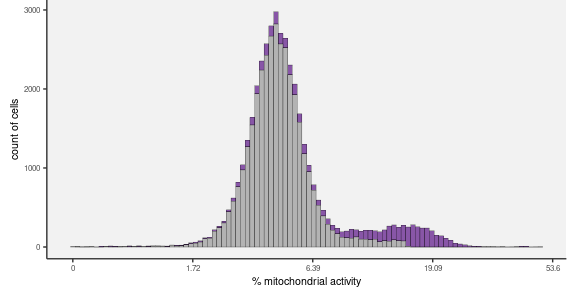

# 1. Merge all the available batches into one file set

## Combine both protein and RNA features


```r
.mkdir("result/step1")
.out.hdr <- "result/step1/matrix"
.data <- fileset.list(.out.hdr)

if.needed(.data, {
    .mkdir(.out.hdr)
    .bats <- 3:7
    .mtx <- "data/batch_" %&% .bats %&% "/matrix.mtx.gz"
    .row <- "data/batch_" %&% .bats %&% "/features.tsv.gz"
    .col <- "data/batch_" %&% .bats %&% "/barcodes.tsv.gz"

    .data <-
        rcpp_mmutil_merge_file_sets(r_headers=NULL,
                                    r_batches=.bats,
                                    r_mtx=.mtx,
                                    r_row=.row,
                                    r_col=.col,
                                    output=.out.hdr,
                                    MAX_ROW_WORD = 2)

    if.needed(.data$mtx %&% ".index", rcpp_mmutil_build_index(.data$mtx))
})
```


```r
.info <- rcpp_mmutil_info(.data$mtx)
```

* Total 41,957 cells

* Total 33,578 features

* Total  57,290,814 non-zero elements

## Take RNA-seq data with basic Q/C steps


```r
.genes <-
    fread(.data$row, col.names="feat", header=F) %>%
    filter(str_starts(feat, "ENSG")) %>% 
    unlist(use.names = F)

.mt.genes <- 
    fread(.data$row, col.names="feat", header=F) %>%
    filter(str_detect(feat, "_MT-")) %>%
    unlist(use.names = F)

.rna.hdr <- "result/step1/rna"
.mt.hdr <- "result/step1/mt"
.rna.data <- fileset.list(.rna.hdr)
.mt.data <- fileset.list(.mt.hdr)

if.needed(.rna.data, {
    .mkdir(.rna.hdr)
    .rna.data <-
        rcpp_mmutil_copy_selected_rows(.data$mtx,
                                       .data$row,
                                       .data$col,
                                       .genes,
                                       .rna.hdr)
})

if.needed(.mt.data, {
    .mkdir(.mt.hdr)
    .mt.data <-
        rcpp_mmutil_copy_selected_rows(.data$mtx,
                                       .data$row,
                                       .data$col,
                                       .mt.genes,
                                       .mt.hdr)
})
```


```r
.dt.rna <-
    rcpp_mmutil_compute_scores(.rna.data$mtx, .rna.data$row, .rna.data$col) %>%
    (function(x) setDT(x$col))

.dt.mt <- 
    rcpp_mmutil_compute_scores(.mt.data$mtx, .mt.data$row, .mt.data$col) %>%
    (function(x) setDT(x$col))
```


```r
.features <- readLines(.data$row)
.hash <- .features[str_detect(.features, "Hash")]

.hash.hdr <- "result/step1/hash"
.hash.data <- fileset.list(.hash.hdr)

if.needed(.hash.data, {
    .hash.data <-
        rcpp_mmutil_copy_selected_rows(.data$mtx,
                                       .data$row,
                                       .data$col,
                                       .hash,
                                       .hash.hdr)
})

.hash.mtx <- read.dense(.hash.data$mtx)
.hash.argmax <- apply(.hash.mtx, 2, which.max)
```


```r
.file <- "result/step1/bbknn/rna.rds"
.mkdir(dirname(.file))

if.needed(.file, {
    .hash.cells <- .hash.data$col %>%
        fread(header=F, col.names="cell") %>%
        (function(x) {
            x[,c("barcode","batch"):=tstrsplit(`cell`,split="_")];
            x[, barcode := gsub(`barcode`, pattern="-[0-9]$", replacement="")];
            x[, hash := .hash.argmax]
            x[, batch := as.integer(`batch`)]
            return(x);
        })

    .batches <- fread(.rna.data$col, col.names="cell", header=F) %>%
        (function(x) {
            x[, c("barcode", "batch") := tstrsplit(cell, split="[_]")];
            x[, barcode := gsub(`barcode`, pattern="-[0-9]$", replacement="")];
            x[, batch := as.integer(`batch`)]
            x;
        }) %>%
        left_join(.hash.cells)

    bb <- .batches %>%
        mutate(b = batch %&% "_" %&% hash) %>%
        select(b) %>%
        unlist()

    .bbknn <- rcpp_mmutil_bbknn_svd(.rna.data$mtx, bb,
                                    knn=30, RANK=3,
                                    TAKE_LN = TRUE)

    saveRDS(.bbknn, .file)
})

.bbknn <- readRDS(.file)
.factors <- .bbknn$factors.adjusted
```

# 2. Cell Q/C by the number of non-zero elements and mictochondrial activities


```r
.file <- "result/step1/qc_table.txt.gz"

if.needed(.file, {

    .qc.dt <-
        merge(.dt.rna, .dt.mt, by="name", suffix=c(".nonmt", ".mt")) %>% 
        mutate(mito.frac = 100 * sum.mt / (sum.nonmt + sum.mt)) %>%
        as.data.table

    .temp <- as.data.table(.factors)
    colnames(.temp) <- "PC" %&% 1:ncol(.temp)
    .temp <- cbind(.dt.rna[, .(name)], .temp)
        
    .qc.dt <- .qc.dt %>% left_join(.temp) %>% as.data.table %>% na.omit

    set.seed(1)
    .x <- .qc.dt$mito.frac
    .kmeans <- kmeans(.x, centers=5, nstart=100)
    
    k.invalid <- which.max(.kmeans$centers)
    mito.cutoff <- min(.x[.kmeans$cluster == k.invalid])

    .y <- .qc.dt$nnz.nonmt
    .kmeans <- kmeans(log10(.y), centers=5, nstart=100)
    k.invalid <- which.min(.kmeans$centers)
    nnz.cutoff <- max(.y[.kmeans$cluster %in% k.invalid])
    
    .dat <- .qc.dt[, .(PC1, PC2, PC3)] %>%
        as.matrix %>%
        apply(MARGIN = 2, scale)

    .kmeans <- kmeans(.dat, centers=2, nstart=100)
    k.valid <- which(apply(.kmeans$centers, 1, function(x) all(abs(x) < 3)))
    pc.valid <- which(.kmeans$cluster %in% k.valid)
    
    .qc.dt <- .qc.dt %>%
        mutate(j = 1:n()) %>%
        mutate(qc = if_else(nnz.nonmt > nnz.cutoff &
                            mito.frac < mito.cutoff &
                            j %in% pc.valid,
                            "pass",
                            "fail")) %>%
        dplyr::select(-j) %>%
        as.data.table
    
    fwrite(.qc.dt, .file, col.names = TRUE, row.names = FALSE)
})

.qc.dt <- fread(.file, header = TRUE)
```


```r
.qc.cols <- c("#8856a7", "gray70")
```


```r
plt <-
    .gg.plot(.qc.dt, aes(x=nnz.nonmt)) +
    geom_histogram(aes(fill=qc), bins=100, colour="black", linewidth=.1) +
    scale_x_continuous("number of genes detected in each cell") +
    scale_fill_manual(values = .qc.cols) +
    ylab("number of cells") +
    theme(legend.position="none")
print(plt)
```

<!-- -->

```r
.file <- fig.dir %&% "/Fig_cell_nnz.pdf"
.gg.save(filename = .file, plot = plt, width=6, height=3)
```


[PDF](Fig/STEP1//Fig_cell_nnz.pdf)


```r
.lab <- function(x) num.round(pmax(0,exp(x)-1))
plt <-
    .gg.plot(.qc.dt, aes(x=log(1 + mito.frac))) +
    geom_histogram(aes(fill=qc), bins=100, colour="black", linewidth=.1) +
    scale_fill_manual(values = .qc.cols) +
    scale_x_continuous("% mitochondrial activity", labels = .lab) +
    ylab("count of cells") +
    theme(legend.position="none")
print(plt)
```

<!-- -->

```r
.file <- fig.dir %&% "/Fig_cell_mito.pdf"
.gg.save(filename = .file, plot = plt, width=6, height=3)
```


[PDF](Fig/STEP1//Fig_cell_mito.pdf)

* Keep 39,138 cells, discard 2,812 cells

<!-- -->

[PDF](Fig/STEP1//Fig_svd_batch.pdf)

## Matrix data after Q/C: 39,138 cells


```r
.qc.hdr <- "result/step1/matrix_qc"
.qc.data <- fileset.list(.qc.hdr)
.qc.cells <- .qc.dt[qc == "pass", .(name)] %>% unlist

if.needed(.qc.data,{
    .qc.data <-
        rcpp_mmutil_copy_selected_columns(.data$mtx,
                                          .data$row,
                                          .data$col,
                                          .qc.cells,
                                          .qc.hdr)
})
```


```r
.info <- rcpp_mmutil_info(.qc.data$mtx)
```

* Total 39,138 cells

* Total 33,578 features

* Total  55,941,489 non-zero elements

## Feature Q/C to remove features with too many zeros


```r
.feature.scores <- 
    rcpp_mmutil_compute_scores(.qc.data$mtx, .qc.data$row, .qc.data$col) %>%
    (function(x) setDT(x$row))

.valid.features <-
    .feature.scores[nnz > 100 & !str_detect(`name`, "Hash"), .(name)] %>%
    unlist

.final.hdr <- "result/step1/matrix_final"
.final.data <- fileset.list(.final.hdr)

if.needed(.final.data, {
    .final.data <-
        rcpp_mmutil_copy_selected_rows(.qc.data$mtx,
                                       .qc.data$row,
                                       .qc.data$col,
                                       .valid.features,
                                       .final.hdr)
})
```


```r
.info <- rcpp_mmutil_info(.final.data$mtx)
```

* Total 39,138 cells

* Total 12,717 features

* Total  55,615,029 non-zero elements

