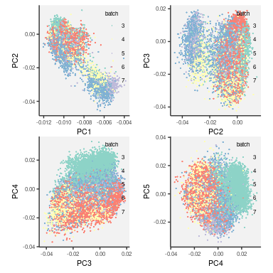

## 1. Merge all the available batches into one file set

### Combine all the data


```r
.mkdir("result/step1")
.out.hdr <- "result/step1/matrix"
.data <- fileset.list(.out.hdr)

if.needed(.data, {
    .mkdir(.out.hdr)
    .bats <- 3:7
    .mtx <- "data/batch_" %&% .bats %&% "/matrix.mtx.gz"
    .row <- "data/batch_" %&% .bats %&% "/features.tsv.gz"
    .col <- "data/batch_" %&% .bats %&% "/barcodes.tsv.gz"

    .data <-
        rcpp_mmutil_merge_file_sets(r_headers=NULL,
                                    r_batches=.bats,
                                    r_mtx=.mtx,
                                    r_row=.row,
                                    r_col=.col,
                                    output=.out.hdr,
                                    MAX_ROW_WORD = 2)

    if.needed(.data$mtx %&% ".index", rcpp_mmutil_build_index(.data$mtx))
})
```


```r
.info <- rcpp_mmutil_info(.data$mtx)
```

* Total 41,957 cells

* Total 33,578 features

* Total  57,290,814 non-zero elements

### Take HASH index


```r
.features <- readLines(.data$row)
.hash <- .features[str_detect(.features, "Hash")]

.hash.hdr <- "result/step1/hash"
.hash.data <- fileset.list(.hash.hdr)

if.needed(.hash.data, {
    .hash.data <-
        rcpp_mmutil_copy_selected_rows(.data$mtx,
                                       .data$row,
                                       .data$col,
                                       .hash,
                                       .hash.hdr)
})
.hash.info <- read.hash(.hash.data)
```


### Take RNA-seq data with basic Q/C steps


```r
.genes <-
    fread(.data$row, col.names="feat", header=F) %>%
    filter(str_starts(feat, "ENSG")) %>%
    unlist(use.names = F)

.mt.genes <-
    fread(.data$row, col.names="feat", header=F) %>%
    filter(str_detect(feat, "_MT-")) %>%
    unlist(use.names = F)

.rna.hdr <- "result/step1/rna"
.mt.hdr <- "result/step1/mt"
.rna.data <- fileset.list(.rna.hdr)
.mt.data <- fileset.list(.mt.hdr)

if.needed(.rna.data, {
    .mkdir(.rna.hdr)
    .rna.data <-
        rcpp_mmutil_copy_selected_rows(.data$mtx,
                                       .data$row,
                                       .data$col,
                                       .genes,
                                       .rna.hdr)
})

if.needed(.mt.data, {
    .mkdir(.mt.hdr)
    .mt.data <-
        rcpp_mmutil_copy_selected_rows(.data$mtx,
                                       .data$row,
                                       .data$col,
                                       .mt.genes,
                                       .mt.hdr)
})
```


```r
.dt.rna <-
    rcpp_mmutil_compute_scores(.rna.data$mtx, .rna.data$row, .rna.data$col) %>%
    (function(x) setDT(x$col))

.dt.mt <-
    rcpp_mmutil_compute_scores(.mt.data$mtx, .mt.data$row, .mt.data$col) %>%
    (function(x) setDT(x$col))
```

## 2. Cell Q/C by the number of non-zero elements and mictochondrial activities

### Establish Q/C threshold by `kmeans`


```r
.file <- "result/step1/qc_table.txt.gz"

if.needed(.file, {

    .qc.dt <-
        merge(.dt.rna, .dt.mt, by="name", suffix=c(".nonmt", ".mt")) %>%
        mutate(mito.frac = 100 * sum.mt / (sum.nonmt + sum.mt)) %>%
        as.data.table

    set.seed(1)
    .x <- .qc.dt$mito.frac
    .kmeans <- kmeans(.x, centers=3, nstart=100)

    k.invalid <- which.max(.kmeans$centers)
    mito.cutoff <- min(.x[.kmeans$cluster == k.invalid])

    .y <- .qc.dt$nnz.nonmt
    .kmeans <- kmeans(log10(.y), centers=3, nstart=100)
    k.invalid <- which.min(.kmeans$centers)
    nnz.cutoff <- max(.y[.kmeans$cluster %in% k.invalid])

    .kmeans <- kmeans(.dat, centers=2, nstart=100)
    k.valid <- which(apply(.kmeans$centers, 1, function(x) all(abs(x) < 3)))

    .qc.dt <- .qc.dt %>%
        mutate(j = 1:n()) %>%
        mutate(qc = if_else(nnz.nonmt > nnz.cutoff &
                            mito.frac < mito.cutoff,
                            "pass",
                            "fail")) %>%
        dplyr::select(-j) %>%
        as.data.table

    fwrite(.qc.dt, .file, col.names = TRUE, row.names = FALSE)
})

.qc.dt <- fread(.file, header = TRUE)
```


```r
.qc.cols <- c("#8856a7", "gray70")
```


```r
plt <-
    .gg.plot(.qc.dt, aes(x=nnz.nonmt)) +
    geom_histogram(aes(fill=qc), bins=100, colour="black", linewidth=.1) +
    scale_x_continuous("number of genes detected in each cell") +
    scale_fill_manual(values = .qc.cols) +
    ylab("number of cells") +
    theme(legend.position="none")
print(plt)
```

<!-- -->

```r
.file <- fig.dir %&% "/Fig_cell_nnz.pdf"
.gg.save(filename = .file, plot = plt, width=6, height=3)
```


[PDF](Fig/STEP1//Fig_cell_nnz.pdf)


```r
.lab <- function(x) num.round(pmax(0,exp(x)-1))
plt <-
    .gg.plot(.qc.dt, aes(x=log(1 + mito.frac))) +
    geom_histogram(aes(fill=qc), bins=100, colour="black", linewidth=.1) +
    scale_fill_manual(values = .qc.cols) +
    scale_x_continuous("% mitochondrial activity", labels = .lab) +
    ylab("count of cells") +
    theme(legend.position="none")
print(plt)
```

<!-- -->

```r
.file <- fig.dir %&% "/Fig_cell_mito.pdf"
.gg.save(filename = .file, plot = plt, width=6, height=3)
```


[PDF](Fig/STEP1//Fig_cell_mito.pdf)

* Keep 35,488 cells, discard 6,462 cells

## 3. Remove weird bimodal patterns in the top three PCs


```r
.rna.qc.hdr <- "result/step1/qc_rna"
.rna.qc.data <- fileset.list(.rna.qc.hdr)

if.needed(.rna.qc.data, {

    .qc.cells <- .qc.dt[qc == "pass"]$name

    .rna.qc.data <-
        rcpp_mmutil_copy_selected_columns(.rna.data$mtx,
                                          .rna.data$row,
                                          .rna.data$col,
                                          .qc.cells,
                                          .rna.qc.hdr)

})
```

### Compute PCA


```r
.file <- "result/step1/qc_rna_svd.rds"
.mkdir(dirname(.file))
if.needed(.file, {
    .svd <- rcpp_mmutil_svd(.rna.qc.data$mtx,
                            RANK=5,
                            TAKE_LN = TRUE)
    saveRDS(.svd, .file)
})
.svd <- readRDS(.file)
```


```r
V <- .svd$V; rownames(V) <- readLines(.rna.qc.data$col)
plots <- lapply(1:4, pca.plot.vd, VD=pca.df(V))
plt <- wrap_plots(plots, ncol = 2)
print(plt)
```

<!-- -->


[PDF](Fig/STEP1//Fig_svd_batch.pdf)

### Identify outlier cell groups, using `kmeans` on the top five PCs


```r
.file <- "result/step1/qc_rna_svd_kmeans.rds"
.mkdir(dirname(.file))
if.needed(.file, {
    set.seed(1)
    .kmeans <- kmeans(apply(V, 2, scale), 2, iter.max = 100, nstart = 100)
    saveRDS(.kmeans, .file)
})
.kmeans <- readRDS(.file)

.take.largest <- function(.kmeans){
    k.select <- which.max(table(.kmeans$cluster))
    which(.kmeans$cluster == k.select)
}
.cells <- .take.largest(.kmeans)
final.cells <- readLines(.rna.qc.data$col)[.cells]

vv <- V[.cells, ]
plots <- lapply(1:4, pca.plot.vd, VD=pca.df(vv))
plt <- wrap_plots(plots, ncol = 2) + ggtitle("n=" %&% num.int(length(.cells)))
print(plt)
```

<!-- -->


[PDF](Fig/STEP1//Fig_svd_batch_filtered.pdf)

## 4. Cell Q/C data applying the cell-level and PC-level criteria


```r
.full.hdr <- "result/step1/matrix"
.full.data <- fileset.list(.full.hdr)
.qc.hdr <- "result/step1/cell_qc_matrix"
.qc.data <- fileset.list(.qc.hdr)

if.needed(.qc.data, {

    .qc.data <-
        rcpp_mmutil_copy_selected_columns(.full.data$mtx,
                                          .full.data$row,
                                          .full.data$col,
                                          final.cells,
                                          .qc.hdr)

})
```

## 5. Gene Q/C to remove genes with too many zeros


```r
.scores <- rcpp_mmutil_compute_scores(.qc.data$mtx,
                                      .qc.data$row,
                                      .qc.data$col)

row.scores <- setDT(.scores$row)

## remove hashtag
row.scores <- row.scores[!str_detect(`name`, "[Hh]ashtag")]

## remove genes expresed in too few cells
## remove genes that are less variable
nnz.cutoff <- 500
cv.cutoff <- 1.25

plt <-
    ggplot(row.scores, aes(log1p(nnz), log1p(cv))) +
    theme_classic() +
    stat_density_2d(geom = "raster",
                    aes(fill = after_stat(sqrt(density))),
                    show.legend=F,
                    contour=F) +
    scale_fill_viridis_c() +
    geom_vline(xintercept = log1p(nnz.cutoff), col=2, lty = 2) +
    geom_hline(yintercept = log1p(cv.cutoff), col=2, lty = 2) +
    stat_density2d(linewidth=.2, colour="white") +
    scale_x_continuous("Number of Non zeros", labels = function(x) num.int(10^x)) +
    scale_y_continuous("Coefficient of variation", labels = function(x) num.sci(10^x))
print(plt)
```

<!-- -->


[PDF](Fig/STEP1//Fig_gene_qc.pdf)


```r
final.features <- row.scores[nnz > nnz.cutoff & cv > cv.cutoff]
.final.hdr <- "result/step1/final_matrix"
.final.data <- fileset.list(.final.hdr)

if.needed(.final.data, {
    .qc.data <-
        rcpp_mmutil_copy_selected_rows(.qc.data$mtx,
                                       .qc.data$row,
                                       .qc.data$col,
                                       final.features$name,
                                       .final.hdr)
})
```
