## 1. Another round of data Q/C to identify trouble some cells and adjust batch effects

We will use full data matrix processed in the previous step.


```r
.hdr <- "result/step1/matrix_final"
.data <- fileset.list(.hdr)
```


```r
.features <- readLines(.data$row)
.hash <- .features[str_detect(.features, "Hash")]
.hash.hdr <- "result/step1/hash"
.hash.data <- fileset.list(.hash.hdr)
if.needed(.hash.data, {
    .hash.data <-
        rcpp_mmutil_copy_selected_rows(.data$mtx,
                                       .data$row,
                                       .data$col,
                                       .hash,
                                       .hash.hdr)
})
.hash.info <- read.hash(.hash.data)
```

### A. Identify principal components in protein surface marker and gene expression data

#### Partition the data by the types of features


```r
.file <- "result/step2/svd.rds"

if.needed(.file, {

    gene.svd <- rcpp_mmutil_svd(.gene.data$mtx, RANK=30, TAKE_LN=T, NUM_THREADS = 16, EM_ITER = 20)

    prot.svd <- rcpp_mmutil_svd(.prot.data$mtx, RANK=10, TAKE_LN=T, NUM_THREADS = 16, EM_ITER = 20)

    .temp <- list(gene = gene.svd, protein = prot.svd)
    saveRDS(.temp, .file)
})
.svd.list <- readRDS(.file)
```

#### Can we identify troublesome batch-specific principal components?


##### Show PCs computed on surface protein data


```r
V <- .svd.list$protein$V; rownames(V) <- readLines(.prot.data$col)
plots <- lapply(1:9, .plot.vd.fun, VD = .pca.df(V))
plt <- wrap_plots(plots, ncol = 3)
print(plt)
```

<!-- -->

* We can adjust systemic batch-specific effects by batch-balancing k-nearest neighbour method. This shouldn't be much trouble.

##### Adjust batch-specific effects on the protein side


```r
.file <- "result/step2/prot_bbknn.rds"

if.needed(.file, {

    V <- .svd.list$protein$V
    .batches <- take.batch.info(.prot.data)

    .bbknn.prot <-
        rcpp_mmutil_bbknn(V,
                          r_batches = .batches, # batch label
                          knn = 50,             # 10 nn per batch
                          RECIPROCAL_MATCH = T, # crucial
                          NUM_THREADS = 16)

    saveRDS(.bbknn.prot, .file)
})

.bbknn.prot <- readRDS(.file)
```


```r
V <- .bbknn.prot$factors.adjusted; rownames(V) <- readLines(.prot.data$col)
plots <- lapply(1:9, .plot.vd.fun, VD = .pca.df(V))
plt <- wrap_plots(plots, ncol = 3)
print(plt)
```

<!-- -->

##### Show PCs computed on gene expression data


```r
V <- .svd.list$gene$V; rownames(V) <- readLines(.gene.data$col)
plots <- lapply(1:9, .plot.vd.fun, VD = .pca.df(V))
plt <- wrap_plots(plots, ncol = 3)
print(plt)
```

<!-- -->

* We found strong bimodal distributions for the first five PCs in gene expression data.


```r
par(mfrow=c(1,5))
for(k in 1:5){
    hist(.svd.list$gene$V[,k], 100, main = "PC" %&% k, xlab="")
}
```

<!-- -->

##### Identify outlier cells in gene expression data


```r
set.seed(1)
.kmeans <- kmeans(.svd.list$gene$V[, 1:5], 2, nstart = 100)
k.select <- which.max(table(.kmeans$cluster))
.qc.cells <- readLines(.gene.data$col)[.kmeans$cluster == k.select]
```


```r
V <- .svd.list$gene$V; rownames(V) <- readLines(.gene.data$col)
.vd <- .pca.df(V)
.vd[, batch := as.factor(.kmeans$cluster)]

plots <- lapply(1:9, .plot.vd.fun, VD = .vd)
plt <- wrap_plots(plots, ncol = 3)
print(plt)
```

<!-- -->


```r
plt <- diagnostic.density.kmeans(.gene.data, .kmeans)
print(plt)
```

<!-- -->


```r
.file <- "result/step2/qc_gene_svd.rds"

if.needed(.file, {
    gene.svd <- rcpp_mmutil_svd(.gene.qc.data$mtx, RANK=30, TAKE_LN=T,
                                NUM_THREADS = 16, EM_ITER = 20)
    saveRDS(gene.svd, .file)
})
gene.svd <- readRDS(.file)

V <- gene.svd$V; rownames(V) <- readLines(.gene.qc.data$col)
plots <- lapply(1:9, .plot.vd.fun, VD = .pca.df(V))
plt <- wrap_plots(plots, ncol = 3)
print(plt)
```

<!-- -->

##### Adjust batch effects on the gene expression side


```r
.file <- "result/step2/gene_bbknn.rds"

if.needed(.file, {

    V <- gene.svd$V
    set.seed(1)
    .batches <- take.batch.info(.gene.qc.data)

    .bbknn.gene <-
        rcpp_mmutil_bbknn(V,
                          r_batches = .batches, # batch label
                          knn = 50,             # 20 nn per batch
                          RECIPROCAL_MATCH = T, # crucial
                          NUM_THREADS = 16)

    saveRDS(.bbknn.gene, .file)
})

.bbknn.gene <- readRDS(.file)
```


```r
V <- .bbknn.gene$factors.adjusted
rownames(V) <- readLines(.gene.qc.data$col)
plots <- lapply(1:9, .plot.vd.fun, VD = .pca.df(V))
plt <- wrap_plots(plots, ncol = 3)
print(plt)
```

<!-- -->

* We still see bimodal distributions...


```r
set.seed(1)
.kmeans <- kmeans(V[, 1:5], 2, nstart = 100)
k.select <- which.max(table(.kmeans$cluster))
.final.cells <- readLines(.gene.qc.data$col)[.kmeans$cluster == k.select]
```


```r
plt <- diagnostic.density.kmeans(.gene.qc.data, .kmeans)
print(plt)
```

<!-- -->


```r
.file <- "result/step2/final_gene_svd.rds"

if.needed(.file, {
    gene.svd <- rcpp_mmutil_svd(.gene.final.data$mtx, RANK=30, TAKE_LN=T,
                                NUM_THREADS = 16, EM_ITER = 20)
    saveRDS(gene.svd, .file)
})
gene.svd <- readRDS(.file)

V <- gene.svd$V; rownames(V) <- readLines(.gene.final.data$col)
plots <- lapply(1:9, .plot.vd.fun, VD = .pca.df(V))
plt <- wrap_plots(plots, ncol = 3)
print(plt)
```

<!-- -->


```r
.kmeans <- kmeans(V[, 1:5], 2, nstart = 100)
plt <- diagnostic.density.kmeans(.gene.final.data, .kmeans)
print(plt)
```

<!-- -->


##### Adjust batch effects on the gene expression side (again)


```r
.file <- "result/step2/final_gene_bbknn.rds"

if.needed(.file, {

    V <- gene.svd$V
    set.seed(1)
    .batches <- take.batch.info(.gene.final.data)

    .bbknn.gene <-
        rcpp_mmutil_bbknn(V,
                          r_batches = .batches, # batch label
                          knn = 50,             # 20 nn per batch
                          RECIPROCAL_MATCH = T, # crucial
                          NUM_THREADS = 16)

    saveRDS(.bbknn.gene, .file)
})

.bbknn.gene <- readRDS(.file)
```


```r
V <- .bbknn.gene$factors.adjusted
rownames(V) <- readLines(.gene.final.data$col)
plots <- lapply(1:9, .plot.vd.fun, VD = .pca.df(V))
plt <- wrap_plots(plots, ncol = 3)
print(plt)
```

<!-- -->


##### Why do we perform batch correction and cell filtering independently within each data type?

- Systematic batch effects or other biases are differently expressed in different data types.

- For protein surface markers, a large part of systemic biases stemmed from differential antibody affinity. Hence, we found several CD marker activities exceptionally deviate from one batch to the others.

- However, potential biases in gene expression data were largely derived from technology. We noticed that bimodal distributions in the PC coordinates were clearly characterized by a skewed distribution of a number of non-zero elements and average expression per cell.

- Since such technical biases implicate low-quality cells, instead of reconciling them with the rest of data, we removed these cells to prevent them from affecting the follow-up cell type analysis.


### B. Combine two data types


```r
.final.hdr <- "result/step2/matrix_final"
.final.data <- fileset.list(.final.hdr)

if.needed(.final.data, {
    .final.data <-
        rcpp_mmutil_copy_selected_columns(.data$mtx,
                                          .data$row,
                                          .data$col,
                                          .final.cells,
                                          .final.hdr)
})
```


```r
.file <- "result/step2/final_bbknn.rds"

if.needed(.file, {

    .batches <- take.batch.info(.final.data)

    .bbknn <-
        rcpp_mmutil_bbknn_mtx(.final.data$mtx,
                              r_batches = .batches, # batch label
                              RANK = 30,            # PCs
                              knn = 50,             # 20 nn per batch
                              RECIPROCAL_MATCH = T, # crucial
                              EM_ITER = 20,         # EM steps
                              NUM_THREADS = 16,
                              TAKE_LN = T,
                              USE_SINGULAR_VALUES = F)

    saveRDS(.bbknn, .file)
})

.bbknn <- readRDS(.file)
```

## 2. Cell type annotation

### Can we distinguish cell types by surface proteins?


* nTconv : CD3+, CD4+, CD8-, CD25-/CD127+, CD45RA+/CD45RO-
* mTconv : CD3+, CD4+, CD8-, CD25-/CD127+, CD45RA-/CD45RO+
* nTreg : CD3+, CD4+, CD8-, CD25+/CD127-, CD45RA+/CD45RO-
* mTreg : CD3+, CD4+, CD8-, CD25+/CD127-, CD45RA-/CD45RO+

Run annotation purely based on marker proteins:


```r
.file <- "result/step2/prot_annot_raw.txt.gz"

if.needed(.file, {
    .pos.markers <- .read.marker.file("marker/surface_round1_positive.txt")
    .neg.markers <- .read.marker.file("marker/surface_round1_negative.txt")
    .annot.out <-
        rcpp_mmutil_annotate_columns(
            pos_labels = list(p1=.pos.markers),
            r_neg_labels = list(n1=.neg.markers),
            mtx_file = .marker.data$mtx,
            row_file = .marker.data$row,
            col_file = .marker.data$col,
            EM_TOL = 1e-6,
            EM_ITER = 500,
            TAKE_LN = T)

    .col <- c("tag", "celltype", "prob", "ln.prob")
    names(.annot.out$annotation) <- .col
    annot.dt <- setDT(.annot.out$annotation) %>%
        parse.tag()
    fwrite(annot.dt, .file)
})

annot.dt <- fread(.file)
```

Two-dimensional density plot on the raw CD marker concentrations.


```r
marker.raw.mtx <- read.dense(.marker.data$mtx)
.names <- sapply(readLines(.marker.data$row),
                 function(s) unlist(strsplit(s, split="[_]+"))[1],
                 USE.NAMES = F)

rownames(marker.raw.mtx) <- .names
colnames(marker.raw.mtx) <- readLines(.marker.data$col)

.melt <-
    reshape2::melt(marker.raw.mtx) %>%
    filter(!str_detect(`Var1`, "Hashtag")) %>%
    as.data.table()

.sum <- .melt[,
              .(value = sum(value)),
              by = .(Var1, Var2)]

## collapse the same feature names
.dt <-
    dcast(.sum, Var1 ~ Var2, value.var = "value", fill = 0)

marker.raw.mtx <- as.matrix(.dt[, -1])
rownames(marker.raw.mtx) <- unlist(.dt[, 1])

.ct <- c("mTreg","nTreg","mTconv","nTconv")
plt <- plt.scatter.ct.2(.ct, annot.dt, marker.raw.mtx)
print(plt)
```

<!-- -->


[PDF](Fig/STEP2//Fig_cdmarker_raw.pdf)

### Run annotation on the batch adjusted data


```r
.file <- "result/step2/prot_annot_adj.txt.gz"
if.needed(.file, {
    .pos.markers <- .read.marker.file("marker/surface_round1_positive.txt")
    .neg.markers <- .read.marker.file("marker/surface_round1_negative.txt")

    .annot.out <-
        rcpp_mmutil_annotate_columns(
            pos_labels = list(p1=.pos.markers),
            r_neg_labels = list(n1=.neg.markers),
            r_U = .bbknn$U,
            r_D = .bbknn$D,
            r_V = .bbknn$factors.adjusted,
            row_file = .final.data$row,
            col_file = .final.data$col,
            EM_TOL = 1e-6,
            EM_ITER = 500,
            TAKE_LN = F)

    .col <- c("tag", "celltype", "prob", "ln.prob")
    names(.annot.out$annotation) <- .col
    annot.dt <- setDT(.annot.out$annotation) %>%
        parse.tag()
    fwrite(annot.dt, .file)
})
annot.dt <- fread(.file)
```


```r
.ct <- c("mTreg","nTreg","mTconv","nTconv")
plt <- plt.scatter.ct.2(.ct, annot.dt, marker.raw.mtx)
print(plt)
```

<!-- -->


[PDF](Fig/STEP2//Fig_cdmarker_adj.pdf)

### Final Q/C by Leiden clustering of the adjusted cell-cell interaction data

Cell-type annotation results purely based on known protein surface markers may be susceptible to low signal-to-noise ratio and antibody detection sensitivity issues. Unsupervised clustering methods often help compensate for ambiguous prediction results of marker-based methods as clustering methods take into account inter-cellular interaction patterns commonly observed across all the transcriptomic and antibody data.


```r
.file <- "Tab/step2_celltype.txt.gz"
if.needed(.file, {
    .tags <- readLines(.final.data$col)
    .leiden <- run.leiden(.bbknn$knn.adj, .tags, res = 1, nrepeat = 100, min.size = 10)

    .tab <-
        annot.dt %>%
        left_join(.leiden) %>%
        na.omit()

    ## identify problematic clusters
    .fraction <- .tab[, .(.N), by = .(celltype, membership, component)]
    .fraction[, Ntot := sum(`N`), by = .(membership, component)]
    .mem.qc <- .fraction[order(`N`, decreasing = T), head(.SD, 1), by = .(membership, component)]
    .remove <- .mem.qc[`N` / `Ntot` < .5, .(membership, component)]
    .ct.map <- .mem.qc[, .(membership, component, celltype)]

    final.cell.type <- .leiden %>%
        anti_join(.remove) %>%
        left_join(.ct.map) %>%
        as.data.table() %>%
        parse.tag()
    fwrite(final.cell.type, .file)
})

final.cell.type <- fread(.file)
```

### Will the same classification results hold in overall data?


```r
.file <- "Tab/step2_umap.txt.gz"
if.needed(.file, {

    set.seed(1)
    .umap <- uwot::tumap(.bbknn$factors.adjusted,
                         learning_rate=.01,
                         n_epochs=1000,
                         n_sgd_threads=16,
                         verbose=T,
                         init="lvrandom",
                         scale=T)

    .tags <- readLines(.final.data$col)

    colnames(.umap) <- "UMAP" %&% 1:ncol(.umap)

    .umap.dt <- final.cell.type %>%
        left_join(data.table(.umap, tag = .tags)) %>%
        na.omit()

    fwrite(.umap.dt, .file)
})
.umap.dt <- fread(.file)
```


```r
.file <- "Tab/step2_tsne.txt.gz"
if.needed(.file, {
    .tsne <- Rtsne::Rtsne(.bbknn$factors.adjusted,
                          check_duplicates = FALSE,
                          verbose = T,
                          num_threads = 16)

    .tags <- readLines(.final.data$col)

    colnames(.tsne$Y) <- "tSNE" %&% 1:ncol(.tsne$Y)

    .tsne.dt <- final.cell.type %>%
        left_join(data.table(.tsne$Y, tag = .tags)) %>%
        na.omit()
    fwrite(.tsne.dt, .file)
})
.tsne.dt <- fread(.file)
```

### UMAP


```r
p1 <- .gg.plot(.umap.dt, aes(UMAP1, UMAP2, color=celltype)) +
    ggrastr::rasterise(geom_point(stroke = 0, size=1), dpi=300) +
    theme(legend.position = c(0,0), legend.justification = c(0,0)) +
    ggtitle("cell types") +
    scale_color_brewer("", palette = "Paired")

p2 <- .gg.plot(.umap.dt, aes(UMAP1, UMAP2, color=as.factor(batch))) +
    ggrastr::rasterise(geom_point(stroke = 0, size=1), dpi=300) +
    theme(legend.position = c(0,0), legend.justification = c(0,0)) +
    ggtitle("batch membership") +
    scale_color_brewer("", palette = "Set3")

plt <- p1 | p2
print(plt)
```

<!-- -->


[PDF](Fig/STEP2//Fig_umap_celltype.pdf)


### tSNE


```r
p1 <-
    .gg.plot(.tsne.dt, aes(tSNE1, tSNE2, color=celltype)) +
    ggrastr::rasterise(geom_point(stroke = 0, size=1), dpi=300) +
    theme(legend.position = c(0,0), legend.justification = c(0,0)) +
    ggtitle("cell types") +
    scale_color_brewer("", palette = "Paired")

p2 <-
    .gg.plot(.tsne.dt, aes(tSNE1, tSNE2, color=as.factor(batch))) +
    ggrastr::rasterise(geom_point(stroke = 0, size=1), dpi=300) +
    theme(legend.position = c(0,0), legend.justification = c(0,0)) +
    ggtitle("batch membership") +
    scale_color_brewer("", palette = "Set3")

plt <- p1 | p2
print(plt)
```

<!-- -->


[PDF](Fig/STEP2//Fig_tsne_celltype.pdf)

## 3. Confirm by other marker genes/proteins (normalized expression)


```r
.markers <-
    c("FOXP3", "ID3", "BACH2", "CXCR3", "PRDM1", "SGK1", "TCF7", "LEF1",
      "SELL", "IL2RA", "IL7R", "IKZF2", "CCR6", "CCR4", "CCR7", "CTLA4",
      "HLA-DRA", "CD25", "CD127", "CD183", "CD196",
      "CD197", "CD194", "CD45RA", "CD45RO",
      "HLA") %>%
    unique

.ct <- c("mTreg","nTreg","mTconv","nTconv")

marker.dt <-
    t(bbknn.x(.final.data, .bbknn, .markers, .rescale=F)) %>%
    as.data.frame() %>%
    rownames_to_column("tag") %>%
    left_join(.umap.dt[, .(tag, UMAP1, UMAP2)]) %>%
    left_join(.tsne.dt[, .(tag, tSNE1, tSNE2)]) %>%
    left_join(final.cell.type[, .(tag, celltype)]) %>%
    na.omit() %>%
    as.data.table() %>%
    melt(id.vars = c("tag", "UMAP1", "UMAP2", "tSNE1", "tSNE2", "celltype"),
         variable.name = "marker",
         value.name = "expr") %>%
    mutate(celltype = factor(celltype, .ct)) %>%
    as.data.table()

plot.marker.scatter <- function(.marker, show.tsne = F) {

    .dt <- marker.dt[marker == .marker]
    ## handle outliers for better visualization
    .cutoff <- quantile(.dt$expr, probs = .95, na.rm=TRUE)

    .aes <- aes(x = UMAP1, y = UMAP2, colour = exp(expr))
    if(show.tsne){
        .aes <- aes(x = tSNE1, y = tSNE2, colour = exp(expr))
    }
    .dt <- .dt %>%
        mutate(expr = scale(pmin(expr, .cutoff))) %>%
        arrange(expr)
    ret <-
        ggplot(.dt, .aes) +
        ggtitle(.marker) +
        theme_classic() +
        ggrastr::rasterise(geom_point(stroke=.0, size=.7, alpha=.8), dpi=300) +
        theme(legend.key.width = unit(.2, "lines"),
              legend.key.height = unit(.5, "lines"),
              legend.position = c(1,1),
              legend.justification = c(1,1),
              legend.title = element_text(size=6),
              legend.text = element_text(size=5)) +
        scale_colour_distiller("", palette="RdPu", direction=1)

    return(ret)
}
```

### UMAP for the marker genes and proteins


```r
.markers <- sort(as.character(unique(marker.dt$marker)))
for(g in .markers){
    plt <- plot.marker.scatter(g, show.tsne = F)
    print(plt)
    .file <- fig.dir %&% "/Fig_marker_" %&% g %&% "_umap.pdf"
    .gg.save(filename = .file, plot = plt, width=3.2, height=2.8)
}
```

<!-- -->

[PDF](Fig/STEP2//Fig_marker_BACH2_umap.pdf)

<!-- -->

[PDF](Fig/STEP2//Fig_marker_CCR4_umap.pdf)

<!-- -->

[PDF](Fig/STEP2//Fig_marker_CCR6_umap.pdf)

<!-- -->

[PDF](Fig/STEP2//Fig_marker_CCR7_umap.pdf)

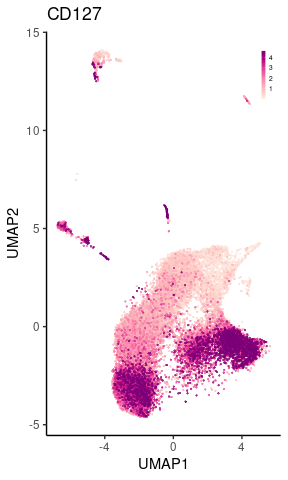<!-- -->

[PDF](Fig/STEP2//Fig_marker_CD127_umap.pdf)

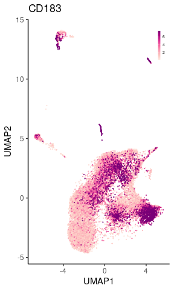<!-- -->

[PDF](Fig/STEP2//Fig_marker_CD183_umap.pdf)

<!-- -->

[PDF](Fig/STEP2//Fig_marker_CD194_umap.pdf)

<!-- -->

[PDF](Fig/STEP2//Fig_marker_CD196_umap.pdf)

<!-- -->

[PDF](Fig/STEP2//Fig_marker_CD197_umap.pdf)

<!-- -->

[PDF](Fig/STEP2//Fig_marker_CD25_umap.pdf)

<!-- -->

[PDF](Fig/STEP2//Fig_marker_CD45RA_umap.pdf)

<!-- -->

[PDF](Fig/STEP2//Fig_marker_CD45RO_umap.pdf)

<!-- -->

[PDF](Fig/STEP2//Fig_marker_CTLA4_umap.pdf)

<!-- -->

[PDF](Fig/STEP2//Fig_marker_CXCR3_umap.pdf)

<!-- -->

[PDF](Fig/STEP2//Fig_marker_FOXP3_umap.pdf)

<!-- -->

[PDF](Fig/STEP2//Fig_marker_HLA-DRA_umap.pdf)

<!-- -->

[PDF](Fig/STEP2//Fig_marker_ID3_umap.pdf)

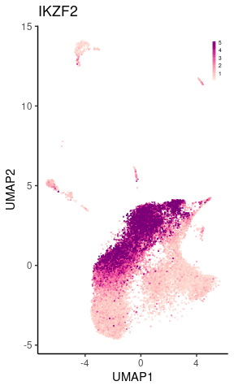<!-- -->

[PDF](Fig/STEP2//Fig_marker_IKZF2_umap.pdf)

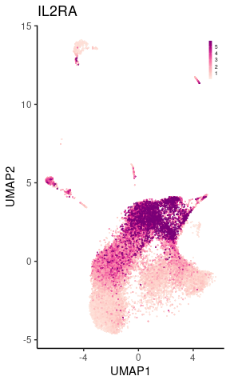<!-- -->

[PDF](Fig/STEP2//Fig_marker_IL2RA_umap.pdf)

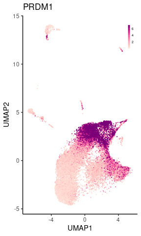<!-- -->

[PDF](Fig/STEP2//Fig_marker_IL7R_umap.pdf)

<!-- -->

[PDF](Fig/STEP2//Fig_marker_LEF1_umap.pdf)

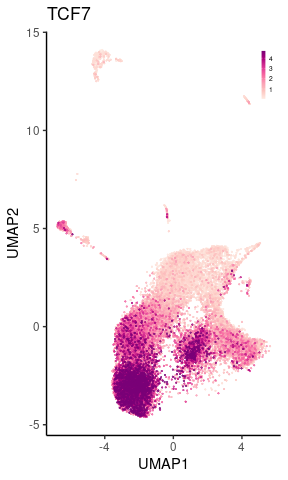<!-- -->

[PDF](Fig/STEP2//Fig_marker_PRDM1_umap.pdf)

<!-- -->

[PDF](Fig/STEP2//Fig_marker_SELL_umap.pdf)

<!-- -->

[PDF](Fig/STEP2//Fig_marker_SGK1_umap.pdf)

<!-- -->

[PDF](Fig/STEP2//Fig_marker_TCF7_umap.pdf)

### tSNE for the marker genes and proteins


```r
.markers <- sort(as.character(unique(marker.dt$marker)))
for(g in .markers){
    plt <- plot.marker.scatter(g, show.tsne = T)
    print(plt)
    .file <- fig.dir %&% "/Fig_marker_" %&% g %&% "_tsne.pdf"
    .gg.save(filename = .file, plot = plt, width=3.2, height=2.8)
}
```

<!-- -->

[PDF](Fig/STEP2//Fig_marker_BACH2_tsne.pdf)

<!-- -->

[PDF](Fig/STEP2//Fig_marker_CCR4_tsne.pdf)

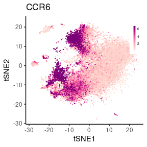<!-- -->

[PDF](Fig/STEP2//Fig_marker_CCR6_tsne.pdf)

<!-- -->

[PDF](Fig/STEP2//Fig_marker_CCR7_tsne.pdf)

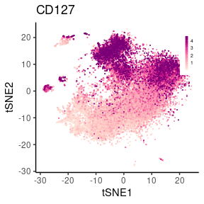<!-- -->

[PDF](Fig/STEP2//Fig_marker_CD127_tsne.pdf)

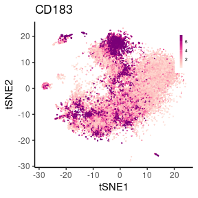<!-- -->

[PDF](Fig/STEP2//Fig_marker_CD183_tsne.pdf)

<!-- -->

[PDF](Fig/STEP2//Fig_marker_CD194_tsne.pdf)

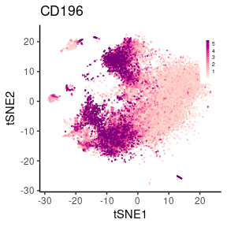<!-- -->

[PDF](Fig/STEP2//Fig_marker_CD196_tsne.pdf)

<!-- -->

[PDF](Fig/STEP2//Fig_marker_CD197_tsne.pdf)

<!-- -->

[PDF](Fig/STEP2//Fig_marker_CD25_tsne.pdf)

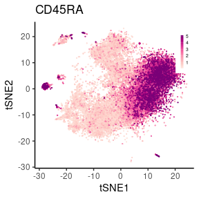<!-- -->

[PDF](Fig/STEP2//Fig_marker_CD45RA_tsne.pdf)

<!-- -->

[PDF](Fig/STEP2//Fig_marker_CD45RO_tsne.pdf)

<!-- -->

[PDF](Fig/STEP2//Fig_marker_CTLA4_tsne.pdf)

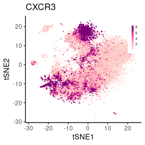<!-- -->

[PDF](Fig/STEP2//Fig_marker_CXCR3_tsne.pdf)

<!-- -->

[PDF](Fig/STEP2//Fig_marker_FOXP3_tsne.pdf)

<!-- -->

[PDF](Fig/STEP2//Fig_marker_HLA-DRA_tsne.pdf)

<!-- -->

[PDF](Fig/STEP2//Fig_marker_ID3_tsne.pdf)

<!-- -->

[PDF](Fig/STEP2//Fig_marker_IKZF2_tsne.pdf)

<!-- -->

[PDF](Fig/STEP2//Fig_marker_IL2RA_tsne.pdf)

<!-- -->

[PDF](Fig/STEP2//Fig_marker_IL7R_tsne.pdf)

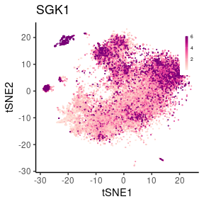<!-- -->

[PDF](Fig/STEP2//Fig_marker_LEF1_tsne.pdf)

<!-- -->

[PDF](Fig/STEP2//Fig_marker_PRDM1_tsne.pdf)

<!-- -->

[PDF](Fig/STEP2//Fig_marker_SELL_tsne.pdf)

<!-- -->

[PDF](Fig/STEP2//Fig_marker_SGK1_tsne.pdf)

<!-- -->

[PDF](Fig/STEP2//Fig_marker_TCF7_tsne.pdf)

## 4. Basic statistics for the first round annotation (27,025 cells)


<!-- -->


[PDF](Fig/STEP2//Fig_count_stat_tot.pdf)

<!-- -->


[PDF](Fig/STEP2//Fig_count_merged_stat_tot.pdf)


## 5. PRDM1 short vs. long


```r
prdm.dt <- fread("data/PRDM1/PRDM1_SL.csv.gz")

.dt <-
    copy(final.cell.type) %>%
    left_join(prdm.dt) %>%
    left_join(.umap.dt) %>%
    left_join(.tsne.dt) %>%
    na.omit() %>%
    as.data.table()

.dt[, membership := as.factor(`membership`)]
```


```r
.aes <- aes(UMAP1, UMAP2, colour=pmin(PRDM1_short, 3))

p1 <-
    ggplot(.dt[order(PRDM1_short)], .aes) +
    xlab("UMAP 1") + ylab("UMAP 2") + prdm.thm +
    ggrastr::rasterise(geom_point(stroke=0, size=1), dpi = 300) +
    scale_colour_distiller("PRDM1\nshort",
                           palette="RdPu",
                           direction=1)

.aes <- aes(UMAP1, UMAP2, colour = pmin(PRDM1_long, 3))

p2 <-
    ggplot(.dt[order(PRDM1_long)], .aes) +
    xlab("UMAP 1") + ylab("UMAP 2") + prdm.thm +
    ggrastr::rasterise(geom_point(stroke=0, size=1), dpi = 300) +
    scale_colour_distiller("PRDM1\nlong",
                           palette="RdPu",
                           direction=1)

plt <- p1 | p2
print(plt)
```

<!-- -->


[PDF](Fig/STEP2//Fig_PRDM1_isoform_umap.pdf)


```r
.aes <- aes(tSNE1, tSNE2, colour=pmin(PRDM1_short, 3))

p1 <-
    ggplot(.dt[order(PRDM1_short)], .aes) +
    xlab("tSNE 1") + ylab("tSNE 2") + prdm.thm +
    ggrastr::rasterise(geom_point(stroke=0, size=1), dpi = 300) +
    scale_colour_distiller("PRDM1\nshort",
                           palette="RdPu",
                           direction=1)

.aes <- aes(tSNE1, tSNE2, colour = pmin(PRDM1_long, 3))

p2 <-
    ggplot(.dt[order(PRDM1_long)], .aes) +
    xlab("tSNE 1") + ylab("tSNE 2") + prdm.thm +
    ggrastr::rasterise(geom_point(stroke=0, size=1), dpi = 300) +
    scale_colour_distiller("PRDM1\nlong",
                           palette="RdPu",
                           direction=1)

plt <- p1 | p2
print(plt)
```

<!-- -->


[PDF](Fig/STEP2//Fig_PRDM1_isoform_tsne.pdf)

## 5. Tables

* [**DOWNLOAD:** Cell type annotation](Tab/step2_celltype.txt.gz)

* [**DOWNLOAD:** UMAP + annotation](Tab/step2_umap.txt.gz)

* [**DOWNLOAD:** tSNE + annotation](Tab/step2_tsne.txt.gz)

