```r
.hdr <- "result/step1/final_matrix"
.data <- fileset.list(.hdr)
```

## 0. Surface Marker Proteins

* nTconv : CD3+, CD4+, CD8-, CD25-/CD127+, CD45RA+/CD45RO-
* mTconv : CD3+, CD4+, CD8-, CD25-/CD127+, CD45RA-/CD45RO+
* nTreg : CD3+, CD4+, CD8-, CD25+/CD127-, CD45RA+/CD45RO-
* mTreg : CD3+, CD4+, CD8-, CD25+/CD127-, CD45RA-/CD45RO+


## 1. Adjust batch-specific displacement using Batch-balancing k-Nearest Neighbour graph


```r
.file <- "result/step2/bbknn.rds"
.mkdir(dirname(.file))

if.needed(.file, {

    .cells <-
        fread(.data$col, header=F, col.names = "tag") %>%
        parse.tag()

    .svd <- rcpp_mmutil_svd(.data$mtx, RANK=50, TAKE_LN=T, EM_ITER = 20, NUM_THREADS=16)

    .bbknn <- rcpp_mmutil_bbknn(r_svd_v = .svd$V,
                                r_svd_u = .svd$U,
                                r_svd_d = .svd$D,
                                r_batches = .cells$batch,
                                knn = 50,
                                NUM_THREADS = 16,
                                USE_SINGULAR_VALUES = F)

    saveRDS(.bbknn, .file)
})

.bbknn <- readRDS(.file)
```


```r
.file <- "result/step2/annotation_bbknn.txt.gz"
if.needed(.file, {

    .annot.out <-
        rcpp_mmutil_annotate_columns(
            pos_labels = list(p1=.pos.markers),
            r_neg_labels = list(n1=.neg.markers),
            r_U = .bbknn$U,
            r_D = .bbknn$D,
            r_V = .bbknn$factors.adjusted,
            row_file = .data$row,
            col_file = .data$col,
            EM_TOL = 1e-8,
            EM_ITER = 500,
            TAKE_LN = F)

    .col <- c("tag", "celltype", "prob", "ln.prob")
    names(.annot.out$annotation) <- .col
    annot.dt <- setDT(.annot.out$annotation) %>%
        parse.tag()

    fwrite(annot.dt, .file)
})
```

## 2. Make major cell type annotation based on marker proteins + Leiden clustering


```r
.file <- "Tab/step2_cell_type.txt.gz"
if.needed(.file, {
    .cells <-
        fread(.data$col, header=F, col.names = "tag") %>%
        parse.tag()

    .leiden <- run.leiden(.bbknn$knn.adj, .cells$tag, res=1, nrepeat = 100)

    .tab <-
        .leiden %>% 
        left_join(annot.dt) %>%
        na.omit()

    ## identify problematic clusters
    .fraction <- .tab[, .(.N), by = .(celltype, membership, component)]
    .fraction[, Ntot := sum(`N`), by = .(membership, component)]
    .mem.qc <- .fraction[order(`N`, decreasing = T), head(.SD, 1), by = .(membership, component)]

    .remove <- .mem.qc[`N` / `Ntot` < .5, .(membership, component)]

    ## Map cell group membership to cell type
    .ct.map <- .mem.qc[, .(membership, component, celltype)]

    final.cell.type <- .leiden %>%
        anti_join(.remove) %>%
        na.omit() %>% 
        left_join(.ct.map) %>%
        as.data.table() %>%
        parse.tag()
    fwrite(final.cell.type, .file)
})
final.cell.type <- fread(.file)
```


```r
.file <- "Tab/step2_umap_coord.txt.gz"
if.needed(.file, {
    .umap <- uwot::tumap(.bbknn$factors.adjusted,
                         learning_rate = .1,
                         n_epochs = 2000,
                         n_sgd_threads = 16,
                         init = "laplacian",
                         verbose = T,
                         init_sdev = .01,
                         scale = F)

    .tags <- readLines(.data$col)
    colnames(.umap) <- "UMAP" %&% 1:ncol(.umap)
    umap.dt <- data.table(.umap, tag = .tags)
    fwrite(umap.dt, .file)
})
umap.dt <- fread(.file) %>% 
    left_join(final.cell.type) %>% 
    na.omit()
```


```r
.file <- "Tab/step2_tsne_coord.txt.gz"
if.needed(.file, {
    .tsne <- Rtsne::Rtsne(.bbknn$factors.adjusted,
                          num_threads = 16,
                          verbose = T,
                          check_duplicates = F)

    .tags <- readLines(.data$col)
    colnames(.tsne$Y) <- "tSNE" %&% 1:ncol(.tsne$Y)
    tsne.dt <- data.table(.tsne$Y, tag = .tags)
    fwrite(tsne.dt, .file)
})
tsne.dt <- fread(.file) %>%
    left_join(final.cell.type) %>%
    na.omit()
```

### t-UMAP


```r
p1 <- .gg.plot(umap.dt[sample(.N)], aes(UMAP1, UMAP2, color=celltype)) +
    ggrastr::rasterise(geom_point(stroke = 0, size=1), dpi=300) +
    theme(legend.position = c(0,0), legend.justification = c(0,0)) +
    ggtitle("cell types") +
    scale_color_brewer("", palette = "Paired")

p2 <- .gg.plot(umap.dt[sample(.N)], aes(UMAP1, UMAP2, color=as.factor(batch))) +
    ggrastr::rasterise(geom_point(stroke = 0, size=1), dpi=300) +
    theme(legend.position = c(0,0), legend.justification = c(0,0)) +
    ggtitle("batch membership") +
    scale_color_brewer("", palette = "Set3")

p3 <- .gg.plot(umap.dt[sample(.N)], aes(UMAP1, UMAP2, color=as.factor(membership))) +
    ggrastr::rasterise(geom_point(stroke = 0, size=1), dpi=300) +
    theme(legend.position = c(0,0), legend.justification = c(0,0)) +
    ggtitle("clustering") +
    scale_color_brewer("", palette = "Set1")

plt <- p1 | p2 | p3
print(plt)
```

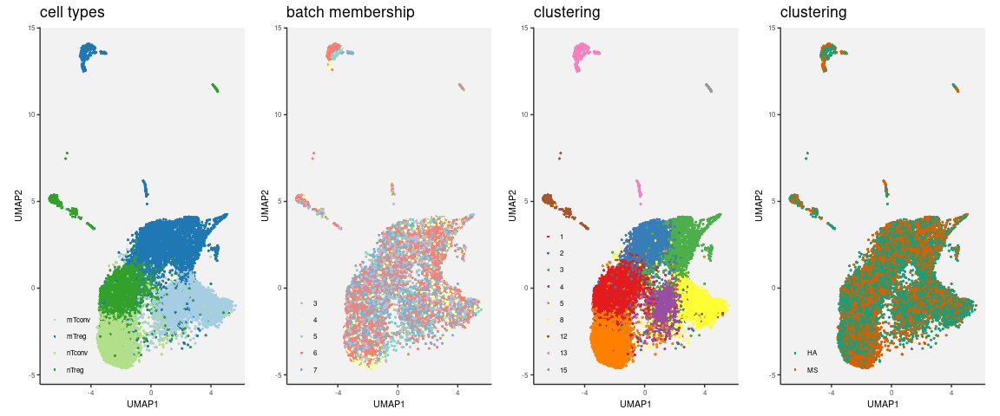<!-- -->


[PDF](Fig/STEP2//Fig_umap_celltype.pdf)

### tSNE


```r
p1 <-
    .gg.plot(tsne.dt[sample(.N)], aes(tSNE1, tSNE2, color=celltype)) +
    ggrastr::rasterise(geom_point(stroke = 0, size=1), dpi=300) +
    theme(legend.position = c(0,0), legend.justification = c(0,0)) +
    ggtitle("cell types") +
    scale_color_brewer("", palette = "Paired")

p2 <-
    .gg.plot(tsne.dt[sample(.N)], aes(tSNE1, tSNE2, color=as.factor(batch))) +
    ggrastr::rasterise(geom_point(stroke = 0, size=1), dpi=300) +
    theme(legend.position = c(0,0), legend.justification = c(0,0)) +
    ggtitle("batch membership") +
    scale_color_brewer("", palette = "Set3")

p3 <-
    .gg.plot(tsne.dt[sample(.N)], aes(tSNE1, tSNE2, color=as.factor(membership))) +
    ggrastr::rasterise(geom_point(stroke = 0, size=1), dpi=300) +
    theme(legend.position = c(0,0), legend.justification = c(0,0)) +
    ggtitle("clustering") +
    scale_color_brewer("", palette = "Set1")

plt <- p1 | p2 | p3
print(plt)
```

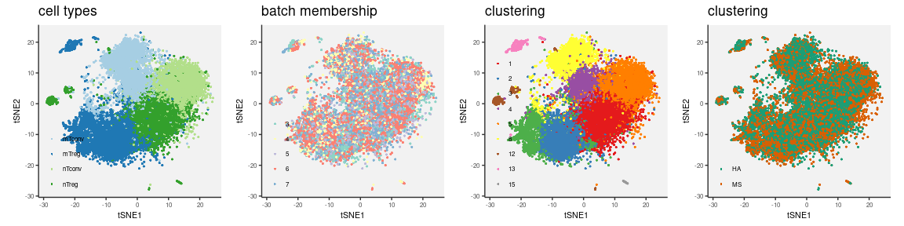<!-- -->


[PDF](Fig/STEP2//Fig_tsne_celltype.pdf)

## 3. Confirm cell type assignment with raw surface marker proteins


Two-dimensional density plot on the raw CD marker concentrations.


```r
.ct <- c("mTreg","nTreg","mTconv","nTconv")
plt <- plt.scatter.ct.2(.ct, final.cell.type, marker.raw.mtx)
print(plt)
```

<!-- -->


[PDF](Fig/STEP2//Fig_cdmarker_raw.pdf)


## 4. Confirm by other marker genes/proteins (normalized expression)


```r
.markers <-
    c("FOXP3", "ID3", "BACH2", "CXCR3", "PRDM1", "SGK1", "TCF7", "LEF1",
      "SELL", "IL2RA", "IL7R", "IKZF2", "CCR6", "CCR4", "CCR7", "CTLA4",
      "HLA-DRA", "CD25", "CD127", "CD183", "CD196",
      "CD197", "CD194", "CD45RA", "CD45RO",
      "HLA") %>%
    unique
```


### UMAP for the marker genes and proteins


```r
.markers <- sort(as.character(unique(marker.dt$marker)))
for(g in .markers){
    plt <- plot.marker.scatter(g, show.tsne = F)
    print(plt)
    .file <- fig.dir %&% "/Fig_marker_" %&% g %&% "_umap.pdf"
    .gg.save(filename = .file, plot = plt, width=3, height=5)
}
```

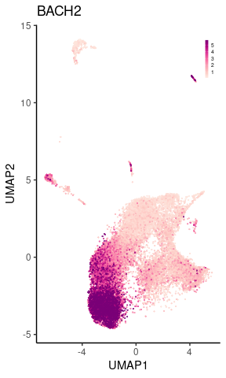<!-- -->

[PDF](Fig/STEP2//Fig_marker_BACH2_umap.pdf)

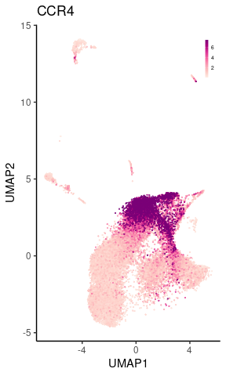<!-- -->

[PDF](Fig/STEP2//Fig_marker_CCR4_umap.pdf)

<!-- -->

[PDF](Fig/STEP2//Fig_marker_CCR6_umap.pdf)

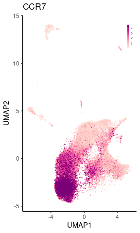<!-- -->

[PDF](Fig/STEP2//Fig_marker_CCR7_umap.pdf)

<!-- -->

[PDF](Fig/STEP2//Fig_marker_CD127_umap.pdf)

<!-- -->

[PDF](Fig/STEP2//Fig_marker_CD183_umap.pdf)

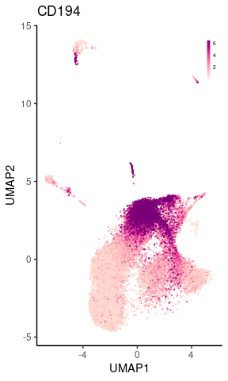<!-- -->

[PDF](Fig/STEP2//Fig_marker_CD194_umap.pdf)

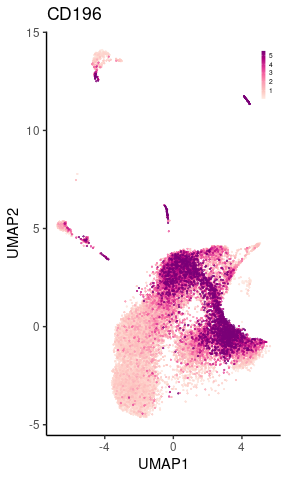<!-- -->

[PDF](Fig/STEP2//Fig_marker_CD196_umap.pdf)

<!-- -->

[PDF](Fig/STEP2//Fig_marker_CD197_umap.pdf)

<!-- -->

[PDF](Fig/STEP2//Fig_marker_CD25_umap.pdf)

<!-- -->

[PDF](Fig/STEP2//Fig_marker_CD45RA_umap.pdf)

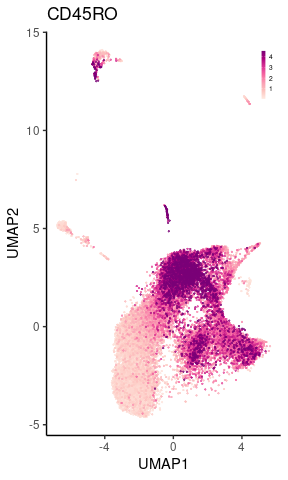<!-- -->

[PDF](Fig/STEP2//Fig_marker_CD45RO_umap.pdf)

<!-- -->

[PDF](Fig/STEP2//Fig_marker_CTLA4_umap.pdf)

<!-- -->

[PDF](Fig/STEP2//Fig_marker_CXCR3_umap.pdf)

<!-- -->

[PDF](Fig/STEP2//Fig_marker_FOXP3_umap.pdf)

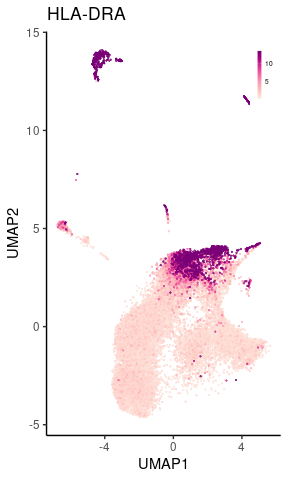<!-- -->

[PDF](Fig/STEP2//Fig_marker_HLA-DRA_umap.pdf)

<!-- -->

[PDF](Fig/STEP2//Fig_marker_ID3_umap.pdf)

<!-- -->

[PDF](Fig/STEP2//Fig_marker_IKZF2_umap.pdf)

<!-- -->

[PDF](Fig/STEP2//Fig_marker_IL2RA_umap.pdf)

<!-- -->

[PDF](Fig/STEP2//Fig_marker_PRDM1_umap.pdf)

<!-- -->

[PDF](Fig/STEP2//Fig_marker_SGK1_umap.pdf)

<!-- -->

[PDF](Fig/STEP2//Fig_marker_TCF7_umap.pdf)

### tSNE for the marker genes and proteins


```r
.markers <- sort(as.character(unique(marker.dt$marker)))
for(g in .markers){
    plt <- plot.marker.scatter(g, show.tsne = T)
    print(plt)
    .file <- fig.dir %&% "/Fig_marker_" %&% g %&% "_tsne.pdf"
    .gg.save(filename = .file, plot = plt, width=3, height=3)
}
```

<!-- -->

[PDF](Fig/STEP2//Fig_marker_BACH2_tsne.pdf)

<!-- -->

[PDF](Fig/STEP2//Fig_marker_CCR4_tsne.pdf)

<!-- -->

[PDF](Fig/STEP2//Fig_marker_CCR6_tsne.pdf)

<!-- -->

[PDF](Fig/STEP2//Fig_marker_CCR7_tsne.pdf)

<!-- -->

[PDF](Fig/STEP2//Fig_marker_CD127_tsne.pdf)

<!-- -->

[PDF](Fig/STEP2//Fig_marker_CD183_tsne.pdf)

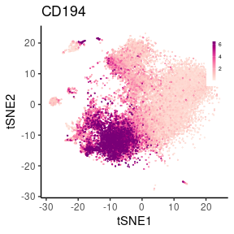<!-- -->

[PDF](Fig/STEP2//Fig_marker_CD194_tsne.pdf)

<!-- -->

[PDF](Fig/STEP2//Fig_marker_CD196_tsne.pdf)

<!-- -->

[PDF](Fig/STEP2//Fig_marker_CD197_tsne.pdf)

<!-- -->

[PDF](Fig/STEP2//Fig_marker_CD25_tsne.pdf)

<!-- -->

[PDF](Fig/STEP2//Fig_marker_CD45RA_tsne.pdf)

<!-- -->

[PDF](Fig/STEP2//Fig_marker_CD45RO_tsne.pdf)

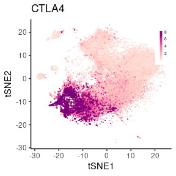<!-- -->

[PDF](Fig/STEP2//Fig_marker_CTLA4_tsne.pdf)

<!-- -->

[PDF](Fig/STEP2//Fig_marker_CXCR3_tsne.pdf)

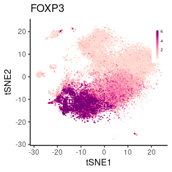<!-- -->

[PDF](Fig/STEP2//Fig_marker_FOXP3_tsne.pdf)

<!-- -->

[PDF](Fig/STEP2//Fig_marker_HLA-DRA_tsne.pdf)

<!-- -->

[PDF](Fig/STEP2//Fig_marker_ID3_tsne.pdf)

<!-- -->

[PDF](Fig/STEP2//Fig_marker_IKZF2_tsne.pdf)

<!-- -->

[PDF](Fig/STEP2//Fig_marker_IL2RA_tsne.pdf)

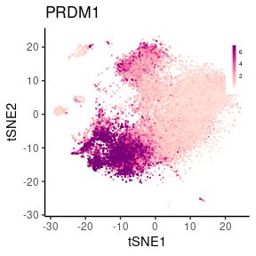<!-- -->

[PDF](Fig/STEP2//Fig_marker_PRDM1_tsne.pdf)

<!-- -->

[PDF](Fig/STEP2//Fig_marker_SGK1_tsne.pdf)

<!-- -->

[PDF](Fig/STEP2//Fig_marker_TCF7_tsne.pdf)

## 5. Basic statistics for the first round annotation (22,403 cells)


```r
.hash.hdr <- "result/step1/hash"
.hash.data <- fileset.list(.hash.hdr)
.hash.info <- read.hash(.hash.data)
```

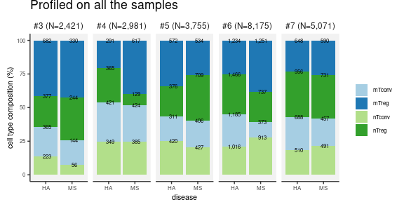<!-- -->


[PDF](Fig/STEP2//Fig_count_stat_tot.pdf)

<!-- -->


[PDF](Fig/STEP2//Fig_count_merged_stat_tot.pdf)


## 6. PRDM1 short vs. long


```r
prdm.dt <- fread("data/PRDM1/PRDM1_SL.csv.gz")

.dt <-
    copy(final.cell.type) %>%
    left_join(prdm.dt) %>%
    left_join(umap.dt) %>%
    left_join(tsne.dt) %>%
    na.omit() %>%
    as.data.table()

.dt[, membership := as.factor(`membership`)]
```


```r
.aes <- aes(UMAP1, UMAP2, colour=pmin(PRDM1_short, 3))

p1 <-
    ggplot(.dt[order(PRDM1_short)], .aes) +
    xlab("UMAP 1") + ylab("UMAP 2") + prdm.thm +
    ggrastr::rasterise(geom_point(stroke=0, size=1), dpi = 300) +
    scale_colour_distiller("PRDM1\nshort",
                           palette="RdPu",
                           direction=1)

.aes <- aes(UMAP1, UMAP2, colour = pmin(PRDM1_long, 3))

p2 <-
    ggplot(.dt[order(PRDM1_long)], .aes) +
    xlab("UMAP 1") + ylab("UMAP 2") + prdm.thm +
    ggrastr::rasterise(geom_point(stroke=0, size=1), dpi = 300) +
    scale_colour_distiller("PRDM1\nlong",
                           palette="RdPu",
                           direction=1)

plt <- p1 | p2
print(plt)
```

<!-- -->


[PDF](Fig/STEP2//Fig_PRDM1_isoform_umap.pdf)


```r
.aes <- aes(tSNE1, tSNE2, colour=pmin(PRDM1_short, 3))

p1 <-
    ggplot(.dt[order(PRDM1_short)], .aes) +
    xlab("tSNE 1") + ylab("tSNE 2") + prdm.thm +
    ggrastr::rasterise(geom_point(stroke=0, size=1), dpi = 300) +
    scale_colour_distiller("PRDM1\nshort",
                           palette="RdPu",
                           direction=1)

.aes <- aes(tSNE1, tSNE2, colour = pmin(PRDM1_long, 3))

p2 <-
    ggplot(.dt[order(PRDM1_long)], .aes) +
    xlab("tSNE 1") + ylab("tSNE 2") + prdm.thm +
    ggrastr::rasterise(geom_point(stroke=0, size=1), dpi = 300) +
    scale_colour_distiller("PRDM1\nlong",
                           palette="RdPu",
                           direction=1)

plt <- p1 | p2
print(plt)
```

<!-- -->


[PDF](Fig/STEP2//Fig_PRDM1_isoform_tsne.pdf)

## 5. Tables

* [**DOWNLOAD:** Cell type annotation](Tab/step2_cell_type.txt.gz)

* [**DOWNLOAD:** UMAP + annotation](Tab/step2_umap_coord.txt.gz)

* [**DOWNLOAD:** tSNE + annotation](Tab/step2_tsne_coord.txt.gz)

