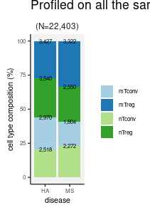
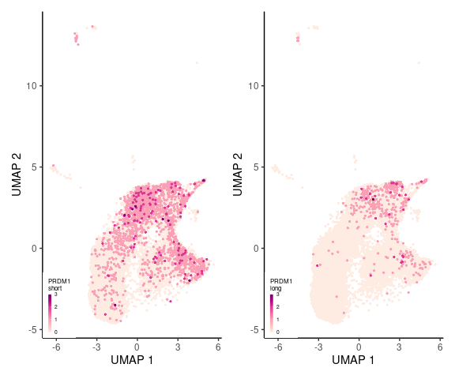

# Round 1: Top-level cell type annotation

## Can we distinguish cell types by surface proteins?


* nTconv : CD3+, CD4+, CD8-, CD25-/CD127+, CD45RA+/CD45RO-
* mTconv : CD3+, CD4+, CD8-, CD25-/CD127+, CD45RA-/CD45RO+
* nTreg : CD3+, CD4+, CD8-, CD25+/CD127-, CD45RA+/CD45RO-
* mTreg : CD3+, CD4+, CD8-, CD25+/CD127-, CD45RA-/CD45RO+

Run annotation purely based on marker proteins:


```r
.file <- "result/step2/prot_annot.txt.gz"

if.needed(.file, {

    .pos.markers <- .read.marker.file("marker/surface_round1_positive.txt")
    .neg.markers <- .read.marker.file("marker/surface_round1_negative.txt")

    .annot.out <-
        rcpp_mmutil_annotate_columns(
            pos_labels = list(p1=.pos.markers),
            r_neg_labels = list(n1=.neg.markers),
            mtx_file = .prot.data$mtx,
            row_file = .prot.data$row,
            col_file = .prot.data$col,
            EM_TOL = 1e-6,
            EM_ITER = 500,
            TAKE_LN = T)

    annot.dt <- setDT(.annot.out$annotation)
    .col <- c("tag", "celltype", "prob", "ln.prob")
    names(annot.dt) <- .col
    annot.dt[, c("barcode","batch") := tstrsplit(tag, split="_")]
    fwrite(annot.dt, .file)
})

annot.dt <- fread(.file)
```

Two-dimensional density plot on the raw CD marker concentrations.


```r
prot.raw.mtx <- read.dense(.prot.data$mtx)
.names <- sapply(readLines(.prot.data$row),
                 function(s) unlist(strsplit(s, split="[_]+"))[1],
                 USE.NAMES = F)

rownames(prot.raw.mtx) <- .names
colnames(prot.raw.mtx) <- readLines(.prot.data$col)

.melt <-
    reshape2::melt(prot.raw.mtx) %>%
    filter(!str_detect(`Var1`, "Hashtag")) %>%
    as.data.table()

.sum <- .melt[,
              .(value = sum(value)),
              by = .(Var1, Var2)]

## collapse the same feature names
.dt <-
    dcast(.sum, Var1 ~ Var2, value.var = "value", fill = 0)

prot.raw.mtx <- as.matrix(.dt[, -1])
rownames(prot.raw.mtx) <- unlist(.dt[, 1])

.ct <- c("mTreg","nTreg","mTconv","nTconv")
plt <- plt.scatter.ct.2(.ct, annot.dt, prot.raw.mtx)
print(plt)
```

<!-- -->


[PDF](Fig/STEP2//Fig_round1_cdmarker.pdf)

## Will the same classification results hold in transcriptomic data?


```r
.features <- readLines(.data$row)
.hash <- .features[str_detect(.features, "Hash")]

.hash.hdr <- "result/step1/hash"
.hash.data <- fileset.list(.hash.hdr)

if.needed(.hash.data, {
    .hash.data <-
        rcpp_mmutil_copy_selected_rows(.data$mtx,
                                       .data$row,
                                       .data$col,
                                       .hash,
                                       .hash.hdr)
})

.hash.mtx <- read.dense(.hash.data$mtx)
.hash.argmax <- apply(.hash.mtx, 2, which.max)

.hash.cells <- .hash.data$col %>%
    fread(header=F, col.names="cell") %>%
    (function(x) {
        x[,c("barcode","batch"):=tstrsplit(`cell`,split="_")];
        x[, barcode := gsub(`barcode`, pattern="-[0-9]$", replacement="")];
        x[, hash := .hash.argmax]
        x[, batch := as.integer(`batch`)]
        return(x);
    })

.sample.info <-
    readxl::read_xlsx("data/Hashing list MS Treg project.xlsx", 1) %>%
    rename(Sample = `Cell type`) %>%
    mutate(hash = gsub("#","",`hash`)) %>%
    mutate(hash = as.integer(`hash`)) %>%
    mutate(disease = substr(`subject`, 1, 2))

.hash.info <-
    left_join(.hash.cells, .sample.info)
```


```r
.file <- "result/step2/gene_bbknn.rds"

if.needed(.file, {

    .batches <- fread(.gene.data$col, col.names="cell", header=F) %>%
        (function(x) {
            x[, c("barcode", "batch") := tstrsplit(cell, split="[_]")];
            x[, barcode := gsub(`barcode`, pattern="-[0-9]$", replacement="")];
            x[, batch := as.integer(`batch`)]
            x;
        }) %>%
        left_join(.hash.info)

    bb <- .batches %>%
        mutate(b = batch %&% "_" %&% disease) %>%
        select(b) %>%
        unlist()

    .bbknn <- rcpp_mmutil_bbknn_svd(.gene.data$mtx, bb,
                                    knn = 30, RANK = 50,
                                    EM_ITER = 20,
                                    TAKE_LN = TRUE,
                                    NUM_THREADS = 16)
    saveRDS(.bbknn, .file)
})
.bbknn <- readRDS(.file)
```

1. Build a batch-balancing kNN graph

2. Leiden graph-based clustering

3. Construct UMAP the kNN backbone graph


```r
.file <- "result/step2/gene_bbknn_leiden.txt.gz"
.cells <- readLines(.gene.data$col)

if.needed(.file, {
    .bbknn.umap <- run.bbknn.umap(.bbknn$knn,
                                  .cells,
                                  symmetrize=F,
                                  min_dist=.1,
                                  spread=5,
                                  res=2)
    fwrite(.bbknn.umap, .file)
})

.bbknn.umap <- fread(.file)

.bbknn.umap <- .bbknn.umap %>%
    left_join(annot.dt, by = "tag") %>%
    filter(celltype != "CD8") %>%
    mutate(membership = as.factor(membership)) %>%
    as.data.table()

## remove cells too far from the centre
## in order to show more cells
.bbknn.umap[, x := scale(umap1)]
.bbknn.umap[, y := scale(umap2)]
.bbknn.umap[, d := sqrt(x^2 + y^2)]

.size <- .bbknn.umap[, .(.N), by = .(membership)]

.bbknn.umap <-
    .size[N > 0, .(membership)] %>%
    left_join(.bbknn.umap, by = "membership") %>%
    filter(`d` < 2.2) %>%
    as.data.table()
```

### Clustering patterns in scRNA-seq generally agrees with the classification results based on surface proteins


```r
p1 <-
    .gg.plot(.bbknn.umap, aes(umap1, umap2, color=membership)) +
    ggrastr::rasterise(geom_point(stroke=0, alpha=.8, size=.7), dpi=300)

p2 <-
    .gg.plot(.bbknn.umap, aes(umap1, umap2, color=celltype)) +
    ggrastr::rasterise(geom_point(stroke=0, alpha=.8, size=.7), dpi=300) +
    scale_color_brewer(palette = "Paired")

plt <- p1 | p2
print(plt)
```

<!-- -->


[PDF](Fig/STEP2//Fig_bbknn_gene_only_umap.pdf)

However, gene expression patterns may not be sufficient.


```r
.ct.mem <- .bbknn.umap[, .(nc = .N), by = .(celltype, membership)]
.ct.mem[, ntot := sum(`nc`), by = .(membership)]
.ct.mem[, pr := `nc`/`ntot`]

.df <-
    .ct.mem %>%
    mutate(row = celltype, col = membership,
           weight = logit(pmax(pmin(pr, 1-1e-2), 1e-2))) %>%
    order.pair(ret.tab = TRUE)

plt <-
    .gg.plot(.df, aes(col, row, fill=weight, size = `nc`)) +
    xlab("Leiden clustering") +
    ylab("cell type") +
    theme(legend.position = "bottom") +
    geom_point(pch=22) +
    scale_size_continuous("#cells", range=c(0,5)) +
    scale_fill_distiller("proportion",
                         palette="PuRd", direction = 1,
                         labels=function(x) round(sigmoid(x), 2))
print(plt)
```

<!-- -->


[PDF](Fig/STEP2//Fig_bbknn_gene_only_cluster.pdf)

## Joint clustering analysis


```r
.file <- "result/step2/full_bbknn.rds"

if.needed(.file, {

    .batches <- fread(.data$col, col.names="cell", header=F) %>%
        (function(x) {
            x[, c("barcode", "batch") := tstrsplit(cell, split="[_]")];
            x[, barcode := gsub(`barcode`, pattern="-[0-9]$", replacement="")];
            x[, batch := as.integer(`batch`)]
            x;
        }) %>%
        left_join(.hash.info)

    bb <- .batches %>%
        mutate(b = batch %&% "_" %&% disease) %>%
        select(b) %>%
        unlist()

    .bbknn <- rcpp_mmutil_bbknn_svd(.data$mtx, bb,
                                    knn = 30, RANK = 50,
                                    EM_ITER = 20,
                                    TAKE_LN = TRUE,
                                    NUM_THREADS = 16)
    saveRDS(.bbknn, .file)
})
.bbknn <- readRDS(.file)
```

### 1. Run annotation based on the surface marker proteins


```r
.file <- "result/step2/prot_annot_full.txt.gz"

if.needed(.file, {
    .pos.markers <- .read.marker.file("marker/surface_round1_positive.txt")
    .neg.markers <- .read.marker.file("marker/surface_round1_negative.txt")

    .annot.out <-
        rcpp_mmutil_annotate_columns(
            pos_labels = list(p1=.pos.markers),
            r_neg_labels = list(n1=.neg.markers),
            row_file = .data$row,
            col_file = .data$col,
            r_U = .bbknn$U,
            r_D = .bbknn$D,
            r_V = .bbknn$V,
            EM_TOL = 1e-6,
            EM_ITER = 500)

    annot.dt <- setDT(.annot.out$annotation)
    .col <- c("tag", "celltype", "prob", "ln.prob")
    names(annot.dt) <- .col
    annot.dt[, c("barcode","batch") := tstrsplit(tag, split="_")]
    fwrite(annot.dt, .file)
})
annot.dt <- fread(.file)
```

Two-dimensional density plot on the raw CD marker concentrations.


```r
prot.raw.mtx <- read.dense(.prot.data$mtx)
colnames(prot.raw.mtx) <- readLines(.prot.data$col)

.names <- sapply(readLines(.prot.data$row),
                 function(s) unlist(strsplit(s, split="[_]+"))[1],
                 USE.NAMES = F) %>%
    sapply(gsub, pattern="anti-human", replacement="", USE.NAMES = F) %>%
    sapply(gsub, pattern="^[-]+", replacement="", USE.NAMES = F)

rownames(prot.raw.mtx) <- .names

.ct <- c("mTreg","nTreg","mTconv","nTconv")
plt <- plt.scatter.ct.2(.ct, annot.dt, prot.raw.mtx)
print(plt)
```

<!-- -->


[PDF](Fig/STEP2//Fig_round1_cdmarker_full.pdf)

### 2. Followed by cell-cell graph clustering...


```r
.file <- "result/step2/full_bbknn_leiden.txt.gz"
.cells <- readLines(.data$col)

if.needed(.file, {
    .bbknn.umap <- run.bbknn.umap(.bbknn$knn,
                                  .cells,
                                  symmetrize=F,
                                  res=3,
                                  nrepeat=20,
                                  min_dist=.01,
                                  spread=5)
    fwrite(.bbknn.umap, .file)
})

.bbknn.umap <- fread(.file)

.bbknn.umap <- .bbknn.umap %>%
    left_join(annot.dt, by = "tag") %>%
    mutate(membership = as.factor(membership)) %>%
    as.data.table()

## remove cells too far from the centre
## in order to show more cells
.bbknn.umap[, x := scale(umap1)]
.bbknn.umap[, y := scale(umap2)]
.bbknn.umap[, d := sqrt(x^2 + y^2)]

.size <- .bbknn.umap[, .(.N), by = .(membership)]

.bbknn.umap <-
    .size[N > 0, .(membership)] %>%
    left_join(.bbknn.umap, by = "membership") %>%
    filter(`d` < 2.2) %>%
    as.data.table()
```


```r
p1 <-
    .gg.plot(.bbknn.umap[sample(.N)], aes(umap1, umap2, color=membership)) +
    ggrastr::rasterise(geom_point(stroke=0, alpha=.8, size=.7), dpi=300)

p2 <-
    .gg.plot(.bbknn.umap[sample(.N)], aes(umap1, umap2, color=celltype)) +
    ggrastr::rasterise(geom_point(stroke=0, alpha=.8, size=.7), dpi=300) +
    scale_color_brewer(palette = "Paired")

plt <- p1 | p2
print(plt)
```

<!-- -->


[PDF](Fig/STEP2//Fig_bbknn_full_umap.pdf)


```r
.ct.mem <- .bbknn.umap[, .(nc = .N), by = .(celltype, membership)]
.ct.mem[, ntot := sum(`nc`), by = .(membership)]
.ct.mem[, pr := `nc`/`ntot`]

.df <-
    .ct.mem %>%
    mutate(row = celltype, col = membership,
           weight = logit(pmax(pmin(pr, 1-1e-2), 1e-2))) %>%
    order.pair(ret.tab = TRUE)

plt <-
    .gg.plot(.df, aes(col, row, fill=weight, size = `nc`)) +
    xlab("Leiden clustering") +
    ylab("cell type") +
    theme(legend.position = "bottom") +
    geom_point(pch=22) +
    scale_size_continuous("#cells", range=c(0,5)) +
    scale_fill_distiller("proportion",
                         palette="PuRd", direction = 1,
                         labels=function(x) round(sigmoid(x), 2))
print(plt)
```

<!-- -->


[PDF](Fig/STEP2//Fig_bbknn_full_cluster.pdf)


* Annotate each cell cluster with the maximally matching cell type


```r
## a. Assign cell types to clusters
.tot.size <- .dt[, .(.N), by = .(membership)]
.tot.size[, membership := as.integer(`membership`)]
.size <- .dt[, .(.N), by = .(membership, celltype)]
.size[, membership := as.integer(`membership`)]

.argmax <- .size[order(`N`), tail(.SD, 1), by = .(membership)]
.argmax[, membership := as.integer(`membership`)]
```

* 43 modules

* Remove clusters with too few cells (`N` $<$ 100) and retain 36 clusters


```r
.argmax[, `N.overlap` := `N`]
.argmax[, `N` := NULL]

.size.argmax <- left_join(.argmax, .tot.size) %>% as.data.table()

.file <- "result/step2/full_bbknn_leiden.txt.gz"
celltype.final <-
    fread(.file) %>%
    left_join(.size.argmax) %>%
    as.data.table() %>%
    na.omit()
```


```r
## b. Remove small clusters
celltype.final <- celltype.final[`N` > 100]

## c. Remove ambiguous ones
celltype.final <- celltype.final[`N.overlap`/`N` > .5]
```

;* Remove clusters with mixed cell types and retain 32 clusters

* 33,422 cells.


Check with Liang's supervised approach.


```r
.overlap <-
    fread("data/PRDM1/PRDM1_SL.csv.gz") %>%
    left_join(celltype.final) %>%
    na.omit()

.dt <- .overlap[, .(.N), by = .(cell_type_liang, celltype)]
.dt <- .dt[, lab := num.int(`N`)]

.aes <- aes(celltype, cell_type_liang, fill=`N`, label=`lab`)
plt <- .gg.plot(.dt, .aes) +
    geom_tile(linewidth=.1, colour="black") +
    geom_text(size=3) +
    scale_fill_distiller("N", direction=1) +
    theme(axis.text.x = element_text(angle=90, vjust=1, hjust=1)) +
    xlab("CD annotation + Leiden") +
    ylab("Classifier (Liang)")
print(plt)
```

<!-- -->


```r
## remove cells too far from the centre
## in order to show more cells
.temp <- fread("data/PRDM1/PRDM1_SL.csv.gz")
.bbknn.umap <- celltype.final %>% left_join(.temp) %>% as.data.table()

.bbknn.umap[, membership := as.factor(`membership`)]
.bbknn.umap[, x := scale(umap1)]
.bbknn.umap[, y := scale(umap2)]
.bbknn.umap[, d := sqrt(x^2 + y^2)]
.bbknn.umap <- .bbknn.umap[`d` < 2.2 & `N` > 100]

p1 <-
    .gg.plot(.bbknn.umap[sample(.N)], aes(umap1, umap2, color=membership)) +
    ggrastr::rasterise(geom_point(stroke=0, alpha=.8, size=.7), dpi=300) +
    theme(legend.position = "none")

p2 <-
    .gg.plot(.bbknn.umap[sample(.N)], aes(umap1, umap2, color=celltype)) +
    ggrastr::rasterise(geom_point(stroke=0, alpha=.8, size=.7), dpi=300) +
    scale_color_brewer("annotation\n+Leiden", palette = "Paired")

p3 <-
    .gg.plot(na.omit(.bbknn.umap[sample(.N)]), aes(umap1, umap2, color=cell_type_liang)) +
    ggrastr::rasterise(geom_point(stroke=0, alpha=.8, size=.7), dpi=300) +
    scale_color_brewer("supervised", palette = "Paired")

plt <- wrap_plots(p1, p2, p3, nrow=1)
print(plt)
```

<!-- -->

```r
.file <- fig.dir %&% "/Fig_bbknn_refined_umap.pdf"
.gg.save(filename = .file, plot = plt, width=12, height=3)
```


[PDF](Fig/STEP2//Fig_bbknn_refined_umap.pdf)


[**DOWNLOAD:** Cell type estimation](Tab/step2_celltype.txt.gz)


```r
.ct.mem <- celltype.final[, .(nc = .N), by = .(celltype, membership)]
.ct.mem[, ntot := sum(`nc`), by = .(membership)]
.ct.mem[, pr := `nc`/`ntot`]

.df <-
    .ct.mem %>%
    mutate(row = celltype, col = membership,
           weight = logit(pmax(pmin(pr, 1-1e-2), 1e-2))) %>%
    order.pair(ret.tab = TRUE)

plt <-
    .gg.plot(.df, aes(col, row, size = `nc`)) +
    xlab("Leiden clustering") +
    ylab("cell type") +
    theme(legend.position = "bottom") +
    geom_point(pch=22, fill="black") +
    scale_size_continuous("#cells", range=c(0,5))
print(plt)
```

<!-- -->

```r
.file <- fig.dir %&% "/Fig_bbknn_refined_cluster.pdf"
.gg.save(filename = .file, plot = plt, width=5, height=2)
```


[PDF](Fig/STEP2//Fig_bbknn_refined_cluster.pdf)


### 3. Confirm by other marker genes/proteins


```r
.markers <-
    c("FOXP3", "ID3", "BACH2", "CXCR3", "PRDM1", "SGK1", "TCF7", "LEF1",
      "SELL", "IL2RA", "IL7R", "IKZF2", "CCR6", "CCR4", "CCR7", "CTLA4",
      "HLA-DRA", "CD25", "CD127", "CD183", "CD196",
      "CD197", "CD194", "CD45RA", "CD45RO",
      "HLA") %>%
    unique

.rows <- .fread(.data$row, col.names="r")
.rows[, c("ensembl_gene_id","hgnc_symbol") := tstrsplit(`r`,split="_")]

.markers <- .rows[`hgnc_symbol` %in% .markers]$r

.marker.hdr <- "result/step2/marker/marker"
.mkdir(dirname(.marker.hdr))
.marker.data <- fileset.list(.marker.hdr)
if.needed(.marker.data, {
    .marker.data <-
        rcpp_mmutil_copy_selected_rows(.data$mtx,
                                       .data$row,
                                       .data$col,
                                       .markers,
                                       .marker.hdr)
})
```


**Note: these plots show expression values without batch adjustment**


```r
.markers <- sort(as.character(unique(marker.dt$marker)))
for(g in .markers){
    plt <- plot.marker.umap(g)
    print(plt)
    .file <- fig.dir %&% "/Fig_marker_" %&% g %&% "_umap.pdf"
    .gg.save(filename = .file, plot = plt, width=3.2, height=2.8)
}
```

<!-- -->

[PDF](Fig/STEP2//Fig_marker_CD127_CD127_umap.pdf)

<!-- -->

[PDF](Fig/STEP2//Fig_marker_CD183_CD183_umap.pdf)

<!-- -->

[PDF](Fig/STEP2//Fig_marker_CD194_CD194_umap.pdf)

<!-- -->

[PDF](Fig/STEP2//Fig_marker_CD196_CD196_umap.pdf)

<!-- -->

[PDF](Fig/STEP2//Fig_marker_CD197_CD197_umap.pdf)

<!-- -->

[PDF](Fig/STEP2//Fig_marker_CD25_CD25_umap.pdf)

<!-- -->

[PDF](Fig/STEP2//Fig_marker_CD45RA_CD45RA_umap.pdf)

<!-- -->

[PDF](Fig/STEP2//Fig_marker_CD45RO_CD45RO_umap.pdf)

<!-- -->

[PDF](Fig/STEP2//Fig_marker_ENSG00000030419_IKZF2_umap.pdf)

<!-- -->

[PDF](Fig/STEP2//Fig_marker_ENSG00000049768_FOXP3_umap.pdf)

<!-- -->

[PDF](Fig/STEP2//Fig_marker_ENSG00000057657_PRDM1_umap.pdf)

<!-- -->

[PDF](Fig/STEP2//Fig_marker_ENSG00000081059_TCF7_umap.pdf)

<!-- -->

[PDF](Fig/STEP2//Fig_marker_ENSG00000112182_BACH2_umap.pdf)

<!-- -->

[PDF](Fig/STEP2//Fig_marker_ENSG00000112486_CCR6_umap.pdf)

<!-- -->

[PDF](Fig/STEP2//Fig_marker_ENSG00000117318_ID3_umap.pdf)

<!-- -->

[PDF](Fig/STEP2//Fig_marker_ENSG00000118515_SGK1_umap.pdf)

<!-- -->

[PDF](Fig/STEP2//Fig_marker_ENSG00000126353_CCR7_umap.pdf)

<!-- -->

[PDF](Fig/STEP2//Fig_marker_ENSG00000134460_IL2RA_umap.pdf)

<!-- -->

[PDF](Fig/STEP2//Fig_marker_ENSG00000138795_LEF1_umap.pdf)

<!-- -->

[PDF](Fig/STEP2//Fig_marker_ENSG00000163599_CTLA4_umap.pdf)

<!-- -->

[PDF](Fig/STEP2//Fig_marker_ENSG00000168685_IL7R_umap.pdf)

<!-- -->

[PDF](Fig/STEP2//Fig_marker_ENSG00000183813_CCR4_umap.pdf)

<!-- -->

[PDF](Fig/STEP2//Fig_marker_ENSG00000186810_CXCR3_umap.pdf)

<!-- -->

[PDF](Fig/STEP2//Fig_marker_ENSG00000188404_SELL_umap.pdf)

<!-- -->

[PDF](Fig/STEP2//Fig_marker_ENSG00000204287_HLA-DRA_umap.pdf)

## Basic statistics for the first round annotation (33,422 cells)


```r
.hash.mtx <- read.dense("result/step1/hash.mtx.gz")
.hash.argmax <- apply(.hash.mtx, 2, which.max)

.cells <- "result/step1/hash.cols.gz" %>%
    fread(header=F, col.names="cell") %>%
    (function(x) {
        x[,c("barcode","batch"):=tstrsplit(`cell`,split="_")];
        x[, barcode := gsub(`barcode`, pattern="-[0-9]$", replacement="")];
        x[, hash := .hash.argmax]
        x[, batch := as.integer(`batch`)]
        return(x);
    })

.sample.info <-
    readxl::read_xlsx("data/Hashing list MS Treg project.xlsx", 1) %>%
    rename(Sample = `Cell type`) %>%
    mutate(hash = gsub("#","",`hash`)) %>%
    mutate(hash = as.integer(`hash`)) %>%
    mutate(disease = substr(`subject`, 1, 2))

.hash.info <-
    left_join(.cells, .sample.info)

.dt <-
    celltype.final %>%
    mutate(batch=as.integer(batch)) %>%
    left_join(.hash.info) %>%
    mutate(ct=factor(celltype, c("nTconv","mTconv","nTreg","mTreg"))) %>%
    na.omit()
```

## Combining all the experiments

<!-- -->

[PDF](Fig/STEP2//Fig_count_stat_tot.pdf)

<!-- -->

[PDF](Fig/STEP2//Fig_count_merged_stat_tot.pdf)

## Total CD4 samples

<!-- -->

[PDF](Fig/STEP2//Fig_count_stat_cd4.pdf)


```r
.stat <-
    .dt[Sample == "Total CD4T cells", .(N = .N), by=.(celltype, ct, disease)] %>%
    .sum.stat.tot %>%
    mutate(batch = "(N=" %&% num.int(sum(.stat$N)) %&% ")")
plt <- .plt.sum.stat(.stat) +
    ggtitle("Profiled on Total CD4 T-cells")
print(plt)
```

<!-- -->


[PDF](Fig/STEP2//Fig_count_merged_stat_cd4.pdf)

## CD25 enriched samples


```r
.stat <-
    .dt[Sample == "CD25+ CD4T cells",
        .(N = .N),
        by=.(batch, celltype, ct, disease)] %>%
    .sum.stat.batch
plt <- .plt.sum.stat(.stat) +
    ggtitle("Profiled on the CD25+ enriched")
print(plt)
```

<!-- -->


[PDF](Fig/STEP2//Fig_count_stat_cd25enriched.pdf)


```r
.stat <-
    .dt[Sample == "CD25+ CD4T cells", .(N = .N), by=.(celltype, ct, disease)] %>%
    .sum.stat.tot %>%
    mutate(batch = "(N=" %&% num.int(sum(.stat$N)) %&% ")")
plt <- .plt.sum.stat(.stat) +
    ggtitle("Profiled on the CD25+ enriched")
print(plt)
```

<!-- -->


[PDF](Fig/STEP2//Fig_count_merged_stat_cd25enriched.pdf)

### PRDM1 short vs. long


```r
prdm.dt <- fread("data/PRDM1/PRDM1_SL.csv.gz")

.dt <-
    copy(celltype.final) %>%
    left_join(prdm.dt) %>%
    na.omit() %>%
    as.data.table()

.aes <- aes(umap1, umap2, colour=pmin(PRDM1_short, 3))

p1 <-
    ggplot(.dt[order(PRDM1_short)], .aes) +
    xlab("UMAP 1") + ylab("UMAP 2") + prdm.thm +
    ggrastr::rasterise(geom_point(stroke=0, size=1), dpi = 300) +
    scale_colour_distiller("PRDM1\nshort",
                           palette="RdPu",
                           direction=1)

.aes <- aes(umap1, umap2, colour = pmin(PRDM1_long, 3))

p2 <-
    ggplot(.dt[order(PRDM1_long)], .aes) +
    xlab("UMAP 1") + ylab("UMAP 2") + prdm.thm +
    ggrastr::rasterise(geom_point(stroke=0, size=1), dpi = 300) +
    scale_colour_distiller("PRDM1\nlong",
                           palette="RdPu",
                           direction=1)

plt <- p1 | p2
print(plt)
```

<!-- -->


[PDF](Fig/STEP2//Fig_PRDM1_isoform_umap.pdf)

### Stratify cells by batches and disease status


```r
.aes <- aes(umap1, umap2, colour=as.factor(batch))

B <- length(unique(.dt$batch))

plt <-
    .gg.plot(.dt[sample(.N)], .aes) +
    xlab("UMAP 1") + ylab("UMAP 2") +
    ggtitle("stratified by " %&% B %&% " batches") +
    facet_wrap( ~ "#" %&% batch, nrow=2) +
    ggrastr::rasterise(geom_point(stroke=0, size=.7), dpi = 300) +
    scale_color_manual(values=.more.colors(B,.palette="Set1"),
                       guide="none")
print(plt)
```

<!-- -->


[PDF](Fig/STEP2//Fig_bbknn_full_batch.pdf)


```r
.aes <- aes(umap1, umap2, colour=disease)

B <- length(unique(.dt$disease))

plt <-
    .gg.plot(.dt[sample(.N)], .aes) +
    xlab("UMAP 1") + ylab("UMAP 2") +
    ggtitle("stratified by " %&% B %&% " disease status") +
    facet_wrap( ~ disease, nrow = 1) +
    ggrastr::rasterise(geom_point(stroke=0, size=.7), dpi = 300) +
    scale_color_brewer(guide="none", palette="Set2")
print(plt)
```

<!-- -->


[PDF](Fig/STEP2//Fig_bbknn_full_disease.pdf)
