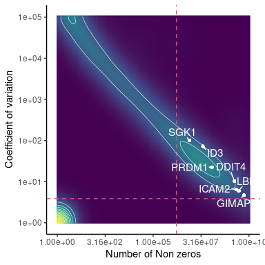
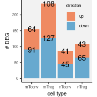

```r
.data <- fileset.list("result/step1/matrix")
.mkdir("result/step3")
```


```r
.features <- readLines(.data$row)
.hash <- .features[str_detect(.features, "Hash")]
.hash.hdr <- "result/step1/hash"
.hash.data <- fileset.list(.hash.hdr)
.hash.info <- read.hash(.hash.data)
```

## 1. MS vs. HC at the major cell type level


```r
final.cell.type <-
     fread("Tab/step2_cell_type.txt.gz") %>%
     left_join(.hash.info) %>%
     na.omit()
```


### a. Prepare data to just include cells annotated for their cell types and phenotypes


```r
.mkdir("result/step3/deg/")
.deg.data <- fileset.list("result/step3/deg/hc_ms")
if.needed(.deg.data, {
    .deg.data <-
        rcpp_mmutil_copy_selected_columns(.data$mtx,
                                          .data$row,
                                          .data$col,
                                          unique(final.cell.type$tag),
                                          "result/step3/deg/hc_ms")
})
```
### b. Gene Q/C to remove genes with too many zeros


```r
nnz.cutoff <- 500
cv.cutoff <- .8
```


```r
.scores <- rcpp_mmutil_compute_scores(.deg.data$mtx,
                                      .deg.data$row,
                                      .deg.data$col)

row.scores <- setDT(.scores$row) %>%
    rename(gene = name) %>%                      # 
    filter(!str_detect(`gene`,"[Hh]ashtag")) %>% # remove hashtag
    as.data.table() %>%
    parse.gene()
```


```r
.genes.interest <- c("PRDM1", "SGK1", "LBH", "DDIT4","GIMAP7","ID3","ICAM2")
.lab.dt <- row.scores[hgnc_symbol %in% .genes.interest]

plt <-
    ggplot(row.scores, aes(log1p(nnz), log1p(cv))) +
    theme_classic() +
    stat_density_2d(geom = "raster",
                    aes(fill = after_stat(sqrt(density))),
                    show.legend=F,
                    contour=F) +
    scale_fill_viridis_c() +
    geom_vline(xintercept = log1p(nnz.cutoff), col=2, lty = 2) +
    geom_hline(yintercept = log1p(cv.cutoff), col=2, lty = 2) +
    stat_density2d(linewidth=.2, colour="white") +
        geom_point(data=.lab.dt, pch=19, col="white", stroke=0, size=2) +
        geom_text_repel(aes(label=hgnc_symbol), data=.lab.dt, size=4, min.segment.length = .01, segment.color="white", color="white") +
    scale_x_continuous("Number of Non zeros", labels = function(x) num.sci(round(10^x))) +
    scale_y_continuous("Coefficient of variation", labels = function(x) num.sci(10^x))

print(plt)
```

<!-- -->


[PDF](Fig/STEP3//Fig_gene_scrores.pdf)


### c. Show that some genes of interest are not necessarily well expressed


```r
.genes.interest <- c("PRDM1", "SGK1", "LBH", "DDIT4")

.dt.show <- 
    row.scores[hgnc_symbol %in% .genes.interest] %>% 
    arrange(`nnz`) %>% 
    mutate(x = `nnz`, y = 5000 + 100 * (1:n())) %>%
    mutate(lab = hgnc_symbol %&% "\n(" %&% `nnz` %&% ")")

plt <-
    ggplot(row.scores, aes((`nnz`))) +
    theme_classic() + ggtitle("Gene-level statistics: histogram of number of non-zeros") +
    geom_histogram(fill="gray", linewidth=.1, color="gray20", bins=50) +
    ggrepel::geom_text_repel(aes(x, y, label=lab),
                             data=.dt.show,
                             size = 4, color = 2, vjust=0, hjust=0) +
    geom_vline(aes(xintercept = x), data = .dt.show, lty = 2, col = 2) +
    scale_y_log10("count") +
    scale_x_continuous("number of non-zero across " %&% num.int(.scores$max.col) %&% " cells",
                       breaks = c(unique(.dt.show$x), c(1, 5000, 15000, 20000)))
print(plt)
```

<!-- -->


```r
.file <- fig.dir %&% "/Fig_gene_scores_nnz.pdf"
.gg.save(filename = .file, plot = plt, width=8, height=3)
```


[PDF](Fig/STEP3//Fig_gene_scores_nnz.pdf)

### d. Compute DEG statistics while adjusting batch effects


```r
qc.features <- row.scores[nnz > nnz.cutoff & cv > cv.cutoff]

.qc.hdr <- "result/step3/deg/qc_hc_ms"
.qc.data <- fileset.list(.qc.hdr)

if.needed(.qc.data, {
    .qc.data <-
        rcpp_mmutil_copy_selected_rows(.deg.data$mtx,
                                       .deg.data$row,
                                       .deg.data$col,
                                       qc.features$gene,
                                       .qc.hdr)
})
```


```r
.file <- "result/step3/hc_ms.rds"
if.needed(.file,
{
    ## cell types
    .celltype <-
        final.cell.type %>%
        select(tag, celltype) %>%
        as.data.frame()
    ## cell -> individual
    .cell2indv <- final.cell.type %>%
        left_join(.hash.info) %>%
        select(tag, subject) %>%
        unique %>%
        as.data.frame()
    ## individual -> disease
    .indv2exp <- .cell2indv %>%
        select(subject) %>%
        mutate(disease = substr(`subject`, 1, 2)) %>%
        as.data.frame()

    .deg.stat <-
        make.cocoa(.qc.data, .celltype, .cell2indv, .indv2exp,
                   knn = 100, .rank = 15, .take.ln = TRUE,
                   impute.by.knn = TRUE, num.threads = 16)
    ## save for computed results
    saveRDS(.deg.stat, .file)
})
.deg.stat <- readRDS(.file)

.cts <- unique(final.cell.type$celltype)
.indvs <- unique(final.cell.type$subject)

.hc.ms.dt <-
    list(tot = sort.col(.deg.stat$sum, .cts, .indvs),
         cfa = sort.col(.deg.stat$resid.ln.mu, .cts, .indvs),
         cfa.sd = sort.col(.deg.stat$resid.ln.mu.sd, .cts, .indvs)) %>%
    combine.statistics() %>%
    na.omit() %>%
    as.data.table() %>%
    (function(x) {
        x[, c("sample", "celltype") := tstrsplit(as.character(Var2), split="_")];
        x[, disease := substr(`sample`, 1, 2)];
        x[, gene := as.character(Var1)];
        x
    }) %>%
    dplyr::select(-Var1, -Var2) %>%
    as.data.table()

hc.ms.deg <-
    summarize.deg(.hc.ms.dt, tot.cutoff = 5) %>%
    as.data.table() %>%
    parse.gene()
```


```r
plt <-
    .gg.plot(hc.ms.deg, aes(pv, fill=`celltype`)) +
    geom_histogram(bins=100, linewidth=.1, color="black") +
    xlab("p-value") +
    scale_fill_brewer(palette = "Paired")

print(plt)
```

<!-- -->


[PDF](Fig/STEP3//Fig_DEG_hist.pdf)

[**DOWNLOAD:** DEG MS vs HC](Tab/DEG_MS_vs_HC.txt.gz)

### e. Comparison with the bulk DEG results


```r
read.bulk <- function(.file) {
    fread(.file) %>%
        rename(hgnc_symbol = gene_name) %>%
        rename(bulk.t = t, bulk.pv = P.Value, bulk.qv = adj.P.Val) %>%
        dplyr::select(hgnc_symbol, starts_with("bulk"))
}

.file <- "data/DEG/20180513/deg.ms.hc.treg.mem.exvivo.sex_covar.ruv.txt"
bulk.mTreg.dt <- read.bulk(.file)

.file <- "data/DEG/20180513/deg.ms.hc.teff.mem.exvivo.sex_covar.ruv.txt"
bulk.mTconv.dt <- read.bulk(.file)
```


#### Memory Treg genes


##### Correlation 0.42 with p-value = 1.01e-92

<!-- -->

[PDF](Fig/STEP3//Fig_DEG_comparison_mTreg.pdf)

* Here, we computed correlation between the bulk and scRNA-seq results after selecting on the DEGs marginally significant in the bulk analysis ($|t| > 2$).

* Two numbers below the marked genes: first, we show p-value of the bulk analysis; second, we show Bonferroni-adjusted p-values of the scRNA-seq analysis.

#### Memory Tconv genes


```r
.sc <- hc.ms.deg[celltype == "mTconv"]

.bulk <- bulk.mTconv.dt

.out <- plot.bulk.sc(.sc,
                     .bulk,
                     .key.genes = c("PRDM1","SGK1","LBH","CD6","JUNB","ID3"),
                     fwer.cutoff = .01,
                     qv.cutoff = .2,
                     n.top = 5)
```

#### Correlation 0.28 with p-value = 4.3e-60

<!-- -->

[PDF](Fig/STEP3//Fig_DEG_comparison_mTconv.pdf)

* Here, we computed correlation between the bulk and scRNA-seq results after selecting on the DEGs marginally significant in the bulk analysis ($|t| > 2$).

* Two numbers below the marked genes: first, we show p-value of the bulk analysis; second, we show Bonferroni-adjusted p-values of the scRNA-seq analysis.

### Found 414 unique genes strongly perturbed by MS with FWER 5%

* Up-regulated: 211

* Down-regulated:  298

* Total pairs of genes and cell types: 34,415


```r
count.deg <- function(.dt, fwer.cutoff = .01) {
    .dt[fwer < fwer.cutoff &
        sign(ADD) == sign(ADE) &
        sign(ADC) == sign(ADE),
        .(n = .N),
        by = .(celltype,
               direction = if_else(z > 0, "up", "down"))
        ] %>%
        mutate(direction = factor(direction, c("up", "down"))) %>%
        group_by(celltype) %>%
        arrange(desc(direction)) %>%
        mutate(nc = cumsum(n)) %>%
        ungroup
}
```


```r
.df <- count.deg(hc.ms.deg)

plt <-
    .gg.plot(.df, aes(x = celltype, y = n, group = direction, fill = direction)) +
    theme(legend.position = c(1,1)) +
    theme(legend.justification = c(1,1)) +
    xlab("cell type") + ylab("# DEG") +
    geom_bar(stat="identity") +
    geom_text(aes(y=nc, label=n)) +
    scale_fill_manual(values = c("#ef8a62","#67a9cf"))

print(plt)
```

<!-- -->


[PDF](Fig/STEP3//Fig_DEG_count.pdf)

## 2. Show genes with FWER $< 5 \times 10^{-2}$


```r
.bulk.genes <-
    rbind(bulk.mTreg.dt[bulk.qv < .2, .(hgnc_symbol)],
          bulk.mTconv.dt[bulk.qv < .2, .(hgnc_symbol)]) %>%
    unique() %>%
    unlist()

hc.ms.deg[, c("ensembl_gene_id", "hgnc_symbol") := tstrsplit(`gene`, split="_")]

.genes.show <-
    hc.ms.deg[fwer < 0.05 &
              hgnc_symbol %in% .bulk.genes &
              sign(ADD) == sign(ADE) &
              sign(ADC) == sign(ADE)] %>%
    select(gene) %>%
    unique %>%
    unlist %>%
    as.character
```


```r
hc.ms.deg[, c("ensembl_gene_id", "hgnc_symbol") := tstrsplit(`gene`, split="_")]

.genes.show <-
    hc.ms.deg[fwer < .05 &
              sign(ADD) == sign(ADE) &
              sign(ADC) == sign(ADE)] %>%
    select(gene) %>%
    unique() %>%
    unlist() %>%
    as.character()
```


<table class=" lightable-paper lightable-striped" style="font-family: Helvetica; width: auto !important; margin-left: auto; margin-right: auto;">
 <thead>
  <tr>
   <th style="text-align:left;"> ensembl_gene_id </th>
   <th style="text-align:left;"> hgnc_symbol </th>
   <th style="text-align:left;"> z_mTconv </th>
   <th style="text-align:left;"> z_mTreg </th>
   <th style="text-align:left;"> z_nTconv </th>
   <th style="text-align:left;"> z_nTreg </th>
   <th style="text-align:left;"> pv_mTconv </th>
   <th style="text-align:left;"> pv_mTreg </th>
   <th style="text-align:left;"> pv_nTconv </th>
   <th style="text-align:left;"> pv_nTreg </th>
   <th style="text-align:left;"> fwer_mTconv </th>
   <th style="text-align:left;"> fwer_mTreg </th>
   <th style="text-align:left;"> fwer_nTconv </th>
   <th style="text-align:left;"> fwer_nTreg </th>
   <th style="text-align:left;"> .link </th>
  </tr>
 </thead>
<tbody>
  <tr>
   <td style="text-align:left;font-weight: bold;">  </td>
   <td style="text-align:left;"> CD137 </td>
   <td style="text-align:left;"> -8.58 </td>
   <td style="text-align:left;"> -39.57 </td>
   <td style="text-align:left;"> -10.23 </td>
   <td style="text-align:left;"> -15.98 </td>
   <td style="text-align:left;"> 9.14e-18 </td>
   <td style="text-align:left;"> 0e+00 </td>
   <td style="text-align:left;"> 1.41e-24 </td>
   <td style="text-align:left;"> 1.75e-57 </td>
   <td style="text-align:left;"> 7.83e-14 </td>
   <td style="text-align:left;"> 0e+00 </td>
   <td style="text-align:left;"> 1.2e-20 </td>
   <td style="text-align:left;"> 1.5e-53 </td>
   <td style="text-align:left;"> [PDF](Fig/STEP3//example/Fig_DEG_example_CD137_CD137.pdf) </td>
  </tr>
  <tr>
   <td style="text-align:left;font-weight: bold;">  </td>
   <td style="text-align:left;"> CD161 </td>
   <td style="text-align:left;"> 8.09 </td>
   <td style="text-align:left;"> 13.88 </td>
   <td style="text-align:left;"> 1.12 </td>
   <td style="text-align:left;"> 2.75 </td>
   <td style="text-align:left;"> 6.01e-16 </td>
   <td style="text-align:left;"> 8.58e-44 </td>
   <td style="text-align:left;"> 2.61e-01 </td>
   <td style="text-align:left;"> 5.87e-03 </td>
   <td style="text-align:left;"> 5.14e-12 </td>
   <td style="text-align:left;"> 7.36e-40 </td>
   <td style="text-align:left;"> 1e+00 </td>
   <td style="text-align:left;"> 1e+00 </td>
   <td style="text-align:left;"> [PDF](Fig/STEP3//example/Fig_DEG_example_CD161_CD161.pdf) </td>
  </tr>
  <tr>
   <td style="text-align:left;font-weight: bold;">  </td>
   <td style="text-align:left;"> CD183 </td>
   <td style="text-align:left;"> -9.03 </td>
   <td style="text-align:left;"> 20.86 </td>
   <td style="text-align:left;"> -11.29 </td>
   <td style="text-align:left;"> -4.07 </td>
   <td style="text-align:left;"> 1.74e-19 </td>
   <td style="text-align:left;"> 1.22e-96 </td>
   <td style="text-align:left;"> 1.45e-29 </td>
   <td style="text-align:left;"> 4.67e-05 </td>
   <td style="text-align:left;"> 1.49e-15 </td>
   <td style="text-align:left;"> 1.05e-92 </td>
   <td style="text-align:left;"> 1.24e-25 </td>
   <td style="text-align:left;"> 3.92e-01 </td>
   <td style="text-align:left;"> [PDF](Fig/STEP3//example/Fig_DEG_example_CD183_CD183.pdf) </td>
  </tr>
  <tr>
   <td style="text-align:left;font-weight: bold;">  </td>
   <td style="text-align:left;"> CD184 </td>
   <td style="text-align:left;"> 4.59 </td>
   <td style="text-align:left;"> 7.95 </td>
   <td style="text-align:left;"> 6.28 </td>
   <td style="text-align:left;"> 5.11 </td>
   <td style="text-align:left;"> 4.45e-06 </td>
   <td style="text-align:left;"> 1.82e-15 </td>
   <td style="text-align:left;"> 3.48e-10 </td>
   <td style="text-align:left;"> 3.26e-07 </td>
   <td style="text-align:left;"> 3.74e-02 </td>
   <td style="text-align:left;"> 1.55e-11 </td>
   <td style="text-align:left;"> 2.97e-06 </td>
   <td style="text-align:left;"> 2.78e-03 </td>
   <td style="text-align:left;"> [PDF](Fig/STEP3//example/Fig_DEG_example_CD184_CD184.pdf) </td>
  </tr>
  <tr>
   <td style="text-align:left;font-weight: bold;">  </td>
   <td style="text-align:left;"> CD19 </td>
   <td style="text-align:left;"> 2.17 </td>
   <td style="text-align:left;"> 28.87 </td>
   <td style="text-align:left;"> -0.39 </td>
   <td style="text-align:left;"> -5.55 </td>
   <td style="text-align:left;"> 3.03e-02 </td>
   <td style="text-align:left;"> 2.53e-183 </td>
   <td style="text-align:left;"> 6.99e-01 </td>
   <td style="text-align:left;"> 2.79e-08 </td>
   <td style="text-align:left;"> 1e+00 </td>
   <td style="text-align:left;"> 2.18e-179 </td>
   <td style="text-align:left;"> 1e+00 </td>
   <td style="text-align:left;"> 2.38e-04 </td>
   <td style="text-align:left;"> [PDF](Fig/STEP3//example/Fig_DEG_example_CD19_CD19.pdf) </td>
  </tr>
  <tr>
   <td style="text-align:left;font-weight: bold;">  </td>
   <td style="text-align:left;"> CD196 </td>
   <td style="text-align:left;"> 36.5 </td>
   <td style="text-align:left;"> -18.43 </td>
   <td style="text-align:left;"> -4.46 </td>
   <td style="text-align:left;"> 9.04 </td>
   <td style="text-align:left;"> 1.07e-291 </td>
   <td style="text-align:left;"> 7.35e-76 </td>
   <td style="text-align:left;"> 8.11e-06 </td>
   <td style="text-align:left;"> 1.51e-19 </td>
   <td style="text-align:left;"> 9.19e-288 </td>
   <td style="text-align:left;"> 6.31e-72 </td>
   <td style="text-align:left;"> 6.85e-02 </td>
   <td style="text-align:left;"> 1.29e-15 </td>
   <td style="text-align:left;"> [PDF](Fig/STEP3//example/Fig_DEG_example_CD196_CD196.pdf) </td>
  </tr>
  <tr>
   <td style="text-align:left;font-weight: bold;">  </td>
   <td style="text-align:left;"> CD197 </td>
   <td style="text-align:left;"> 1.48 </td>
   <td style="text-align:left;"> 7.32 </td>
   <td style="text-align:left;"> 7.5 </td>
   <td style="text-align:left;"> 0.89 </td>
   <td style="text-align:left;"> 1.4e-01 </td>
   <td style="text-align:left;"> 2.52e-13 </td>
   <td style="text-align:left;"> 6.16e-14 </td>
   <td style="text-align:left;"> 3.74e-01 </td>
   <td style="text-align:left;"> 1e+00 </td>
   <td style="text-align:left;"> 2.14e-09 </td>
   <td style="text-align:left;"> 5.26e-10 </td>
   <td style="text-align:left;"> 1e+00 </td>
   <td style="text-align:left;"> [PDF](Fig/STEP3//example/Fig_DEG_example_CD197_CD197.pdf) </td>
  </tr>
  <tr>
   <td style="text-align:left;font-weight: bold;">  </td>
   <td style="text-align:left;"> CD20 </td>
   <td style="text-align:left;"> -19.75 </td>
   <td style="text-align:left;"> -14.36 </td>
   <td style="text-align:left;"> -26.22 </td>
   <td style="text-align:left;"> -21.85 </td>
   <td style="text-align:left;"> 8.63e-87 </td>
   <td style="text-align:left;"> 8.75e-47 </td>
   <td style="text-align:left;"> 1.58e-151 </td>
   <td style="text-align:left;"> 7.48e-106 </td>
   <td style="text-align:left;"> 7.42e-83 </td>
   <td style="text-align:left;"> 7.51e-43 </td>
   <td style="text-align:left;"> 1.36e-147 </td>
   <td style="text-align:left;"> 6.43e-102 </td>
   <td style="text-align:left;"> [PDF](Fig/STEP3//example/Fig_DEG_example_CD20_CD20.pdf) </td>
  </tr>
  <tr>
   <td style="text-align:left;font-weight: bold;">  </td>
   <td style="text-align:left;"> CD226 </td>
   <td style="text-align:left;"> 9.04 </td>
   <td style="text-align:left;"> 60.15 </td>
   <td style="text-align:left;"> 10.7 </td>
   <td style="text-align:left;"> 5.89 </td>
   <td style="text-align:left;"> 1.51e-19 </td>
   <td style="text-align:left;"> 0e+00 </td>
   <td style="text-align:left;"> 1.04e-26 </td>
   <td style="text-align:left;"> 3.8e-09 </td>
   <td style="text-align:left;"> 1.3e-15 </td>
   <td style="text-align:left;"> 0e+00 </td>
   <td style="text-align:left;"> 8.88e-23 </td>
   <td style="text-align:left;"> 3.25e-05 </td>
   <td style="text-align:left;"> [PDF](Fig/STEP3//example/Fig_DEG_example_CD226_CD226.pdf) </td>
  </tr>
  <tr>
   <td style="text-align:left;font-weight: bold;">  </td>
   <td style="text-align:left;"> CD25 </td>
   <td style="text-align:left;"> -0.3 </td>
   <td style="text-align:left;"> 75.24 </td>
   <td style="text-align:left;"> -21.26 </td>
   <td style="text-align:left;"> 11.88 </td>
   <td style="text-align:left;"> 7.62e-01 </td>
   <td style="text-align:left;"> 0e+00 </td>
   <td style="text-align:left;"> 2.84e-100 </td>
   <td style="text-align:left;"> 1.55e-32 </td>
   <td style="text-align:left;"> 1e+00 </td>
   <td style="text-align:left;"> 0e+00 </td>
   <td style="text-align:left;"> 2.44e-96 </td>
   <td style="text-align:left;"> 1.34e-28 </td>
   <td style="text-align:left;"> [PDF](Fig/STEP3//example/Fig_DEG_example_CD25_CD25.pdf) </td>
  </tr>
  <tr>
   <td style="text-align:left;font-weight: bold;">  </td>
   <td style="text-align:left;"> CD27 </td>
   <td style="text-align:left;"> -63.24 </td>
   <td style="text-align:left;"> -109.66 </td>
   <td style="text-align:left;"> -74.51 </td>
   <td style="text-align:left;"> -117.27 </td>
   <td style="text-align:left;"> 0e+00 </td>
   <td style="text-align:left;"> 0e+00 </td>
   <td style="text-align:left;"> 0e+00 </td>
   <td style="text-align:left;"> 0e+00 </td>
   <td style="text-align:left;"> 0e+00 </td>
   <td style="text-align:left;"> 0e+00 </td>
   <td style="text-align:left;"> 0e+00 </td>
   <td style="text-align:left;"> 0e+00 </td>
   <td style="text-align:left;"> [PDF](Fig/STEP3//example/Fig_DEG_example_CD27_CD27.pdf) </td>
  </tr>
  <tr>
   <td style="text-align:left;font-weight: bold;">  </td>
   <td style="text-align:left;"> CD278 </td>
   <td style="text-align:left;"> 30.48 </td>
   <td style="text-align:left;"> 67.84 </td>
   <td style="text-align:left;"> 26.38 </td>
   <td style="text-align:left;"> 7.98 </td>
   <td style="text-align:left;"> 5.31e-204 </td>
   <td style="text-align:left;"> 0e+00 </td>
   <td style="text-align:left;"> 2.35e-153 </td>
   <td style="text-align:left;"> 1.45e-15 </td>
   <td style="text-align:left;"> 4.57e-200 </td>
   <td style="text-align:left;"> 0e+00 </td>
   <td style="text-align:left;"> 2.02e-149 </td>
   <td style="text-align:left;"> 1.24e-11 </td>
   <td style="text-align:left;"> [PDF](Fig/STEP3//example/Fig_DEG_example_CD278_CD278.pdf) </td>
  </tr>
  <tr>
   <td style="text-align:left;font-weight: bold;">  </td>
   <td style="text-align:left;"> CD279 </td>
   <td style="text-align:left;"> 11.18 </td>
   <td style="text-align:left;"> 11.84 </td>
   <td style="text-align:left;"> 0.22 </td>
   <td style="text-align:left;"> -3.49 </td>
   <td style="text-align:left;"> 4.93e-29 </td>
   <td style="text-align:left;"> 2.5e-32 </td>
   <td style="text-align:left;"> 8.28e-01 </td>
   <td style="text-align:left;"> 4.75e-04 </td>
   <td style="text-align:left;"> 4.23e-25 </td>
   <td style="text-align:left;"> 2.14e-28 </td>
   <td style="text-align:left;"> 1e+00 </td>
   <td style="text-align:left;"> 1e+00 </td>
   <td style="text-align:left;"> [PDF](Fig/STEP3//example/Fig_DEG_example_CD279_CD279.pdf) </td>
  </tr>
  <tr>
   <td style="text-align:left;font-weight: bold;">  </td>
   <td style="text-align:left;"> CD3 </td>
   <td style="text-align:left;"> -19.26 </td>
   <td style="text-align:left;"> -89.23 </td>
   <td style="text-align:left;"> -39.89 </td>
   <td style="text-align:left;"> -53.7 </td>
   <td style="text-align:left;"> 1.1e-82 </td>
   <td style="text-align:left;"> 0e+00 </td>
   <td style="text-align:left;"> 0e+00 </td>
   <td style="text-align:left;"> 0e+00 </td>
   <td style="text-align:left;"> 9.43e-79 </td>
   <td style="text-align:left;"> 0e+00 </td>
   <td style="text-align:left;"> 0e+00 </td>
   <td style="text-align:left;"> 0e+00 </td>
   <td style="text-align:left;"> [PDF](Fig/STEP3//example/Fig_DEG_example_CD3_CD3.pdf) </td>
  </tr>
  <tr>
   <td style="text-align:left;font-weight: bold;">  </td>
   <td style="text-align:left;"> CD366 </td>
   <td style="text-align:left;"> 4.6 </td>
   <td style="text-align:left;"> 23.15 </td>
   <td style="text-align:left;"> 1.87 </td>
   <td style="text-align:left;"> -1.62 </td>
   <td style="text-align:left;"> 4.29e-06 </td>
   <td style="text-align:left;"> 1.38e-118 </td>
   <td style="text-align:left;"> 6.12e-02 </td>
   <td style="text-align:left;"> 1.06e-01 </td>
   <td style="text-align:left;"> 3.61e-02 </td>
   <td style="text-align:left;"> 1.18e-114 </td>
   <td style="text-align:left;"> 1e+00 </td>
   <td style="text-align:left;"> 1e+00 </td>
   <td style="text-align:left;"> [PDF](Fig/STEP3//example/Fig_DEG_example_CD366_CD366.pdf) </td>
  </tr>
  <tr>
   <td style="text-align:left;font-weight: bold;">  </td>
   <td style="text-align:left;"> CD45RA </td>
   <td style="text-align:left;"> -81.69 </td>
   <td style="text-align:left;"> -33.67 </td>
   <td style="text-align:left;"> -80.72 </td>
   <td style="text-align:left;"> -2.06 </td>
   <td style="text-align:left;"> 0e+00 </td>
   <td style="text-align:left;"> 1.5e-248 </td>
   <td style="text-align:left;"> 0e+00 </td>
   <td style="text-align:left;"> 3.98e-02 </td>
   <td style="text-align:left;"> 0e+00 </td>
   <td style="text-align:left;"> 1.29e-244 </td>
   <td style="text-align:left;"> 0e+00 </td>
   <td style="text-align:left;"> 1e+00 </td>
   <td style="text-align:left;"> [PDF](Fig/STEP3//example/Fig_DEG_example_CD45RA_CD45RA.pdf) </td>
  </tr>
  <tr>
   <td style="text-align:left;font-weight: bold;">  </td>
   <td style="text-align:left;"> CD45RO </td>
   <td style="text-align:left;"> -4.04 </td>
   <td style="text-align:left;"> -17.12 </td>
   <td style="text-align:left;"> 6.23 </td>
   <td style="text-align:left;"> 8.33 </td>
   <td style="text-align:left;"> 5.32e-05 </td>
   <td style="text-align:left;"> 1.04e-65 </td>
   <td style="text-align:left;"> 4.66e-10 </td>
   <td style="text-align:left;"> 8.42e-17 </td>
   <td style="text-align:left;"> 4.43e-01 </td>
   <td style="text-align:left;"> 8.97e-62 </td>
   <td style="text-align:left;"> 3.97e-06 </td>
   <td style="text-align:left;"> 7.22e-13 </td>
   <td style="text-align:left;"> [PDF](Fig/STEP3//example/Fig_DEG_example_CD45RO_CD45RO.pdf) </td>
  </tr>
  <tr>
   <td style="text-align:left;font-weight: bold;">  </td>
   <td style="text-align:left;"> CD58 </td>
   <td style="text-align:left;"> 2.82 </td>
   <td style="text-align:left;"> 17.8 </td>
   <td style="text-align:left;"> 1.46 </td>
   <td style="text-align:left;"> 0.57 </td>
   <td style="text-align:left;"> 4.83e-03 </td>
   <td style="text-align:left;"> 6.73e-71 </td>
   <td style="text-align:left;"> 1.44e-01 </td>
   <td style="text-align:left;"> 5.66e-01 </td>
   <td style="text-align:left;"> 1e+00 </td>
   <td style="text-align:left;"> 5.78e-67 </td>
   <td style="text-align:left;"> 1e+00 </td>
   <td style="text-align:left;"> 1e+00 </td>
   <td style="text-align:left;"> [PDF](Fig/STEP3//example/Fig_DEG_example_CD58_CD58.pdf) </td>
  </tr>
  <tr>
   <td style="text-align:left;font-weight: bold;">  </td>
   <td style="text-align:left;"> CD8a </td>
   <td style="text-align:left;"> 2.09 </td>
   <td style="text-align:left;"> 19.17 </td>
   <td style="text-align:left;"> 3.11 </td>
   <td style="text-align:left;"> -6.17 </td>
   <td style="text-align:left;"> 3.7e-02 </td>
   <td style="text-align:left;"> 6.95e-82 </td>
   <td style="text-align:left;"> 1.86e-03 </td>
   <td style="text-align:left;"> 6.85e-10 </td>
   <td style="text-align:left;"> 1e+00 </td>
   <td style="text-align:left;"> 5.97e-78 </td>
   <td style="text-align:left;"> 1e+00 </td>
   <td style="text-align:left;"> 5.86e-06 </td>
   <td style="text-align:left;"> [PDF](Fig/STEP3//example/Fig_DEG_example_CD8a_CD8a.pdf) </td>
  </tr>
  <tr>
   <td style="text-align:left;font-weight: bold;"> ENSG00000002586 </td>
   <td style="text-align:left;"> CD99 </td>
   <td style="text-align:left;"> 2.79 </td>
   <td style="text-align:left;"> 5.17 </td>
   <td style="text-align:left;"> -0.69 </td>
   <td style="text-align:left;"> 4.85 </td>
   <td style="text-align:left;"> 5.26e-03 </td>
   <td style="text-align:left;"> 2.34e-07 </td>
   <td style="text-align:left;"> 4.92e-01 </td>
   <td style="text-align:left;"> 1.22e-06 </td>
   <td style="text-align:left;"> 1e+00 </td>
   <td style="text-align:left;"> 1.96e-03 </td>
   <td style="text-align:left;"> 1e+00 </td>
   <td style="text-align:left;"> 1.03e-02 </td>
   <td style="text-align:left;"> [PDF](Fig/STEP3//example/Fig_DEG_example_ENSG00000002586_CD99.pdf) </td>
  </tr>
  <tr>
   <td style="text-align:left;font-weight: bold;"> ENSG00000003056 </td>
   <td style="text-align:left;"> M6PR </td>
   <td style="text-align:left;"> -1.54 </td>
   <td style="text-align:left;"> -5.01 </td>
   <td style="text-align:left;"> -4.3 </td>
   <td style="text-align:left;"> -5.34 </td>
   <td style="text-align:left;"> 1.24e-01 </td>
   <td style="text-align:left;"> 5.49e-07 </td>
   <td style="text-align:left;"> 1.73e-05 </td>
   <td style="text-align:left;"> 9.43e-08 </td>
   <td style="text-align:left;"> 1e+00 </td>
   <td style="text-align:left;"> 4.6e-03 </td>
   <td style="text-align:left;"> 1.46e-01 </td>
   <td style="text-align:left;"> 8.03e-04 </td>
   <td style="text-align:left;"> [PDF](Fig/STEP3//example/Fig_DEG_example_ENSG00000003056_M6PR.pdf) </td>
  </tr>
  <tr>
   <td style="text-align:left;font-weight: bold;"> ENSG00000008517 </td>
   <td style="text-align:left;"> IL32 </td>
   <td style="text-align:left;"> 9.92 </td>
   <td style="text-align:left;"> 16.74 </td>
   <td style="text-align:left;"> 7.07 </td>
   <td style="text-align:left;"> 9.29 </td>
   <td style="text-align:left;"> 3.24e-23 </td>
   <td style="text-align:left;"> 7.26e-63 </td>
   <td style="text-align:left;"> 1.49e-12 </td>
   <td style="text-align:left;"> 1.49e-20 </td>
   <td style="text-align:left;"> 2.78e-19 </td>
   <td style="text-align:left;"> 6.23e-59 </td>
   <td style="text-align:left;"> 1.28e-08 </td>
   <td style="text-align:left;"> 1.28e-16 </td>
   <td style="text-align:left;"> [PDF](Fig/STEP3//example/Fig_DEG_example_ENSG00000008517_IL32.pdf) </td>
  </tr>
  <tr>
   <td style="text-align:left;font-weight: bold;"> ENSG00000008988 </td>
   <td style="text-align:left;"> RPS20 </td>
   <td style="text-align:left;"> -2.84 </td>
   <td style="text-align:left;"> -9.02 </td>
   <td style="text-align:left;"> -0.73 </td>
   <td style="text-align:left;"> -4.78 </td>
   <td style="text-align:left;"> 4.45e-03 </td>
   <td style="text-align:left;"> 1.81e-19 </td>
   <td style="text-align:left;"> 4.67e-01 </td>
   <td style="text-align:left;"> 1.78e-06 </td>
   <td style="text-align:left;"> 1e+00 </td>
   <td style="text-align:left;"> 1.55e-15 </td>
   <td style="text-align:left;"> 1e+00 </td>
   <td style="text-align:left;"> 1.51e-02 </td>
   <td style="text-align:left;"> [PDF](Fig/STEP3//example/Fig_DEG_example_ENSG00000008988_RPS20.pdf) </td>
  </tr>
  <tr>
   <td style="text-align:left;font-weight: bold;"> ENSG00000009790 </td>
   <td style="text-align:left;"> TRAF3IP3 </td>
   <td style="text-align:left;"> -7.63 </td>
   <td style="text-align:left;"> -9.81 </td>
   <td style="text-align:left;"> -7.71 </td>
   <td style="text-align:left;"> -8.98 </td>
   <td style="text-align:left;"> 2.31e-14 </td>
   <td style="text-align:left;"> 9.9e-23 </td>
   <td style="text-align:left;"> 1.22e-14 </td>
   <td style="text-align:left;"> 2.67e-19 </td>
   <td style="text-align:left;"> 1.98e-10 </td>
   <td style="text-align:left;"> 8.46e-19 </td>
   <td style="text-align:left;"> 1.04e-10 </td>
   <td style="text-align:left;"> 2.29e-15 </td>
   <td style="text-align:left;"> [PDF](Fig/STEP3//example/Fig_DEG_example_ENSG00000009790_TRAF3IP3.pdf) </td>
  </tr>
  <tr>
   <td style="text-align:left;font-weight: bold;"> ENSG00000009844 </td>
   <td style="text-align:left;"> VTA1 </td>
   <td style="text-align:left;"> -5.52 </td>
   <td style="text-align:left;"> -4.86 </td>
   <td style="text-align:left;"> -2.61 </td>
   <td style="text-align:left;"> -0.38 </td>
   <td style="text-align:left;"> 3.46e-08 </td>
   <td style="text-align:left;"> 1.15e-06 </td>
   <td style="text-align:left;"> 9.01e-03 </td>
   <td style="text-align:left;"> 7.06e-01 </td>
   <td style="text-align:left;"> 2.94e-04 </td>
   <td style="text-align:left;"> 9.63e-03 </td>
   <td style="text-align:left;"> 1e+00 </td>
   <td style="text-align:left;"> 1e+00 </td>
   <td style="text-align:left;"> [PDF](Fig/STEP3//example/Fig_DEG_example_ENSG00000009844_VTA1.pdf) </td>
  </tr>
  <tr>
   <td style="text-align:left;font-weight: bold;"> ENSG00000011600 </td>
   <td style="text-align:left;"> TYROBP </td>
   <td style="text-align:left;"> -1.06 </td>
   <td style="text-align:left;"> 5.98 </td>
   <td style="text-align:left;"> 0.83 </td>
   <td style="text-align:left;"> -0.43 </td>
   <td style="text-align:left;"> 2.91e-01 </td>
   <td style="text-align:left;"> 2.28e-09 </td>
   <td style="text-align:left;"> 4.05e-01 </td>
   <td style="text-align:left;"> 6.64e-01 </td>
   <td style="text-align:left;"> 1e+00 </td>
   <td style="text-align:left;"> 1.93e-05 </td>
   <td style="text-align:left;"> 1e+00 </td>
   <td style="text-align:left;"> 1e+00 </td>
   <td style="text-align:left;"> [PDF](Fig/STEP3//example/Fig_DEG_example_ENSG00000011600_TYROBP.pdf) </td>
  </tr>
  <tr>
   <td style="text-align:left;font-weight: bold;"> ENSG00000013573 </td>
   <td style="text-align:left;"> DDX11 </td>
   <td style="text-align:left;"> -5.16 </td>
   <td style="text-align:left;"> -2.51 </td>
   <td style="text-align:left;"> -3.75 </td>
   <td style="text-align:left;"> -2.23 </td>
   <td style="text-align:left;"> 2.5e-07 </td>
   <td style="text-align:left;"> 1.2e-02 </td>
   <td style="text-align:left;"> 1.77e-04 </td>
   <td style="text-align:left;"> 2.57e-02 </td>
   <td style="text-align:left;"> 2.12e-03 </td>
   <td style="text-align:left;"> 1e+00 </td>
   <td style="text-align:left;"> 1e+00 </td>
   <td style="text-align:left;"> 1e+00 </td>
   <td style="text-align:left;"> [PDF](Fig/STEP3//example/Fig_DEG_example_ENSG00000013573_DDX11.pdf) </td>
  </tr>
  <tr>
   <td style="text-align:left;font-weight: bold;"> ENSG00000019582 </td>
   <td style="text-align:left;"> CD74 </td>
   <td style="text-align:left;"> -2.04 </td>
   <td style="text-align:left;"> 3.47 </td>
   <td style="text-align:left;"> -5.4 </td>
   <td style="text-align:left;"> 2.16 </td>
   <td style="text-align:left;"> 4.11e-02 </td>
   <td style="text-align:left;"> 5.28e-04 </td>
   <td style="text-align:left;"> 6.76e-08 </td>
   <td style="text-align:left;"> 3.09e-02 </td>
   <td style="text-align:left;"> 1e+00 </td>
   <td style="text-align:left;"> 1e+00 </td>
   <td style="text-align:left;"> 5.75e-04 </td>
   <td style="text-align:left;"> 1e+00 </td>
   <td style="text-align:left;"> [PDF](Fig/STEP3//example/Fig_DEG_example_ENSG00000019582_CD74.pdf) </td>
  </tr>
  <tr>
   <td style="text-align:left;font-weight: bold;"> ENSG00000025708 </td>
   <td style="text-align:left;"> TYMP </td>
   <td style="text-align:left;"> 1.72 </td>
   <td style="text-align:left;"> 7.52 </td>
   <td style="text-align:left;"> -0.4 </td>
   <td style="text-align:left;"> -1.45 </td>
   <td style="text-align:left;"> 8.55e-02 </td>
   <td style="text-align:left;"> 5.4e-14 </td>
   <td style="text-align:left;"> 6.89e-01 </td>
   <td style="text-align:left;"> 1.48e-01 </td>
   <td style="text-align:left;"> 1e+00 </td>
   <td style="text-align:left;"> 4.59e-10 </td>
   <td style="text-align:left;"> 1e+00 </td>
   <td style="text-align:left;"> 1e+00 </td>
   <td style="text-align:left;"> [PDF](Fig/STEP3//example/Fig_DEG_example_ENSG00000025708_TYMP.pdf) </td>
  </tr>
  <tr>
   <td style="text-align:left;font-weight: bold;"> ENSG00000026025 </td>
   <td style="text-align:left;"> VIM </td>
   <td style="text-align:left;"> 27.17 </td>
   <td style="text-align:left;"> 18.97 </td>
   <td style="text-align:left;"> 2.98 </td>
   <td style="text-align:left;"> 7.67 </td>
   <td style="text-align:left;"> 1.6e-162 </td>
   <td style="text-align:left;"> 2.77e-80 </td>
   <td style="text-align:left;"> 2.92e-03 </td>
   <td style="text-align:left;"> 1.74e-14 </td>
   <td style="text-align:left;"> 1.38e-158 </td>
   <td style="text-align:left;"> 2.38e-76 </td>
   <td style="text-align:left;"> 1e+00 </td>
   <td style="text-align:left;"> 1.49e-10 </td>
   <td style="text-align:left;"> [PDF](Fig/STEP3//example/Fig_DEG_example_ENSG00000026025_VIM.pdf) </td>
  </tr>
  <tr>
   <td style="text-align:left;font-weight: bold;"> ENSG00000026297 </td>
   <td style="text-align:left;"> RNASET2 </td>
   <td style="text-align:left;"> 4.7 </td>
   <td style="text-align:left;"> 1.98 </td>
   <td style="text-align:left;"> -0.22 </td>
   <td style="text-align:left;"> 0.91 </td>
   <td style="text-align:left;"> 2.61e-06 </td>
   <td style="text-align:left;"> 4.82e-02 </td>
   <td style="text-align:left;"> 8.29e-01 </td>
   <td style="text-align:left;"> 3.65e-01 </td>
   <td style="text-align:left;"> 2.2e-02 </td>
   <td style="text-align:left;"> 1e+00 </td>
   <td style="text-align:left;"> 1e+00 </td>
   <td style="text-align:left;"> 1e+00 </td>
   <td style="text-align:left;"> [PDF](Fig/STEP3//example/Fig_DEG_example_ENSG00000026297_RNASET2.pdf) </td>
  </tr>
  <tr>
   <td style="text-align:left;font-weight: bold;"> ENSG00000026508 </td>
   <td style="text-align:left;"> CD44 </td>
   <td style="text-align:left;"> 1.54 </td>
   <td style="text-align:left;"> 6.05 </td>
   <td style="text-align:left;"> 0.76 </td>
   <td style="text-align:left;"> 1.14 </td>
   <td style="text-align:left;"> 1.23e-01 </td>
   <td style="text-align:left;"> 1.43e-09 </td>
   <td style="text-align:left;"> 4.47e-01 </td>
   <td style="text-align:left;"> 2.55e-01 </td>
   <td style="text-align:left;"> 1e+00 </td>
   <td style="text-align:left;"> 1.21e-05 </td>
   <td style="text-align:left;"> 1e+00 </td>
   <td style="text-align:left;"> 1e+00 </td>
   <td style="text-align:left;"> [PDF](Fig/STEP3//example/Fig_DEG_example_ENSG00000026508_CD44.pdf) </td>
  </tr>
  <tr>
   <td style="text-align:left;font-weight: bold;"> ENSG00000030582 </td>
   <td style="text-align:left;"> GRN </td>
   <td style="text-align:left;"> -0.82 </td>
   <td style="text-align:left;"> 5.17 </td>
   <td style="text-align:left;"> 1.52 </td>
   <td style="text-align:left;"> -0.09 </td>
   <td style="text-align:left;"> 4.1e-01 </td>
   <td style="text-align:left;"> 2.38e-07 </td>
   <td style="text-align:left;"> 1.29e-01 </td>
   <td style="text-align:left;"> 9.29e-01 </td>
   <td style="text-align:left;"> 1e+00 </td>
   <td style="text-align:left;"> 2e-03 </td>
   <td style="text-align:left;"> 1e+00 </td>
   <td style="text-align:left;"> 1e+00 </td>
   <td style="text-align:left;"> [PDF](Fig/STEP3//example/Fig_DEG_example_ENSG00000030582_GRN.pdf) </td>
  </tr>
  <tr>
   <td style="text-align:left;font-weight: bold;"> ENSG00000034510 </td>
   <td style="text-align:left;"> TMSB10 </td>
   <td style="text-align:left;"> 12.74 </td>
   <td style="text-align:left;"> 19.37 </td>
   <td style="text-align:left;"> 11.15 </td>
   <td style="text-align:left;"> 2.29 </td>
   <td style="text-align:left;"> 3.65e-37 </td>
   <td style="text-align:left;"> 1.28e-83 </td>
   <td style="text-align:left;"> 7.08e-29 </td>
   <td style="text-align:left;"> 2.18e-02 </td>
   <td style="text-align:left;"> 3.14e-33 </td>
   <td style="text-align:left;"> 1.1e-79 </td>
   <td style="text-align:left;"> 6.07e-25 </td>
   <td style="text-align:left;"> 1e+00 </td>
   <td style="text-align:left;"> [PDF](Fig/STEP3//example/Fig_DEG_example_ENSG00000034510_TMSB10.pdf) </td>
  </tr>
  <tr>
   <td style="text-align:left;font-weight: bold;"> ENSG00000036448 </td>
   <td style="text-align:left;"> MYOM2 </td>
   <td style="text-align:left;"> 5.07 </td>
   <td style="text-align:left;"> 5.32 </td>
   <td style="text-align:left;"> -4.14 </td>
   <td style="text-align:left;"> 0.59 </td>
   <td style="text-align:left;"> 4e-07 </td>
   <td style="text-align:left;"> 1.06e-07 </td>
   <td style="text-align:left;"> 3.4e-05 </td>
   <td style="text-align:left;"> 5.56e-01 </td>
   <td style="text-align:left;"> 3.38e-03 </td>
   <td style="text-align:left;"> 8.89e-04 </td>
   <td style="text-align:left;"> 2.86e-01 </td>
   <td style="text-align:left;"> 1e+00 </td>
   <td style="text-align:left;"> [PDF](Fig/STEP3//example/Fig_DEG_example_ENSG00000036448_MYOM2.pdf) </td>
  </tr>
  <tr>
   <td style="text-align:left;font-weight: bold;"> ENSG00000038274 </td>
   <td style="text-align:left;"> MAT2B </td>
   <td style="text-align:left;"> -2.37 </td>
   <td style="text-align:left;"> -5.89 </td>
   <td style="text-align:left;"> -2.86 </td>
   <td style="text-align:left;"> -2.74 </td>
   <td style="text-align:left;"> 1.79e-02 </td>
   <td style="text-align:left;"> 3.85e-09 </td>
   <td style="text-align:left;"> 4.18e-03 </td>
   <td style="text-align:left;"> 6.06e-03 </td>
   <td style="text-align:left;"> 1e+00 </td>
   <td style="text-align:left;"> 3.25e-05 </td>
   <td style="text-align:left;"> 1e+00 </td>
   <td style="text-align:left;"> 1e+00 </td>
   <td style="text-align:left;"> [PDF](Fig/STEP3//example/Fig_DEG_example_ENSG00000038274_MAT2B.pdf) </td>
  </tr>
  <tr>
   <td style="text-align:left;font-weight: bold;"> ENSG00000041357 </td>
   <td style="text-align:left;"> PSMA4 </td>
   <td style="text-align:left;"> -5.1 </td>
   <td style="text-align:left;"> -2.11 </td>
   <td style="text-align:left;"> -1.74 </td>
   <td style="text-align:left;"> -0.27 </td>
   <td style="text-align:left;"> 3.35e-07 </td>
   <td style="text-align:left;"> 3.5e-02 </td>
   <td style="text-align:left;"> 8.24e-02 </td>
   <td style="text-align:left;"> 7.83e-01 </td>
   <td style="text-align:left;"> 2.84e-03 </td>
   <td style="text-align:left;"> 1e+00 </td>
   <td style="text-align:left;"> 1e+00 </td>
   <td style="text-align:left;"> 1e+00 </td>
   <td style="text-align:left;"> [PDF](Fig/STEP3//example/Fig_DEG_example_ENSG00000041357_PSMA4.pdf) </td>
  </tr>
  <tr>
   <td style="text-align:left;font-weight: bold;"> ENSG00000047410 </td>
   <td style="text-align:left;"> TPR </td>
   <td style="text-align:left;"> -3.67 </td>
   <td style="text-align:left;"> -5.58 </td>
   <td style="text-align:left;"> 0.05 </td>
   <td style="text-align:left;"> -4.46 </td>
   <td style="text-align:left;"> 2.44e-04 </td>
   <td style="text-align:left;"> 2.36e-08 </td>
   <td style="text-align:left;"> 9.6e-01 </td>
   <td style="text-align:left;"> 8.36e-06 </td>
   <td style="text-align:left;"> 1e+00 </td>
   <td style="text-align:left;"> 1.99e-04 </td>
   <td style="text-align:left;"> 1e+00 </td>
   <td style="text-align:left;"> 7.06e-02 </td>
   <td style="text-align:left;"> [PDF](Fig/STEP3//example/Fig_DEG_example_ENSG00000047410_TPR.pdf) </td>
  </tr>
  <tr>
   <td style="text-align:left;font-weight: bold;"> ENSG00000048405 </td>
   <td style="text-align:left;"> ZNF800 </td>
   <td style="text-align:left;"> -1.07 </td>
   <td style="text-align:left;"> -4.9 </td>
   <td style="text-align:left;"> -2.66 </td>
   <td style="text-align:left;"> -3.11 </td>
   <td style="text-align:left;"> 2.85e-01 </td>
   <td style="text-align:left;"> 9.61e-07 </td>
   <td style="text-align:left;"> 7.84e-03 </td>
   <td style="text-align:left;"> 1.9e-03 </td>
   <td style="text-align:left;"> 1e+00 </td>
   <td style="text-align:left;"> 8.03e-03 </td>
   <td style="text-align:left;"> 1e+00 </td>
   <td style="text-align:left;"> 1e+00 </td>
   <td style="text-align:left;"> [PDF](Fig/STEP3//example/Fig_DEG_example_ENSG00000048405_ZNF800.pdf) </td>
  </tr>
  <tr>
   <td style="text-align:left;font-weight: bold;"> ENSG00000051108 </td>
   <td style="text-align:left;"> HERPUD1 </td>
   <td style="text-align:left;"> 8.56 </td>
   <td style="text-align:left;"> 9.62 </td>
   <td style="text-align:left;"> 4.81 </td>
   <td style="text-align:left;"> 5.41 </td>
   <td style="text-align:left;"> 1.13e-17 </td>
   <td style="text-align:left;"> 6.74e-22 </td>
   <td style="text-align:left;"> 1.52e-06 </td>
   <td style="text-align:left;"> 6.2e-08 </td>
   <td style="text-align:left;"> 9.66e-14 </td>
   <td style="text-align:left;"> 5.75e-18 </td>
   <td style="text-align:left;"> 1.29e-02 </td>
   <td style="text-align:left;"> 5.28e-04 </td>
   <td style="text-align:left;"> [PDF](Fig/STEP3//example/Fig_DEG_example_ENSG00000051108_HERPUD1.pdf) </td>
  </tr>
  <tr>
   <td style="text-align:left;font-weight: bold;"> ENSG00000056558 </td>
   <td style="text-align:left;"> TRAF1 </td>
   <td style="text-align:left;"> 0.81 </td>
   <td style="text-align:left;"> -4.68 </td>
   <td style="text-align:left;"> -1.11 </td>
   <td style="text-align:left;"> -1.2 </td>
   <td style="text-align:left;"> 4.16e-01 </td>
   <td style="text-align:left;"> 2.9e-06 </td>
   <td style="text-align:left;"> 2.68e-01 </td>
   <td style="text-align:left;"> 2.3e-01 </td>
   <td style="text-align:left;"> 1e+00 </td>
   <td style="text-align:left;"> 2.41e-02 </td>
   <td style="text-align:left;"> 1e+00 </td>
   <td style="text-align:left;"> 1e+00 </td>
   <td style="text-align:left;"> [PDF](Fig/STEP3//example/Fig_DEG_example_ENSG00000056558_TRAF1.pdf) </td>
  </tr>
  <tr>
   <td style="text-align:left;font-weight: bold;"> ENSG00000057657 </td>
   <td style="text-align:left;"> PRDM1 </td>
   <td style="text-align:left;"> 5.71 </td>
   <td style="text-align:left;"> 7.1 </td>
   <td style="text-align:left;"> 2.31 </td>
   <td style="text-align:left;"> 2.1 </td>
   <td style="text-align:left;"> 1.1e-08 </td>
   <td style="text-align:left;"> 1.28e-12 </td>
   <td style="text-align:left;"> 2.1e-02 </td>
   <td style="text-align:left;"> 3.59e-02 </td>
   <td style="text-align:left;"> 9.38e-05 </td>
   <td style="text-align:left;"> 1.08e-08 </td>
   <td style="text-align:left;"> 1e+00 </td>
   <td style="text-align:left;"> 1e+00 </td>
   <td style="text-align:left;"> [PDF](Fig/STEP3//example/Fig_DEG_example_ENSG00000057657_PRDM1.pdf) </td>
  </tr>
  <tr>
   <td style="text-align:left;font-weight: bold;"> ENSG00000059377 </td>
   <td style="text-align:left;"> TBXAS1 </td>
   <td style="text-align:left;"> 0.17 </td>
   <td style="text-align:left;"> 4.99 </td>
   <td style="text-align:left;"> 1.04 </td>
   <td style="text-align:left;"> 1 </td>
   <td style="text-align:left;"> 8.64e-01 </td>
   <td style="text-align:left;"> 6.08e-07 </td>
   <td style="text-align:left;"> 2.98e-01 </td>
   <td style="text-align:left;"> 3.17e-01 </td>
   <td style="text-align:left;"> 1e+00 </td>
   <td style="text-align:left;"> 5.09e-03 </td>
   <td style="text-align:left;"> 1e+00 </td>
   <td style="text-align:left;"> 1e+00 </td>
   <td style="text-align:left;"> [PDF](Fig/STEP3//example/Fig_DEG_example_ENSG00000059377_TBXAS1.pdf) </td>
  </tr>
  <tr>
   <td style="text-align:left;font-weight: bold;"> ENSG00000059804 </td>
   <td style="text-align:left;"> SLC2A3 </td>
   <td style="text-align:left;"> 0.65 </td>
   <td style="text-align:left;"> 4.14 </td>
   <td style="text-align:left;"> -4.76 </td>
   <td style="text-align:left;"> -5.69 </td>
   <td style="text-align:left;"> 5.16e-01 </td>
   <td style="text-align:left;"> 3.45e-05 </td>
   <td style="text-align:left;"> 1.91e-06 </td>
   <td style="text-align:left;"> 1.26e-08 </td>
   <td style="text-align:left;"> 1e+00 </td>
   <td style="text-align:left;"> 2.84e-01 </td>
   <td style="text-align:left;"> 1.62e-02 </td>
   <td style="text-align:left;"> 1.08e-04 </td>
   <td style="text-align:left;"> [PDF](Fig/STEP3//example/Fig_DEG_example_ENSG00000059804_SLC2A3.pdf) </td>
  </tr>
  <tr>
   <td style="text-align:left;font-weight: bold;"> ENSG00000064666 </td>
   <td style="text-align:left;"> CNN2 </td>
   <td style="text-align:left;"> 1.86 </td>
   <td style="text-align:left;"> 5.05 </td>
   <td style="text-align:left;"> 1.54 </td>
   <td style="text-align:left;"> 0.04 </td>
   <td style="text-align:left;"> 6.35e-02 </td>
   <td style="text-align:left;"> 4.44e-07 </td>
   <td style="text-align:left;"> 1.24e-01 </td>
   <td style="text-align:left;"> 9.7e-01 </td>
   <td style="text-align:left;"> 1e+00 </td>
   <td style="text-align:left;"> 3.72e-03 </td>
   <td style="text-align:left;"> 1e+00 </td>
   <td style="text-align:left;"> 1e+00 </td>
   <td style="text-align:left;"> [PDF](Fig/STEP3//example/Fig_DEG_example_ENSG00000064666_CNN2.pdf) </td>
  </tr>
  <tr>
   <td style="text-align:left;font-weight: bold;"> ENSG00000064933 </td>
   <td style="text-align:left;"> PMS1 </td>
   <td style="text-align:left;"> -2.41 </td>
   <td style="text-align:left;"> -4.89 </td>
   <td style="text-align:left;"> -4.17 </td>
   <td style="text-align:left;"> -4.5 </td>
   <td style="text-align:left;"> 1.61e-02 </td>
   <td style="text-align:left;"> 1e-06 </td>
   <td style="text-align:left;"> 3.09e-05 </td>
   <td style="text-align:left;"> 6.65e-06 </td>
   <td style="text-align:left;"> 1e+00 </td>
   <td style="text-align:left;"> 8.38e-03 </td>
   <td style="text-align:left;"> 2.61e-01 </td>
   <td style="text-align:left;"> 5.62e-02 </td>
   <td style="text-align:left;"> [PDF](Fig/STEP3//example/Fig_DEG_example_ENSG00000064933_PMS1.pdf) </td>
  </tr>
  <tr>
   <td style="text-align:left;font-weight: bold;"> ENSG00000065978 </td>
   <td style="text-align:left;"> YBX1 </td>
   <td style="text-align:left;"> 6.82 </td>
   <td style="text-align:left;"> -1.3 </td>
   <td style="text-align:left;"> 4.49 </td>
   <td style="text-align:left;"> 3.43 </td>
   <td style="text-align:left;"> 9.01e-12 </td>
   <td style="text-align:left;"> 1.93e-01 </td>
   <td style="text-align:left;"> 7.11e-06 </td>
   <td style="text-align:left;"> 6.05e-04 </td>
   <td style="text-align:left;"> 7.69e-08 </td>
   <td style="text-align:left;"> 1e+00 </td>
   <td style="text-align:left;"> 6.01e-02 </td>
   <td style="text-align:left;"> 1e+00 </td>
   <td style="text-align:left;"> [PDF](Fig/STEP3//example/Fig_DEG_example_ENSG00000065978_YBX1.pdf) </td>
  </tr>
  <tr>
   <td style="text-align:left;font-weight: bold;"> ENSG00000066379 </td>
   <td style="text-align:left;"> ZNRD1 </td>
   <td style="text-align:left;"> -3.41 </td>
   <td style="text-align:left;"> -4.54 </td>
   <td style="text-align:left;"> -4.96 </td>
   <td style="text-align:left;"> -1.28 </td>
   <td style="text-align:left;"> 6.6e-04 </td>
   <td style="text-align:left;"> 5.66e-06 </td>
   <td style="text-align:left;"> 7.16e-07 </td>
   <td style="text-align:left;"> 1.99e-01 </td>
   <td style="text-align:left;"> 1e+00 </td>
   <td style="text-align:left;"> 4.7e-02 </td>
   <td style="text-align:left;"> 6.07e-03 </td>
   <td style="text-align:left;"> 1e+00 </td>
   <td style="text-align:left;"> [PDF](Fig/STEP3//example/Fig_DEG_example_ENSG00000066379_ZNRD1.pdf) </td>
  </tr>
  <tr>
   <td style="text-align:left;font-weight: bold;"> ENSG00000067082 </td>
   <td style="text-align:left;"> KLF6 </td>
   <td style="text-align:left;"> -4.9 </td>
   <td style="text-align:left;"> -6.03 </td>
   <td style="text-align:left;"> -2.09 </td>
   <td style="text-align:left;"> 2.42 </td>
   <td style="text-align:left;"> 9.5e-07 </td>
   <td style="text-align:left;"> 1.6e-09 </td>
   <td style="text-align:left;"> 3.62e-02 </td>
   <td style="text-align:left;"> 1.56e-02 </td>
   <td style="text-align:left;"> 8.02e-03 </td>
   <td style="text-align:left;"> 1.36e-05 </td>
   <td style="text-align:left;"> 1e+00 </td>
   <td style="text-align:left;"> 1e+00 </td>
   <td style="text-align:left;"> [PDF](Fig/STEP3//example/Fig_DEG_example_ENSG00000067082_KLF6.pdf) </td>
  </tr>
  <tr>
   <td style="text-align:left;font-weight: bold;"> ENSG00000069399 </td>
   <td style="text-align:left;"> BCL3 </td>
   <td style="text-align:left;"> 5.24 </td>
   <td style="text-align:left;"> 7.84 </td>
   <td style="text-align:left;"> 0.37 </td>
   <td style="text-align:left;"> 1.31 </td>
   <td style="text-align:left;"> 1.59e-07 </td>
   <td style="text-align:left;"> 4.54e-15 </td>
   <td style="text-align:left;"> 7.1e-01 </td>
   <td style="text-align:left;"> 1.91e-01 </td>
   <td style="text-align:left;"> 1.35e-03 </td>
   <td style="text-align:left;"> 3.86e-11 </td>
   <td style="text-align:left;"> 1e+00 </td>
   <td style="text-align:left;"> 1e+00 </td>
   <td style="text-align:left;"> [PDF](Fig/STEP3//example/Fig_DEG_example_ENSG00000069399_BCL3.pdf) </td>
  </tr>
  <tr>
   <td style="text-align:left;font-weight: bold;"> ENSG00000069424 </td>
   <td style="text-align:left;"> KCNAB2 </td>
   <td style="text-align:left;"> -4.97 </td>
   <td style="text-align:left;"> -1.93 </td>
   <td style="text-align:left;"> -3.96 </td>
   <td style="text-align:left;"> -0.53 </td>
   <td style="text-align:left;"> 6.76e-07 </td>
   <td style="text-align:left;"> 5.4e-02 </td>
   <td style="text-align:left;"> 7.37e-05 </td>
   <td style="text-align:left;"> 5.96e-01 </td>
   <td style="text-align:left;"> 5.71e-03 </td>
   <td style="text-align:left;"> 1e+00 </td>
   <td style="text-align:left;"> 6.18e-01 </td>
   <td style="text-align:left;"> 1e+00 </td>
   <td style="text-align:left;"> [PDF](Fig/STEP3//example/Fig_DEG_example_ENSG00000069424_KCNAB2.pdf) </td>
  </tr>
  <tr>
   <td style="text-align:left;font-weight: bold;"> ENSG00000069493 </td>
   <td style="text-align:left;"> CLEC2D </td>
   <td style="text-align:left;"> -6.42 </td>
   <td style="text-align:left;"> -4.82 </td>
   <td style="text-align:left;"> -5.8 </td>
   <td style="text-align:left;"> -3.86 </td>
   <td style="text-align:left;"> 1.36e-10 </td>
   <td style="text-align:left;"> 1.46e-06 </td>
   <td style="text-align:left;"> 6.75e-09 </td>
   <td style="text-align:left;"> 1.11e-04 </td>
   <td style="text-align:left;"> 1.16e-06 </td>
   <td style="text-align:left;"> 1.22e-02 </td>
   <td style="text-align:left;"> 5.75e-05 </td>
   <td style="text-align:left;"> 9.31e-01 </td>
   <td style="text-align:left;"> [PDF](Fig/STEP3//example/Fig_DEG_example_ENSG00000069493_CLEC2D.pdf) </td>
  </tr>
  <tr>
   <td style="text-align:left;font-weight: bold;"> ENSG00000071073 </td>
   <td style="text-align:left;"> MGAT4A </td>
   <td style="text-align:left;"> 4.47 </td>
   <td style="text-align:left;"> 6.29 </td>
   <td style="text-align:left;"> 4 </td>
   <td style="text-align:left;"> 5.42 </td>
   <td style="text-align:left;"> 7.78e-06 </td>
   <td style="text-align:left;"> 3.24e-10 </td>
   <td style="text-align:left;"> 6.31e-05 </td>
   <td style="text-align:left;"> 6.06e-08 </td>
   <td style="text-align:left;"> 6.54e-02 </td>
   <td style="text-align:left;"> 2.74e-06 </td>
   <td style="text-align:left;"> 5.29e-01 </td>
   <td style="text-align:left;"> 5.17e-04 </td>
   <td style="text-align:left;"> [PDF](Fig/STEP3//example/Fig_DEG_example_ENSG00000071073_MGAT4A.pdf) </td>
  </tr>
  <tr>
   <td style="text-align:left;font-weight: bold;"> ENSG00000073578 </td>
   <td style="text-align:left;"> SDHA </td>
   <td style="text-align:left;"> -2.63 </td>
   <td style="text-align:left;"> -4.76 </td>
   <td style="text-align:left;"> -0.89 </td>
   <td style="text-align:left;"> -1.53 </td>
   <td style="text-align:left;"> 8.64e-03 </td>
   <td style="text-align:left;"> 1.9e-06 </td>
   <td style="text-align:left;"> 3.75e-01 </td>
   <td style="text-align:left;"> 1.27e-01 </td>
   <td style="text-align:left;"> 1e+00 </td>
   <td style="text-align:left;"> 1.59e-02 </td>
   <td style="text-align:left;"> 1e+00 </td>
   <td style="text-align:left;"> 1e+00 </td>
   <td style="text-align:left;"> [PDF](Fig/STEP3//example/Fig_DEG_example_ENSG00000073578_SDHA.pdf) </td>
  </tr>
  <tr>
   <td style="text-align:left;font-weight: bold;"> ENSG00000075624 </td>
   <td style="text-align:left;"> ACTB </td>
   <td style="text-align:left;"> -2.22 </td>
   <td style="text-align:left;"> -9.06 </td>
   <td style="text-align:left;"> -8.5 </td>
   <td style="text-align:left;"> -4.83 </td>
   <td style="text-align:left;"> 2.67e-02 </td>
   <td style="text-align:left;"> 1.35e-19 </td>
   <td style="text-align:left;"> 1.84e-17 </td>
   <td style="text-align:left;"> 1.34e-06 </td>
   <td style="text-align:left;"> 1e+00 </td>
   <td style="text-align:left;"> 1.15e-15 </td>
   <td style="text-align:left;"> 1.58e-13 </td>
   <td style="text-align:left;"> 1.13e-02 </td>
   <td style="text-align:left;"> [PDF](Fig/STEP3//example/Fig_DEG_example_ENSG00000075624_ACTB.pdf) </td>
  </tr>
  <tr>
   <td style="text-align:left;font-weight: bold;"> ENSG00000077420 </td>
   <td style="text-align:left;"> APBB1IP </td>
   <td style="text-align:left;"> -4.2 </td>
   <td style="text-align:left;"> -5.21 </td>
   <td style="text-align:left;"> -5.8 </td>
   <td style="text-align:left;"> -3.78 </td>
   <td style="text-align:left;"> 2.68e-05 </td>
   <td style="text-align:left;"> 1.84e-07 </td>
   <td style="text-align:left;"> 6.71e-09 </td>
   <td style="text-align:left;"> 1.59e-04 </td>
   <td style="text-align:left;"> 2.24e-01 </td>
   <td style="text-align:left;"> 1.55e-03 </td>
   <td style="text-align:left;"> 5.72e-05 </td>
   <td style="text-align:left;"> 1e+00 </td>
   <td style="text-align:left;"> [PDF](Fig/STEP3//example/Fig_DEG_example_ENSG00000077420_APBB1IP.pdf) </td>
  </tr>
  <tr>
   <td style="text-align:left;font-weight: bold;"> ENSG00000078304 </td>
   <td style="text-align:left;"> PPP2R5C </td>
   <td style="text-align:left;"> -1.15 </td>
   <td style="text-align:left;"> -2.38 </td>
   <td style="text-align:left;"> -5.04 </td>
   <td style="text-align:left;"> -2.67 </td>
   <td style="text-align:left;"> 2.49e-01 </td>
   <td style="text-align:left;"> 1.72e-02 </td>
   <td style="text-align:left;"> 4.65e-07 </td>
   <td style="text-align:left;"> 7.62e-03 </td>
   <td style="text-align:left;"> 1e+00 </td>
   <td style="text-align:left;"> 1e+00 </td>
   <td style="text-align:left;"> 3.95e-03 </td>
   <td style="text-align:left;"> 1e+00 </td>
   <td style="text-align:left;"> [PDF](Fig/STEP3//example/Fig_DEG_example_ENSG00000078304_PPP2R5C.pdf) </td>
  </tr>
  <tr>
   <td style="text-align:left;font-weight: bold;"> ENSG00000080824 </td>
   <td style="text-align:left;"> HSP90AA1 </td>
   <td style="text-align:left;"> -1.74 </td>
   <td style="text-align:left;"> -5.42 </td>
   <td style="text-align:left;"> -4.98 </td>
   <td style="text-align:left;"> 0.9 </td>
   <td style="text-align:left;"> 8.25e-02 </td>
   <td style="text-align:left;"> 6.05e-08 </td>
   <td style="text-align:left;"> 6.27e-07 </td>
   <td style="text-align:left;"> 3.67e-01 </td>
   <td style="text-align:left;"> 1e+00 </td>
   <td style="text-align:left;"> 5.09e-04 </td>
   <td style="text-align:left;"> 5.32e-03 </td>
   <td style="text-align:left;"> 1e+00 </td>
   <td style="text-align:left;"> [PDF](Fig/STEP3//example/Fig_DEG_example_ENSG00000080824_HSP90AA1.pdf) </td>
  </tr>
  <tr>
   <td style="text-align:left;font-weight: bold;"> ENSG00000081059 </td>
   <td style="text-align:left;"> TCF7 </td>
   <td style="text-align:left;"> -4.44 </td>
   <td style="text-align:left;"> -9.21 </td>
   <td style="text-align:left;"> 0.71 </td>
   <td style="text-align:left;"> -0.37 </td>
   <td style="text-align:left;"> 9.06e-06 </td>
   <td style="text-align:left;"> 3.21e-20 </td>
   <td style="text-align:left;"> 4.75e-01 </td>
   <td style="text-align:left;"> 7.14e-01 </td>
   <td style="text-align:left;"> 7.6e-02 </td>
   <td style="text-align:left;"> 2.74e-16 </td>
   <td style="text-align:left;"> 1e+00 </td>
   <td style="text-align:left;"> 1e+00 </td>
   <td style="text-align:left;"> [PDF](Fig/STEP3//example/Fig_DEG_example_ENSG00000081059_TCF7.pdf) </td>
  </tr>
  <tr>
   <td style="text-align:left;font-weight: bold;"> ENSG00000081237 </td>
   <td style="text-align:left;"> PTPRC </td>
   <td style="text-align:left;"> -3.76 </td>
   <td style="text-align:left;"> -3.03 </td>
   <td style="text-align:left;"> -3.25 </td>
   <td style="text-align:left;"> -5.57 </td>
   <td style="text-align:left;"> 1.71e-04 </td>
   <td style="text-align:left;"> 2.45e-03 </td>
   <td style="text-align:left;"> 1.15e-03 </td>
   <td style="text-align:left;"> 2.56e-08 </td>
   <td style="text-align:left;"> 1e+00 </td>
   <td style="text-align:left;"> 1e+00 </td>
   <td style="text-align:left;"> 1e+00 </td>
   <td style="text-align:left;"> 2.19e-04 </td>
   <td style="text-align:left;"> [PDF](Fig/STEP3//example/Fig_DEG_example_ENSG00000081237_PTPRC.pdf) </td>
  </tr>
  <tr>
   <td style="text-align:left;font-weight: bold;"> ENSG00000083223 </td>
   <td style="text-align:left;"> TUT7 </td>
   <td style="text-align:left;"> -4.72 </td>
   <td style="text-align:left;"> -1.73 </td>
   <td style="text-align:left;"> -1.01 </td>
   <td style="text-align:left;"> -0.2 </td>
   <td style="text-align:left;"> 2.36e-06 </td>
   <td style="text-align:left;"> 8.43e-02 </td>
   <td style="text-align:left;"> 3.11e-01 </td>
   <td style="text-align:left;"> 8.4e-01 </td>
   <td style="text-align:left;"> 1.99e-02 </td>
   <td style="text-align:left;"> 1e+00 </td>
   <td style="text-align:left;"> 1e+00 </td>
   <td style="text-align:left;"> 1e+00 </td>
   <td style="text-align:left;"> [PDF](Fig/STEP3//example/Fig_DEG_example_ENSG00000083223_TUT7.pdf) </td>
  </tr>
  <tr>
   <td style="text-align:left;font-weight: bold;"> ENSG00000087074 </td>
   <td style="text-align:left;"> PPP1R15A </td>
   <td style="text-align:left;"> -4.94 </td>
   <td style="text-align:left;"> 5.77 </td>
   <td style="text-align:left;"> 0.18 </td>
   <td style="text-align:left;"> -0.44 </td>
   <td style="text-align:left;"> 7.67e-07 </td>
   <td style="text-align:left;"> 7.7e-09 </td>
   <td style="text-align:left;"> 8.56e-01 </td>
   <td style="text-align:left;"> 6.58e-01 </td>
   <td style="text-align:left;"> 6.47e-03 </td>
   <td style="text-align:left;"> 6.49e-05 </td>
   <td style="text-align:left;"> 1e+00 </td>
   <td style="text-align:left;"> 1e+00 </td>
   <td style="text-align:left;"> [PDF](Fig/STEP3//example/Fig_DEG_example_ENSG00000087074_PPP1R15A.pdf) </td>
  </tr>
  <tr>
   <td style="text-align:left;font-weight: bold;"> ENSG00000087086 </td>
   <td style="text-align:left;"> FTL </td>
   <td style="text-align:left;"> 8.92 </td>
   <td style="text-align:left;"> 18.24 </td>
   <td style="text-align:left;"> 12.08 </td>
   <td style="text-align:left;"> 6.07 </td>
   <td style="text-align:left;"> 4.87e-19 </td>
   <td style="text-align:left;"> 2.46e-74 </td>
   <td style="text-align:left;"> 1.34e-33 </td>
   <td style="text-align:left;"> 1.25e-09 </td>
   <td style="text-align:left;"> 4.17e-15 </td>
   <td style="text-align:left;"> 2.12e-70 </td>
   <td style="text-align:left;"> 1.15e-29 </td>
   <td style="text-align:left;"> 1.07e-05 </td>
   <td style="text-align:left;"> [PDF](Fig/STEP3//example/Fig_DEG_example_ENSG00000087086_FTL.pdf) </td>
  </tr>
  <tr>
   <td style="text-align:left;font-weight: bold;"> ENSG00000088986 </td>
   <td style="text-align:left;"> DYNLL1 </td>
   <td style="text-align:left;"> -5.11 </td>
   <td style="text-align:left;"> -5.89 </td>
   <td style="text-align:left;"> -2.74 </td>
   <td style="text-align:left;"> -3.62 </td>
   <td style="text-align:left;"> 3.19e-07 </td>
   <td style="text-align:left;"> 3.85e-09 </td>
   <td style="text-align:left;"> 6.06e-03 </td>
   <td style="text-align:left;"> 2.97e-04 </td>
   <td style="text-align:left;"> 2.7e-03 </td>
   <td style="text-align:left;"> 3.25e-05 </td>
   <td style="text-align:left;"> 1e+00 </td>
   <td style="text-align:left;"> 1e+00 </td>
   <td style="text-align:left;"> [PDF](Fig/STEP3//example/Fig_DEG_example_ENSG00000088986_DYNLL1.pdf) </td>
  </tr>
  <tr>
   <td style="text-align:left;font-weight: bold;"> ENSG00000089692 </td>
   <td style="text-align:left;"> LAG3 </td>
   <td style="text-align:left;"> 2.17 </td>
   <td style="text-align:left;"> 7.43 </td>
   <td style="text-align:left;"> -0.39 </td>
   <td style="text-align:left;"> 0 </td>
   <td style="text-align:left;"> 3.02e-02 </td>
   <td style="text-align:left;"> 1.07e-13 </td>
   <td style="text-align:left;"> 6.95e-01 </td>
   <td style="text-align:left;"> 1e+00 </td>
   <td style="text-align:left;"> 1e+00 </td>
   <td style="text-align:left;"> 9.1e-10 </td>
   <td style="text-align:left;"> 1e+00 </td>
   <td style="text-align:left;"> 1e+00 </td>
   <td style="text-align:left;"> [PDF](Fig/STEP3//example/Fig_DEG_example_ENSG00000089692_LAG3.pdf) </td>
  </tr>
  <tr>
   <td style="text-align:left;font-weight: bold;"> ENSG00000090104 </td>
   <td style="text-align:left;"> RGS1 </td>
   <td style="text-align:left;"> -5.02 </td>
   <td style="text-align:left;"> 4.69 </td>
   <td style="text-align:left;"> -2.47 </td>
   <td style="text-align:left;"> -4.99 </td>
   <td style="text-align:left;"> 5.07e-07 </td>
   <td style="text-align:left;"> 2.72e-06 </td>
   <td style="text-align:left;"> 1.35e-02 </td>
   <td style="text-align:left;"> 6.18e-07 </td>
   <td style="text-align:left;"> 4.29e-03 </td>
   <td style="text-align:left;"> 2.26e-02 </td>
   <td style="text-align:left;"> 1e+00 </td>
   <td style="text-align:left;"> 5.25e-03 </td>
   <td style="text-align:left;"> [PDF](Fig/STEP3//example/Fig_DEG_example_ENSG00000090104_RGS1.pdf) </td>
  </tr>
  <tr>
   <td style="text-align:left;font-weight: bold;"> ENSG00000091317 </td>
   <td style="text-align:left;"> CMTM6 </td>
   <td style="text-align:left;"> 9.72 </td>
   <td style="text-align:left;"> 2.41 </td>
   <td style="text-align:left;"> -1.59 </td>
   <td style="text-align:left;"> -0.54 </td>
   <td style="text-align:left;"> 2.42e-22 </td>
   <td style="text-align:left;"> 1.59e-02 </td>
   <td style="text-align:left;"> 1.11e-01 </td>
   <td style="text-align:left;"> 5.9e-01 </td>
   <td style="text-align:left;"> 2.08e-18 </td>
   <td style="text-align:left;"> 1e+00 </td>
   <td style="text-align:left;"> 1e+00 </td>
   <td style="text-align:left;"> 1e+00 </td>
   <td style="text-align:left;"> [PDF](Fig/STEP3//example/Fig_DEG_example_ENSG00000091317_CMTM6.pdf) </td>
  </tr>
  <tr>
   <td style="text-align:left;font-weight: bold;"> ENSG00000092820 </td>
   <td style="text-align:left;"> EZR </td>
   <td style="text-align:left;"> 2.1 </td>
   <td style="text-align:left;"> 3.98 </td>
   <td style="text-align:left;"> 1.21 </td>
   <td style="text-align:left;"> 4.83 </td>
   <td style="text-align:left;"> 3.58e-02 </td>
   <td style="text-align:left;"> 6.98e-05 </td>
   <td style="text-align:left;"> 2.26e-01 </td>
   <td style="text-align:left;"> 1.34e-06 </td>
   <td style="text-align:left;"> 1e+00 </td>
   <td style="text-align:left;"> 5.71e-01 </td>
   <td style="text-align:left;"> 1e+00 </td>
   <td style="text-align:left;"> 1.13e-02 </td>
   <td style="text-align:left;"> [PDF](Fig/STEP3//example/Fig_DEG_example_ENSG00000092820_EZR.pdf) </td>
  </tr>
  <tr>
   <td style="text-align:left;font-weight: bold;"> ENSG00000099985 </td>
   <td style="text-align:left;"> OSM </td>
   <td style="text-align:left;"> 6.97 </td>
   <td style="text-align:left;"> 1.34 </td>
   <td style="text-align:left;"> 2.6 </td>
   <td style="text-align:left;"> 1.26 </td>
   <td style="text-align:left;"> 3.2e-12 </td>
   <td style="text-align:left;"> 1.81e-01 </td>
   <td style="text-align:left;"> 9.26e-03 </td>
   <td style="text-align:left;"> 2.09e-01 </td>
   <td style="text-align:left;"> 2.73e-08 </td>
   <td style="text-align:left;"> 1e+00 </td>
   <td style="text-align:left;"> 1e+00 </td>
   <td style="text-align:left;"> 1e+00 </td>
   <td style="text-align:left;"> [PDF](Fig/STEP3//example/Fig_DEG_example_ENSG00000099985_OSM.pdf) </td>
  </tr>
  <tr>
   <td style="text-align:left;font-weight: bold;"> ENSG00000100097 </td>
   <td style="text-align:left;"> LGALS1 </td>
   <td style="text-align:left;"> 12.57 </td>
   <td style="text-align:left;"> 5.86 </td>
   <td style="text-align:left;"> 2.04 </td>
   <td style="text-align:left;"> 2.08 </td>
   <td style="text-align:left;"> 2.99e-36 </td>
   <td style="text-align:left;"> 4.67e-09 </td>
   <td style="text-align:left;"> 4.1e-02 </td>
   <td style="text-align:left;"> 3.76e-02 </td>
   <td style="text-align:left;"> 2.56e-32 </td>
   <td style="text-align:left;"> 3.94e-05 </td>
   <td style="text-align:left;"> 1e+00 </td>
   <td style="text-align:left;"> 1e+00 </td>
   <td style="text-align:left;"> [PDF](Fig/STEP3//example/Fig_DEG_example_ENSG00000100097_LGALS1.pdf) </td>
  </tr>
  <tr>
   <td style="text-align:left;font-weight: bold;"> ENSG00000100100 </td>
   <td style="text-align:left;"> PIK3IP1 </td>
   <td style="text-align:left;"> -0.59 </td>
   <td style="text-align:left;"> -0.54 </td>
   <td style="text-align:left;"> 2.2 </td>
   <td style="text-align:left;"> 4.84 </td>
   <td style="text-align:left;"> 5.52e-01 </td>
   <td style="text-align:left;"> 5.91e-01 </td>
   <td style="text-align:left;"> 2.79e-02 </td>
   <td style="text-align:left;"> 1.32e-06 </td>
   <td style="text-align:left;"> 1e+00 </td>
   <td style="text-align:left;"> 1e+00 </td>
   <td style="text-align:left;"> 1e+00 </td>
   <td style="text-align:left;"> 1.12e-02 </td>
   <td style="text-align:left;"> [PDF](Fig/STEP3//example/Fig_DEG_example_ENSG00000100100_PIK3IP1.pdf) </td>
  </tr>
  <tr>
   <td style="text-align:left;font-weight: bold;"> ENSG00000100129 </td>
   <td style="text-align:left;"> EIF3L </td>
   <td style="text-align:left;"> 1.58 </td>
   <td style="text-align:left;"> -6.27 </td>
   <td style="text-align:left;"> 2.53 </td>
   <td style="text-align:left;"> -1.37 </td>
   <td style="text-align:left;"> 1.15e-01 </td>
   <td style="text-align:left;"> 3.66e-10 </td>
   <td style="text-align:left;"> 1.13e-02 </td>
   <td style="text-align:left;"> 1.69e-01 </td>
   <td style="text-align:left;"> 1e+00 </td>
   <td style="text-align:left;"> 3.09e-06 </td>
   <td style="text-align:left;"> 1e+00 </td>
   <td style="text-align:left;"> 1e+00 </td>
   <td style="text-align:left;"> [PDF](Fig/STEP3//example/Fig_DEG_example_ENSG00000100129_EIF3L.pdf) </td>
  </tr>
  <tr>
   <td style="text-align:left;font-weight: bold;"> ENSG00000100201 </td>
   <td style="text-align:left;"> DDX17 </td>
   <td style="text-align:left;"> -3.06 </td>
   <td style="text-align:left;"> -4.84 </td>
   <td style="text-align:left;"> -2.27 </td>
   <td style="text-align:left;"> -3.55 </td>
   <td style="text-align:left;"> 2.19e-03 </td>
   <td style="text-align:left;"> 1.27e-06 </td>
   <td style="text-align:left;"> 2.32e-02 </td>
   <td style="text-align:left;"> 3.91e-04 </td>
   <td style="text-align:left;"> 1e+00 </td>
   <td style="text-align:left;"> 1.06e-02 </td>
   <td style="text-align:left;"> 1e+00 </td>
   <td style="text-align:left;"> 1e+00 </td>
   <td style="text-align:left;"> [PDF](Fig/STEP3//example/Fig_DEG_example_ENSG00000100201_DDX17.pdf) </td>
  </tr>
  <tr>
   <td style="text-align:left;font-weight: bold;"> ENSG00000100219 </td>
   <td style="text-align:left;"> XBP1 </td>
   <td style="text-align:left;"> 4.64 </td>
   <td style="text-align:left;"> 3.87 </td>
   <td style="text-align:left;"> 12.26 </td>
   <td style="text-align:left;"> 5.51 </td>
   <td style="text-align:left;"> 3.5e-06 </td>
   <td style="text-align:left;"> 1.09e-04 </td>
   <td style="text-align:left;"> 1.43e-34 </td>
   <td style="text-align:left;"> 3.57e-08 </td>
   <td style="text-align:left;"> 2.95e-02 </td>
   <td style="text-align:left;"> 8.86e-01 </td>
   <td style="text-align:left;"> 1.23e-30 </td>
   <td style="text-align:left;"> 3.05e-04 </td>
   <td style="text-align:left;"> [PDF](Fig/STEP3//example/Fig_DEG_example_ENSG00000100219_XBP1.pdf) </td>
  </tr>
  <tr>
   <td style="text-align:left;font-weight: bold;"> ENSG00000100288 </td>
   <td style="text-align:left;"> CHKB </td>
   <td style="text-align:left;"> 0.07 </td>
   <td style="text-align:left;"> 3.58 </td>
   <td style="text-align:left;"> 4.62 </td>
   <td style="text-align:left;"> 1.28 </td>
   <td style="text-align:left;"> 9.41e-01 </td>
   <td style="text-align:left;"> 3.41e-04 </td>
   <td style="text-align:left;"> 3.88e-06 </td>
   <td style="text-align:left;"> 2e-01 </td>
   <td style="text-align:left;"> 1e+00 </td>
   <td style="text-align:left;"> 1e+00 </td>
   <td style="text-align:left;"> 3.28e-02 </td>
   <td style="text-align:left;"> 1e+00 </td>
   <td style="text-align:left;"> [PDF](Fig/STEP3//example/Fig_DEG_example_ENSG00000100288_CHKB.pdf) </td>
  </tr>
  <tr>
   <td style="text-align:left;font-weight: bold;"> ENSG00000100300 </td>
   <td style="text-align:left;"> TSPO </td>
   <td style="text-align:left;"> 7.68 </td>
   <td style="text-align:left;"> 5.86 </td>
   <td style="text-align:left;"> 3.29 </td>
   <td style="text-align:left;"> 2.05 </td>
   <td style="text-align:left;"> 1.57e-14 </td>
   <td style="text-align:left;"> 4.62e-09 </td>
   <td style="text-align:left;"> 1e-03 </td>
   <td style="text-align:left;"> 4.07e-02 </td>
   <td style="text-align:left;"> 1.34e-10 </td>
   <td style="text-align:left;"> 3.9e-05 </td>
   <td style="text-align:left;"> 1e+00 </td>
   <td style="text-align:left;"> 1e+00 </td>
   <td style="text-align:left;"> [PDF](Fig/STEP3//example/Fig_DEG_example_ENSG00000100300_TSPO.pdf) </td>
  </tr>
  <tr>
   <td style="text-align:left;font-weight: bold;"> ENSG00000100906 </td>
   <td style="text-align:left;"> NFKBIA </td>
   <td style="text-align:left;"> 21.3 </td>
   <td style="text-align:left;"> 6.07 </td>
   <td style="text-align:left;"> 8.9 </td>
   <td style="text-align:left;"> 16.98 </td>
   <td style="text-align:left;"> 1.21e-100 </td>
   <td style="text-align:left;"> 1.24e-09 </td>
   <td style="text-align:left;"> 5.81e-19 </td>
   <td style="text-align:left;"> 1.1e-64 </td>
   <td style="text-align:left;"> 1.04e-96 </td>
   <td style="text-align:left;"> 1.05e-05 </td>
   <td style="text-align:left;"> 4.97e-15 </td>
   <td style="text-align:left;"> 9.45e-61 </td>
   <td style="text-align:left;"> [PDF](Fig/STEP3//example/Fig_DEG_example_ENSG00000100906_NFKBIA.pdf) </td>
  </tr>
  <tr>
   <td style="text-align:left;font-weight: bold;"> ENSG00000101439 </td>
   <td style="text-align:left;"> CST3 </td>
   <td style="text-align:left;"> 1.58 </td>
   <td style="text-align:left;"> 5.07 </td>
   <td style="text-align:left;"> 3.24 </td>
   <td style="text-align:left;"> -2.48 </td>
   <td style="text-align:left;"> 1.13e-01 </td>
   <td style="text-align:left;"> 4.08e-07 </td>
   <td style="text-align:left;"> 1.21e-03 </td>
   <td style="text-align:left;"> 1.31e-02 </td>
   <td style="text-align:left;"> 1e+00 </td>
   <td style="text-align:left;"> 3.42e-03 </td>
   <td style="text-align:left;"> 1e+00 </td>
   <td style="text-align:left;"> 1e+00 </td>
   <td style="text-align:left;"> [PDF](Fig/STEP3//example/Fig_DEG_example_ENSG00000101439_CST3.pdf) </td>
  </tr>
  <tr>
   <td style="text-align:left;font-weight: bold;"> ENSG00000101695 </td>
   <td style="text-align:left;"> RNF125 </td>
   <td style="text-align:left;"> 2.87 </td>
   <td style="text-align:left;"> 2.51 </td>
   <td style="text-align:left;"> 1.71 </td>
   <td style="text-align:left;"> 6.83 </td>
   <td style="text-align:left;"> 4.12e-03 </td>
   <td style="text-align:left;"> 1.21e-02 </td>
   <td style="text-align:left;"> 8.66e-02 </td>
   <td style="text-align:left;"> 8.38e-12 </td>
   <td style="text-align:left;"> 1e+00 </td>
   <td style="text-align:left;"> 1e+00 </td>
   <td style="text-align:left;"> 1e+00 </td>
   <td style="text-align:left;"> 7.17e-08 </td>
   <td style="text-align:left;"> [PDF](Fig/STEP3//example/Fig_DEG_example_ENSG00000101695_RNF125.pdf) </td>
  </tr>
  <tr>
   <td style="text-align:left;font-weight: bold;"> ENSG00000102007 </td>
   <td style="text-align:left;"> PLP2 </td>
   <td style="text-align:left;"> 7.21 </td>
   <td style="text-align:left;"> 6.83 </td>
   <td style="text-align:left;"> 0.93 </td>
   <td style="text-align:left;"> 3.74 </td>
   <td style="text-align:left;"> 5.66e-13 </td>
   <td style="text-align:left;"> 8.43e-12 </td>
   <td style="text-align:left;"> 3.51e-01 </td>
   <td style="text-align:left;"> 1.81e-04 </td>
   <td style="text-align:left;"> 4.83e-09 </td>
   <td style="text-align:left;"> 7.15e-08 </td>
   <td style="text-align:left;"> 1e+00 </td>
   <td style="text-align:left;"> 1e+00 </td>
   <td style="text-align:left;"> [PDF](Fig/STEP3//example/Fig_DEG_example_ENSG00000102007_PLP2.pdf) </td>
  </tr>
  <tr>
   <td style="text-align:left;font-weight: bold;"> ENSG00000102226 </td>
   <td style="text-align:left;"> USP11 </td>
   <td style="text-align:left;"> -4.57 </td>
   <td style="text-align:left;"> -1.63 </td>
   <td style="text-align:left;"> -1.69 </td>
   <td style="text-align:left;"> -1.73 </td>
   <td style="text-align:left;"> 4.94e-06 </td>
   <td style="text-align:left;"> 1.04e-01 </td>
   <td style="text-align:left;"> 9.07e-02 </td>
   <td style="text-align:left;"> 8.36e-02 </td>
   <td style="text-align:left;"> 4.15e-02 </td>
   <td style="text-align:left;"> 1e+00 </td>
   <td style="text-align:left;"> 1e+00 </td>
   <td style="text-align:left;"> 1e+00 </td>
   <td style="text-align:left;"> [PDF](Fig/STEP3//example/Fig_DEG_example_ENSG00000102226_USP11.pdf) </td>
  </tr>
  <tr>
   <td style="text-align:left;font-weight: bold;"> ENSG00000102245 </td>
   <td style="text-align:left;"> CD40LG </td>
   <td style="text-align:left;"> -4.87 </td>
   <td style="text-align:left;"> -1.66 </td>
   <td style="text-align:left;"> -4.35 </td>
   <td style="text-align:left;"> -2.37 </td>
   <td style="text-align:left;"> 1.13e-06 </td>
   <td style="text-align:left;"> 9.78e-02 </td>
   <td style="text-align:left;"> 1.33e-05 </td>
   <td style="text-align:left;"> 1.76e-02 </td>
   <td style="text-align:left;"> 9.52e-03 </td>
   <td style="text-align:left;"> 1e+00 </td>
   <td style="text-align:left;"> 1.12e-01 </td>
   <td style="text-align:left;"> 1e+00 </td>
   <td style="text-align:left;"> [PDF](Fig/STEP3//example/Fig_DEG_example_ENSG00000102245_CD40LG.pdf) </td>
  </tr>
  <tr>
   <td style="text-align:left;font-weight: bold;"> ENSG00000102760 </td>
   <td style="text-align:left;"> RGCC </td>
   <td style="text-align:left;"> -3.84 </td>
   <td style="text-align:left;"> 0 </td>
   <td style="text-align:left;"> -5.38 </td>
   <td style="text-align:left;"> -2.57 </td>
   <td style="text-align:left;"> 1.25e-04 </td>
   <td style="text-align:left;"> 9.99e-01 </td>
   <td style="text-align:left;"> 7.63e-08 </td>
   <td style="text-align:left;"> 1.01e-02 </td>
   <td style="text-align:left;"> 1e+00 </td>
   <td style="text-align:left;"> 1e+00 </td>
   <td style="text-align:left;"> 6.49e-04 </td>
   <td style="text-align:left;"> 1e+00 </td>
   <td style="text-align:left;"> [PDF](Fig/STEP3//example/Fig_DEG_example_ENSG00000102760_RGCC.pdf) </td>
  </tr>
  <tr>
   <td style="text-align:left;font-weight: bold;"> ENSG00000102879 </td>
   <td style="text-align:left;"> CORO1A </td>
   <td style="text-align:left;"> -4.95 </td>
   <td style="text-align:left;"> -6.68 </td>
   <td style="text-align:left;"> -2.16 </td>
   <td style="text-align:left;"> -3.63 </td>
   <td style="text-align:left;"> 7.39e-07 </td>
   <td style="text-align:left;"> 2.42e-11 </td>
   <td style="text-align:left;"> 3.08e-02 </td>
   <td style="text-align:left;"> 2.79e-04 </td>
   <td style="text-align:left;"> 6.24e-03 </td>
   <td style="text-align:left;"> 2.06e-07 </td>
   <td style="text-align:left;"> 1e+00 </td>
   <td style="text-align:left;"> 1e+00 </td>
   <td style="text-align:left;"> [PDF](Fig/STEP3//example/Fig_DEG_example_ENSG00000102879_CORO1A.pdf) </td>
  </tr>
  <tr>
   <td style="text-align:left;font-weight: bold;"> ENSG00000103064 </td>
   <td style="text-align:left;"> SLC7A6 </td>
   <td style="text-align:left;"> -4.65 </td>
   <td style="text-align:left;"> -5.28 </td>
   <td style="text-align:left;"> -2.11 </td>
   <td style="text-align:left;"> -4.86 </td>
   <td style="text-align:left;"> 3.39e-06 </td>
   <td style="text-align:left;"> 1.32e-07 </td>
   <td style="text-align:left;"> 3.48e-02 </td>
   <td style="text-align:left;"> 1.16e-06 </td>
   <td style="text-align:left;"> 2.85e-02 </td>
   <td style="text-align:left;"> 1.1e-03 </td>
   <td style="text-align:left;"> 1e+00 </td>
   <td style="text-align:left;"> 9.8e-03 </td>
   <td style="text-align:left;"> [PDF](Fig/STEP3//example/Fig_DEG_example_ENSG00000103064_SLC7A6.pdf) </td>
  </tr>
  <tr>
   <td style="text-align:left;font-weight: bold;"> ENSG00000103121 </td>
   <td style="text-align:left;"> CMC2 </td>
   <td style="text-align:left;"> -1.13 </td>
   <td style="text-align:left;"> -3.31 </td>
   <td style="text-align:left;"> -2.56 </td>
   <td style="text-align:left;"> -5.28 </td>
   <td style="text-align:left;"> 2.57e-01 </td>
   <td style="text-align:left;"> 9.42e-04 </td>
   <td style="text-align:left;"> 1.04e-02 </td>
   <td style="text-align:left;"> 1.3e-07 </td>
   <td style="text-align:left;"> 1e+00 </td>
   <td style="text-align:left;"> 1e+00 </td>
   <td style="text-align:left;"> 1e+00 </td>
   <td style="text-align:left;"> 1.1e-03 </td>
   <td style="text-align:left;"> [PDF](Fig/STEP3//example/Fig_DEG_example_ENSG00000103121_CMC2.pdf) </td>
  </tr>
  <tr>
   <td style="text-align:left;font-weight: bold;"> ENSG00000103202 </td>
   <td style="text-align:left;"> NME4 </td>
   <td style="text-align:left;"> 1.14 </td>
   <td style="text-align:left;"> 1.71 </td>
   <td style="text-align:left;"> 2.41 </td>
   <td style="text-align:left;"> 5.03 </td>
   <td style="text-align:left;"> 2.52e-01 </td>
   <td style="text-align:left;"> 8.71e-02 </td>
   <td style="text-align:left;"> 1.61e-02 </td>
   <td style="text-align:left;"> 4.81e-07 </td>
   <td style="text-align:left;"> 1e+00 </td>
   <td style="text-align:left;"> 1e+00 </td>
   <td style="text-align:left;"> 1e+00 </td>
   <td style="text-align:left;"> 4.08e-03 </td>
   <td style="text-align:left;"> [PDF](Fig/STEP3//example/Fig_DEG_example_ENSG00000103202_NME4.pdf) </td>
  </tr>
  <tr>
   <td style="text-align:left;font-weight: bold;"> ENSG00000103479 </td>
   <td style="text-align:left;"> RBL2 </td>
   <td style="text-align:left;"> 0.28 </td>
   <td style="text-align:left;"> -4.94 </td>
   <td style="text-align:left;"> -0.01 </td>
   <td style="text-align:left;"> 0.1 </td>
   <td style="text-align:left;"> 7.8e-01 </td>
   <td style="text-align:left;"> 7.91e-07 </td>
   <td style="text-align:left;"> 9.91e-01 </td>
   <td style="text-align:left;"> 9.19e-01 </td>
   <td style="text-align:left;"> 1e+00 </td>
   <td style="text-align:left;"> 6.61e-03 </td>
   <td style="text-align:left;"> 1e+00 </td>
   <td style="text-align:left;"> 1e+00 </td>
   <td style="text-align:left;"> [PDF](Fig/STEP3//example/Fig_DEG_example_ENSG00000103479_RBL2.pdf) </td>
  </tr>
  <tr>
   <td style="text-align:left;font-weight: bold;"> ENSG00000103811 </td>
   <td style="text-align:left;"> CTSH </td>
   <td style="text-align:left;"> 7.21 </td>
   <td style="text-align:left;"> 4.14 </td>
   <td style="text-align:left;"> 1.43 </td>
   <td style="text-align:left;"> -0.11 </td>
   <td style="text-align:left;"> 5.62e-13 </td>
   <td style="text-align:left;"> 3.47e-05 </td>
   <td style="text-align:left;"> 1.53e-01 </td>
   <td style="text-align:left;"> 9.16e-01 </td>
   <td style="text-align:left;"> 4.8e-09 </td>
   <td style="text-align:left;"> 2.85e-01 </td>
   <td style="text-align:left;"> 1e+00 </td>
   <td style="text-align:left;"> 1e+00 </td>
   <td style="text-align:left;"> [PDF](Fig/STEP3//example/Fig_DEG_example_ENSG00000103811_CTSH.pdf) </td>
  </tr>
  <tr>
   <td style="text-align:left;font-weight: bold;"> ENSG00000104964 </td>
   <td style="text-align:left;"> AES </td>
   <td style="text-align:left;"> 3.22 </td>
   <td style="text-align:left;"> 5.06 </td>
   <td style="text-align:left;"> 0.13 </td>
   <td style="text-align:left;"> -1.34 </td>
   <td style="text-align:left;"> 1.28e-03 </td>
   <td style="text-align:left;"> 4.24e-07 </td>
   <td style="text-align:left;"> 8.97e-01 </td>
   <td style="text-align:left;"> 1.81e-01 </td>
   <td style="text-align:left;"> 1e+00 </td>
   <td style="text-align:left;"> 3.55e-03 </td>
   <td style="text-align:left;"> 1e+00 </td>
   <td style="text-align:left;"> 1e+00 </td>
   <td style="text-align:left;"> [PDF](Fig/STEP3//example/Fig_DEG_example_ENSG00000104964_AES.pdf) </td>
  </tr>
  <tr>
   <td style="text-align:left;font-weight: bold;"> ENSG00000105352 </td>
   <td style="text-align:left;"> CEACAM4 </td>
   <td style="text-align:left;"> -0.4 </td>
   <td style="text-align:left;"> 0.61 </td>
   <td style="text-align:left;"> 1.64 </td>
   <td style="text-align:left;"> 7.02 </td>
   <td style="text-align:left;"> 6.9e-01 </td>
   <td style="text-align:left;"> 5.43e-01 </td>
   <td style="text-align:left;"> 1e-01 </td>
   <td style="text-align:left;"> 2.29e-12 </td>
   <td style="text-align:left;"> 1e+00 </td>
   <td style="text-align:left;"> 1e+00 </td>
   <td style="text-align:left;"> 1e+00 </td>
   <td style="text-align:left;"> 1.96e-08 </td>
   <td style="text-align:left;"> [PDF](Fig/STEP3//example/Fig_DEG_example_ENSG00000105352_CEACAM4.pdf) </td>
  </tr>
  <tr>
   <td style="text-align:left;font-weight: bold;"> ENSG00000105655 </td>
   <td style="text-align:left;"> ISYNA1 </td>
   <td style="text-align:left;"> -1.53 </td>
   <td style="text-align:left;"> -4.65 </td>
   <td style="text-align:left;"> -1.3 </td>
   <td style="text-align:left;"> -1.23 </td>
   <td style="text-align:left;"> 1.25e-01 </td>
   <td style="text-align:left;"> 3.33e-06 </td>
   <td style="text-align:left;"> 1.92e-01 </td>
   <td style="text-align:left;"> 2.2e-01 </td>
   <td style="text-align:left;"> 1e+00 </td>
   <td style="text-align:left;"> 2.77e-02 </td>
   <td style="text-align:left;"> 1e+00 </td>
   <td style="text-align:left;"> 1e+00 </td>
   <td style="text-align:left;"> [PDF](Fig/STEP3//example/Fig_DEG_example_ENSG00000105655_ISYNA1.pdf) </td>
  </tr>
  <tr>
   <td style="text-align:left;font-weight: bold;"> ENSG00000105835 </td>
   <td style="text-align:left;"> NAMPT </td>
   <td style="text-align:left;"> -1.52 </td>
   <td style="text-align:left;"> 4.89 </td>
   <td style="text-align:left;"> -0.1 </td>
   <td style="text-align:left;"> -0.69 </td>
   <td style="text-align:left;"> 1.29e-01 </td>
   <td style="text-align:left;"> 1.03e-06 </td>
   <td style="text-align:left;"> 9.17e-01 </td>
   <td style="text-align:left;"> 4.9e-01 </td>
   <td style="text-align:left;"> 1e+00 </td>
   <td style="text-align:left;"> 8.63e-03 </td>
   <td style="text-align:left;"> 1e+00 </td>
   <td style="text-align:left;"> 1e+00 </td>
   <td style="text-align:left;"> [PDF](Fig/STEP3//example/Fig_DEG_example_ENSG00000105835_NAMPT.pdf) </td>
  </tr>
  <tr>
   <td style="text-align:left;font-weight: bold;"> ENSG00000106460 </td>
   <td style="text-align:left;"> TMEM106B </td>
   <td style="text-align:left;"> -2.22 </td>
   <td style="text-align:left;"> -5.99 </td>
   <td style="text-align:left;"> -1.34 </td>
   <td style="text-align:left;"> -3.1 </td>
   <td style="text-align:left;"> 2.64e-02 </td>
   <td style="text-align:left;"> 2.13e-09 </td>
   <td style="text-align:left;"> 1.8e-01 </td>
   <td style="text-align:left;"> 1.94e-03 </td>
   <td style="text-align:left;"> 1e+00 </td>
   <td style="text-align:left;"> 1.8e-05 </td>
   <td style="text-align:left;"> 1e+00 </td>
   <td style="text-align:left;"> 1e+00 </td>
   <td style="text-align:left;"> [PDF](Fig/STEP3//example/Fig_DEG_example_ENSG00000106460_TMEM106B.pdf) </td>
  </tr>
  <tr>
   <td style="text-align:left;font-weight: bold;"> ENSG00000106560 </td>
   <td style="text-align:left;"> GIMAP2 </td>
   <td style="text-align:left;"> -5.88 </td>
   <td style="text-align:left;"> -7.12 </td>
   <td style="text-align:left;"> -5.38 </td>
   <td style="text-align:left;"> -7.02 </td>
   <td style="text-align:left;"> 3.99e-09 </td>
   <td style="text-align:left;"> 1.06e-12 </td>
   <td style="text-align:left;"> 7.27e-08 </td>
   <td style="text-align:left;"> 2.23e-12 </td>
   <td style="text-align:left;"> 3.39e-05 </td>
   <td style="text-align:left;"> 8.99e-09 </td>
   <td style="text-align:left;"> 6.18e-04 </td>
   <td style="text-align:left;"> 1.91e-08 </td>
   <td style="text-align:left;"> [PDF](Fig/STEP3//example/Fig_DEG_example_ENSG00000106560_GIMAP2.pdf) </td>
  </tr>
  <tr>
   <td style="text-align:left;font-weight: bold;"> ENSG00000106605 </td>
   <td style="text-align:left;"> BLVRA </td>
   <td style="text-align:left;"> 0.64 </td>
   <td style="text-align:left;"> 5.3 </td>
   <td style="text-align:left;"> -0.6 </td>
   <td style="text-align:left;"> 3.3 </td>
   <td style="text-align:left;"> 5.25e-01 </td>
   <td style="text-align:left;"> 1.15e-07 </td>
   <td style="text-align:left;"> 5.47e-01 </td>
   <td style="text-align:left;"> 9.77e-04 </td>
   <td style="text-align:left;"> 1e+00 </td>
   <td style="text-align:left;"> 9.7e-04 </td>
   <td style="text-align:left;"> 1e+00 </td>
   <td style="text-align:left;"> 1e+00 </td>
   <td style="text-align:left;"> [PDF](Fig/STEP3//example/Fig_DEG_example_ENSG00000106605_BLVRA.pdf) </td>
  </tr>
  <tr>
   <td style="text-align:left;font-weight: bold;"> ENSG00000107281 </td>
   <td style="text-align:left;"> NPDC1 </td>
   <td style="text-align:left;"> 4.61 </td>
   <td style="text-align:left;"> -4 </td>
   <td style="text-align:left;"> 2.6 </td>
   <td style="text-align:left;"> 0.67 </td>
   <td style="text-align:left;"> 3.97e-06 </td>
   <td style="text-align:left;"> 6.44e-05 </td>
   <td style="text-align:left;"> 9.32e-03 </td>
   <td style="text-align:left;"> 5.05e-01 </td>
   <td style="text-align:left;"> 3.34e-02 </td>
   <td style="text-align:left;"> 5.27e-01 </td>
   <td style="text-align:left;"> 1e+00 </td>
   <td style="text-align:left;"> 1e+00 </td>
   <td style="text-align:left;"> [PDF](Fig/STEP3//example/Fig_DEG_example_ENSG00000107281_NPDC1.pdf) </td>
  </tr>
  <tr>
   <td style="text-align:left;font-weight: bold;"> ENSG00000107738 </td>
   <td style="text-align:left;"> VSIR </td>
   <td style="text-align:left;"> 2.55 </td>
   <td style="text-align:left;"> 4.86 </td>
   <td style="text-align:left;"> 2.52 </td>
   <td style="text-align:left;"> 4 </td>
   <td style="text-align:left;"> 1.07e-02 </td>
   <td style="text-align:left;"> 1.16e-06 </td>
   <td style="text-align:left;"> 1.18e-02 </td>
   <td style="text-align:left;"> 6.21e-05 </td>
   <td style="text-align:left;"> 1e+00 </td>
   <td style="text-align:left;"> 9.65e-03 </td>
   <td style="text-align:left;"> 1e+00 </td>
   <td style="text-align:left;"> 5.21e-01 </td>
   <td style="text-align:left;"> [PDF](Fig/STEP3//example/Fig_DEG_example_ENSG00000107738_VSIR.pdf) </td>
  </tr>
  <tr>
   <td style="text-align:left;font-weight: bold;"> ENSG00000107968 </td>
   <td style="text-align:left;"> MAP3K8 </td>
   <td style="text-align:left;"> -1.5 </td>
   <td style="text-align:left;"> 3.86 </td>
   <td style="text-align:left;"> -0.84 </td>
   <td style="text-align:left;"> 5.23 </td>
   <td style="text-align:left;"> 1.34e-01 </td>
   <td style="text-align:left;"> 1.13e-04 </td>
   <td style="text-align:left;"> 4e-01 </td>
   <td style="text-align:left;"> 1.66e-07 </td>
   <td style="text-align:left;"> 1e+00 </td>
   <td style="text-align:left;"> 9.21e-01 </td>
   <td style="text-align:left;"> 1e+00 </td>
   <td style="text-align:left;"> 1.41e-03 </td>
   <td style="text-align:left;"> [PDF](Fig/STEP3//example/Fig_DEG_example_ENSG00000107968_MAP3K8.pdf) </td>
  </tr>
  <tr>
   <td style="text-align:left;font-weight: bold;"> ENSG00000108518 </td>
   <td style="text-align:left;"> PFN1 </td>
   <td style="text-align:left;"> 4.62 </td>
   <td style="text-align:left;"> -0.29 </td>
   <td style="text-align:left;"> -1.68 </td>
   <td style="text-align:left;"> -0.57 </td>
   <td style="text-align:left;"> 3.81e-06 </td>
   <td style="text-align:left;"> 7.69e-01 </td>
   <td style="text-align:left;"> 9.26e-02 </td>
   <td style="text-align:left;"> 5.69e-01 </td>
   <td style="text-align:left;"> 3.2e-02 </td>
   <td style="text-align:left;"> 1e+00 </td>
   <td style="text-align:left;"> 1e+00 </td>
   <td style="text-align:left;"> 1e+00 </td>
   <td style="text-align:left;"> [PDF](Fig/STEP3//example/Fig_DEG_example_ENSG00000108518_PFN1.pdf) </td>
  </tr>
  <tr>
   <td style="text-align:left;font-weight: bold;"> ENSG00000108590 </td>
   <td style="text-align:left;"> MED31 </td>
   <td style="text-align:left;"> -3.51 </td>
   <td style="text-align:left;"> -4.59 </td>
   <td style="text-align:left;"> -1.45 </td>
   <td style="text-align:left;"> -3.17 </td>
   <td style="text-align:left;"> 4.45e-04 </td>
   <td style="text-align:left;"> 4.54e-06 </td>
   <td style="text-align:left;"> 1.47e-01 </td>
   <td style="text-align:left;"> 1.54e-03 </td>
   <td style="text-align:left;"> 1e+00 </td>
   <td style="text-align:left;"> 3.77e-02 </td>
   <td style="text-align:left;"> 1e+00 </td>
   <td style="text-align:left;"> 1e+00 </td>
   <td style="text-align:left;"> [PDF](Fig/STEP3//example/Fig_DEG_example_ENSG00000108590_MED31.pdf) </td>
  </tr>
  <tr>
   <td style="text-align:left;font-weight: bold;"> ENSG00000108622 </td>
   <td style="text-align:left;"> ICAM2 </td>
   <td style="text-align:left;"> -6.41 </td>
   <td style="text-align:left;"> -10.36 </td>
   <td style="text-align:left;"> -4.63 </td>
   <td style="text-align:left;"> -5.33 </td>
   <td style="text-align:left;"> 1.5e-10 </td>
   <td style="text-align:left;"> 3.85e-25 </td>
   <td style="text-align:left;"> 3.6e-06 </td>
   <td style="text-align:left;"> 1.01e-07 </td>
   <td style="text-align:left;"> 1.28e-06 </td>
   <td style="text-align:left;"> 3.29e-21 </td>
   <td style="text-align:left;"> 3.04e-02 </td>
   <td style="text-align:left;"> 8.57e-04 </td>
   <td style="text-align:left;"> [PDF](Fig/STEP3//example/Fig_DEG_example_ENSG00000108622_ICAM2.pdf) </td>
  </tr>
  <tr>
   <td style="text-align:left;font-weight: bold;"> ENSG00000109775 </td>
   <td style="text-align:left;"> UFSP2 </td>
   <td style="text-align:left;"> -1.66 </td>
   <td style="text-align:left;"> -2.33 </td>
   <td style="text-align:left;"> -4.71 </td>
   <td style="text-align:left;"> -1.55 </td>
   <td style="text-align:left;"> 9.78e-02 </td>
   <td style="text-align:left;"> 1.98e-02 </td>
   <td style="text-align:left;"> 2.52e-06 </td>
   <td style="text-align:left;"> 1.21e-01 </td>
   <td style="text-align:left;"> 1e+00 </td>
   <td style="text-align:left;"> 1e+00 </td>
   <td style="text-align:left;"> 2.13e-02 </td>
   <td style="text-align:left;"> 1e+00 </td>
   <td style="text-align:left;"> [PDF](Fig/STEP3//example/Fig_DEG_example_ENSG00000109775_UFSP2.pdf) </td>
  </tr>
  <tr>
   <td style="text-align:left;font-weight: bold;"> ENSG00000109971 </td>
   <td style="text-align:left;"> HSPA8 </td>
   <td style="text-align:left;"> 3.36 </td>
   <td style="text-align:left;"> -7.32 </td>
   <td style="text-align:left;"> -2.75 </td>
   <td style="text-align:left;"> -8.3 </td>
   <td style="text-align:left;"> 7.85e-04 </td>
   <td style="text-align:left;"> 2.46e-13 </td>
   <td style="text-align:left;"> 5.94e-03 </td>
   <td style="text-align:left;"> 1.01e-16 </td>
   <td style="text-align:left;"> 1e+00 </td>
   <td style="text-align:left;"> 2.09e-09 </td>
   <td style="text-align:left;"> 1e+00 </td>
   <td style="text-align:left;"> 8.66e-13 </td>
   <td style="text-align:left;"> [PDF](Fig/STEP3//example/Fig_DEG_example_ENSG00000109971_HSPA8.pdf) </td>
  </tr>
  <tr>
   <td style="text-align:left;font-weight: bold;"> ENSG00000110172 </td>
   <td style="text-align:left;"> CHORDC1 </td>
   <td style="text-align:left;"> -0.43 </td>
   <td style="text-align:left;"> -4.74 </td>
   <td style="text-align:left;"> -0.49 </td>
   <td style="text-align:left;"> -0.76 </td>
   <td style="text-align:left;"> 6.66e-01 </td>
   <td style="text-align:left;"> 2.13e-06 </td>
   <td style="text-align:left;"> 6.27e-01 </td>
   <td style="text-align:left;"> 4.5e-01 </td>
   <td style="text-align:left;"> 1e+00 </td>
   <td style="text-align:left;"> 1.78e-02 </td>
   <td style="text-align:left;"> 1e+00 </td>
   <td style="text-align:left;"> 1e+00 </td>
   <td style="text-align:left;"> [PDF](Fig/STEP3//example/Fig_DEG_example_ENSG00000110172_CHORDC1.pdf) </td>
  </tr>
  <tr>
   <td style="text-align:left;font-weight: bold;"> ENSG00000110848 </td>
   <td style="text-align:left;"> CD69 </td>
   <td style="text-align:left;"> -5.37 </td>
   <td style="text-align:left;"> -3.01 </td>
   <td style="text-align:left;"> -3.56 </td>
   <td style="text-align:left;"> -5.04 </td>
   <td style="text-align:left;"> 7.81e-08 </td>
   <td style="text-align:left;"> 2.65e-03 </td>
   <td style="text-align:left;"> 3.68e-04 </td>
   <td style="text-align:left;"> 4.65e-07 </td>
   <td style="text-align:left;"> 6.63e-04 </td>
   <td style="text-align:left;"> 1e+00 </td>
   <td style="text-align:left;"> 1e+00 </td>
   <td style="text-align:left;"> 3.95e-03 </td>
   <td style="text-align:left;"> [PDF](Fig/STEP3//example/Fig_DEG_example_ENSG00000110848_CD69.pdf) </td>
  </tr>
  <tr>
   <td style="text-align:left;font-weight: bold;"> ENSG00000111348 </td>
   <td style="text-align:left;"> ARHGDIB </td>
   <td style="text-align:left;"> -0.86 </td>
   <td style="text-align:left;"> -1.44 </td>
   <td style="text-align:left;"> -1.87 </td>
   <td style="text-align:left;"> -4.67 </td>
   <td style="text-align:left;"> 3.88e-01 </td>
   <td style="text-align:left;"> 1.51e-01 </td>
   <td style="text-align:left;"> 6.15e-02 </td>
   <td style="text-align:left;"> 2.94e-06 </td>
   <td style="text-align:left;"> 1e+00 </td>
   <td style="text-align:left;"> 1e+00 </td>
   <td style="text-align:left;"> 1e+00 </td>
   <td style="text-align:left;"> 2.49e-02 </td>
   <td style="text-align:left;"> [PDF](Fig/STEP3//example/Fig_DEG_example_ENSG00000111348_ARHGDIB.pdf) </td>
  </tr>
  <tr>
   <td style="text-align:left;font-weight: bold;"> ENSG00000111640 </td>
   <td style="text-align:left;"> GAPDH </td>
   <td style="text-align:left;"> 4.68 </td>
   <td style="text-align:left;"> -8.26 </td>
   <td style="text-align:left;"> -4.84 </td>
   <td style="text-align:left;"> -2.48 </td>
   <td style="text-align:left;"> 2.89e-06 </td>
   <td style="text-align:left;"> 1.44e-16 </td>
   <td style="text-align:left;"> 1.31e-06 </td>
   <td style="text-align:left;"> 1.33e-02 </td>
   <td style="text-align:left;"> 2.44e-02 </td>
   <td style="text-align:left;"> 1.22e-12 </td>
   <td style="text-align:left;"> 1.11e-02 </td>
   <td style="text-align:left;"> 1e+00 </td>
   <td style="text-align:left;"> [PDF](Fig/STEP3//example/Fig_DEG_example_ENSG00000111640_GAPDH.pdf) </td>
  </tr>
  <tr>
   <td style="text-align:left;font-weight: bold;"> ENSG00000111679 </td>
   <td style="text-align:left;"> PTPN6 </td>
   <td style="text-align:left;"> -5.01 </td>
   <td style="text-align:left;"> -2.81 </td>
   <td style="text-align:left;"> -4.68 </td>
   <td style="text-align:left;"> -4.55 </td>
   <td style="text-align:left;"> 5.48e-07 </td>
   <td style="text-align:left;"> 4.97e-03 </td>
   <td style="text-align:left;"> 2.92e-06 </td>
   <td style="text-align:left;"> 5.45e-06 </td>
   <td style="text-align:left;"> 4.63e-03 </td>
   <td style="text-align:left;"> 1e+00 </td>
   <td style="text-align:left;"> 2.47e-02 </td>
   <td style="text-align:left;"> 4.61e-02 </td>
   <td style="text-align:left;"> [PDF](Fig/STEP3//example/Fig_DEG_example_ENSG00000111679_PTPN6.pdf) </td>
  </tr>
  <tr>
   <td style="text-align:left;font-weight: bold;"> ENSG00000111796 </td>
   <td style="text-align:left;"> KLRB1 </td>
   <td style="text-align:left;"> 7.04 </td>
   <td style="text-align:left;"> 9.21 </td>
   <td style="text-align:left;"> 0.71 </td>
   <td style="text-align:left;"> 6.62 </td>
   <td style="text-align:left;"> 1.89e-12 </td>
   <td style="text-align:left;"> 3.27e-20 </td>
   <td style="text-align:left;"> 4.76e-01 </td>
   <td style="text-align:left;"> 3.48e-11 </td>
   <td style="text-align:left;"> 1.61e-08 </td>
   <td style="text-align:left;"> 2.79e-16 </td>
   <td style="text-align:left;"> 1e+00 </td>
   <td style="text-align:left;"> 2.98e-07 </td>
   <td style="text-align:left;"> [PDF](Fig/STEP3//example/Fig_DEG_example_ENSG00000111796_KLRB1.pdf) </td>
  </tr>
  <tr>
   <td style="text-align:left;font-weight: bold;"> ENSG00000112110 </td>
   <td style="text-align:left;"> MRPL18 </td>
   <td style="text-align:left;"> -5.26 </td>
   <td style="text-align:left;"> -3.52 </td>
   <td style="text-align:left;"> -3.51 </td>
   <td style="text-align:left;"> -4.84 </td>
   <td style="text-align:left;"> 1.46e-07 </td>
   <td style="text-align:left;"> 4.25e-04 </td>
   <td style="text-align:left;"> 4.5e-04 </td>
   <td style="text-align:left;"> 1.31e-06 </td>
   <td style="text-align:left;"> 1.24e-03 </td>
   <td style="text-align:left;"> 1e+00 </td>
   <td style="text-align:left;"> 1e+00 </td>
   <td style="text-align:left;"> 1.11e-02 </td>
   <td style="text-align:left;"> [PDF](Fig/STEP3//example/Fig_DEG_example_ENSG00000112110_MRPL18.pdf) </td>
  </tr>
  <tr>
   <td style="text-align:left;font-weight: bold;"> ENSG00000112486 </td>
   <td style="text-align:left;"> CCR6 </td>
   <td style="text-align:left;"> 4.75 </td>
   <td style="text-align:left;"> 0.07 </td>
   <td style="text-align:left;"> -0.16 </td>
   <td style="text-align:left;"> 0.96 </td>
   <td style="text-align:left;"> 2.02e-06 </td>
   <td style="text-align:left;"> 9.42e-01 </td>
   <td style="text-align:left;"> 8.71e-01 </td>
   <td style="text-align:left;"> 3.36e-01 </td>
   <td style="text-align:left;"> 1.71e-02 </td>
   <td style="text-align:left;"> 1e+00 </td>
   <td style="text-align:left;"> 1e+00 </td>
   <td style="text-align:left;"> 1e+00 </td>
   <td style="text-align:left;"> [PDF](Fig/STEP3//example/Fig_DEG_example_ENSG00000112486_CCR6.pdf) </td>
  </tr>
  <tr>
   <td style="text-align:left;font-weight: bold;"> ENSG00000112773 </td>
   <td style="text-align:left;"> TENT5A </td>
   <td style="text-align:left;"> 0.55 </td>
   <td style="text-align:left;"> 0.08 </td>
   <td style="text-align:left;"> 0.68 </td>
   <td style="text-align:left;"> -4.73 </td>
   <td style="text-align:left;"> 5.84e-01 </td>
   <td style="text-align:left;"> 9.4e-01 </td>
   <td style="text-align:left;"> 4.98e-01 </td>
   <td style="text-align:left;"> 2.2e-06 </td>
   <td style="text-align:left;"> 1e+00 </td>
   <td style="text-align:left;"> 1e+00 </td>
   <td style="text-align:left;"> 1e+00 </td>
   <td style="text-align:left;"> 1.86e-02 </td>
   <td style="text-align:left;"> [PDF](Fig/STEP3//example/Fig_DEG_example_ENSG00000112773_TENT5A.pdf) </td>
  </tr>
  <tr>
   <td style="text-align:left;font-weight: bold;"> ENSG00000113088 </td>
   <td style="text-align:left;"> GZMK </td>
   <td style="text-align:left;"> -14.32 </td>
   <td style="text-align:left;"> -10.65 </td>
   <td style="text-align:left;"> -7.77 </td>
   <td style="text-align:left;"> -3.57 </td>
   <td style="text-align:left;"> 1.72e-46 </td>
   <td style="text-align:left;"> 1.7e-26 </td>
   <td style="text-align:left;"> 7.69e-15 </td>
   <td style="text-align:left;"> 3.64e-04 </td>
   <td style="text-align:left;"> 1.48e-42 </td>
   <td style="text-align:left;"> 1.45e-22 </td>
   <td style="text-align:left;"> 6.58e-11 </td>
   <td style="text-align:left;"> 1e+00 </td>
   <td style="text-align:left;"> [PDF](Fig/STEP3//example/Fig_DEG_example_ENSG00000113088_GZMK.pdf) </td>
  </tr>
  <tr>
   <td style="text-align:left;font-weight: bold;"> ENSG00000113593 </td>
   <td style="text-align:left;"> PPWD1 </td>
   <td style="text-align:left;"> -4.98 </td>
   <td style="text-align:left;"> -3.5 </td>
   <td style="text-align:left;"> -2.26 </td>
   <td style="text-align:left;"> -2.52 </td>
   <td style="text-align:left;"> 6.2e-07 </td>
   <td style="text-align:left;"> 4.59e-04 </td>
   <td style="text-align:left;"> 2.41e-02 </td>
   <td style="text-align:left;"> 1.19e-02 </td>
   <td style="text-align:left;"> 5.24e-03 </td>
   <td style="text-align:left;"> 1e+00 </td>
   <td style="text-align:left;"> 1e+00 </td>
   <td style="text-align:left;"> 1e+00 </td>
   <td style="text-align:left;"> [PDF](Fig/STEP3//example/Fig_DEG_example_ENSG00000113593_PPWD1.pdf) </td>
  </tr>
  <tr>
   <td style="text-align:left;font-weight: bold;"> ENSG00000113732 </td>
   <td style="text-align:left;"> ATP6V0E1 </td>
   <td style="text-align:left;"> -1.73 </td>
   <td style="text-align:left;"> -1.39 </td>
   <td style="text-align:left;"> -3.12 </td>
   <td style="text-align:left;"> -5.18 </td>
   <td style="text-align:left;"> 8.32e-02 </td>
   <td style="text-align:left;"> 1.64e-01 </td>
   <td style="text-align:left;"> 1.79e-03 </td>
   <td style="text-align:left;"> 2.21e-07 </td>
   <td style="text-align:left;"> 1e+00 </td>
   <td style="text-align:left;"> 1e+00 </td>
   <td style="text-align:left;"> 1e+00 </td>
   <td style="text-align:left;"> 1.88e-03 </td>
   <td style="text-align:left;"> [PDF](Fig/STEP3//example/Fig_DEG_example_ENSG00000113732_ATP6V0E1.pdf) </td>
  </tr>
  <tr>
   <td style="text-align:left;font-weight: bold;"> ENSG00000113749 </td>
   <td style="text-align:left;"> HRH2 </td>
   <td style="text-align:left;"> -0.23 </td>
   <td style="text-align:left;"> -4.69 </td>
   <td style="text-align:left;"> -0.28 </td>
   <td style="text-align:left;"> -2.58 </td>
   <td style="text-align:left;"> 8.22e-01 </td>
   <td style="text-align:left;"> 2.76e-06 </td>
   <td style="text-align:left;"> 7.76e-01 </td>
   <td style="text-align:left;"> 9.83e-03 </td>
   <td style="text-align:left;"> 1e+00 </td>
   <td style="text-align:left;"> 2.3e-02 </td>
   <td style="text-align:left;"> 1e+00 </td>
   <td style="text-align:left;"> 1e+00 </td>
   <td style="text-align:left;"> [PDF](Fig/STEP3//example/Fig_DEG_example_ENSG00000113749_HRH2.pdf) </td>
  </tr>
  <tr>
   <td style="text-align:left;font-weight: bold;"> ENSG00000114737 </td>
   <td style="text-align:left;"> CISH </td>
   <td style="text-align:left;"> -0.16 </td>
   <td style="text-align:left;"> 0.29 </td>
   <td style="text-align:left;"> 6.16 </td>
   <td style="text-align:left;"> 0.78 </td>
   <td style="text-align:left;"> 8.77e-01 </td>
   <td style="text-align:left;"> 7.7e-01 </td>
   <td style="text-align:left;"> 7.15e-10 </td>
   <td style="text-align:left;"> 4.34e-01 </td>
   <td style="text-align:left;"> 1e+00 </td>
   <td style="text-align:left;"> 1e+00 </td>
   <td style="text-align:left;"> 6.1e-06 </td>
   <td style="text-align:left;"> 1e+00 </td>
   <td style="text-align:left;"> [PDF](Fig/STEP3//example/Fig_DEG_example_ENSG00000114737_CISH.pdf) </td>
  </tr>
  <tr>
   <td style="text-align:left;font-weight: bold;"> ENSG00000115306 </td>
   <td style="text-align:left;"> SPTBN1 </td>
   <td style="text-align:left;"> -4.18 </td>
   <td style="text-align:left;"> -6.13 </td>
   <td style="text-align:left;"> 1.14 </td>
   <td style="text-align:left;"> -0.25 </td>
   <td style="text-align:left;"> 2.86e-05 </td>
   <td style="text-align:left;"> 8.74e-10 </td>
   <td style="text-align:left;"> 2.55e-01 </td>
   <td style="text-align:left;"> 8e-01 </td>
   <td style="text-align:left;"> 2.39e-01 </td>
   <td style="text-align:left;"> 7.39e-06 </td>
   <td style="text-align:left;"> 1e+00 </td>
   <td style="text-align:left;"> 1e+00 </td>
   <td style="text-align:left;"> [PDF](Fig/STEP3//example/Fig_DEG_example_ENSG00000115306_SPTBN1.pdf) </td>
  </tr>
  <tr>
   <td style="text-align:left;font-weight: bold;"> ENSG00000115687 </td>
   <td style="text-align:left;"> PASK </td>
   <td style="text-align:left;"> 5.94 </td>
   <td style="text-align:left;"> 3.55 </td>
   <td style="text-align:left;"> 11.32 </td>
   <td style="text-align:left;"> 3.71 </td>
   <td style="text-align:left;"> 2.84e-09 </td>
   <td style="text-align:left;"> 3.88e-04 </td>
   <td style="text-align:left;"> 9.91e-30 </td>
   <td style="text-align:left;"> 2.09e-04 </td>
   <td style="text-align:left;"> 2.42e-05 </td>
   <td style="text-align:left;"> 1e+00 </td>
   <td style="text-align:left;"> 8.49e-26 </td>
   <td style="text-align:left;"> 1e+00 </td>
   <td style="text-align:left;"> [PDF](Fig/STEP3//example/Fig_DEG_example_ENSG00000115687_PASK.pdf) </td>
  </tr>
  <tr>
   <td style="text-align:left;font-weight: bold;"> ENSG00000115758 </td>
   <td style="text-align:left;"> ODC1 </td>
   <td style="text-align:left;"> 4.28 </td>
   <td style="text-align:left;"> 6.81 </td>
   <td style="text-align:left;"> 5.79 </td>
   <td style="text-align:left;"> 5.61 </td>
   <td style="text-align:left;"> 1.86e-05 </td>
   <td style="text-align:left;"> 9.97e-12 </td>
   <td style="text-align:left;"> 7.2e-09 </td>
   <td style="text-align:left;"> 1.97e-08 </td>
   <td style="text-align:left;"> 1.56e-01 </td>
   <td style="text-align:left;"> 8.46e-08 </td>
   <td style="text-align:left;"> 6.13e-05 </td>
   <td style="text-align:left;"> 1.69e-04 </td>
   <td style="text-align:left;"> [PDF](Fig/STEP3//example/Fig_DEG_example_ENSG00000115758_ODC1.pdf) </td>
  </tr>
  <tr>
   <td style="text-align:left;font-weight: bold;"> ENSG00000116350 </td>
   <td style="text-align:left;"> SRSF4 </td>
   <td style="text-align:left;"> -2.54 </td>
   <td style="text-align:left;"> -4.99 </td>
   <td style="text-align:left;"> -1.03 </td>
   <td style="text-align:left;"> -1.24 </td>
   <td style="text-align:left;"> 1.11e-02 </td>
   <td style="text-align:left;"> 6.15e-07 </td>
   <td style="text-align:left;"> 3.01e-01 </td>
   <td style="text-align:left;"> 2.14e-01 </td>
   <td style="text-align:left;"> 1e+00 </td>
   <td style="text-align:left;"> 5.15e-03 </td>
   <td style="text-align:left;"> 1e+00 </td>
   <td style="text-align:left;"> 1e+00 </td>
   <td style="text-align:left;"> [PDF](Fig/STEP3//example/Fig_DEG_example_ENSG00000116350_SRSF4.pdf) </td>
  </tr>
  <tr>
   <td style="text-align:left;font-weight: bold;"> ENSG00000116717 </td>
   <td style="text-align:left;"> GADD45A </td>
   <td style="text-align:left;"> 1.01 </td>
   <td style="text-align:left;"> 4.94 </td>
   <td style="text-align:left;"> 0.72 </td>
   <td style="text-align:left;"> 1.57 </td>
   <td style="text-align:left;"> 3.12e-01 </td>
   <td style="text-align:left;"> 7.9e-07 </td>
   <td style="text-align:left;"> 4.74e-01 </td>
   <td style="text-align:left;"> 1.16e-01 </td>
   <td style="text-align:left;"> 1e+00 </td>
   <td style="text-align:left;"> 6.61e-03 </td>
   <td style="text-align:left;"> 1e+00 </td>
   <td style="text-align:left;"> 1e+00 </td>
   <td style="text-align:left;"> [PDF](Fig/STEP3//example/Fig_DEG_example_ENSG00000116717_GADD45A.pdf) </td>
  </tr>
  <tr>
   <td style="text-align:left;font-weight: bold;"> ENSG00000116741 </td>
   <td style="text-align:left;"> RGS2 </td>
   <td style="text-align:left;"> 0.33 </td>
   <td style="text-align:left;"> 5.28 </td>
   <td style="text-align:left;"> -1.95 </td>
   <td style="text-align:left;"> 2.12 </td>
   <td style="text-align:left;"> 7.38e-01 </td>
   <td style="text-align:left;"> 1.27e-07 </td>
   <td style="text-align:left;"> 5.12e-02 </td>
   <td style="text-align:left;"> 3.39e-02 </td>
   <td style="text-align:left;"> 1e+00 </td>
   <td style="text-align:left;"> 1.07e-03 </td>
   <td style="text-align:left;"> 1e+00 </td>
   <td style="text-align:left;"> 1e+00 </td>
   <td style="text-align:left;"> [PDF](Fig/STEP3//example/Fig_DEG_example_ENSG00000116741_RGS2.pdf) </td>
  </tr>
  <tr>
   <td style="text-align:left;font-weight: bold;"> ENSG00000116754 </td>
   <td style="text-align:left;"> SRSF11 </td>
   <td style="text-align:left;"> -2.63 </td>
   <td style="text-align:left;"> -6.27 </td>
   <td style="text-align:left;"> -0.87 </td>
   <td style="text-align:left;"> -2.76 </td>
   <td style="text-align:left;"> 8.5e-03 </td>
   <td style="text-align:left;"> 3.63e-10 </td>
   <td style="text-align:left;"> 3.83e-01 </td>
   <td style="text-align:left;"> 5.76e-03 </td>
   <td style="text-align:left;"> 1e+00 </td>
   <td style="text-align:left;"> 3.07e-06 </td>
   <td style="text-align:left;"> 1e+00 </td>
   <td style="text-align:left;"> 1e+00 </td>
   <td style="text-align:left;"> [PDF](Fig/STEP3//example/Fig_DEG_example_ENSG00000116754_SRSF11.pdf) </td>
  </tr>
  <tr>
   <td style="text-align:left;font-weight: bold;"> ENSG00000116824 </td>
   <td style="text-align:left;"> CD2 </td>
   <td style="text-align:left;"> -4.64 </td>
   <td style="text-align:left;"> -5.78 </td>
   <td style="text-align:left;"> -3.12 </td>
   <td style="text-align:left;"> -5.01 </td>
   <td style="text-align:left;"> 3.53e-06 </td>
   <td style="text-align:left;"> 7.6e-09 </td>
   <td style="text-align:left;"> 1.8e-03 </td>
   <td style="text-align:left;"> 5.5e-07 </td>
   <td style="text-align:left;"> 2.97e-02 </td>
   <td style="text-align:left;"> 6.41e-05 </td>
   <td style="text-align:left;"> 1e+00 </td>
   <td style="text-align:left;"> 4.67e-03 </td>
   <td style="text-align:left;"> [PDF](Fig/STEP3//example/Fig_DEG_example_ENSG00000116824_CD2.pdf) </td>
  </tr>
  <tr>
   <td style="text-align:left;font-weight: bold;"> ENSG00000117091 </td>
   <td style="text-align:left;"> CD48 </td>
   <td style="text-align:left;"> -1.7 </td>
   <td style="text-align:left;"> -5.55 </td>
   <td style="text-align:left;"> -1.43 </td>
   <td style="text-align:left;"> -5.72 </td>
   <td style="text-align:left;"> 8.91e-02 </td>
   <td style="text-align:left;"> 2.86e-08 </td>
   <td style="text-align:left;"> 1.52e-01 </td>
   <td style="text-align:left;"> 1.06e-08 </td>
   <td style="text-align:left;"> 1e+00 </td>
   <td style="text-align:left;"> 2.41e-04 </td>
   <td style="text-align:left;"> 1e+00 </td>
   <td style="text-align:left;"> 9.06e-05 </td>
   <td style="text-align:left;"> [PDF](Fig/STEP3//example/Fig_DEG_example_ENSG00000117091_CD48.pdf) </td>
  </tr>
  <tr>
   <td style="text-align:left;font-weight: bold;"> ENSG00000117318 </td>
   <td style="text-align:left;"> ID3 </td>
   <td style="text-align:left;"> -8.17 </td>
   <td style="text-align:left;"> -2.4 </td>
   <td style="text-align:left;"> 1.03 </td>
   <td style="text-align:left;"> -0.16 </td>
   <td style="text-align:left;"> 3.03e-16 </td>
   <td style="text-align:left;"> 1.64e-02 </td>
   <td style="text-align:left;"> 3.03e-01 </td>
   <td style="text-align:left;"> 8.7e-01 </td>
   <td style="text-align:left;"> 2.59e-12 </td>
   <td style="text-align:left;"> 1e+00 </td>
   <td style="text-align:left;"> 1e+00 </td>
   <td style="text-align:left;"> 1e+00 </td>
   <td style="text-align:left;"> [PDF](Fig/STEP3//example/Fig_DEG_example_ENSG00000117318_ID3.pdf) </td>
  </tr>
  <tr>
   <td style="text-align:left;font-weight: bold;"> ENSG00000117448 </td>
   <td style="text-align:left;"> AKR1A1 </td>
   <td style="text-align:left;"> -0.97 </td>
   <td style="text-align:left;"> -3.33 </td>
   <td style="text-align:left;"> -2.19 </td>
   <td style="text-align:left;"> -4.82 </td>
   <td style="text-align:left;"> 3.32e-01 </td>
   <td style="text-align:left;"> 8.67e-04 </td>
   <td style="text-align:left;"> 2.88e-02 </td>
   <td style="text-align:left;"> 1.41e-06 </td>
   <td style="text-align:left;"> 1e+00 </td>
   <td style="text-align:left;"> 1e+00 </td>
   <td style="text-align:left;"> 1e+00 </td>
   <td style="text-align:left;"> 1.19e-02 </td>
   <td style="text-align:left;"> [PDF](Fig/STEP3//example/Fig_DEG_example_ENSG00000117448_AKR1A1.pdf) </td>
  </tr>
  <tr>
   <td style="text-align:left;font-weight: bold;"> ENSG00000117616 </td>
   <td style="text-align:left;"> RSRP1 </td>
   <td style="text-align:left;"> -3.98 </td>
   <td style="text-align:left;"> -4.85 </td>
   <td style="text-align:left;"> -3.91 </td>
   <td style="text-align:left;"> -4.98 </td>
   <td style="text-align:left;"> 6.93e-05 </td>
   <td style="text-align:left;"> 1.24e-06 </td>
   <td style="text-align:left;"> 9.2e-05 </td>
   <td style="text-align:left;"> 6.38e-07 </td>
   <td style="text-align:left;"> 5.77e-01 </td>
   <td style="text-align:left;"> 1.03e-02 </td>
   <td style="text-align:left;"> 7.72e-01 </td>
   <td style="text-align:left;"> 5.42e-03 </td>
   <td style="text-align:left;"> [PDF](Fig/STEP3//example/Fig_DEG_example_ENSG00000117616_RSRP1.pdf) </td>
  </tr>
  <tr>
   <td style="text-align:left;font-weight: bold;"> ENSG00000118503 </td>
   <td style="text-align:left;"> TNFAIP3 </td>
   <td style="text-align:left;"> 5.93 </td>
   <td style="text-align:left;"> 9.62 </td>
   <td style="text-align:left;"> 5.79 </td>
   <td style="text-align:left;"> 10.29 </td>
   <td style="text-align:left;"> 3.11e-09 </td>
   <td style="text-align:left;"> 6.9e-22 </td>
   <td style="text-align:left;"> 6.95e-09 </td>
   <td style="text-align:left;"> 7.99e-25 </td>
   <td style="text-align:left;"> 2.64e-05 </td>
   <td style="text-align:left;"> 5.89e-18 </td>
   <td style="text-align:left;"> 5.92e-05 </td>
   <td style="text-align:left;"> 6.86e-21 </td>
   <td style="text-align:left;"> [PDF](Fig/STEP3//example/Fig_DEG_example_ENSG00000118503_TNFAIP3.pdf) </td>
  </tr>
  <tr>
   <td style="text-align:left;font-weight: bold;"> ENSG00000119138 </td>
   <td style="text-align:left;"> KLF9 </td>
   <td style="text-align:left;"> 2.22 </td>
   <td style="text-align:left;"> 3.52 </td>
   <td style="text-align:left;"> 4.07 </td>
   <td style="text-align:left;"> 4.96 </td>
   <td style="text-align:left;"> 2.65e-02 </td>
   <td style="text-align:left;"> 4.29e-04 </td>
   <td style="text-align:left;"> 4.78e-05 </td>
   <td style="text-align:left;"> 7.16e-07 </td>
   <td style="text-align:left;"> 1e+00 </td>
   <td style="text-align:left;"> 1e+00 </td>
   <td style="text-align:left;"> 4.02e-01 </td>
   <td style="text-align:left;"> 6.08e-03 </td>
   <td style="text-align:left;"> [PDF](Fig/STEP3//example/Fig_DEG_example_ENSG00000119138_KLF9.pdf) </td>
  </tr>
  <tr>
   <td style="text-align:left;font-weight: bold;"> ENSG00000119185 </td>
   <td style="text-align:left;"> ITGB1BP1 </td>
   <td style="text-align:left;"> -2 </td>
   <td style="text-align:left;"> -5.21 </td>
   <td style="text-align:left;"> -0.14 </td>
   <td style="text-align:left;"> -1.57 </td>
   <td style="text-align:left;"> 4.56e-02 </td>
   <td style="text-align:left;"> 1.92e-07 </td>
   <td style="text-align:left;"> 8.88e-01 </td>
   <td style="text-align:left;"> 1.16e-01 </td>
   <td style="text-align:left;"> 1e+00 </td>
   <td style="text-align:left;"> 1.61e-03 </td>
   <td style="text-align:left;"> 1e+00 </td>
   <td style="text-align:left;"> 1e+00 </td>
   <td style="text-align:left;"> [PDF](Fig/STEP3//example/Fig_DEG_example_ENSG00000119185_ITGB1BP1.pdf) </td>
  </tr>
  <tr>
   <td style="text-align:left;font-weight: bold;"> ENSG00000119431 </td>
   <td style="text-align:left;"> HDHD3 </td>
   <td style="text-align:left;"> -3.96 </td>
   <td style="text-align:left;"> -6.53 </td>
   <td style="text-align:left;"> -5.21 </td>
   <td style="text-align:left;"> -5.88 </td>
   <td style="text-align:left;"> 7.4e-05 </td>
   <td style="text-align:left;"> 6.44e-11 </td>
   <td style="text-align:left;"> 1.89e-07 </td>
   <td style="text-align:left;"> 3.99e-09 </td>
   <td style="text-align:left;"> 6.16e-01 </td>
   <td style="text-align:left;"> 5.45e-07 </td>
   <td style="text-align:left;"> 1.61e-03 </td>
   <td style="text-align:left;"> 3.41e-05 </td>
   <td style="text-align:left;"> [PDF](Fig/STEP3//example/Fig_DEG_example_ENSG00000119431_HDHD3.pdf) </td>
  </tr>
  <tr>
   <td style="text-align:left;font-weight: bold;"> ENSG00000119718 </td>
   <td style="text-align:left;"> EIF2B2 </td>
   <td style="text-align:left;"> -5.24 </td>
   <td style="text-align:left;"> -2.16 </td>
   <td style="text-align:left;"> -1.52 </td>
   <td style="text-align:left;"> -0.95 </td>
   <td style="text-align:left;"> 1.59e-07 </td>
   <td style="text-align:left;"> 3.1e-02 </td>
   <td style="text-align:left;"> 1.29e-01 </td>
   <td style="text-align:left;"> 3.42e-01 </td>
   <td style="text-align:left;"> 1.35e-03 </td>
   <td style="text-align:left;"> 1e+00 </td>
   <td style="text-align:left;"> 1e+00 </td>
   <td style="text-align:left;"> 1e+00 </td>
   <td style="text-align:left;"> [PDF](Fig/STEP3//example/Fig_DEG_example_ENSG00000119718_EIF2B2.pdf) </td>
  </tr>
  <tr>
   <td style="text-align:left;font-weight: bold;"> ENSG00000120129 </td>
   <td style="text-align:left;"> DUSP1 </td>
   <td style="text-align:left;"> 3.12 </td>
   <td style="text-align:left;"> 0.37 </td>
   <td style="text-align:left;"> 7.09 </td>
   <td style="text-align:left;"> 8.6 </td>
   <td style="text-align:left;"> 1.81e-03 </td>
   <td style="text-align:left;"> 7.09e-01 </td>
   <td style="text-align:left;"> 1.38e-12 </td>
   <td style="text-align:left;"> 7.82e-18 </td>
   <td style="text-align:left;"> 1e+00 </td>
   <td style="text-align:left;"> 1e+00 </td>
   <td style="text-align:left;"> 1.18e-08 </td>
   <td style="text-align:left;"> 6.71e-14 </td>
   <td style="text-align:left;"> [PDF](Fig/STEP3//example/Fig_DEG_example_ENSG00000120129_DUSP1.pdf) </td>
  </tr>
  <tr>
   <td style="text-align:left;font-weight: bold;"> ENSG00000120833 </td>
   <td style="text-align:left;"> SOCS2 </td>
   <td style="text-align:left;"> 7.98 </td>
   <td style="text-align:left;"> 0.27 </td>
   <td style="text-align:left;"> 6.8 </td>
   <td style="text-align:left;"> -0.54 </td>
   <td style="text-align:left;"> 1.44e-15 </td>
   <td style="text-align:left;"> 7.87e-01 </td>
   <td style="text-align:left;"> 1.08e-11 </td>
   <td style="text-align:left;"> 5.89e-01 </td>
   <td style="text-align:left;"> 1.23e-11 </td>
   <td style="text-align:left;"> 1e+00 </td>
   <td style="text-align:left;"> 9.25e-08 </td>
   <td style="text-align:left;"> 1e+00 </td>
   <td style="text-align:left;"> [PDF](Fig/STEP3//example/Fig_DEG_example_ENSG00000120833_SOCS2.pdf) </td>
  </tr>
  <tr>
   <td style="text-align:left;font-weight: bold;"> ENSG00000120875 </td>
   <td style="text-align:left;"> DUSP4 </td>
   <td style="text-align:left;"> 1.63 </td>
   <td style="text-align:left;"> 10.5 </td>
   <td style="text-align:left;"> -0.45 </td>
   <td style="text-align:left;"> 4.33 </td>
   <td style="text-align:left;"> 1.04e-01 </td>
   <td style="text-align:left;"> 8.57e-26 </td>
   <td style="text-align:left;"> 6.54e-01 </td>
   <td style="text-align:left;"> 1.49e-05 </td>
   <td style="text-align:left;"> 1e+00 </td>
   <td style="text-align:left;"> 7.33e-22 </td>
   <td style="text-align:left;"> 1e+00 </td>
   <td style="text-align:left;"> 1.25e-01 </td>
   <td style="text-align:left;"> [PDF](Fig/STEP3//example/Fig_DEG_example_ENSG00000120875_DUSP4.pdf) </td>
  </tr>
  <tr>
   <td style="text-align:left;font-weight: bold;"> ENSG00000120913 </td>
   <td style="text-align:left;"> PDLIM2 </td>
   <td style="text-align:left;"> -5.22 </td>
   <td style="text-align:left;"> -3.5 </td>
   <td style="text-align:left;"> -1.3 </td>
   <td style="text-align:left;"> -1.44 </td>
   <td style="text-align:left;"> 1.84e-07 </td>
   <td style="text-align:left;"> 4.57e-04 </td>
   <td style="text-align:left;"> 1.94e-01 </td>
   <td style="text-align:left;"> 1.5e-01 </td>
   <td style="text-align:left;"> 1.56e-03 </td>
   <td style="text-align:left;"> 1e+00 </td>
   <td style="text-align:left;"> 1e+00 </td>
   <td style="text-align:left;"> 1e+00 </td>
   <td style="text-align:left;"> [PDF](Fig/STEP3//example/Fig_DEG_example_ENSG00000120913_PDLIM2.pdf) </td>
  </tr>
  <tr>
   <td style="text-align:left;font-weight: bold;"> ENSG00000121858 </td>
   <td style="text-align:left;"> TNFSF10 </td>
   <td style="text-align:left;"> -4.55 </td>
   <td style="text-align:left;"> 1.01 </td>
   <td style="text-align:left;"> -2.31 </td>
   <td style="text-align:left;"> -2.46 </td>
   <td style="text-align:left;"> 5.4e-06 </td>
   <td style="text-align:left;"> 3.11e-01 </td>
   <td style="text-align:left;"> 2.08e-02 </td>
   <td style="text-align:left;"> 1.41e-02 </td>
   <td style="text-align:left;"> 4.54e-02 </td>
   <td style="text-align:left;"> 1e+00 </td>
   <td style="text-align:left;"> 1e+00 </td>
   <td style="text-align:left;"> 1e+00 </td>
   <td style="text-align:left;"> [PDF](Fig/STEP3//example/Fig_DEG_example_ENSG00000121858_TNFSF10.pdf) </td>
  </tr>
  <tr>
   <td style="text-align:left;font-weight: bold;"> ENSG00000121966 </td>
   <td style="text-align:left;"> CXCR4 </td>
   <td style="text-align:left;"> -3.43 </td>
   <td style="text-align:left;"> 8.23 </td>
   <td style="text-align:left;"> 3.08 </td>
   <td style="text-align:left;"> 1.9 </td>
   <td style="text-align:left;"> 6.13e-04 </td>
   <td style="text-align:left;"> 1.81e-16 </td>
   <td style="text-align:left;"> 2.07e-03 </td>
   <td style="text-align:left;"> 5.78e-02 </td>
   <td style="text-align:left;"> 1e+00 </td>
   <td style="text-align:left;"> 1.54e-12 </td>
   <td style="text-align:left;"> 1e+00 </td>
   <td style="text-align:left;"> 1e+00 </td>
   <td style="text-align:left;"> [PDF](Fig/STEP3//example/Fig_DEG_example_ENSG00000121966_CXCR4.pdf) </td>
  </tr>
  <tr>
   <td style="text-align:left;font-weight: bold;"> ENSG00000122224 </td>
   <td style="text-align:left;"> LY9 </td>
   <td style="text-align:left;"> -4.22 </td>
   <td style="text-align:left;"> -6.57 </td>
   <td style="text-align:left;"> -3.72 </td>
   <td style="text-align:left;"> -4.82 </td>
   <td style="text-align:left;"> 2.42e-05 </td>
   <td style="text-align:left;"> 4.93e-11 </td>
   <td style="text-align:left;"> 1.96e-04 </td>
   <td style="text-align:left;"> 1.43e-06 </td>
   <td style="text-align:left;"> 2.02e-01 </td>
   <td style="text-align:left;"> 4.18e-07 </td>
   <td style="text-align:left;"> 1e+00 </td>
   <td style="text-align:left;"> 1.21e-02 </td>
   <td style="text-align:left;"> [PDF](Fig/STEP3//example/Fig_DEG_example_ENSG00000122224_LY9.pdf) </td>
  </tr>
  <tr>
   <td style="text-align:left;font-weight: bold;"> ENSG00000122862 </td>
   <td style="text-align:left;"> SRGN </td>
   <td style="text-align:left;"> 0.85 </td>
   <td style="text-align:left;"> 5.31 </td>
   <td style="text-align:left;"> -3.2 </td>
   <td style="text-align:left;"> -1.27 </td>
   <td style="text-align:left;"> 3.96e-01 </td>
   <td style="text-align:left;"> 1.08e-07 </td>
   <td style="text-align:left;"> 1.38e-03 </td>
   <td style="text-align:left;"> 2.03e-01 </td>
   <td style="text-align:left;"> 1e+00 </td>
   <td style="text-align:left;"> 9.04e-04 </td>
   <td style="text-align:left;"> 1e+00 </td>
   <td style="text-align:left;"> 1e+00 </td>
   <td style="text-align:left;"> [PDF](Fig/STEP3//example/Fig_DEG_example_ENSG00000122862_SRGN.pdf) </td>
  </tr>
  <tr>
   <td style="text-align:left;font-weight: bold;"> ENSG00000123179 </td>
   <td style="text-align:left;"> EBPL </td>
   <td style="text-align:left;"> -2.9 </td>
   <td style="text-align:left;"> -2.61 </td>
   <td style="text-align:left;"> -2.45 </td>
   <td style="text-align:left;"> -4.76 </td>
   <td style="text-align:left;"> 3.7e-03 </td>
   <td style="text-align:left;"> 9.05e-03 </td>
   <td style="text-align:left;"> 1.42e-02 </td>
   <td style="text-align:left;"> 1.92e-06 </td>
   <td style="text-align:left;"> 1e+00 </td>
   <td style="text-align:left;"> 1e+00 </td>
   <td style="text-align:left;"> 1e+00 </td>
   <td style="text-align:left;"> 1.62e-02 </td>
   <td style="text-align:left;"> [PDF](Fig/STEP3//example/Fig_DEG_example_ENSG00000123179_EBPL.pdf) </td>
  </tr>
  <tr>
   <td style="text-align:left;font-weight: bold;"> ENSG00000123219 </td>
   <td style="text-align:left;"> CENPK </td>
   <td style="text-align:left;"> 6.04 </td>
   <td style="text-align:left;"> 5.19 </td>
   <td style="text-align:left;"> 9.52 </td>
   <td style="text-align:left;"> 10.6 </td>
   <td style="text-align:left;"> 1.5e-09 </td>
   <td style="text-align:left;"> 2.11e-07 </td>
   <td style="text-align:left;"> 1.8e-21 </td>
   <td style="text-align:left;"> 2.83e-26 </td>
   <td style="text-align:left;"> 1.27e-05 </td>
   <td style="text-align:left;"> 1.77e-03 </td>
   <td style="text-align:left;"> 1.54e-17 </td>
   <td style="text-align:left;"> 2.43e-22 </td>
   <td style="text-align:left;"> [PDF](Fig/STEP3//example/Fig_DEG_example_ENSG00000123219_CENPK.pdf) </td>
  </tr>
  <tr>
   <td style="text-align:left;font-weight: bold;"> ENSG00000123416 </td>
   <td style="text-align:left;"> TUBA1B </td>
   <td style="text-align:left;"> -1.66 </td>
   <td style="text-align:left;"> -6.27 </td>
   <td style="text-align:left;"> -1.58 </td>
   <td style="text-align:left;"> 1.8 </td>
   <td style="text-align:left;"> 9.76e-02 </td>
   <td style="text-align:left;"> 3.58e-10 </td>
   <td style="text-align:left;"> 1.14e-01 </td>
   <td style="text-align:left;"> 7.13e-02 </td>
   <td style="text-align:left;"> 1e+00 </td>
   <td style="text-align:left;"> 3.03e-06 </td>
   <td style="text-align:left;"> 1e+00 </td>
   <td style="text-align:left;"> 1e+00 </td>
   <td style="text-align:left;"> [PDF](Fig/STEP3//example/Fig_DEG_example_ENSG00000123416_TUBA1B.pdf) </td>
  </tr>
  <tr>
   <td style="text-align:left;font-weight: bold;"> ENSG00000124256 </td>
   <td style="text-align:left;"> ZBP1 </td>
   <td style="text-align:left;"> -0.84 </td>
   <td style="text-align:left;"> 4.83 </td>
   <td style="text-align:left;"> -0.32 </td>
   <td style="text-align:left;"> 0.53 </td>
   <td style="text-align:left;"> 4.02e-01 </td>
   <td style="text-align:left;"> 1.36e-06 </td>
   <td style="text-align:left;"> 7.52e-01 </td>
   <td style="text-align:left;"> 5.94e-01 </td>
   <td style="text-align:left;"> 1e+00 </td>
   <td style="text-align:left;"> 1.13e-02 </td>
   <td style="text-align:left;"> 1e+00 </td>
   <td style="text-align:left;"> 1e+00 </td>
   <td style="text-align:left;"> [PDF](Fig/STEP3//example/Fig_DEG_example_ENSG00000124256_ZBP1.pdf) </td>
  </tr>
  <tr>
   <td style="text-align:left;font-weight: bold;"> ENSG00000124575 </td>
   <td style="text-align:left;"> HIST1H1D </td>
   <td style="text-align:left;"> 5.99 </td>
   <td style="text-align:left;"> 4.43 </td>
   <td style="text-align:left;"> 6.75 </td>
   <td style="text-align:left;"> 3.54 </td>
   <td style="text-align:left;"> 2.11e-09 </td>
   <td style="text-align:left;"> 9.39e-06 </td>
   <td style="text-align:left;"> 1.47e-11 </td>
   <td style="text-align:left;"> 4.04e-04 </td>
   <td style="text-align:left;"> 1.8e-05 </td>
   <td style="text-align:left;"> 7.78e-02 </td>
   <td style="text-align:left;"> 1.26e-07 </td>
   <td style="text-align:left;"> 1e+00 </td>
   <td style="text-align:left;"> [PDF](Fig/STEP3//example/Fig_DEG_example_ENSG00000124575_HIST1H1D.pdf) </td>
  </tr>
  <tr>
   <td style="text-align:left;font-weight: bold;"> ENSG00000124588 </td>
   <td style="text-align:left;"> NQO2 </td>
   <td style="text-align:left;"> -1.88 </td>
   <td style="text-align:left;"> -6.41 </td>
   <td style="text-align:left;"> -2.82 </td>
   <td style="text-align:left;"> -2.87 </td>
   <td style="text-align:left;"> 5.95e-02 </td>
   <td style="text-align:left;"> 1.43e-10 </td>
   <td style="text-align:left;"> 4.85e-03 </td>
   <td style="text-align:left;"> 4.04e-03 </td>
   <td style="text-align:left;"> 1e+00 </td>
   <td style="text-align:left;"> 1.21e-06 </td>
   <td style="text-align:left;"> 1e+00 </td>
   <td style="text-align:left;"> 1e+00 </td>
   <td style="text-align:left;"> [PDF](Fig/STEP3//example/Fig_DEG_example_ENSG00000124588_NQO2.pdf) </td>
  </tr>
  <tr>
   <td style="text-align:left;font-weight: bold;"> ENSG00000124942 </td>
   <td style="text-align:left;"> AHNAK </td>
   <td style="text-align:left;"> 7.56 </td>
   <td style="text-align:left;"> 7.97 </td>
   <td style="text-align:left;"> 1.04 </td>
   <td style="text-align:left;"> 5.09 </td>
   <td style="text-align:left;"> 3.97e-14 </td>
   <td style="text-align:left;"> 1.62e-15 </td>
   <td style="text-align:left;"> 2.98e-01 </td>
   <td style="text-align:left;"> 3.53e-07 </td>
   <td style="text-align:left;"> 3.39e-10 </td>
   <td style="text-align:left;"> 1.38e-11 </td>
   <td style="text-align:left;"> 1e+00 </td>
   <td style="text-align:left;"> 3e-03 </td>
   <td style="text-align:left;"> [PDF](Fig/STEP3//example/Fig_DEG_example_ENSG00000124942_AHNAK.pdf) </td>
  </tr>
  <tr>
   <td style="text-align:left;font-weight: bold;"> ENSG00000125148 </td>
   <td style="text-align:left;"> MT2A </td>
   <td style="text-align:left;"> 1.74 </td>
   <td style="text-align:left;"> 5.65 </td>
   <td style="text-align:left;"> 1.74 </td>
   <td style="text-align:left;"> 0.86 </td>
   <td style="text-align:left;"> 8.14e-02 </td>
   <td style="text-align:left;"> 1.61e-08 </td>
   <td style="text-align:left;"> 8.14e-02 </td>
   <td style="text-align:left;"> 3.9e-01 </td>
   <td style="text-align:left;"> 1e+00 </td>
   <td style="text-align:left;"> 1.36e-04 </td>
   <td style="text-align:left;"> 1e+00 </td>
   <td style="text-align:left;"> 1e+00 </td>
   <td style="text-align:left;"> [PDF](Fig/STEP3//example/Fig_DEG_example_ENSG00000125148_MT2A.pdf) </td>
  </tr>
  <tr>
   <td style="text-align:left;font-weight: bold;"> ENSG00000125347 </td>
   <td style="text-align:left;"> IRF1 </td>
   <td style="text-align:left;"> -5.03 </td>
   <td style="text-align:left;"> -6.46 </td>
   <td style="text-align:left;"> -0.21 </td>
   <td style="text-align:left;"> 1.78 </td>
   <td style="text-align:left;"> 4.82e-07 </td>
   <td style="text-align:left;"> 1.05e-10 </td>
   <td style="text-align:left;"> 8.3e-01 </td>
   <td style="text-align:left;"> 7.54e-02 </td>
   <td style="text-align:left;"> 4.07e-03 </td>
   <td style="text-align:left;"> 8.89e-07 </td>
   <td style="text-align:left;"> 1e+00 </td>
   <td style="text-align:left;"> 1e+00 </td>
   <td style="text-align:left;"> [PDF](Fig/STEP3//example/Fig_DEG_example_ENSG00000125347_IRF1.pdf) </td>
  </tr>
  <tr>
   <td style="text-align:left;font-weight: bold;"> ENSG00000125384 </td>
   <td style="text-align:left;"> PTGER2 </td>
   <td style="text-align:left;"> -0.01 </td>
   <td style="text-align:left;"> 0.56 </td>
   <td style="text-align:left;"> 5.88 </td>
   <td style="text-align:left;"> 0.21 </td>
   <td style="text-align:left;"> 9.89e-01 </td>
   <td style="text-align:left;"> 5.72e-01 </td>
   <td style="text-align:left;"> 4.02e-09 </td>
   <td style="text-align:left;"> 8.37e-01 </td>
   <td style="text-align:left;"> 1e+00 </td>
   <td style="text-align:left;"> 1e+00 </td>
   <td style="text-align:left;"> 3.42e-05 </td>
   <td style="text-align:left;"> 1e+00 </td>
   <td style="text-align:left;"> [PDF](Fig/STEP3//example/Fig_DEG_example_ENSG00000125384_PTGER2.pdf) </td>
  </tr>
  <tr>
   <td style="text-align:left;font-weight: bold;"> ENSG00000125691 </td>
   <td style="text-align:left;"> RPL23 </td>
   <td style="text-align:left;"> -1.9 </td>
   <td style="text-align:left;"> -5.02 </td>
   <td style="text-align:left;"> 0.71 </td>
   <td style="text-align:left;"> -2.92 </td>
   <td style="text-align:left;"> 5.79e-02 </td>
   <td style="text-align:left;"> 5.18e-07 </td>
   <td style="text-align:left;"> 4.75e-01 </td>
   <td style="text-align:left;"> 3.53e-03 </td>
   <td style="text-align:left;"> 1e+00 </td>
   <td style="text-align:left;"> 4.34e-03 </td>
   <td style="text-align:left;"> 1e+00 </td>
   <td style="text-align:left;"> 1e+00 </td>
   <td style="text-align:left;"> [PDF](Fig/STEP3//example/Fig_DEG_example_ENSG00000125691_RPL23.pdf) </td>
  </tr>
  <tr>
   <td style="text-align:left;font-weight: bold;"> ENSG00000125726 </td>
   <td style="text-align:left;"> CD70 </td>
   <td style="text-align:left;"> -1.3 </td>
   <td style="text-align:left;"> 5.41 </td>
   <td style="text-align:left;"> NaN </td>
   <td style="text-align:left;"> 1.48 </td>
   <td style="text-align:left;"> 1.93e-01 </td>
   <td style="text-align:left;"> 6.18e-08 </td>
   <td style="text-align:left;"> Inf </td>
   <td style="text-align:left;"> 1.38e-01 </td>
   <td style="text-align:left;"> 1e+00 </td>
   <td style="text-align:left;"> 5.2e-04 </td>
   <td style="text-align:left;"> Inf </td>
   <td style="text-align:left;"> 1e+00 </td>
   <td style="text-align:left;"> [PDF](Fig/STEP3//example/Fig_DEG_example_ENSG00000125726_CD70.pdf) </td>
  </tr>
  <tr>
   <td style="text-align:left;font-weight: bold;"> ENSG00000125910 </td>
   <td style="text-align:left;"> S1PR4 </td>
   <td style="text-align:left;"> -4.06 </td>
   <td style="text-align:left;"> -4.76 </td>
   <td style="text-align:left;"> -2.22 </td>
   <td style="text-align:left;"> -0.33 </td>
   <td style="text-align:left;"> 4.84e-05 </td>
   <td style="text-align:left;"> 1.9e-06 </td>
   <td style="text-align:left;"> 2.67e-02 </td>
   <td style="text-align:left;"> 7.44e-01 </td>
   <td style="text-align:left;"> 4.04e-01 </td>
   <td style="text-align:left;"> 1.59e-02 </td>
   <td style="text-align:left;"> 1e+00 </td>
   <td style="text-align:left;"> 1e+00 </td>
   <td style="text-align:left;"> [PDF](Fig/STEP3//example/Fig_DEG_example_ENSG00000125910_S1PR4.pdf) </td>
  </tr>
  <tr>
   <td style="text-align:left;font-weight: bold;"> ENSG00000125952 </td>
   <td style="text-align:left;"> MAX </td>
   <td style="text-align:left;"> -2.34 </td>
   <td style="text-align:left;"> -4.56 </td>
   <td style="text-align:left;"> -0.36 </td>
   <td style="text-align:left;"> -2 </td>
   <td style="text-align:left;"> 1.95e-02 </td>
   <td style="text-align:left;"> 5.2e-06 </td>
   <td style="text-align:left;"> 7.17e-01 </td>
   <td style="text-align:left;"> 4.52e-02 </td>
   <td style="text-align:left;"> 1e+00 </td>
   <td style="text-align:left;"> 4.32e-02 </td>
   <td style="text-align:left;"> 1e+00 </td>
   <td style="text-align:left;"> 1e+00 </td>
   <td style="text-align:left;"> [PDF](Fig/STEP3//example/Fig_DEG_example_ENSG00000125952_MAX.pdf) </td>
  </tr>
  <tr>
   <td style="text-align:left;font-weight: bold;"> ENSG00000126264 </td>
   <td style="text-align:left;"> HCST </td>
   <td style="text-align:left;"> -8.15 </td>
   <td style="text-align:left;"> -2.94 </td>
   <td style="text-align:left;"> -5.71 </td>
   <td style="text-align:left;"> -8.29 </td>
   <td style="text-align:left;"> 3.63e-16 </td>
   <td style="text-align:left;"> 3.29e-03 </td>
   <td style="text-align:left;"> 1.11e-08 </td>
   <td style="text-align:left;"> 1.16e-16 </td>
   <td style="text-align:left;"> 3.11e-12 </td>
   <td style="text-align:left;"> 1e+00 </td>
   <td style="text-align:left;"> 9.43e-05 </td>
   <td style="text-align:left;"> 9.91e-13 </td>
   <td style="text-align:left;"> [PDF](Fig/STEP3//example/Fig_DEG_example_ENSG00000126264_HCST.pdf) </td>
  </tr>
  <tr>
   <td style="text-align:left;font-weight: bold;"> ENSG00000126353 </td>
   <td style="text-align:left;"> CCR7 </td>
   <td style="text-align:left;"> -4.36 </td>
   <td style="text-align:left;"> -9.71 </td>
   <td style="text-align:left;"> -2.54 </td>
   <td style="text-align:left;"> -1.75 </td>
   <td style="text-align:left;"> 1.31e-05 </td>
   <td style="text-align:left;"> 2.8e-22 </td>
   <td style="text-align:left;"> 1.1e-02 </td>
   <td style="text-align:left;"> 7.95e-02 </td>
   <td style="text-align:left;"> 1.1e-01 </td>
   <td style="text-align:left;"> 2.4e-18 </td>
   <td style="text-align:left;"> 1e+00 </td>
   <td style="text-align:left;"> 1e+00 </td>
   <td style="text-align:left;"> [PDF](Fig/STEP3//example/Fig_DEG_example_ENSG00000126353_CCR7.pdf) </td>
  </tr>
  <tr>
   <td style="text-align:left;font-weight: bold;"> ENSG00000126524 </td>
   <td style="text-align:left;"> SBDS </td>
   <td style="text-align:left;"> 4.77 </td>
   <td style="text-align:left;"> 4.52 </td>
   <td style="text-align:left;"> 2.27 </td>
   <td style="text-align:left;"> 5.5 </td>
   <td style="text-align:left;"> 1.88e-06 </td>
   <td style="text-align:left;"> 6.14e-06 </td>
   <td style="text-align:left;"> 2.35e-02 </td>
   <td style="text-align:left;"> 3.78e-08 </td>
   <td style="text-align:left;"> 1.59e-02 </td>
   <td style="text-align:left;"> 5.09e-02 </td>
   <td style="text-align:left;"> 1e+00 </td>
   <td style="text-align:left;"> 3.22e-04 </td>
   <td style="text-align:left;"> [PDF](Fig/STEP3//example/Fig_DEG_example_ENSG00000126524_SBDS.pdf) </td>
  </tr>
  <tr>
   <td style="text-align:left;font-weight: bold;"> ENSG00000126709 </td>
   <td style="text-align:left;"> IFI6 </td>
   <td style="text-align:left;"> -1.07 </td>
   <td style="text-align:left;"> 5.7 </td>
   <td style="text-align:left;"> -1.48 </td>
   <td style="text-align:left;"> 1.88 </td>
   <td style="text-align:left;"> 2.86e-01 </td>
   <td style="text-align:left;"> 1.18e-08 </td>
   <td style="text-align:left;"> 1.4e-01 </td>
   <td style="text-align:left;"> 6.01e-02 </td>
   <td style="text-align:left;"> 1e+00 </td>
   <td style="text-align:left;"> 9.96e-05 </td>
   <td style="text-align:left;"> 1e+00 </td>
   <td style="text-align:left;"> 1e+00 </td>
   <td style="text-align:left;"> [PDF](Fig/STEP3//example/Fig_DEG_example_ENSG00000126709_IFI6.pdf) </td>
  </tr>
  <tr>
   <td style="text-align:left;font-weight: bold;"> ENSG00000127124 </td>
   <td style="text-align:left;"> HIVEP3 </td>
   <td style="text-align:left;"> -5.14 </td>
   <td style="text-align:left;"> -3.88 </td>
   <td style="text-align:left;"> -2.67 </td>
   <td style="text-align:left;"> -3.64 </td>
   <td style="text-align:left;"> 2.81e-07 </td>
   <td style="text-align:left;"> 1.06e-04 </td>
   <td style="text-align:left;"> 7.65e-03 </td>
   <td style="text-align:left;"> 2.76e-04 </td>
   <td style="text-align:left;"> 2.37e-03 </td>
   <td style="text-align:left;"> 8.63e-01 </td>
   <td style="text-align:left;"> 1e+00 </td>
   <td style="text-align:left;"> 1e+00 </td>
   <td style="text-align:left;"> [PDF](Fig/STEP3//example/Fig_DEG_example_ENSG00000127124_HIVEP3.pdf) </td>
  </tr>
  <tr>
   <td style="text-align:left;font-weight: bold;"> ENSG00000127528 </td>
   <td style="text-align:left;"> KLF2 </td>
   <td style="text-align:left;"> -1.97 </td>
   <td style="text-align:left;"> -3.93 </td>
   <td style="text-align:left;"> -3.07 </td>
   <td style="text-align:left;"> -5.59 </td>
   <td style="text-align:left;"> 4.84e-02 </td>
   <td style="text-align:left;"> 8.35e-05 </td>
   <td style="text-align:left;"> 2.15e-03 </td>
   <td style="text-align:left;"> 2.27e-08 </td>
   <td style="text-align:left;"> 1e+00 </td>
   <td style="text-align:left;"> 6.82e-01 </td>
   <td style="text-align:left;"> 1e+00 </td>
   <td style="text-align:left;"> 1.94e-04 </td>
   <td style="text-align:left;"> [PDF](Fig/STEP3//example/Fig_DEG_example_ENSG00000127528_KLF2.pdf) </td>
  </tr>
  <tr>
   <td style="text-align:left;font-weight: bold;"> ENSG00000128016 </td>
   <td style="text-align:left;"> ZFP36 </td>
   <td style="text-align:left;"> 6.8 </td>
   <td style="text-align:left;"> -0.86 </td>
   <td style="text-align:left;"> -5.04 </td>
   <td style="text-align:left;"> -3.24 </td>
   <td style="text-align:left;"> 1.05e-11 </td>
   <td style="text-align:left;"> 3.91e-01 </td>
   <td style="text-align:left;"> 4.58e-07 </td>
   <td style="text-align:left;"> 1.18e-03 </td>
   <td style="text-align:left;"> 8.99e-08 </td>
   <td style="text-align:left;"> 1e+00 </td>
   <td style="text-align:left;"> 3.89e-03 </td>
   <td style="text-align:left;"> 1e+00 </td>
   <td style="text-align:left;"> [PDF](Fig/STEP3//example/Fig_DEG_example_ENSG00000128016_ZFP36.pdf) </td>
  </tr>
  <tr>
   <td style="text-align:left;font-weight: bold;"> ENSG00000128536 </td>
   <td style="text-align:left;"> CDHR3 </td>
   <td style="text-align:left;"> 2 </td>
   <td style="text-align:left;"> 4.85 </td>
   <td style="text-align:left;"> -0.53 </td>
   <td style="text-align:left;"> 1.91 </td>
   <td style="text-align:left;"> 4.5e-02 </td>
   <td style="text-align:left;"> 1.24e-06 </td>
   <td style="text-align:left;"> 5.96e-01 </td>
   <td style="text-align:left;"> 5.56e-02 </td>
   <td style="text-align:left;"> 1e+00 </td>
   <td style="text-align:left;"> 1.03e-02 </td>
   <td style="text-align:left;"> 1e+00 </td>
   <td style="text-align:left;"> 1e+00 </td>
   <td style="text-align:left;"> [PDF](Fig/STEP3//example/Fig_DEG_example_ENSG00000128536_CDHR3.pdf) </td>
  </tr>
  <tr>
   <td style="text-align:left;font-weight: bold;"> ENSG00000128731 </td>
   <td style="text-align:left;"> HERC2 </td>
   <td style="text-align:left;"> -1.36 </td>
   <td style="text-align:left;"> -2.14 </td>
   <td style="text-align:left;"> -2.78 </td>
   <td style="text-align:left;"> -4.57 </td>
   <td style="text-align:left;"> 1.74e-01 </td>
   <td style="text-align:left;"> 3.22e-02 </td>
   <td style="text-align:left;"> 5.39e-03 </td>
   <td style="text-align:left;"> 4.78e-06 </td>
   <td style="text-align:left;"> 1e+00 </td>
   <td style="text-align:left;"> 1e+00 </td>
   <td style="text-align:left;"> 1e+00 </td>
   <td style="text-align:left;"> 4.04e-02 </td>
   <td style="text-align:left;"> [PDF](Fig/STEP3//example/Fig_DEG_example_ENSG00000128731_HERC2.pdf) </td>
  </tr>
  <tr>
   <td style="text-align:left;font-weight: bold;"> ENSG00000129824 </td>
   <td style="text-align:left;"> RPS4Y1 </td>
   <td style="text-align:left;"> -0.65 </td>
   <td style="text-align:left;"> -8.69 </td>
   <td style="text-align:left;"> -1.2 </td>
   <td style="text-align:left;"> 0.32 </td>
   <td style="text-align:left;"> 5.18e-01 </td>
   <td style="text-align:left;"> 3.65e-18 </td>
   <td style="text-align:left;"> 2.3e-01 </td>
   <td style="text-align:left;"> 7.51e-01 </td>
   <td style="text-align:left;"> 1e+00 </td>
   <td style="text-align:left;"> 3.11e-14 </td>
   <td style="text-align:left;"> 1e+00 </td>
   <td style="text-align:left;"> 1e+00 </td>
   <td style="text-align:left;"> [PDF](Fig/STEP3//example/Fig_DEG_example_ENSG00000129824_RPS4Y1.pdf) </td>
  </tr>
  <tr>
   <td style="text-align:left;font-weight: bold;"> ENSG00000130066 </td>
   <td style="text-align:left;"> SAT1 </td>
   <td style="text-align:left;"> -2.57 </td>
   <td style="text-align:left;"> -6.84 </td>
   <td style="text-align:left;"> -1 </td>
   <td style="text-align:left;"> -3.2 </td>
   <td style="text-align:left;"> 1.03e-02 </td>
   <td style="text-align:left;"> 8.01e-12 </td>
   <td style="text-align:left;"> 3.15e-01 </td>
   <td style="text-align:left;"> 1.39e-03 </td>
   <td style="text-align:left;"> 1e+00 </td>
   <td style="text-align:left;"> 6.8e-08 </td>
   <td style="text-align:left;"> 1e+00 </td>
   <td style="text-align:left;"> 1e+00 </td>
   <td style="text-align:left;"> [PDF](Fig/STEP3//example/Fig_DEG_example_ENSG00000130066_SAT1.pdf) </td>
  </tr>
  <tr>
   <td style="text-align:left;font-weight: bold;"> ENSG00000130312 </td>
   <td style="text-align:left;"> MRPL34 </td>
   <td style="text-align:left;"> -4.07 </td>
   <td style="text-align:left;"> -4.31 </td>
   <td style="text-align:left;"> -4.05 </td>
   <td style="text-align:left;"> -4.77 </td>
   <td style="text-align:left;"> 4.65e-05 </td>
   <td style="text-align:left;"> 1.63e-05 </td>
   <td style="text-align:left;"> 5.09e-05 </td>
   <td style="text-align:left;"> 1.81e-06 </td>
   <td style="text-align:left;"> 3.88e-01 </td>
   <td style="text-align:left;"> 1.35e-01 </td>
   <td style="text-align:left;"> 4.28e-01 </td>
   <td style="text-align:left;"> 1.53e-02 </td>
   <td style="text-align:left;"> [PDF](Fig/STEP3//example/Fig_DEG_example_ENSG00000130312_MRPL34.pdf) </td>
  </tr>
  <tr>
   <td style="text-align:left;font-weight: bold;"> ENSG00000130592 </td>
   <td style="text-align:left;"> LSP1 </td>
   <td style="text-align:left;"> 0.97 </td>
   <td style="text-align:left;"> 8.11 </td>
   <td style="text-align:left;"> 1.91 </td>
   <td style="text-align:left;"> -0.03 </td>
   <td style="text-align:left;"> 3.33e-01 </td>
   <td style="text-align:left;"> 4.95e-16 </td>
   <td style="text-align:left;"> 5.67e-02 </td>
   <td style="text-align:left;"> 9.75e-01 </td>
   <td style="text-align:left;"> 1e+00 </td>
   <td style="text-align:left;"> 4.22e-12 </td>
   <td style="text-align:left;"> 1e+00 </td>
   <td style="text-align:left;"> 1e+00 </td>
   <td style="text-align:left;"> [PDF](Fig/STEP3//example/Fig_DEG_example_ENSG00000130592_LSP1.pdf) </td>
  </tr>
  <tr>
   <td style="text-align:left;font-weight: bold;"> ENSG00000131981 </td>
   <td style="text-align:left;"> LGALS3 </td>
   <td style="text-align:left;"> 1.16 </td>
   <td style="text-align:left;"> 11.38 </td>
   <td style="text-align:left;"> 0.18 </td>
   <td style="text-align:left;"> 3.33 </td>
   <td style="text-align:left;"> 2.47e-01 </td>
   <td style="text-align:left;"> 5.33e-30 </td>
   <td style="text-align:left;"> 8.6e-01 </td>
   <td style="text-align:left;"> 8.62e-04 </td>
   <td style="text-align:left;"> 1e+00 </td>
   <td style="text-align:left;"> 4.56e-26 </td>
   <td style="text-align:left;"> 1e+00 </td>
   <td style="text-align:left;"> 1e+00 </td>
   <td style="text-align:left;"> [PDF](Fig/STEP3//example/Fig_DEG_example_ENSG00000131981_LGALS3.pdf) </td>
  </tr>
  <tr>
   <td style="text-align:left;font-weight: bold;"> ENSG00000132199 </td>
   <td style="text-align:left;"> ENOSF1 </td>
   <td style="text-align:left;"> -2.81 </td>
   <td style="text-align:left;"> -2.08 </td>
   <td style="text-align:left;"> -0.41 </td>
   <td style="text-align:left;"> -4.89 </td>
   <td style="text-align:left;"> 4.96e-03 </td>
   <td style="text-align:left;"> 3.77e-02 </td>
   <td style="text-align:left;"> 6.84e-01 </td>
   <td style="text-align:left;"> 9.85e-07 </td>
   <td style="text-align:left;"> 1e+00 </td>
   <td style="text-align:left;"> 1e+00 </td>
   <td style="text-align:left;"> 1e+00 </td>
   <td style="text-align:left;"> 8.36e-03 </td>
   <td style="text-align:left;"> [PDF](Fig/STEP3//example/Fig_DEG_example_ENSG00000132199_ENOSF1.pdf) </td>
  </tr>
  <tr>
   <td style="text-align:left;font-weight: bold;"> ENSG00000132406 </td>
   <td style="text-align:left;"> TMEM128 </td>
   <td style="text-align:left;"> -5.07 </td>
   <td style="text-align:left;"> -4.8 </td>
   <td style="text-align:left;"> -4.06 </td>
   <td style="text-align:left;"> -3.73 </td>
   <td style="text-align:left;"> 3.89e-07 </td>
   <td style="text-align:left;"> 1.58e-06 </td>
   <td style="text-align:left;"> 4.85e-05 </td>
   <td style="text-align:left;"> 1.9e-04 </td>
   <td style="text-align:left;"> 3.29e-03 </td>
   <td style="text-align:left;"> 1.31e-02 </td>
   <td style="text-align:left;"> 4.08e-01 </td>
   <td style="text-align:left;"> 1e+00 </td>
   <td style="text-align:left;"> [PDF](Fig/STEP3//example/Fig_DEG_example_ENSG00000132406_TMEM128.pdf) </td>
  </tr>
  <tr>
   <td style="text-align:left;font-weight: bold;"> ENSG00000132965 </td>
   <td style="text-align:left;"> ALOX5AP </td>
   <td style="text-align:left;"> -0.35 </td>
   <td style="text-align:left;"> -1.43 </td>
   <td style="text-align:left;"> -4.96 </td>
   <td style="text-align:left;"> -4.43 </td>
   <td style="text-align:left;"> 7.26e-01 </td>
   <td style="text-align:left;"> 1.52e-01 </td>
   <td style="text-align:left;"> 7.04e-07 </td>
   <td style="text-align:left;"> 9.34e-06 </td>
   <td style="text-align:left;"> 1e+00 </td>
   <td style="text-align:left;"> 1e+00 </td>
   <td style="text-align:left;"> 5.97e-03 </td>
   <td style="text-align:left;"> 7.88e-02 </td>
   <td style="text-align:left;"> [PDF](Fig/STEP3//example/Fig_DEG_example_ENSG00000132965_ALOX5AP.pdf) </td>
  </tr>
  <tr>
   <td style="text-align:left;font-weight: bold;"> ENSG00000133321 </td>
   <td style="text-align:left;"> RARRES3 </td>
   <td style="text-align:left;"> -7.95 </td>
   <td style="text-align:left;"> -9.55 </td>
   <td style="text-align:left;"> -1.92 </td>
   <td style="text-align:left;"> -3.96 </td>
   <td style="text-align:left;"> 1.8e-15 </td>
   <td style="text-align:left;"> 1.33e-21 </td>
   <td style="text-align:left;"> 5.46e-02 </td>
   <td style="text-align:left;"> 7.55e-05 </td>
   <td style="text-align:left;"> 1.54e-11 </td>
   <td style="text-align:left;"> 1.13e-17 </td>
   <td style="text-align:left;"> 1e+00 </td>
   <td style="text-align:left;"> 6.32e-01 </td>
   <td style="text-align:left;"> [PDF](Fig/STEP3//example/Fig_DEG_example_ENSG00000133321_RARRES3.pdf) </td>
  </tr>
  <tr>
   <td style="text-align:left;font-weight: bold;"> ENSG00000133561 </td>
   <td style="text-align:left;"> GIMAP6 </td>
   <td style="text-align:left;"> -7.96 </td>
   <td style="text-align:left;"> -5.95 </td>
   <td style="text-align:left;"> -2.43 </td>
   <td style="text-align:left;"> -1.54 </td>
   <td style="text-align:left;"> 1.71e-15 </td>
   <td style="text-align:left;"> 2.63e-09 </td>
   <td style="text-align:left;"> 1.52e-02 </td>
   <td style="text-align:left;"> 1.24e-01 </td>
   <td style="text-align:left;"> 1.46e-11 </td>
   <td style="text-align:left;"> 2.22e-05 </td>
   <td style="text-align:left;"> 1e+00 </td>
   <td style="text-align:left;"> 1e+00 </td>
   <td style="text-align:left;"> [PDF](Fig/STEP3//example/Fig_DEG_example_ENSG00000133561_GIMAP6.pdf) </td>
  </tr>
  <tr>
   <td style="text-align:left;font-weight: bold;"> ENSG00000133574 </td>
   <td style="text-align:left;"> GIMAP4 </td>
   <td style="text-align:left;"> -9.29 </td>
   <td style="text-align:left;"> -16.84 </td>
   <td style="text-align:left;"> -5.52 </td>
   <td style="text-align:left;"> -8.73 </td>
   <td style="text-align:left;"> 1.56e-20 </td>
   <td style="text-align:left;"> 1.32e-63 </td>
   <td style="text-align:left;"> 3.37e-08 </td>
   <td style="text-align:left;"> 2.63e-18 </td>
   <td style="text-align:left;"> 1.34e-16 </td>
   <td style="text-align:left;"> 1.13e-59 </td>
   <td style="text-align:left;"> 2.87e-04 </td>
   <td style="text-align:left;"> 2.25e-14 </td>
   <td style="text-align:left;"> [PDF](Fig/STEP3//example/Fig_DEG_example_ENSG00000133574_GIMAP4.pdf) </td>
  </tr>
  <tr>
   <td style="text-align:left;font-weight: bold;"> ENSG00000134882 </td>
   <td style="text-align:left;"> UBAC2 </td>
   <td style="text-align:left;"> -0.4 </td>
   <td style="text-align:left;"> -4.53 </td>
   <td style="text-align:left;"> 0.96 </td>
   <td style="text-align:left;"> -0.87 </td>
   <td style="text-align:left;"> 6.86e-01 </td>
   <td style="text-align:left;"> 5.9e-06 </td>
   <td style="text-align:left;"> 3.38e-01 </td>
   <td style="text-align:left;"> 3.83e-01 </td>
   <td style="text-align:left;"> 1e+00 </td>
   <td style="text-align:left;"> 4.9e-02 </td>
   <td style="text-align:left;"> 1e+00 </td>
   <td style="text-align:left;"> 1e+00 </td>
   <td style="text-align:left;"> [PDF](Fig/STEP3//example/Fig_DEG_example_ENSG00000134882_UBAC2.pdf) </td>
  </tr>
  <tr>
   <td style="text-align:left;font-weight: bold;"> ENSG00000134905 </td>
   <td style="text-align:left;"> CARS2 </td>
   <td style="text-align:left;"> -1.87 </td>
   <td style="text-align:left;"> -4.61 </td>
   <td style="text-align:left;"> -1.76 </td>
   <td style="text-align:left;"> -0.68 </td>
   <td style="text-align:left;"> 6.2e-02 </td>
   <td style="text-align:left;"> 3.98e-06 </td>
   <td style="text-align:left;"> 7.89e-02 </td>
   <td style="text-align:left;"> 4.97e-01 </td>
   <td style="text-align:left;"> 1e+00 </td>
   <td style="text-align:left;"> 3.31e-02 </td>
   <td style="text-align:left;"> 1e+00 </td>
   <td style="text-align:left;"> 1e+00 </td>
   <td style="text-align:left;"> [PDF](Fig/STEP3//example/Fig_DEG_example_ENSG00000134905_CARS2.pdf) </td>
  </tr>
  <tr>
   <td style="text-align:left;font-weight: bold;"> ENSG00000135046 </td>
   <td style="text-align:left;"> ANXA1 </td>
   <td style="text-align:left;"> -7.58 </td>
   <td style="text-align:left;"> -5.94 </td>
   <td style="text-align:left;"> -9.33 </td>
   <td style="text-align:left;"> 0.53 </td>
   <td style="text-align:left;"> 3.56e-14 </td>
   <td style="text-align:left;"> 2.87e-09 </td>
   <td style="text-align:left;"> 1.05e-20 </td>
   <td style="text-align:left;"> 5.97e-01 </td>
   <td style="text-align:left;"> 3.04e-10 </td>
   <td style="text-align:left;"> 2.42e-05 </td>
   <td style="text-align:left;"> 8.95e-17 </td>
   <td style="text-align:left;"> 1e+00 </td>
   <td style="text-align:left;"> [PDF](Fig/STEP3//example/Fig_DEG_example_ENSG00000135046_ANXA1.pdf) </td>
  </tr>
  <tr>
   <td style="text-align:left;font-weight: bold;"> ENSG00000135048 </td>
   <td style="text-align:left;"> CEMIP2 </td>
   <td style="text-align:left;"> 6.16 </td>
   <td style="text-align:left;"> 4.39 </td>
   <td style="text-align:left;"> 4.04 </td>
   <td style="text-align:left;"> 2.6 </td>
   <td style="text-align:left;"> 7.38e-10 </td>
   <td style="text-align:left;"> 1.15e-05 </td>
   <td style="text-align:left;"> 5.31e-05 </td>
   <td style="text-align:left;"> 9.45e-03 </td>
   <td style="text-align:left;"> 6.28e-06 </td>
   <td style="text-align:left;"> 9.55e-02 </td>
   <td style="text-align:left;"> 4.46e-01 </td>
   <td style="text-align:left;"> 1e+00 </td>
   <td style="text-align:left;"> [PDF](Fig/STEP3//example/Fig_DEG_example_ENSG00000135048_CEMIP2.pdf) </td>
  </tr>
  <tr>
   <td style="text-align:left;font-weight: bold;"> ENSG00000135318 </td>
   <td style="text-align:left;"> NT5E </td>
   <td style="text-align:left;"> 4.68 </td>
   <td style="text-align:left;"> 5.93 </td>
   <td style="text-align:left;"> 2.74 </td>
   <td style="text-align:left;"> 2.17 </td>
   <td style="text-align:left;"> 2.93e-06 </td>
   <td style="text-align:left;"> 2.96e-09 </td>
   <td style="text-align:left;"> 6.08e-03 </td>
   <td style="text-align:left;"> 3.02e-02 </td>
   <td style="text-align:left;"> 2.46e-02 </td>
   <td style="text-align:left;"> 2.5e-05 </td>
   <td style="text-align:left;"> 1e+00 </td>
   <td style="text-align:left;"> 1e+00 </td>
   <td style="text-align:left;"> [PDF](Fig/STEP3//example/Fig_DEG_example_ENSG00000135318_NT5E.pdf) </td>
  </tr>
  <tr>
   <td style="text-align:left;font-weight: bold;"> ENSG00000135916 </td>
   <td style="text-align:left;"> ITM2C </td>
   <td style="text-align:left;"> -2.72 </td>
   <td style="text-align:left;"> 12.83 </td>
   <td style="text-align:left;"> -2.84 </td>
   <td style="text-align:left;"> 2.68 </td>
   <td style="text-align:left;"> 6.54e-03 </td>
   <td style="text-align:left;"> 1.06e-37 </td>
   <td style="text-align:left;"> 4.58e-03 </td>
   <td style="text-align:left;"> 7.34e-03 </td>
   <td style="text-align:left;"> 1e+00 </td>
   <td style="text-align:left;"> 9.06e-34 </td>
   <td style="text-align:left;"> 1e+00 </td>
   <td style="text-align:left;"> 1e+00 </td>
   <td style="text-align:left;"> [PDF](Fig/STEP3//example/Fig_DEG_example_ENSG00000135916_ITM2C.pdf) </td>
  </tr>
  <tr>
   <td style="text-align:left;font-weight: bold;"> ENSG00000136152 </td>
   <td style="text-align:left;"> COG3 </td>
   <td style="text-align:left;"> 2.22 </td>
   <td style="text-align:left;"> 4.93 </td>
   <td style="text-align:left;"> 2.22 </td>
   <td style="text-align:left;"> 2.5 </td>
   <td style="text-align:left;"> 2.63e-02 </td>
   <td style="text-align:left;"> 8.14e-07 </td>
   <td style="text-align:left;"> 2.67e-02 </td>
   <td style="text-align:left;"> 1.25e-02 </td>
   <td style="text-align:left;"> 1e+00 </td>
   <td style="text-align:left;"> 6.81e-03 </td>
   <td style="text-align:left;"> 1e+00 </td>
   <td style="text-align:left;"> 1e+00 </td>
   <td style="text-align:left;"> [PDF](Fig/STEP3//example/Fig_DEG_example_ENSG00000136152_COG3.pdf) </td>
  </tr>
  <tr>
   <td style="text-align:left;font-weight: bold;"> ENSG00000136213 </td>
   <td style="text-align:left;"> CHST12 </td>
   <td style="text-align:left;"> -5.62 </td>
   <td style="text-align:left;"> -1.96 </td>
   <td style="text-align:left;"> -3.88 </td>
   <td style="text-align:left;"> -2 </td>
   <td style="text-align:left;"> 1.87e-08 </td>
   <td style="text-align:left;"> 4.98e-02 </td>
   <td style="text-align:left;"> 1.04e-04 </td>
   <td style="text-align:left;"> 4.55e-02 </td>
   <td style="text-align:left;"> 1.59e-04 </td>
   <td style="text-align:left;"> 1e+00 </td>
   <td style="text-align:left;"> 8.73e-01 </td>
   <td style="text-align:left;"> 1e+00 </td>
   <td style="text-align:left;"> [PDF](Fig/STEP3//example/Fig_DEG_example_ENSG00000136213_CHST12.pdf) </td>
  </tr>
  <tr>
   <td style="text-align:left;font-weight: bold;"> ENSG00000136490 </td>
   <td style="text-align:left;"> LIMD2 </td>
   <td style="text-align:left;"> -7.74 </td>
   <td style="text-align:left;"> -8.97 </td>
   <td style="text-align:left;"> -4.76 </td>
   <td style="text-align:left;"> -6.6 </td>
   <td style="text-align:left;"> 1.02e-14 </td>
   <td style="text-align:left;"> 3.06e-19 </td>
   <td style="text-align:left;"> 1.97e-06 </td>
   <td style="text-align:left;"> 4.01e-11 </td>
   <td style="text-align:left;"> 8.72e-11 </td>
   <td style="text-align:left;"> 2.61e-15 </td>
   <td style="text-align:left;"> 1.67e-02 </td>
   <td style="text-align:left;"> 3.43e-07 </td>
   <td style="text-align:left;"> [PDF](Fig/STEP3//example/Fig_DEG_example_ENSG00000136490_LIMD2.pdf) </td>
  </tr>
  <tr>
   <td style="text-align:left;font-weight: bold;"> ENSG00000136738 </td>
   <td style="text-align:left;"> STAM </td>
   <td style="text-align:left;"> 1.42 </td>
   <td style="text-align:left;"> 5.52 </td>
   <td style="text-align:left;"> 1.75 </td>
   <td style="text-align:left;"> 2.16 </td>
   <td style="text-align:left;"> 1.56e-01 </td>
   <td style="text-align:left;"> 3.36e-08 </td>
   <td style="text-align:left;"> 8.08e-02 </td>
   <td style="text-align:left;"> 3.08e-02 </td>
   <td style="text-align:left;"> 1e+00 </td>
   <td style="text-align:left;"> 2.83e-04 </td>
   <td style="text-align:left;"> 1e+00 </td>
   <td style="text-align:left;"> 1e+00 </td>
   <td style="text-align:left;"> [PDF](Fig/STEP3//example/Fig_DEG_example_ENSG00000136738_STAM.pdf) </td>
  </tr>
  <tr>
   <td style="text-align:left;font-weight: bold;"> ENSG00000136810 </td>
   <td style="text-align:left;"> TXN </td>
   <td style="text-align:left;"> 5 </td>
   <td style="text-align:left;"> 2.58 </td>
   <td style="text-align:left;"> -1.13 </td>
   <td style="text-align:left;"> 2.7 </td>
   <td style="text-align:left;"> 5.65e-07 </td>
   <td style="text-align:left;"> 9.91e-03 </td>
   <td style="text-align:left;"> 2.6e-01 </td>
   <td style="text-align:left;"> 6.86e-03 </td>
   <td style="text-align:left;"> 4.77e-03 </td>
   <td style="text-align:left;"> 1e+00 </td>
   <td style="text-align:left;"> 1e+00 </td>
   <td style="text-align:left;"> 1e+00 </td>
   <td style="text-align:left;"> [PDF](Fig/STEP3//example/Fig_DEG_example_ENSG00000136810_TXN.pdf) </td>
  </tr>
  <tr>
   <td style="text-align:left;font-weight: bold;"> ENSG00000137038 </td>
   <td style="text-align:left;"> DMAC1 </td>
   <td style="text-align:left;"> -1.37 </td>
   <td style="text-align:left;"> -2.88 </td>
   <td style="text-align:left;"> 0.64 </td>
   <td style="text-align:left;"> -5.13 </td>
   <td style="text-align:left;"> 1.72e-01 </td>
   <td style="text-align:left;"> 4.02e-03 </td>
   <td style="text-align:left;"> 5.22e-01 </td>
   <td style="text-align:left;"> 2.95e-07 </td>
   <td style="text-align:left;"> 1e+00 </td>
   <td style="text-align:left;"> 1e+00 </td>
   <td style="text-align:left;"> 1e+00 </td>
   <td style="text-align:left;"> 2.51e-03 </td>
   <td style="text-align:left;"> [PDF](Fig/STEP3//example/Fig_DEG_example_ENSG00000137038_DMAC1.pdf) </td>
  </tr>
  <tr>
   <td style="text-align:left;font-weight: bold;"> ENSG00000137078 </td>
   <td style="text-align:left;"> SIT1 </td>
   <td style="text-align:left;"> -4.17 </td>
   <td style="text-align:left;"> -4.9 </td>
   <td style="text-align:left;"> -3.7 </td>
   <td style="text-align:left;"> -5.15 </td>
   <td style="text-align:left;"> 3.06e-05 </td>
   <td style="text-align:left;"> 9.81e-07 </td>
   <td style="text-align:left;"> 2.15e-04 </td>
   <td style="text-align:left;"> 2.63e-07 </td>
   <td style="text-align:left;"> 2.56e-01 </td>
   <td style="text-align:left;"> 8.19e-03 </td>
   <td style="text-align:left;"> 1e+00 </td>
   <td style="text-align:left;"> 2.24e-03 </td>
   <td style="text-align:left;"> [PDF](Fig/STEP3//example/Fig_DEG_example_ENSG00000137078_SIT1.pdf) </td>
  </tr>
  <tr>
   <td style="text-align:left;font-weight: bold;"> ENSG00000137171 </td>
   <td style="text-align:left;"> KLC4 </td>
   <td style="text-align:left;"> -1.23 </td>
   <td style="text-align:left;"> 0.08 </td>
   <td style="text-align:left;"> -0.2 </td>
   <td style="text-align:left;"> -4.88 </td>
   <td style="text-align:left;"> 2.2e-01 </td>
   <td style="text-align:left;"> 9.34e-01 </td>
   <td style="text-align:left;"> 8.4e-01 </td>
   <td style="text-align:left;"> 1.05e-06 </td>
   <td style="text-align:left;"> 1e+00 </td>
   <td style="text-align:left;"> 1e+00 </td>
   <td style="text-align:left;"> 1e+00 </td>
   <td style="text-align:left;"> 8.87e-03 </td>
   <td style="text-align:left;"> [PDF](Fig/STEP3//example/Fig_DEG_example_ENSG00000137171_KLC4.pdf) </td>
  </tr>
  <tr>
   <td style="text-align:left;font-weight: bold;"> ENSG00000137193 </td>
   <td style="text-align:left;"> PIM1 </td>
   <td style="text-align:left;"> 8.78 </td>
   <td style="text-align:left;"> 2.11 </td>
   <td style="text-align:left;"> 8.55 </td>
   <td style="text-align:left;"> -0.76 </td>
   <td style="text-align:left;"> 1.61e-18 </td>
   <td style="text-align:left;"> 3.44e-02 </td>
   <td style="text-align:left;"> 1.19e-17 </td>
   <td style="text-align:left;"> 4.46e-01 </td>
   <td style="text-align:left;"> 1.38e-14 </td>
   <td style="text-align:left;"> 1e+00 </td>
   <td style="text-align:left;"> 1.02e-13 </td>
   <td style="text-align:left;"> 1e+00 </td>
   <td style="text-align:left;"> [PDF](Fig/STEP3//example/Fig_DEG_example_ENSG00000137193_PIM1.pdf) </td>
  </tr>
  <tr>
   <td style="text-align:left;font-weight: bold;"> ENSG00000137714 </td>
   <td style="text-align:left;"> FDX1 </td>
   <td style="text-align:left;"> -2.36 </td>
   <td style="text-align:left;"> -0.25 </td>
   <td style="text-align:left;"> -5.64 </td>
   <td style="text-align:left;"> -3.64 </td>
   <td style="text-align:left;"> 1.8e-02 </td>
   <td style="text-align:left;"> 8e-01 </td>
   <td style="text-align:left;"> 1.71e-08 </td>
   <td style="text-align:left;"> 2.74e-04 </td>
   <td style="text-align:left;"> 1e+00 </td>
   <td style="text-align:left;"> 1e+00 </td>
   <td style="text-align:left;"> 1.45e-04 </td>
   <td style="text-align:left;"> 1e+00 </td>
   <td style="text-align:left;"> [PDF](Fig/STEP3//example/Fig_DEG_example_ENSG00000137714_FDX1.pdf) </td>
  </tr>
  <tr>
   <td style="text-align:left;font-weight: bold;"> ENSG00000138172 </td>
   <td style="text-align:left;"> CALHM2 </td>
   <td style="text-align:left;"> -1.62 </td>
   <td style="text-align:left;"> -4.9 </td>
   <td style="text-align:left;"> -2.13 </td>
   <td style="text-align:left;"> -0.62 </td>
   <td style="text-align:left;"> 1.05e-01 </td>
   <td style="text-align:left;"> 9.82e-07 </td>
   <td style="text-align:left;"> 3.32e-02 </td>
   <td style="text-align:left;"> 5.34e-01 </td>
   <td style="text-align:left;"> 1e+00 </td>
   <td style="text-align:left;"> 8.21e-03 </td>
   <td style="text-align:left;"> 1e+00 </td>
   <td style="text-align:left;"> 1e+00 </td>
   <td style="text-align:left;"> [PDF](Fig/STEP3//example/Fig_DEG_example_ENSG00000138172_CALHM2.pdf) </td>
  </tr>
  <tr>
   <td style="text-align:left;font-weight: bold;"> ENSG00000138185 </td>
   <td style="text-align:left;"> ENTPD1 </td>
   <td style="text-align:left;"> 1.05 </td>
   <td style="text-align:left;"> 9.3 </td>
   <td style="text-align:left;"> NaN </td>
   <td style="text-align:left;"> 3.05 </td>
   <td style="text-align:left;"> 2.95e-01 </td>
   <td style="text-align:left;"> 1.46e-20 </td>
   <td style="text-align:left;"> Inf </td>
   <td style="text-align:left;"> 2.27e-03 </td>
   <td style="text-align:left;"> 1e+00 </td>
   <td style="text-align:left;"> 1.24e-16 </td>
   <td style="text-align:left;"> Inf </td>
   <td style="text-align:left;"> 1e+00 </td>
   <td style="text-align:left;"> [PDF](Fig/STEP3//example/Fig_DEG_example_ENSG00000138185_ENTPD1.pdf) </td>
  </tr>
  <tr>
   <td style="text-align:left;font-weight: bold;"> ENSG00000138378 </td>
   <td style="text-align:left;"> STAT4 </td>
   <td style="text-align:left;"> 0.72 </td>
   <td style="text-align:left;"> -5.08 </td>
   <td style="text-align:left;"> -2.99 </td>
   <td style="text-align:left;"> -2.79 </td>
   <td style="text-align:left;"> 4.74e-01 </td>
   <td style="text-align:left;"> 3.87e-07 </td>
   <td style="text-align:left;"> 2.8e-03 </td>
   <td style="text-align:left;"> 5.22e-03 </td>
   <td style="text-align:left;"> 1e+00 </td>
   <td style="text-align:left;"> 3.25e-03 </td>
   <td style="text-align:left;"> 1e+00 </td>
   <td style="text-align:left;"> 1e+00 </td>
   <td style="text-align:left;"> [PDF](Fig/STEP3//example/Fig_DEG_example_ENSG00000138378_STAT4.pdf) </td>
  </tr>
  <tr>
   <td style="text-align:left;font-weight: bold;"> ENSG00000138640 </td>
   <td style="text-align:left;"> FAM13A </td>
   <td style="text-align:left;"> 5.66 </td>
   <td style="text-align:left;"> -2.15 </td>
   <td style="text-align:left;"> 9.02 </td>
   <td style="text-align:left;"> 1.59 </td>
   <td style="text-align:left;"> 1.49e-08 </td>
   <td style="text-align:left;"> 3.17e-02 </td>
   <td style="text-align:left;"> 1.94e-19 </td>
   <td style="text-align:left;"> 1.11e-01 </td>
   <td style="text-align:left;"> 1.27e-04 </td>
   <td style="text-align:left;"> 1e+00 </td>
   <td style="text-align:left;"> 1.66e-15 </td>
   <td style="text-align:left;"> 1e+00 </td>
   <td style="text-align:left;"> [PDF](Fig/STEP3//example/Fig_DEG_example_ENSG00000138640_FAM13A.pdf) </td>
  </tr>
  <tr>
   <td style="text-align:left;font-weight: bold;"> ENSG00000138757 </td>
   <td style="text-align:left;"> G3BP2 </td>
   <td style="text-align:left;"> 2.92 </td>
   <td style="text-align:left;"> 4.9 </td>
   <td style="text-align:left;"> 0.75 </td>
   <td style="text-align:left;"> 1.58 </td>
   <td style="text-align:left;"> 3.5e-03 </td>
   <td style="text-align:left;"> 9.73e-07 </td>
   <td style="text-align:left;"> 4.55e-01 </td>
   <td style="text-align:left;"> 1.14e-01 </td>
   <td style="text-align:left;"> 1e+00 </td>
   <td style="text-align:left;"> 8.13e-03 </td>
   <td style="text-align:left;"> 1e+00 </td>
   <td style="text-align:left;"> 1e+00 </td>
   <td style="text-align:left;"> [PDF](Fig/STEP3//example/Fig_DEG_example_ENSG00000138757_G3BP2.pdf) </td>
  </tr>
  <tr>
   <td style="text-align:left;font-weight: bold;"> ENSG00000138795 </td>
   <td style="text-align:left;"> LEF1 </td>
   <td style="text-align:left;"> -3.39 </td>
   <td style="text-align:left;"> -5.39 </td>
   <td style="text-align:left;"> 2.21 </td>
   <td style="text-align:left;"> 0.41 </td>
   <td style="text-align:left;"> 6.88e-04 </td>
   <td style="text-align:left;"> 7.06e-08 </td>
   <td style="text-align:left;"> 2.74e-02 </td>
   <td style="text-align:left;"> 6.79e-01 </td>
   <td style="text-align:left;"> 1e+00 </td>
   <td style="text-align:left;"> 5.94e-04 </td>
   <td style="text-align:left;"> 1e+00 </td>
   <td style="text-align:left;"> 1e+00 </td>
   <td style="text-align:left;"> [PDF](Fig/STEP3//example/Fig_DEG_example_ENSG00000138795_LEF1.pdf) </td>
  </tr>
  <tr>
   <td style="text-align:left;font-weight: bold;"> ENSG00000139187 </td>
   <td style="text-align:left;"> KLRG1 </td>
   <td style="text-align:left;"> -8.43 </td>
   <td style="text-align:left;"> 0.68 </td>
   <td style="text-align:left;"> -2.41 </td>
   <td style="text-align:left;"> 0.52 </td>
   <td style="text-align:left;"> 3.6e-17 </td>
   <td style="text-align:left;"> 4.98e-01 </td>
   <td style="text-align:left;"> 1.59e-02 </td>
   <td style="text-align:left;"> 6.03e-01 </td>
   <td style="text-align:left;"> 3.08e-13 </td>
   <td style="text-align:left;"> 1e+00 </td>
   <td style="text-align:left;"> 1e+00 </td>
   <td style="text-align:left;"> 1e+00 </td>
   <td style="text-align:left;"> [PDF](Fig/STEP3//example/Fig_DEG_example_ENSG00000139187_KLRG1.pdf) </td>
  </tr>
  <tr>
   <td style="text-align:left;font-weight: bold;"> ENSG00000139192 </td>
   <td style="text-align:left;"> TAPBPL </td>
   <td style="text-align:left;"> -4.66 </td>
   <td style="text-align:left;"> -4.03 </td>
   <td style="text-align:left;"> -3.03 </td>
   <td style="text-align:left;"> -1.26 </td>
   <td style="text-align:left;"> 3.18e-06 </td>
   <td style="text-align:left;"> 5.64e-05 </td>
   <td style="text-align:left;"> 2.48e-03 </td>
   <td style="text-align:left;"> 2.08e-01 </td>
   <td style="text-align:left;"> 2.68e-02 </td>
   <td style="text-align:left;"> 4.62e-01 </td>
   <td style="text-align:left;"> 1e+00 </td>
   <td style="text-align:left;"> 1e+00 </td>
   <td style="text-align:left;"> [PDF](Fig/STEP3//example/Fig_DEG_example_ENSG00000139192_TAPBPL.pdf) </td>
  </tr>
  <tr>
   <td style="text-align:left;font-weight: bold;"> ENSG00000139289 </td>
   <td style="text-align:left;"> PHLDA1 </td>
   <td style="text-align:left;"> -1.96 </td>
   <td style="text-align:left;"> 4.86 </td>
   <td style="text-align:left;"> NaN </td>
   <td style="text-align:left;"> 1.26 </td>
   <td style="text-align:left;"> 4.97e-02 </td>
   <td style="text-align:left;"> 1.19e-06 </td>
   <td style="text-align:left;"> Inf </td>
   <td style="text-align:left;"> 2.08e-01 </td>
   <td style="text-align:left;"> 1e+00 </td>
   <td style="text-align:left;"> 9.9e-03 </td>
   <td style="text-align:left;"> Inf </td>
   <td style="text-align:left;"> 1e+00 </td>
   <td style="text-align:left;"> [PDF](Fig/STEP3//example/Fig_DEG_example_ENSG00000139289_PHLDA1.pdf) </td>
  </tr>
  <tr>
   <td style="text-align:left;font-weight: bold;"> ENSG00000139626 </td>
   <td style="text-align:left;"> ITGB7 </td>
   <td style="text-align:left;"> 4.65 </td>
   <td style="text-align:left;"> 1.23 </td>
   <td style="text-align:left;"> 2.79 </td>
   <td style="text-align:left;"> -0.35 </td>
   <td style="text-align:left;"> 3.27e-06 </td>
   <td style="text-align:left;"> 2.18e-01 </td>
   <td style="text-align:left;"> 5.34e-03 </td>
   <td style="text-align:left;"> 7.25e-01 </td>
   <td style="text-align:left;"> 2.75e-02 </td>
   <td style="text-align:left;"> 1e+00 </td>
   <td style="text-align:left;"> 1e+00 </td>
   <td style="text-align:left;"> 1e+00 </td>
   <td style="text-align:left;"> [PDF](Fig/STEP3//example/Fig_DEG_example_ENSG00000139626_ITGB7.pdf) </td>
  </tr>
  <tr>
   <td style="text-align:left;font-weight: bold;"> ENSG00000139641 </td>
   <td style="text-align:left;"> ESYT1 </td>
   <td style="text-align:left;"> 0.67 </td>
   <td style="text-align:left;"> 4.54 </td>
   <td style="text-align:left;"> 0.65 </td>
   <td style="text-align:left;"> -0.96 </td>
   <td style="text-align:left;"> 5.05e-01 </td>
   <td style="text-align:left;"> 5.6e-06 </td>
   <td style="text-align:left;"> 5.18e-01 </td>
   <td style="text-align:left;"> 3.37e-01 </td>
   <td style="text-align:left;"> 1e+00 </td>
   <td style="text-align:left;"> 4.66e-02 </td>
   <td style="text-align:left;"> 1e+00 </td>
   <td style="text-align:left;"> 1e+00 </td>
   <td style="text-align:left;"> [PDF](Fig/STEP3//example/Fig_DEG_example_ENSG00000139641_ESYT1.pdf) </td>
  </tr>
  <tr>
   <td style="text-align:left;font-weight: bold;"> ENSG00000139679 </td>
   <td style="text-align:left;"> LPAR6 </td>
   <td style="text-align:left;"> 0.11 </td>
   <td style="text-align:left;"> 0.76 </td>
   <td style="text-align:left;"> -2.44 </td>
   <td style="text-align:left;"> -5.19 </td>
   <td style="text-align:left;"> 9.11e-01 </td>
   <td style="text-align:left;"> 4.49e-01 </td>
   <td style="text-align:left;"> 1.48e-02 </td>
   <td style="text-align:left;"> 2.13e-07 </td>
   <td style="text-align:left;"> 1e+00 </td>
   <td style="text-align:left;"> 1e+00 </td>
   <td style="text-align:left;"> 1e+00 </td>
   <td style="text-align:left;"> 1.81e-03 </td>
   <td style="text-align:left;"> [PDF](Fig/STEP3//example/Fig_DEG_example_ENSG00000139679_LPAR6.pdf) </td>
  </tr>
  <tr>
   <td style="text-align:left;font-weight: bold;"> ENSG00000140319 </td>
   <td style="text-align:left;"> SRP14 </td>
   <td style="text-align:left;"> 1.98 </td>
   <td style="text-align:left;"> 5.08 </td>
   <td style="text-align:left;"> 1.32 </td>
   <td style="text-align:left;"> 1.27 </td>
   <td style="text-align:left;"> 4.75e-02 </td>
   <td style="text-align:left;"> 3.75e-07 </td>
   <td style="text-align:left;"> 1.86e-01 </td>
   <td style="text-align:left;"> 2.04e-01 </td>
   <td style="text-align:left;"> 1e+00 </td>
   <td style="text-align:left;"> 3.15e-03 </td>
   <td style="text-align:left;"> 1e+00 </td>
   <td style="text-align:left;"> 1e+00 </td>
   <td style="text-align:left;"> [PDF](Fig/STEP3//example/Fig_DEG_example_ENSG00000140319_SRP14.pdf) </td>
  </tr>
  <tr>
   <td style="text-align:left;font-weight: bold;"> ENSG00000140931 </td>
   <td style="text-align:left;"> CMTM3 </td>
   <td style="text-align:left;"> 3.88 </td>
   <td style="text-align:left;"> 6.87 </td>
   <td style="text-align:left;"> 1.67 </td>
   <td style="text-align:left;"> 2.99 </td>
   <td style="text-align:left;"> 1.05e-04 </td>
   <td style="text-align:left;"> 6.43e-12 </td>
   <td style="text-align:left;"> 9.47e-02 </td>
   <td style="text-align:left;"> 2.8e-03 </td>
   <td style="text-align:left;"> 8.73e-01 </td>
   <td style="text-align:left;"> 5.46e-08 </td>
   <td style="text-align:left;"> 1e+00 </td>
   <td style="text-align:left;"> 1e+00 </td>
   <td style="text-align:left;"> [PDF](Fig/STEP3//example/Fig_DEG_example_ENSG00000140931_CMTM3.pdf) </td>
  </tr>
  <tr>
   <td style="text-align:left;font-weight: bold;"> ENSG00000141232 </td>
   <td style="text-align:left;"> TOB1 </td>
   <td style="text-align:left;"> 3.76 </td>
   <td style="text-align:left;"> 0.74 </td>
   <td style="text-align:left;"> 6.46 </td>
   <td style="text-align:left;"> 2.87 </td>
   <td style="text-align:left;"> 1.71e-04 </td>
   <td style="text-align:left;"> 4.59e-01 </td>
   <td style="text-align:left;"> 1.07e-10 </td>
   <td style="text-align:left;"> 4.12e-03 </td>
   <td style="text-align:left;"> 1e+00 </td>
   <td style="text-align:left;"> 1e+00 </td>
   <td style="text-align:left;"> 9.1e-07 </td>
   <td style="text-align:left;"> 1e+00 </td>
   <td style="text-align:left;"> [PDF](Fig/STEP3//example/Fig_DEG_example_ENSG00000141232_TOB1.pdf) </td>
  </tr>
  <tr>
   <td style="text-align:left;font-weight: bold;"> ENSG00000141556 </td>
   <td style="text-align:left;"> TBCD </td>
   <td style="text-align:left;"> 0.61 </td>
   <td style="text-align:left;"> 5.37 </td>
   <td style="text-align:left;"> 1.85 </td>
   <td style="text-align:left;"> 3.59 </td>
   <td style="text-align:left;"> 5.43e-01 </td>
   <td style="text-align:left;"> 7.88e-08 </td>
   <td style="text-align:left;"> 6.42e-02 </td>
   <td style="text-align:left;"> 3.35e-04 </td>
   <td style="text-align:left;"> 1e+00 </td>
   <td style="text-align:left;"> 6.62e-04 </td>
   <td style="text-align:left;"> 1e+00 </td>
   <td style="text-align:left;"> 1e+00 </td>
   <td style="text-align:left;"> [PDF](Fig/STEP3//example/Fig_DEG_example_ENSG00000141556_TBCD.pdf) </td>
  </tr>
  <tr>
   <td style="text-align:left;font-weight: bold;"> ENSG00000141682 </td>
   <td style="text-align:left;"> PMAIP1 </td>
   <td style="text-align:left;"> 2.92 </td>
   <td style="text-align:left;"> 6.96 </td>
   <td style="text-align:left;"> 1.73 </td>
   <td style="text-align:left;"> 3.14 </td>
   <td style="text-align:left;"> 3.55e-03 </td>
   <td style="text-align:left;"> 3.45e-12 </td>
   <td style="text-align:left;"> 8.43e-02 </td>
   <td style="text-align:left;"> 1.71e-03 </td>
   <td style="text-align:left;"> 1e+00 </td>
   <td style="text-align:left;"> 2.93e-08 </td>
   <td style="text-align:left;"> 1e+00 </td>
   <td style="text-align:left;"> 1e+00 </td>
   <td style="text-align:left;"> [PDF](Fig/STEP3//example/Fig_DEG_example_ENSG00000141682_PMAIP1.pdf) </td>
  </tr>
  <tr>
   <td style="text-align:left;font-weight: bold;"> ENSG00000141959 </td>
   <td style="text-align:left;"> PFKL </td>
   <td style="text-align:left;"> 6.43 </td>
   <td style="text-align:left;"> 4.12 </td>
   <td style="text-align:left;"> 3.11 </td>
   <td style="text-align:left;"> 0.66 </td>
   <td style="text-align:left;"> 1.28e-10 </td>
   <td style="text-align:left;"> 3.73e-05 </td>
   <td style="text-align:left;"> 1.84e-03 </td>
   <td style="text-align:left;"> 5.08e-01 </td>
   <td style="text-align:left;"> 1.09e-06 </td>
   <td style="text-align:left;"> 3.07e-01 </td>
   <td style="text-align:left;"> 1e+00 </td>
   <td style="text-align:left;"> 1e+00 </td>
   <td style="text-align:left;"> [PDF](Fig/STEP3//example/Fig_DEG_example_ENSG00000141959_PFKL.pdf) </td>
  </tr>
  <tr>
   <td style="text-align:left;font-weight: bold;"> ENSG00000142188 </td>
   <td style="text-align:left;"> TMEM50B </td>
   <td style="text-align:left;"> -5.67 </td>
   <td style="text-align:left;"> -2.79 </td>
   <td style="text-align:left;"> -5.7 </td>
   <td style="text-align:left;"> -3.78 </td>
   <td style="text-align:left;"> 1.46e-08 </td>
   <td style="text-align:left;"> 5.33e-03 </td>
   <td style="text-align:left;"> 1.23e-08 </td>
   <td style="text-align:left;"> 1.55e-04 </td>
   <td style="text-align:left;"> 1.24e-04 </td>
   <td style="text-align:left;"> 1e+00 </td>
   <td style="text-align:left;"> 1.05e-04 </td>
   <td style="text-align:left;"> 1e+00 </td>
   <td style="text-align:left;"> [PDF](Fig/STEP3//example/Fig_DEG_example_ENSG00000142188_TMEM50B.pdf) </td>
  </tr>
  <tr>
   <td style="text-align:left;font-weight: bold;"> ENSG00000142546 </td>
   <td style="text-align:left;"> NOSIP </td>
   <td style="text-align:left;"> -5.34 </td>
   <td style="text-align:left;"> -5.33 </td>
   <td style="text-align:left;"> 1.03 </td>
   <td style="text-align:left;"> -3.6 </td>
   <td style="text-align:left;"> 9.22e-08 </td>
   <td style="text-align:left;"> 1.01e-07 </td>
   <td style="text-align:left;"> 3.04e-01 </td>
   <td style="text-align:left;"> 3.2e-04 </td>
   <td style="text-align:left;"> 7.82e-04 </td>
   <td style="text-align:left;"> 8.47e-04 </td>
   <td style="text-align:left;"> 1e+00 </td>
   <td style="text-align:left;"> 1e+00 </td>
   <td style="text-align:left;"> [PDF](Fig/STEP3//example/Fig_DEG_example_ENSG00000142546_NOSIP.pdf) </td>
  </tr>
  <tr>
   <td style="text-align:left;font-weight: bold;"> ENSG00000142669 </td>
   <td style="text-align:left;"> SH3BGRL3 </td>
   <td style="text-align:left;"> 4.13 </td>
   <td style="text-align:left;"> 8.62 </td>
   <td style="text-align:left;"> -0.36 </td>
   <td style="text-align:left;"> 2.36 </td>
   <td style="text-align:left;"> 3.69e-05 </td>
   <td style="text-align:left;"> 6.81e-18 </td>
   <td style="text-align:left;"> 7.19e-01 </td>
   <td style="text-align:left;"> 1.83e-02 </td>
   <td style="text-align:left;"> 3.08e-01 </td>
   <td style="text-align:left;"> 5.8e-14 </td>
   <td style="text-align:left;"> 1e+00 </td>
   <td style="text-align:left;"> 1e+00 </td>
   <td style="text-align:left;"> [PDF](Fig/STEP3//example/Fig_DEG_example_ENSG00000142669_SH3BGRL3.pdf) </td>
  </tr>
  <tr>
   <td style="text-align:left;font-weight: bold;"> ENSG00000143106 </td>
   <td style="text-align:left;"> PSMA5 </td>
   <td style="text-align:left;"> -4.37 </td>
   <td style="text-align:left;"> -5.88 </td>
   <td style="text-align:left;"> -3.12 </td>
   <td style="text-align:left;"> -3.06 </td>
   <td style="text-align:left;"> 1.23e-05 </td>
   <td style="text-align:left;"> 4.03e-09 </td>
   <td style="text-align:left;"> 1.83e-03 </td>
   <td style="text-align:left;"> 2.21e-03 </td>
   <td style="text-align:left;"> 1.03e-01 </td>
   <td style="text-align:left;"> 3.4e-05 </td>
   <td style="text-align:left;"> 1e+00 </td>
   <td style="text-align:left;"> 1e+00 </td>
   <td style="text-align:left;"> [PDF](Fig/STEP3//example/Fig_DEG_example_ENSG00000143106_PSMA5.pdf) </td>
  </tr>
  <tr>
   <td style="text-align:left;font-weight: bold;"> ENSG00000143198 </td>
   <td style="text-align:left;"> MGST3 </td>
   <td style="text-align:left;"> 7.83 </td>
   <td style="text-align:left;"> 10.96 </td>
   <td style="text-align:left;"> 6.27 </td>
   <td style="text-align:left;"> 7.72 </td>
   <td style="text-align:left;"> 4.82e-15 </td>
   <td style="text-align:left;"> 5.69e-28 </td>
   <td style="text-align:left;"> 3.72e-10 </td>
   <td style="text-align:left;"> 1.15e-14 </td>
   <td style="text-align:left;"> 4.13e-11 </td>
   <td style="text-align:left;"> 4.87e-24 </td>
   <td style="text-align:left;"> 3.17e-06 </td>
   <td style="text-align:left;"> 9.88e-11 </td>
   <td style="text-align:left;"> [PDF](Fig/STEP3//example/Fig_DEG_example_ENSG00000143198_MGST3.pdf) </td>
  </tr>
  <tr>
   <td style="text-align:left;font-weight: bold;"> ENSG00000143641 </td>
   <td style="text-align:left;"> GALNT2 </td>
   <td style="text-align:left;"> -1.78 </td>
   <td style="text-align:left;"> 3.67 </td>
   <td style="text-align:left;"> 5.58 </td>
   <td style="text-align:left;"> 4.35 </td>
   <td style="text-align:left;"> 7.58e-02 </td>
   <td style="text-align:left;"> 2.44e-04 </td>
   <td style="text-align:left;"> 2.46e-08 </td>
   <td style="text-align:left;"> 1.33e-05 </td>
   <td style="text-align:left;"> 1e+00 </td>
   <td style="text-align:left;"> 1e+00 </td>
   <td style="text-align:left;"> 2.1e-04 </td>
   <td style="text-align:left;"> 1.12e-01 </td>
   <td style="text-align:left;"> [PDF](Fig/STEP3//example/Fig_DEG_example_ENSG00000143641_GALNT2.pdf) </td>
  </tr>
  <tr>
   <td style="text-align:left;font-weight: bold;"> ENSG00000144655 </td>
   <td style="text-align:left;"> CSRNP1 </td>
   <td style="text-align:left;"> 5.43 </td>
   <td style="text-align:left;"> 5.22 </td>
   <td style="text-align:left;"> 3.11 </td>
   <td style="text-align:left;"> 3.56 </td>
   <td style="text-align:left;"> 5.61e-08 </td>
   <td style="text-align:left;"> 1.75e-07 </td>
   <td style="text-align:left;"> 1.87e-03 </td>
   <td style="text-align:left;"> 3.73e-04 </td>
   <td style="text-align:left;"> 4.76e-04 </td>
   <td style="text-align:left;"> 1.47e-03 </td>
   <td style="text-align:left;"> 1e+00 </td>
   <td style="text-align:left;"> 1e+00 </td>
   <td style="text-align:left;"> [PDF](Fig/STEP3//example/Fig_DEG_example_ENSG00000144655_CSRNP1.pdf) </td>
  </tr>
  <tr>
   <td style="text-align:left;font-weight: bold;"> ENSG00000144746 </td>
   <td style="text-align:left;"> ARL6IP5 </td>
   <td style="text-align:left;"> 0.42 </td>
   <td style="text-align:left;"> -1.62 </td>
   <td style="text-align:left;"> -1 </td>
   <td style="text-align:left;"> -5.75 </td>
   <td style="text-align:left;"> 6.76e-01 </td>
   <td style="text-align:left;"> 1.06e-01 </td>
   <td style="text-align:left;"> 3.19e-01 </td>
   <td style="text-align:left;"> 8.75e-09 </td>
   <td style="text-align:left;"> 1e+00 </td>
   <td style="text-align:left;"> 1e+00 </td>
   <td style="text-align:left;"> 1e+00 </td>
   <td style="text-align:left;"> 7.47e-05 </td>
   <td style="text-align:left;"> [PDF](Fig/STEP3//example/Fig_DEG_example_ENSG00000144746_ARL6IP5.pdf) </td>
  </tr>
  <tr>
   <td style="text-align:left;font-weight: bold;"> ENSG00000145220 </td>
   <td style="text-align:left;"> LYAR </td>
   <td style="text-align:left;"> -5.2 </td>
   <td style="text-align:left;"> -5.31 </td>
   <td style="text-align:left;"> -2.1 </td>
   <td style="text-align:left;"> -0.87 </td>
   <td style="text-align:left;"> 1.98e-07 </td>
   <td style="text-align:left;"> 1.1e-07 </td>
   <td style="text-align:left;"> 3.54e-02 </td>
   <td style="text-align:left;"> 3.87e-01 </td>
   <td style="text-align:left;"> 1.67e-03 </td>
   <td style="text-align:left;"> 9.27e-04 </td>
   <td style="text-align:left;"> 1e+00 </td>
   <td style="text-align:left;"> 1e+00 </td>
   <td style="text-align:left;"> [PDF](Fig/STEP3//example/Fig_DEG_example_ENSG00000145220_LYAR.pdf) </td>
  </tr>
  <tr>
   <td style="text-align:left;font-weight: bold;"> ENSG00000145391 </td>
   <td style="text-align:left;"> SETD7 </td>
   <td style="text-align:left;"> -1.15 </td>
   <td style="text-align:left;"> 4.6 </td>
   <td style="text-align:left;"> -0.03 </td>
   <td style="text-align:left;"> 1.4 </td>
   <td style="text-align:left;"> 2.51e-01 </td>
   <td style="text-align:left;"> 4.18e-06 </td>
   <td style="text-align:left;"> 9.73e-01 </td>
   <td style="text-align:left;"> 1.61e-01 </td>
   <td style="text-align:left;"> 1e+00 </td>
   <td style="text-align:left;"> 3.47e-02 </td>
   <td style="text-align:left;"> 1e+00 </td>
   <td style="text-align:left;"> 1e+00 </td>
   <td style="text-align:left;"> [PDF](Fig/STEP3//example/Fig_DEG_example_ENSG00000145391_SETD7.pdf) </td>
  </tr>
  <tr>
   <td style="text-align:left;font-weight: bold;"> ENSG00000145649 </td>
   <td style="text-align:left;"> GZMA </td>
   <td style="text-align:left;"> -19.62 </td>
   <td style="text-align:left;"> -8.96 </td>
   <td style="text-align:left;"> 4.38 </td>
   <td style="text-align:left;"> -1.54 </td>
   <td style="text-align:left;"> 1.13e-85 </td>
   <td style="text-align:left;"> 3.23e-19 </td>
   <td style="text-align:left;"> 1.21e-05 </td>
   <td style="text-align:left;"> 1.24e-01 </td>
   <td style="text-align:left;"> 9.76e-82 </td>
   <td style="text-align:left;"> 2.76e-15 </td>
   <td style="text-align:left;"> 1.02e-01 </td>
   <td style="text-align:left;"> 1e+00 </td>
   <td style="text-align:left;"> [PDF](Fig/STEP3//example/Fig_DEG_example_ENSG00000145649_GZMA.pdf) </td>
  </tr>
  <tr>
   <td style="text-align:left;font-weight: bold;"> ENSG00000145736 </td>
   <td style="text-align:left;"> GTF2H2 </td>
   <td style="text-align:left;"> -2.24 </td>
   <td style="text-align:left;"> -4.29 </td>
   <td style="text-align:left;"> -1.71 </td>
   <td style="text-align:left;"> -4.73 </td>
   <td style="text-align:left;"> 2.52e-02 </td>
   <td style="text-align:left;"> 1.77e-05 </td>
   <td style="text-align:left;"> 8.74e-02 </td>
   <td style="text-align:left;"> 2.25e-06 </td>
   <td style="text-align:left;"> 1e+00 </td>
   <td style="text-align:left;"> 1.46e-01 </td>
   <td style="text-align:left;"> 1e+00 </td>
   <td style="text-align:left;"> 1.91e-02 </td>
   <td style="text-align:left;"> [PDF](Fig/STEP3//example/Fig_DEG_example_ENSG00000145736_GTF2H2.pdf) </td>
  </tr>
  <tr>
   <td style="text-align:left;font-weight: bold;"> ENSG00000145779 </td>
   <td style="text-align:left;"> TNFAIP8 </td>
   <td style="text-align:left;"> -1.81 </td>
   <td style="text-align:left;"> -7.34 </td>
   <td style="text-align:left;"> 0.78 </td>
   <td style="text-align:left;"> -2.57 </td>
   <td style="text-align:left;"> 7.03e-02 </td>
   <td style="text-align:left;"> 2.12e-13 </td>
   <td style="text-align:left;"> 4.33e-01 </td>
   <td style="text-align:left;"> 1.03e-02 </td>
   <td style="text-align:left;"> 1e+00 </td>
   <td style="text-align:left;"> 1.8e-09 </td>
   <td style="text-align:left;"> 1e+00 </td>
   <td style="text-align:left;"> 1e+00 </td>
   <td style="text-align:left;"> [PDF](Fig/STEP3//example/Fig_DEG_example_ENSG00000145779_TNFAIP8.pdf) </td>
  </tr>
  <tr>
   <td style="text-align:left;font-weight: bold;"> ENSG00000145860 </td>
   <td style="text-align:left;"> RNF145 </td>
   <td style="text-align:left;"> 2.68 </td>
   <td style="text-align:left;"> 5.15 </td>
   <td style="text-align:left;"> 0.12 </td>
   <td style="text-align:left;"> 1.91 </td>
   <td style="text-align:left;"> 7.45e-03 </td>
   <td style="text-align:left;"> 2.67e-07 </td>
   <td style="text-align:left;"> 9.03e-01 </td>
   <td style="text-align:left;"> 5.62e-02 </td>
   <td style="text-align:left;"> 1e+00 </td>
   <td style="text-align:left;"> 2.24e-03 </td>
   <td style="text-align:left;"> 1e+00 </td>
   <td style="text-align:left;"> 1e+00 </td>
   <td style="text-align:left;"> [PDF](Fig/STEP3//example/Fig_DEG_example_ENSG00000145860_RNF145.pdf) </td>
  </tr>
  <tr>
   <td style="text-align:left;font-weight: bold;"> ENSG00000145945 </td>
   <td style="text-align:left;"> FAM50B </td>
   <td style="text-align:left;"> -4.99 </td>
   <td style="text-align:left;"> -4.35 </td>
   <td style="text-align:left;"> -2.68 </td>
   <td style="text-align:left;"> -3.13 </td>
   <td style="text-align:left;"> 5.97e-07 </td>
   <td style="text-align:left;"> 1.39e-05 </td>
   <td style="text-align:left;"> 7.44e-03 </td>
   <td style="text-align:left;"> 1.77e-03 </td>
   <td style="text-align:left;"> 5.05e-03 </td>
   <td style="text-align:left;"> 1.15e-01 </td>
   <td style="text-align:left;"> 1e+00 </td>
   <td style="text-align:left;"> 1e+00 </td>
   <td style="text-align:left;"> [PDF](Fig/STEP3//example/Fig_DEG_example_ENSG00000145945_FAM50B.pdf) </td>
  </tr>
  <tr>
   <td style="text-align:left;font-weight: bold;"> ENSG00000147138 </td>
   <td style="text-align:left;"> GPR174 </td>
   <td style="text-align:left;"> -1.44 </td>
   <td style="text-align:left;"> -1.29 </td>
   <td style="text-align:left;"> -5.31 </td>
   <td style="text-align:left;"> -2.98 </td>
   <td style="text-align:left;"> 1.5e-01 </td>
   <td style="text-align:left;"> 1.99e-01 </td>
   <td style="text-align:left;"> 1.1e-07 </td>
   <td style="text-align:left;"> 2.87e-03 </td>
   <td style="text-align:left;"> 1e+00 </td>
   <td style="text-align:left;"> 1e+00 </td>
   <td style="text-align:left;"> 9.36e-04 </td>
   <td style="text-align:left;"> 1e+00 </td>
   <td style="text-align:left;"> [PDF](Fig/STEP3//example/Fig_DEG_example_ENSG00000147138_GPR174.pdf) </td>
  </tr>
  <tr>
   <td style="text-align:left;font-weight: bold;"> ENSG00000147813 </td>
   <td style="text-align:left;"> NAPRT </td>
   <td style="text-align:left;"> 2.94 </td>
   <td style="text-align:left;"> 4.31 </td>
   <td style="text-align:left;"> 3.97 </td>
   <td style="text-align:left;"> 4.83 </td>
   <td style="text-align:left;"> 3.26e-03 </td>
   <td style="text-align:left;"> 1.61e-05 </td>
   <td style="text-align:left;"> 7.28e-05 </td>
   <td style="text-align:left;"> 1.35e-06 </td>
   <td style="text-align:left;"> 1e+00 </td>
   <td style="text-align:left;"> 1.33e-01 </td>
   <td style="text-align:left;"> 6.11e-01 </td>
   <td style="text-align:left;"> 1.15e-02 </td>
   <td style="text-align:left;"> [PDF](Fig/STEP3//example/Fig_DEG_example_ENSG00000147813_NAPRT.pdf) </td>
  </tr>
  <tr>
   <td style="text-align:left;font-weight: bold;"> ENSG00000150347 </td>
   <td style="text-align:left;"> ARID5B </td>
   <td style="text-align:left;"> 0.22 </td>
   <td style="text-align:left;"> 6.42 </td>
   <td style="text-align:left;"> 6.23 </td>
   <td style="text-align:left;"> 4.02 </td>
   <td style="text-align:left;"> 8.23e-01 </td>
   <td style="text-align:left;"> 1.38e-10 </td>
   <td style="text-align:left;"> 4.64e-10 </td>
   <td style="text-align:left;"> 5.82e-05 </td>
   <td style="text-align:left;"> 1e+00 </td>
   <td style="text-align:left;"> 1.17e-06 </td>
   <td style="text-align:left;"> 3.96e-06 </td>
   <td style="text-align:left;"> 4.88e-01 </td>
   <td style="text-align:left;"> [PDF](Fig/STEP3//example/Fig_DEG_example_ENSG00000150347_ARID5B.pdf) </td>
  </tr>
  <tr>
   <td style="text-align:left;font-weight: bold;"> ENSG00000150593 </td>
   <td style="text-align:left;"> PDCD4 </td>
   <td style="text-align:left;"> -2.85 </td>
   <td style="text-align:left;"> -6.33 </td>
   <td style="text-align:left;"> -1.58 </td>
   <td style="text-align:left;"> -2.42 </td>
   <td style="text-align:left;"> 4.37e-03 </td>
   <td style="text-align:left;"> 2.45e-10 </td>
   <td style="text-align:left;"> 1.14e-01 </td>
   <td style="text-align:left;"> 1.54e-02 </td>
   <td style="text-align:left;"> 1e+00 </td>
   <td style="text-align:left;"> 2.07e-06 </td>
   <td style="text-align:left;"> 1e+00 </td>
   <td style="text-align:left;"> 1e+00 </td>
   <td style="text-align:left;"> [PDF](Fig/STEP3//example/Fig_DEG_example_ENSG00000150593_PDCD4.pdf) </td>
  </tr>
  <tr>
   <td style="text-align:left;font-weight: bold;"> ENSG00000150753 </td>
   <td style="text-align:left;"> CCT5 </td>
   <td style="text-align:left;"> -2.12 </td>
   <td style="text-align:left;"> -4.75 </td>
   <td style="text-align:left;"> -2.22 </td>
   <td style="text-align:left;"> -1.87 </td>
   <td style="text-align:left;"> 3.44e-02 </td>
   <td style="text-align:left;"> 2.04e-06 </td>
   <td style="text-align:left;"> 2.64e-02 </td>
   <td style="text-align:left;"> 6.1e-02 </td>
   <td style="text-align:left;"> 1e+00 </td>
   <td style="text-align:left;"> 1.7e-02 </td>
   <td style="text-align:left;"> 1e+00 </td>
   <td style="text-align:left;"> 1e+00 </td>
   <td style="text-align:left;"> [PDF](Fig/STEP3//example/Fig_DEG_example_ENSG00000150753_CCT5.pdf) </td>
  </tr>
  <tr>
   <td style="text-align:left;font-weight: bold;"> ENSG00000152518 </td>
   <td style="text-align:left;"> ZFP36L2 </td>
   <td style="text-align:left;"> 4.77 </td>
   <td style="text-align:left;"> -0.75 </td>
   <td style="text-align:left;"> 6.83 </td>
   <td style="text-align:left;"> 3.16 </td>
   <td style="text-align:left;"> 1.8e-06 </td>
   <td style="text-align:left;"> 4.51e-01 </td>
   <td style="text-align:left;"> 8.28e-12 </td>
   <td style="text-align:left;"> 1.56e-03 </td>
   <td style="text-align:left;"> 1.52e-02 </td>
   <td style="text-align:left;"> 1e+00 </td>
   <td style="text-align:left;"> 7.07e-08 </td>
   <td style="text-align:left;"> 1e+00 </td>
   <td style="text-align:left;"> [PDF](Fig/STEP3//example/Fig_DEG_example_ENSG00000152518_ZFP36L2.pdf) </td>
  </tr>
  <tr>
   <td style="text-align:left;font-weight: bold;"> ENSG00000154165 </td>
   <td style="text-align:left;"> GPR15 </td>
   <td style="text-align:left;"> 6.46 </td>
   <td style="text-align:left;"> 13.39 </td>
   <td style="text-align:left;"> 0.28 </td>
   <td style="text-align:left;"> 3.53 </td>
   <td style="text-align:left;"> 1.04e-10 </td>
   <td style="text-align:left;"> 6.9e-41 </td>
   <td style="text-align:left;"> 7.8e-01 </td>
   <td style="text-align:left;"> 4.21e-04 </td>
   <td style="text-align:left;"> 8.87e-07 </td>
   <td style="text-align:left;"> 5.91e-37 </td>
   <td style="text-align:left;"> 1e+00 </td>
   <td style="text-align:left;"> 1e+00 </td>
   <td style="text-align:left;"> [PDF](Fig/STEP3//example/Fig_DEG_example_ENSG00000154165_GPR15.pdf) </td>
  </tr>
  <tr>
   <td style="text-align:left;font-weight: bold;"> ENSG00000154229 </td>
   <td style="text-align:left;"> PRKCA </td>
   <td style="text-align:left;"> -1.78 </td>
   <td style="text-align:left;"> -4.58 </td>
   <td style="text-align:left;"> 0.81 </td>
   <td style="text-align:left;"> -1.01 </td>
   <td style="text-align:left;"> 7.48e-02 </td>
   <td style="text-align:left;"> 4.62e-06 </td>
   <td style="text-align:left;"> 4.17e-01 </td>
   <td style="text-align:left;"> 3.14e-01 </td>
   <td style="text-align:left;"> 1e+00 </td>
   <td style="text-align:left;"> 3.84e-02 </td>
   <td style="text-align:left;"> 1e+00 </td>
   <td style="text-align:left;"> 1e+00 </td>
   <td style="text-align:left;"> [PDF](Fig/STEP3//example/Fig_DEG_example_ENSG00000154229_PRKCA.pdf) </td>
  </tr>
  <tr>
   <td style="text-align:left;font-weight: bold;"> ENSG00000154451 </td>
   <td style="text-align:left;"> GBP5 </td>
   <td style="text-align:left;"> -0.85 </td>
   <td style="text-align:left;"> 7.58 </td>
   <td style="text-align:left;"> 0.42 </td>
   <td style="text-align:left;"> 1.53 </td>
   <td style="text-align:left;"> 3.93e-01 </td>
   <td style="text-align:left;"> 3.59e-14 </td>
   <td style="text-align:left;"> 6.78e-01 </td>
   <td style="text-align:left;"> 1.26e-01 </td>
   <td style="text-align:left;"> 1e+00 </td>
   <td style="text-align:left;"> 3.05e-10 </td>
   <td style="text-align:left;"> 1e+00 </td>
   <td style="text-align:left;"> 1e+00 </td>
   <td style="text-align:left;"> [PDF](Fig/STEP3//example/Fig_DEG_example_ENSG00000154451_GBP5.pdf) </td>
  </tr>
  <tr>
   <td style="text-align:left;font-weight: bold;"> ENSG00000154767 </td>
   <td style="text-align:left;"> XPC </td>
   <td style="text-align:left;"> -5.19 </td>
   <td style="text-align:left;"> -1.46 </td>
   <td style="text-align:left;"> -2.61 </td>
   <td style="text-align:left;"> 0.39 </td>
   <td style="text-align:left;"> 2.13e-07 </td>
   <td style="text-align:left;"> 1.45e-01 </td>
   <td style="text-align:left;"> 8.99e-03 </td>
   <td style="text-align:left;"> 6.98e-01 </td>
   <td style="text-align:left;"> 1.81e-03 </td>
   <td style="text-align:left;"> 1e+00 </td>
   <td style="text-align:left;"> 1e+00 </td>
   <td style="text-align:left;"> 1e+00 </td>
   <td style="text-align:left;"> [PDF](Fig/STEP3//example/Fig_DEG_example_ENSG00000154767_XPC.pdf) </td>
  </tr>
  <tr>
   <td style="text-align:left;font-weight: bold;"> ENSG00000155959 </td>
   <td style="text-align:left;"> VBP1 </td>
   <td style="text-align:left;"> -3.35 </td>
   <td style="text-align:left;"> -5.47 </td>
   <td style="text-align:left;"> -1.62 </td>
   <td style="text-align:left;"> 0.76 </td>
   <td style="text-align:left;"> 8.16e-04 </td>
   <td style="text-align:left;"> 4.57e-08 </td>
   <td style="text-align:left;"> 1.05e-01 </td>
   <td style="text-align:left;"> 4.49e-01 </td>
   <td style="text-align:left;"> 1e+00 </td>
   <td style="text-align:left;"> 3.85e-04 </td>
   <td style="text-align:left;"> 1e+00 </td>
   <td style="text-align:left;"> 1e+00 </td>
   <td style="text-align:left;"> [PDF](Fig/STEP3//example/Fig_DEG_example_ENSG00000155959_VBP1.pdf) </td>
  </tr>
  <tr>
   <td style="text-align:left;font-weight: bold;"> ENSG00000156976 </td>
   <td style="text-align:left;"> EIF4A2 </td>
   <td style="text-align:left;"> -3.69 </td>
   <td style="text-align:left;"> -6.03 </td>
   <td style="text-align:left;"> -2.23 </td>
   <td style="text-align:left;"> -2.46 </td>
   <td style="text-align:left;"> 2.2e-04 </td>
   <td style="text-align:left;"> 1.65e-09 </td>
   <td style="text-align:left;"> 2.61e-02 </td>
   <td style="text-align:left;"> 1.38e-02 </td>
   <td style="text-align:left;"> 1e+00 </td>
   <td style="text-align:left;"> 1.39e-05 </td>
   <td style="text-align:left;"> 1e+00 </td>
   <td style="text-align:left;"> 1e+00 </td>
   <td style="text-align:left;"> [PDF](Fig/STEP3//example/Fig_DEG_example_ENSG00000156976_EIF4A2.pdf) </td>
  </tr>
  <tr>
   <td style="text-align:left;font-weight: bold;"> ENSG00000157514 </td>
   <td style="text-align:left;"> TSC22D3 </td>
   <td style="text-align:left;"> 1.95 </td>
   <td style="text-align:left;"> 9.94 </td>
   <td style="text-align:left;"> 6.28 </td>
   <td style="text-align:left;"> 13.48 </td>
   <td style="text-align:left;"> 5.08e-02 </td>
   <td style="text-align:left;"> 2.92e-23 </td>
   <td style="text-align:left;"> 3.28e-10 </td>
   <td style="text-align:left;"> 1.95e-41 </td>
   <td style="text-align:left;"> 1e+00 </td>
   <td style="text-align:left;"> 2.5e-19 </td>
   <td style="text-align:left;"> 2.8e-06 </td>
   <td style="text-align:left;"> 1.68e-37 </td>
   <td style="text-align:left;"> [PDF](Fig/STEP3//example/Fig_DEG_example_ENSG00000157514_TSC22D3.pdf) </td>
  </tr>
  <tr>
   <td style="text-align:left;font-weight: bold;"> ENSG00000158517 </td>
   <td style="text-align:left;"> NCF1 </td>
   <td style="text-align:left;"> -0.9 </td>
   <td style="text-align:left;"> 8.99 </td>
   <td style="text-align:left;"> -0.36 </td>
   <td style="text-align:left;"> -1.1 </td>
   <td style="text-align:left;"> 3.71e-01 </td>
   <td style="text-align:left;"> 2.39e-19 </td>
   <td style="text-align:left;"> 7.17e-01 </td>
   <td style="text-align:left;"> 2.73e-01 </td>
   <td style="text-align:left;"> 1e+00 </td>
   <td style="text-align:left;"> 2.04e-15 </td>
   <td style="text-align:left;"> 1e+00 </td>
   <td style="text-align:left;"> 1e+00 </td>
   <td style="text-align:left;"> [PDF](Fig/STEP3//example/Fig_DEG_example_ENSG00000158517_NCF1.pdf) </td>
  </tr>
  <tr>
   <td style="text-align:left;font-weight: bold;"> ENSG00000158525 </td>
   <td style="text-align:left;"> CPA5 </td>
   <td style="text-align:left;"> -5.66 </td>
   <td style="text-align:left;"> -10.04 </td>
   <td style="text-align:left;"> -3.52 </td>
   <td style="text-align:left;"> -6.82 </td>
   <td style="text-align:left;"> 1.48e-08 </td>
   <td style="text-align:left;"> 1.01e-23 </td>
   <td style="text-align:left;"> 4.28e-04 </td>
   <td style="text-align:left;"> 8.91e-12 </td>
   <td style="text-align:left;"> 1.26e-04 </td>
   <td style="text-align:left;"> 8.66e-20 </td>
   <td style="text-align:left;"> 1e+00 </td>
   <td style="text-align:left;"> 7.63e-08 </td>
   <td style="text-align:left;"> [PDF](Fig/STEP3//example/Fig_DEG_example_ENSG00000158525_CPA5.pdf) </td>
  </tr>
  <tr>
   <td style="text-align:left;font-weight: bold;"> ENSG00000158710 </td>
   <td style="text-align:left;"> TAGLN2 </td>
   <td style="text-align:left;"> 4.79 </td>
   <td style="text-align:left;"> 2.56 </td>
   <td style="text-align:left;"> 2.3 </td>
   <td style="text-align:left;"> 5.75 </td>
   <td style="text-align:left;"> 1.71e-06 </td>
   <td style="text-align:left;"> 1.04e-02 </td>
   <td style="text-align:left;"> 2.13e-02 </td>
   <td style="text-align:left;"> 9.07e-09 </td>
   <td style="text-align:left;"> 1.44e-02 </td>
   <td style="text-align:left;"> 1e+00 </td>
   <td style="text-align:left;"> 1e+00 </td>
   <td style="text-align:left;"> 7.75e-05 </td>
   <td style="text-align:left;"> [PDF](Fig/STEP3//example/Fig_DEG_example_ENSG00000158710_TAGLN2.pdf) </td>
  </tr>
  <tr>
   <td style="text-align:left;font-weight: bold;"> ENSG00000158813 </td>
   <td style="text-align:left;"> EDA </td>
   <td style="text-align:left;"> 2.35 </td>
   <td style="text-align:left;"> 0.33 </td>
   <td style="text-align:left;"> 5.03 </td>
   <td style="text-align:left;"> 2.44 </td>
   <td style="text-align:left;"> 1.9e-02 </td>
   <td style="text-align:left;"> 7.44e-01 </td>
   <td style="text-align:left;"> 4.96e-07 </td>
   <td style="text-align:left;"> 1.46e-02 </td>
   <td style="text-align:left;"> 1e+00 </td>
   <td style="text-align:left;"> 1e+00 </td>
   <td style="text-align:left;"> 4.21e-03 </td>
   <td style="text-align:left;"> 1e+00 </td>
   <td style="text-align:left;"> [PDF](Fig/STEP3//example/Fig_DEG_example_ENSG00000158813_EDA.pdf) </td>
  </tr>
  <tr>
   <td style="text-align:left;font-weight: bold;"> ENSG00000159388 </td>
   <td style="text-align:left;"> BTG2 </td>
   <td style="text-align:left;"> -0.2 </td>
   <td style="text-align:left;"> -5.52 </td>
   <td style="text-align:left;"> -1.49 </td>
   <td style="text-align:left;"> -3.53 </td>
   <td style="text-align:left;"> 8.45e-01 </td>
   <td style="text-align:left;"> 3.47e-08 </td>
   <td style="text-align:left;"> 1.37e-01 </td>
   <td style="text-align:left;"> 4.16e-04 </td>
   <td style="text-align:left;"> 1e+00 </td>
   <td style="text-align:left;"> 2.92e-04 </td>
   <td style="text-align:left;"> 1e+00 </td>
   <td style="text-align:left;"> 1e+00 </td>
   <td style="text-align:left;"> [PDF](Fig/STEP3//example/Fig_DEG_example_ENSG00000159388_BTG2.pdf) </td>
  </tr>
  <tr>
   <td style="text-align:left;font-weight: bold;"> ENSG00000160185 </td>
   <td style="text-align:left;"> UBASH3A </td>
   <td style="text-align:left;"> -2.66 </td>
   <td style="text-align:left;"> -6.34 </td>
   <td style="text-align:left;"> -0.57 </td>
   <td style="text-align:left;"> -5.34 </td>
   <td style="text-align:left;"> 7.87e-03 </td>
   <td style="text-align:left;"> 2.3e-10 </td>
   <td style="text-align:left;"> 5.68e-01 </td>
   <td style="text-align:left;"> 9.21e-08 </td>
   <td style="text-align:left;"> 1e+00 </td>
   <td style="text-align:left;"> 1.94e-06 </td>
   <td style="text-align:left;"> 1e+00 </td>
   <td style="text-align:left;"> 7.85e-04 </td>
   <td style="text-align:left;"> [PDF](Fig/STEP3//example/Fig_DEG_example_ENSG00000160185_UBASH3A.pdf) </td>
  </tr>
  <tr>
   <td style="text-align:left;font-weight: bold;"> ENSG00000160213 </td>
   <td style="text-align:left;"> CSTB </td>
   <td style="text-align:left;"> 2.97 </td>
   <td style="text-align:left;"> 4.87 </td>
   <td style="text-align:left;"> -1.57 </td>
   <td style="text-align:left;"> -0.94 </td>
   <td style="text-align:left;"> 2.96e-03 </td>
   <td style="text-align:left;"> 1.09e-06 </td>
   <td style="text-align:left;"> 1.16e-01 </td>
   <td style="text-align:left;"> 3.46e-01 </td>
   <td style="text-align:left;"> 1e+00 </td>
   <td style="text-align:left;"> 9.09e-03 </td>
   <td style="text-align:left;"> 1e+00 </td>
   <td style="text-align:left;"> 1e+00 </td>
   <td style="text-align:left;"> [PDF](Fig/STEP3//example/Fig_DEG_example_ENSG00000160213_CSTB.pdf) </td>
  </tr>
  <tr>
   <td style="text-align:left;font-weight: bold;"> ENSG00000160888 </td>
   <td style="text-align:left;"> IER2 </td>
   <td style="text-align:left;"> 5.84 </td>
   <td style="text-align:left;"> -11.09 </td>
   <td style="text-align:left;"> 4.83 </td>
   <td style="text-align:left;"> 0.84 </td>
   <td style="text-align:left;"> 5.15e-09 </td>
   <td style="text-align:left;"> 1.46e-28 </td>
   <td style="text-align:left;"> 1.38e-06 </td>
   <td style="text-align:left;"> 3.99e-01 </td>
   <td style="text-align:left;"> 4.38e-05 </td>
   <td style="text-align:left;"> 1.25e-24 </td>
   <td style="text-align:left;"> 1.17e-02 </td>
   <td style="text-align:left;"> 1e+00 </td>
   <td style="text-align:left;"> [PDF](Fig/STEP3//example/Fig_DEG_example_ENSG00000160888_IER2.pdf) </td>
  </tr>
  <tr>
   <td style="text-align:left;font-weight: bold;"> ENSG00000161547 </td>
   <td style="text-align:left;"> SRSF2 </td>
   <td style="text-align:left;"> 7.86 </td>
   <td style="text-align:left;"> 7.7 </td>
   <td style="text-align:left;"> 11.03 </td>
   <td style="text-align:left;"> 10.64 </td>
   <td style="text-align:left;"> 3.74e-15 </td>
   <td style="text-align:left;"> 1.41e-14 </td>
   <td style="text-align:left;"> 2.86e-28 </td>
   <td style="text-align:left;"> 1.92e-26 </td>
   <td style="text-align:left;"> 3.2e-11 </td>
   <td style="text-align:left;"> 1.2e-10 </td>
   <td style="text-align:left;"> 2.45e-24 </td>
   <td style="text-align:left;"> 1.65e-22 </td>
   <td style="text-align:left;"> [PDF](Fig/STEP3//example/Fig_DEG_example_ENSG00000161547_SRSF2.pdf) </td>
  </tr>
  <tr>
   <td style="text-align:left;font-weight: bold;"> ENSG00000162704 </td>
   <td style="text-align:left;"> ARPC5 </td>
   <td style="text-align:left;"> -6.13 </td>
   <td style="text-align:left;"> -5.55 </td>
   <td style="text-align:left;"> -6.62 </td>
   <td style="text-align:left;"> -5.03 </td>
   <td style="text-align:left;"> 8.99e-10 </td>
   <td style="text-align:left;"> 2.8e-08 </td>
   <td style="text-align:left;"> 3.65e-11 </td>
   <td style="text-align:left;"> 4.95e-07 </td>
   <td style="text-align:left;"> 7.65e-06 </td>
   <td style="text-align:left;"> 2.35e-04 </td>
   <td style="text-align:left;"> 3.11e-07 </td>
   <td style="text-align:left;"> 4.21e-03 </td>
   <td style="text-align:left;"> [PDF](Fig/STEP3//example/Fig_DEG_example_ENSG00000162704_ARPC5.pdf) </td>
  </tr>
  <tr>
   <td style="text-align:left;font-weight: bold;"> ENSG00000162777 </td>
   <td style="text-align:left;"> DENND2D </td>
   <td style="text-align:left;"> -10.16 </td>
   <td style="text-align:left;"> -8.05 </td>
   <td style="text-align:left;"> -7.5 </td>
   <td style="text-align:left;"> -5.85 </td>
   <td style="text-align:left;"> 3.02e-24 </td>
   <td style="text-align:left;"> 7.95e-16 </td>
   <td style="text-align:left;"> 6.28e-14 </td>
   <td style="text-align:left;"> 5e-09 </td>
   <td style="text-align:left;"> 2.59e-20 </td>
   <td style="text-align:left;"> 6.77e-12 </td>
   <td style="text-align:left;"> 5.36e-10 </td>
   <td style="text-align:left;"> 4.27e-05 </td>
   <td style="text-align:left;"> [PDF](Fig/STEP3//example/Fig_DEG_example_ENSG00000162777_DENND2D.pdf) </td>
  </tr>
  <tr>
   <td style="text-align:left;font-weight: bold;"> ENSG00000163131 </td>
   <td style="text-align:left;"> CTSS </td>
   <td style="text-align:left;"> -0.61 </td>
   <td style="text-align:left;"> 5.49 </td>
   <td style="text-align:left;"> -1.88 </td>
   <td style="text-align:left;"> -1.66 </td>
   <td style="text-align:left;"> 5.4e-01 </td>
   <td style="text-align:left;"> 3.93e-08 </td>
   <td style="text-align:left;"> 6.05e-02 </td>
   <td style="text-align:left;"> 9.6e-02 </td>
   <td style="text-align:left;"> 1e+00 </td>
   <td style="text-align:left;"> 3.31e-04 </td>
   <td style="text-align:left;"> 1e+00 </td>
   <td style="text-align:left;"> 1e+00 </td>
   <td style="text-align:left;"> [PDF](Fig/STEP3//example/Fig_DEG_example_ENSG00000163131_CTSS.pdf) </td>
  </tr>
  <tr>
   <td style="text-align:left;font-weight: bold;"> ENSG00000163154 </td>
   <td style="text-align:left;"> TNFAIP8L2 </td>
   <td style="text-align:left;"> -3.91 </td>
   <td style="text-align:left;"> -6.83 </td>
   <td style="text-align:left;"> -4.59 </td>
   <td style="text-align:left;"> -4.85 </td>
   <td style="text-align:left;"> 9.12e-05 </td>
   <td style="text-align:left;"> 8.41e-12 </td>
   <td style="text-align:left;"> 4.34e-06 </td>
   <td style="text-align:left;"> 1.25e-06 </td>
   <td style="text-align:left;"> 7.58e-01 </td>
   <td style="text-align:left;"> 7.13e-08 </td>
   <td style="text-align:left;"> 3.67e-02 </td>
   <td style="text-align:left;"> 1.06e-02 </td>
   <td style="text-align:left;"> [PDF](Fig/STEP3//example/Fig_DEG_example_ENSG00000163154_TNFAIP8L2.pdf) </td>
  </tr>
  <tr>
   <td style="text-align:left;font-weight: bold;"> ENSG00000163319 </td>
   <td style="text-align:left;"> MRPS18C </td>
   <td style="text-align:left;"> -0.08 </td>
   <td style="text-align:left;"> -0.93 </td>
   <td style="text-align:left;"> 4.8 </td>
   <td style="text-align:left;"> 2.23 </td>
   <td style="text-align:left;"> 9.38e-01 </td>
   <td style="text-align:left;"> 3.53e-01 </td>
   <td style="text-align:left;"> 1.59e-06 </td>
   <td style="text-align:left;"> 2.57e-02 </td>
   <td style="text-align:left;"> 1e+00 </td>
   <td style="text-align:left;"> 1e+00 </td>
   <td style="text-align:left;"> 1.35e-02 </td>
   <td style="text-align:left;"> 1e+00 </td>
   <td style="text-align:left;"> [PDF](Fig/STEP3//example/Fig_DEG_example_ENSG00000163319_MRPS18C.pdf) </td>
  </tr>
  <tr>
   <td style="text-align:left;font-weight: bold;"> ENSG00000163463 </td>
   <td style="text-align:left;"> KRTCAP2 </td>
   <td style="text-align:left;"> -0.16 </td>
   <td style="text-align:left;"> 0.11 </td>
   <td style="text-align:left;"> -4.79 </td>
   <td style="text-align:left;"> -0.93 </td>
   <td style="text-align:left;"> 8.74e-01 </td>
   <td style="text-align:left;"> 9.14e-01 </td>
   <td style="text-align:left;"> 1.64e-06 </td>
   <td style="text-align:left;"> 3.5e-01 </td>
   <td style="text-align:left;"> 1e+00 </td>
   <td style="text-align:left;"> 1e+00 </td>
   <td style="text-align:left;"> 1.39e-02 </td>
   <td style="text-align:left;"> 1e+00 </td>
   <td style="text-align:left;"> [PDF](Fig/STEP3//example/Fig_DEG_example_ENSG00000163463_KRTCAP2.pdf) </td>
  </tr>
  <tr>
   <td style="text-align:left;font-weight: bold;"> ENSG00000163513 </td>
   <td style="text-align:left;"> TGFBR2 </td>
   <td style="text-align:left;"> -3.08 </td>
   <td style="text-align:left;"> -4.66 </td>
   <td style="text-align:left;"> 0.2 </td>
   <td style="text-align:left;"> -1.75 </td>
   <td style="text-align:left;"> 2.06e-03 </td>
   <td style="text-align:left;"> 3.13e-06 </td>
   <td style="text-align:left;"> 8.43e-01 </td>
   <td style="text-align:left;"> 8.02e-02 </td>
   <td style="text-align:left;"> 1e+00 </td>
   <td style="text-align:left;"> 2.61e-02 </td>
   <td style="text-align:left;"> 1e+00 </td>
   <td style="text-align:left;"> 1e+00 </td>
   <td style="text-align:left;"> [PDF](Fig/STEP3//example/Fig_DEG_example_ENSG00000163513_TGFBR2.pdf) </td>
  </tr>
  <tr>
   <td style="text-align:left;font-weight: bold;"> ENSG00000163519 </td>
   <td style="text-align:left;"> TRAT1 </td>
   <td style="text-align:left;"> -3.72 </td>
   <td style="text-align:left;"> -2.88 </td>
   <td style="text-align:left;"> -3.5 </td>
   <td style="text-align:left;"> -6.15 </td>
   <td style="text-align:left;"> 1.98e-04 </td>
   <td style="text-align:left;"> 4e-03 </td>
   <td style="text-align:left;"> 4.66e-04 </td>
   <td style="text-align:left;"> 7.57e-10 </td>
   <td style="text-align:left;"> 1e+00 </td>
   <td style="text-align:left;"> 1e+00 </td>
   <td style="text-align:left;"> 1e+00 </td>
   <td style="text-align:left;"> 6.47e-06 </td>
   <td style="text-align:left;"> [PDF](Fig/STEP3//example/Fig_DEG_example_ENSG00000163519_TRAT1.pdf) </td>
  </tr>
  <tr>
   <td style="text-align:left;font-weight: bold;"> ENSG00000163565 </td>
   <td style="text-align:left;"> IFI16 </td>
   <td style="text-align:left;"> -3.11 </td>
   <td style="text-align:left;"> -5.28 </td>
   <td style="text-align:left;"> -0.21 </td>
   <td style="text-align:left;"> -1.61 </td>
   <td style="text-align:left;"> 1.88e-03 </td>
   <td style="text-align:left;"> 1.27e-07 </td>
   <td style="text-align:left;"> 8.32e-01 </td>
   <td style="text-align:left;"> 1.08e-01 </td>
   <td style="text-align:left;"> 1e+00 </td>
   <td style="text-align:left;"> 1.06e-03 </td>
   <td style="text-align:left;"> 1e+00 </td>
   <td style="text-align:left;"> 1e+00 </td>
   <td style="text-align:left;"> [PDF](Fig/STEP3//example/Fig_DEG_example_ENSG00000163565_IFI16.pdf) </td>
  </tr>
  <tr>
   <td style="text-align:left;font-weight: bold;"> ENSG00000163599 </td>
   <td style="text-align:left;"> CTLA4 </td>
   <td style="text-align:left;"> 3.18 </td>
   <td style="text-align:left;"> 9.25 </td>
   <td style="text-align:left;"> 0.98 </td>
   <td style="text-align:left;"> 4.21 </td>
   <td style="text-align:left;"> 1.45e-03 </td>
   <td style="text-align:left;"> 2.35e-20 </td>
   <td style="text-align:left;"> 3.25e-01 </td>
   <td style="text-align:left;"> 2.53e-05 </td>
   <td style="text-align:left;"> 1e+00 </td>
   <td style="text-align:left;"> 2e-16 </td>
   <td style="text-align:left;"> 1e+00 </td>
   <td style="text-align:left;"> 2.13e-01 </td>
   <td style="text-align:left;"> [PDF](Fig/STEP3//example/Fig_DEG_example_ENSG00000163599_CTLA4.pdf) </td>
  </tr>
  <tr>
   <td style="text-align:left;font-weight: bold;"> ENSG00000163870 </td>
   <td style="text-align:left;"> TPRA1 </td>
   <td style="text-align:left;"> -4.94 </td>
   <td style="text-align:left;"> -2.74 </td>
   <td style="text-align:left;"> -2.41 </td>
   <td style="text-align:left;"> -4.61 </td>
   <td style="text-align:left;"> 7.62e-07 </td>
   <td style="text-align:left;"> 6.15e-03 </td>
   <td style="text-align:left;"> 1.6e-02 </td>
   <td style="text-align:left;"> 3.95e-06 </td>
   <td style="text-align:left;"> 6.43e-03 </td>
   <td style="text-align:left;"> 1e+00 </td>
   <td style="text-align:left;"> 1e+00 </td>
   <td style="text-align:left;"> 3.34e-02 </td>
   <td style="text-align:left;"> [PDF](Fig/STEP3//example/Fig_DEG_example_ENSG00000163870_TPRA1.pdf) </td>
  </tr>
  <tr>
   <td style="text-align:left;font-weight: bold;"> ENSG00000164032 </td>
   <td style="text-align:left;"> H2AFZ </td>
   <td style="text-align:left;"> -1.92 </td>
   <td style="text-align:left;"> -7.75 </td>
   <td style="text-align:left;"> -3.35 </td>
   <td style="text-align:left;"> -2.49 </td>
   <td style="text-align:left;"> 5.51e-02 </td>
   <td style="text-align:left;"> 9.06e-15 </td>
   <td style="text-align:left;"> 8.05e-04 </td>
   <td style="text-align:left;"> 1.26e-02 </td>
   <td style="text-align:left;"> 1e+00 </td>
   <td style="text-align:left;"> 7.71e-11 </td>
   <td style="text-align:left;"> 1e+00 </td>
   <td style="text-align:left;"> 1e+00 </td>
   <td style="text-align:left;"> [PDF](Fig/STEP3//example/Fig_DEG_example_ENSG00000164032_H2AFZ.pdf) </td>
  </tr>
  <tr>
   <td style="text-align:left;font-weight: bold;"> ENSG00000164442 </td>
   <td style="text-align:left;"> CITED2 </td>
   <td style="text-align:left;"> 6.37 </td>
   <td style="text-align:left;"> 4.39 </td>
   <td style="text-align:left;"> 0.21 </td>
   <td style="text-align:left;"> -2.7 </td>
   <td style="text-align:left;"> 1.84e-10 </td>
   <td style="text-align:left;"> 1.14e-05 </td>
   <td style="text-align:left;"> 8.37e-01 </td>
   <td style="text-align:left;"> 6.96e-03 </td>
   <td style="text-align:left;"> 1.57e-06 </td>
   <td style="text-align:left;"> 9.41e-02 </td>
   <td style="text-align:left;"> 1e+00 </td>
   <td style="text-align:left;"> 1e+00 </td>
   <td style="text-align:left;"> [PDF](Fig/STEP3//example/Fig_DEG_example_ENSG00000164442_CITED2.pdf) </td>
  </tr>
  <tr>
   <td style="text-align:left;font-weight: bold;"> ENSG00000164543 </td>
   <td style="text-align:left;"> STK17A </td>
   <td style="text-align:left;"> -3.33 </td>
   <td style="text-align:left;"> -1.84 </td>
   <td style="text-align:left;"> -6.99 </td>
   <td style="text-align:left;"> -1.47 </td>
   <td style="text-align:left;"> 8.84e-04 </td>
   <td style="text-align:left;"> 6.6e-02 </td>
   <td style="text-align:left;"> 2.77e-12 </td>
   <td style="text-align:left;"> 1.42e-01 </td>
   <td style="text-align:left;"> 1e+00 </td>
   <td style="text-align:left;"> 1e+00 </td>
   <td style="text-align:left;"> 2.37e-08 </td>
   <td style="text-align:left;"> 1e+00 </td>
   <td style="text-align:left;"> [PDF](Fig/STEP3//example/Fig_DEG_example_ENSG00000164543_STK17A.pdf) </td>
  </tr>
  <tr>
   <td style="text-align:left;font-weight: bold;"> ENSG00000165272 </td>
   <td style="text-align:left;"> AQP3 </td>
   <td style="text-align:left;"> 4.73 </td>
   <td style="text-align:left;"> 2.83 </td>
   <td style="text-align:left;"> 1.16 </td>
   <td style="text-align:left;"> 1.01 </td>
   <td style="text-align:left;"> 2.28e-06 </td>
   <td style="text-align:left;"> 4.63e-03 </td>
   <td style="text-align:left;"> 2.44e-01 </td>
   <td style="text-align:left;"> 3.12e-01 </td>
   <td style="text-align:left;"> 1.92e-02 </td>
   <td style="text-align:left;"> 1e+00 </td>
   <td style="text-align:left;"> 1e+00 </td>
   <td style="text-align:left;"> 1e+00 </td>
   <td style="text-align:left;"> [PDF](Fig/STEP3//example/Fig_DEG_example_ENSG00000165272_AQP3.pdf) </td>
  </tr>
  <tr>
   <td style="text-align:left;font-weight: bold;"> ENSG00000165630 </td>
   <td style="text-align:left;"> PRPF18 </td>
   <td style="text-align:left;"> -4.73 </td>
   <td style="text-align:left;"> -0.5 </td>
   <td style="text-align:left;"> -1.28 </td>
   <td style="text-align:left;"> -2.41 </td>
   <td style="text-align:left;"> 2.26e-06 </td>
   <td style="text-align:left;"> 6.16e-01 </td>
   <td style="text-align:left;"> 2e-01 </td>
   <td style="text-align:left;"> 1.58e-02 </td>
   <td style="text-align:left;"> 1.91e-02 </td>
   <td style="text-align:left;"> 1e+00 </td>
   <td style="text-align:left;"> 1e+00 </td>
   <td style="text-align:left;"> 1e+00 </td>
   <td style="text-align:left;"> [PDF](Fig/STEP3//example/Fig_DEG_example_ENSG00000165630_PRPF18.pdf) </td>
  </tr>
  <tr>
   <td style="text-align:left;font-weight: bold;"> ENSG00000165644 </td>
   <td style="text-align:left;"> COMTD1 </td>
   <td style="text-align:left;"> 4.65 </td>
   <td style="text-align:left;"> -0.06 </td>
   <td style="text-align:left;"> 0.19 </td>
   <td style="text-align:left;"> -0.89 </td>
   <td style="text-align:left;"> 3.39e-06 </td>
   <td style="text-align:left;"> 9.55e-01 </td>
   <td style="text-align:left;"> 8.48e-01 </td>
   <td style="text-align:left;"> 3.76e-01 </td>
   <td style="text-align:left;"> 2.85e-02 </td>
   <td style="text-align:left;"> 1e+00 </td>
   <td style="text-align:left;"> 1e+00 </td>
   <td style="text-align:left;"> 1e+00 </td>
   <td style="text-align:left;"> [PDF](Fig/STEP3//example/Fig_DEG_example_ENSG00000165644_COMTD1.pdf) </td>
  </tr>
  <tr>
   <td style="text-align:left;font-weight: bold;"> ENSG00000165672 </td>
   <td style="text-align:left;"> PRDX3 </td>
   <td style="text-align:left;"> -2.3 </td>
   <td style="text-align:left;"> -8.06 </td>
   <td style="text-align:left;"> -1.94 </td>
   <td style="text-align:left;"> -4.33 </td>
   <td style="text-align:left;"> 2.13e-02 </td>
   <td style="text-align:left;"> 7.63e-16 </td>
   <td style="text-align:left;"> 5.22e-02 </td>
   <td style="text-align:left;"> 1.46e-05 </td>
   <td style="text-align:left;"> 1e+00 </td>
   <td style="text-align:left;"> 6.5e-12 </td>
   <td style="text-align:left;"> 1e+00 </td>
   <td style="text-align:left;"> 1.23e-01 </td>
   <td style="text-align:left;"> [PDF](Fig/STEP3//example/Fig_DEG_example_ENSG00000165672_PRDX3.pdf) </td>
  </tr>
  <tr>
   <td style="text-align:left;font-weight: bold;"> ENSG00000165714 </td>
   <td style="text-align:left;"> BORCS5 </td>
   <td style="text-align:left;"> -0.64 </td>
   <td style="text-align:left;"> -5.54 </td>
   <td style="text-align:left;"> -0.72 </td>
   <td style="text-align:left;"> -1.58 </td>
   <td style="text-align:left;"> 5.25e-01 </td>
   <td style="text-align:left;"> 3.01e-08 </td>
   <td style="text-align:left;"> 4.73e-01 </td>
   <td style="text-align:left;"> 1.14e-01 </td>
   <td style="text-align:left;"> 1e+00 </td>
   <td style="text-align:left;"> 2.53e-04 </td>
   <td style="text-align:left;"> 1e+00 </td>
   <td style="text-align:left;"> 1e+00 </td>
   <td style="text-align:left;"> [PDF](Fig/STEP3//example/Fig_DEG_example_ENSG00000165714_BORCS5.pdf) </td>
  </tr>
  <tr>
   <td style="text-align:left;font-weight: bold;"> ENSG00000165929 </td>
   <td style="text-align:left;"> TC2N </td>
   <td style="text-align:left;"> -5.43 </td>
   <td style="text-align:left;"> -2.74 </td>
   <td style="text-align:left;"> -3.85 </td>
   <td style="text-align:left;"> -1.19 </td>
   <td style="text-align:left;"> 5.67e-08 </td>
   <td style="text-align:left;"> 6.08e-03 </td>
   <td style="text-align:left;"> 1.2e-04 </td>
   <td style="text-align:left;"> 2.35e-01 </td>
   <td style="text-align:left;"> 4.81e-04 </td>
   <td style="text-align:left;"> 1e+00 </td>
   <td style="text-align:left;"> 1e+00 </td>
   <td style="text-align:left;"> 1e+00 </td>
   <td style="text-align:left;"> [PDF](Fig/STEP3//example/Fig_DEG_example_ENSG00000165929_TC2N.pdf) </td>
  </tr>
  <tr>
   <td style="text-align:left;font-weight: bold;"> ENSG00000166557 </td>
   <td style="text-align:left;"> TMED3 </td>
   <td style="text-align:left;"> -0.25 </td>
   <td style="text-align:left;"> -1.84 </td>
   <td style="text-align:left;"> -5.14 </td>
   <td style="text-align:left;"> -2.84 </td>
   <td style="text-align:left;"> 8.06e-01 </td>
   <td style="text-align:left;"> 6.59e-02 </td>
   <td style="text-align:left;"> 2.79e-07 </td>
   <td style="text-align:left;"> 4.46e-03 </td>
   <td style="text-align:left;"> 1e+00 </td>
   <td style="text-align:left;"> 1e+00 </td>
   <td style="text-align:left;"> 2.37e-03 </td>
   <td style="text-align:left;"> 1e+00 </td>
   <td style="text-align:left;"> [PDF](Fig/STEP3//example/Fig_DEG_example_ENSG00000166557_TMED3.pdf) </td>
  </tr>
  <tr>
   <td style="text-align:left;font-weight: bold;"> ENSG00000166750 </td>
   <td style="text-align:left;"> SLFN5 </td>
   <td style="text-align:left;"> -4.26 </td>
   <td style="text-align:left;"> -7.03 </td>
   <td style="text-align:left;"> 1.7 </td>
   <td style="text-align:left;"> -0.55 </td>
   <td style="text-align:left;"> 2.03e-05 </td>
   <td style="text-align:left;"> 2.02e-12 </td>
   <td style="text-align:left;"> 8.85e-02 </td>
   <td style="text-align:left;"> 5.83e-01 </td>
   <td style="text-align:left;"> 1.7e-01 </td>
   <td style="text-align:left;"> 1.72e-08 </td>
   <td style="text-align:left;"> 1e+00 </td>
   <td style="text-align:left;"> 1e+00 </td>
   <td style="text-align:left;"> [PDF](Fig/STEP3//example/Fig_DEG_example_ENSG00000166750_SLFN5.pdf) </td>
  </tr>
  <tr>
   <td style="text-align:left;font-weight: bold;"> ENSG00000167618 </td>
   <td style="text-align:left;"> LAIR2 </td>
   <td style="text-align:left;"> 6.69 </td>
   <td style="text-align:left;"> 15.19 </td>
   <td style="text-align:left;"> 6.74 </td>
   <td style="text-align:left;"> 9.03 </td>
   <td style="text-align:left;"> 2.23e-11 </td>
   <td style="text-align:left;"> 4.42e-52 </td>
   <td style="text-align:left;"> 1.57e-11 </td>
   <td style="text-align:left;"> 1.64e-19 </td>
   <td style="text-align:left;"> 1.9e-07 </td>
   <td style="text-align:left;"> 3.8e-48 </td>
   <td style="text-align:left;"> 1.34e-07 </td>
   <td style="text-align:left;"> 1.41e-15 </td>
   <td style="text-align:left;"> [PDF](Fig/STEP3//example/Fig_DEG_example_ENSG00000167618_LAIR2.pdf) </td>
  </tr>
  <tr>
   <td style="text-align:left;font-weight: bold;"> ENSG00000167851 </td>
   <td style="text-align:left;"> CD300A </td>
   <td style="text-align:left;"> -5.04 </td>
   <td style="text-align:left;"> -2.65 </td>
   <td style="text-align:left;"> -0.96 </td>
   <td style="text-align:left;"> -1 </td>
   <td style="text-align:left;"> 4.68e-07 </td>
   <td style="text-align:left;"> 8.02e-03 </td>
   <td style="text-align:left;"> 3.37e-01 </td>
   <td style="text-align:left;"> 3.17e-01 </td>
   <td style="text-align:left;"> 3.95e-03 </td>
   <td style="text-align:left;"> 1e+00 </td>
   <td style="text-align:left;"> 1e+00 </td>
   <td style="text-align:left;"> 1e+00 </td>
   <td style="text-align:left;"> [PDF](Fig/STEP3//example/Fig_DEG_example_ENSG00000167851_CD300A.pdf) </td>
  </tr>
  <tr>
   <td style="text-align:left;font-weight: bold;"> ENSG00000167996 </td>
   <td style="text-align:left;"> FTH1 </td>
   <td style="text-align:left;"> 11.15 </td>
   <td style="text-align:left;"> 13.97 </td>
   <td style="text-align:left;"> 0.79 </td>
   <td style="text-align:left;"> -0.96 </td>
   <td style="text-align:left;"> 6.89e-29 </td>
   <td style="text-align:left;"> 2.23e-44 </td>
   <td style="text-align:left;"> 4.27e-01 </td>
   <td style="text-align:left;"> 3.36e-01 </td>
   <td style="text-align:left;"> 5.91e-25 </td>
   <td style="text-align:left;"> 1.91e-40 </td>
   <td style="text-align:left;"> 1e+00 </td>
   <td style="text-align:left;"> 1e+00 </td>
   <td style="text-align:left;"> [PDF](Fig/STEP3//example/Fig_DEG_example_ENSG00000167996_FTH1.pdf) </td>
  </tr>
  <tr>
   <td style="text-align:left;font-weight: bold;"> ENSG00000168209 </td>
   <td style="text-align:left;"> DDIT4 </td>
   <td style="text-align:left;"> 15.55 </td>
   <td style="text-align:left;"> 12.63 </td>
   <td style="text-align:left;"> 11.16 </td>
   <td style="text-align:left;"> 12.86 </td>
   <td style="text-align:left;"> 1.61e-54 </td>
   <td style="text-align:left;"> 1.53e-36 </td>
   <td style="text-align:left;"> 6.09e-29 </td>
   <td style="text-align:left;"> 7.74e-38 </td>
   <td style="text-align:left;"> 1.38e-50 </td>
   <td style="text-align:left;"> 1.31e-32 </td>
   <td style="text-align:left;"> 5.22e-25 </td>
   <td style="text-align:left;"> 6.65e-34 </td>
   <td style="text-align:left;"> [PDF](Fig/STEP3//example/Fig_DEG_example_ENSG00000168209_DDIT4.pdf) </td>
  </tr>
  <tr>
   <td style="text-align:left;font-weight: bold;"> ENSG00000168275 </td>
   <td style="text-align:left;"> COA6 </td>
   <td style="text-align:left;"> -2.41 </td>
   <td style="text-align:left;"> -4.79 </td>
   <td style="text-align:left;"> -2.28 </td>
   <td style="text-align:left;"> -1.96 </td>
   <td style="text-align:left;"> 1.6e-02 </td>
   <td style="text-align:left;"> 1.64e-06 </td>
   <td style="text-align:left;"> 2.24e-02 </td>
   <td style="text-align:left;"> 5.01e-02 </td>
   <td style="text-align:left;"> 1e+00 </td>
   <td style="text-align:left;"> 1.37e-02 </td>
   <td style="text-align:left;"> 1e+00 </td>
   <td style="text-align:left;"> 1e+00 </td>
   <td style="text-align:left;"> [PDF](Fig/STEP3//example/Fig_DEG_example_ENSG00000168275_COA6.pdf) </td>
  </tr>
  <tr>
   <td style="text-align:left;font-weight: bold;"> ENSG00000168298 </td>
   <td style="text-align:left;"> HIST1H1E </td>
   <td style="text-align:left;"> 5.05 </td>
   <td style="text-align:left;"> 4.11 </td>
   <td style="text-align:left;"> 3.87 </td>
   <td style="text-align:left;"> 2.33 </td>
   <td style="text-align:left;"> 4.34e-07 </td>
   <td style="text-align:left;"> 3.95e-05 </td>
   <td style="text-align:left;"> 1.1e-04 </td>
   <td style="text-align:left;"> 1.96e-02 </td>
   <td style="text-align:left;"> 3.67e-03 </td>
   <td style="text-align:left;"> 3.24e-01 </td>
   <td style="text-align:left;"> 9.22e-01 </td>
   <td style="text-align:left;"> 1e+00 </td>
   <td style="text-align:left;"> [PDF](Fig/STEP3//example/Fig_DEG_example_ENSG00000168298_HIST1H1E.pdf) </td>
  </tr>
  <tr>
   <td style="text-align:left;font-weight: bold;"> ENSG00000168569 </td>
   <td style="text-align:left;"> TMEM223 </td>
   <td style="text-align:left;"> -3.86 </td>
   <td style="text-align:left;"> -2.93 </td>
   <td style="text-align:left;"> -1.28 </td>
   <td style="text-align:left;"> -4.57 </td>
   <td style="text-align:left;"> 1.12e-04 </td>
   <td style="text-align:left;"> 3.42e-03 </td>
   <td style="text-align:left;"> 1.99e-01 </td>
   <td style="text-align:left;"> 4.8e-06 </td>
   <td style="text-align:left;"> 9.27e-01 </td>
   <td style="text-align:left;"> 1e+00 </td>
   <td style="text-align:left;"> 1e+00 </td>
   <td style="text-align:left;"> 4.06e-02 </td>
   <td style="text-align:left;"> [PDF](Fig/STEP3//example/Fig_DEG_example_ENSG00000168569_TMEM223.pdf) </td>
  </tr>
  <tr>
   <td style="text-align:left;font-weight: bold;"> ENSG00000168685 </td>
   <td style="text-align:left;"> IL7R </td>
   <td style="text-align:left;"> -7.38 </td>
   <td style="text-align:left;"> -5.86 </td>
   <td style="text-align:left;"> -5.16 </td>
   <td style="text-align:left;"> -0.25 </td>
   <td style="text-align:left;"> 1.63e-13 </td>
   <td style="text-align:left;"> 4.62e-09 </td>
   <td style="text-align:left;"> 2.46e-07 </td>
   <td style="text-align:left;"> 8e-01 </td>
   <td style="text-align:left;"> 1.39e-09 </td>
   <td style="text-align:left;"> 3.9e-05 </td>
   <td style="text-align:left;"> 2.09e-03 </td>
   <td style="text-align:left;"> 1e+00 </td>
   <td style="text-align:left;"> [PDF](Fig/STEP3//example/Fig_DEG_example_ENSG00000168685_IL7R.pdf) </td>
  </tr>
  <tr>
   <td style="text-align:left;font-weight: bold;"> ENSG00000168765 </td>
   <td style="text-align:left;"> GSTM4 </td>
   <td style="text-align:left;"> 3.19 </td>
   <td style="text-align:left;"> 4.55 </td>
   <td style="text-align:left;"> 4.39 </td>
   <td style="text-align:left;"> 5.99 </td>
   <td style="text-align:left;"> 1.42e-03 </td>
   <td style="text-align:left;"> 5.47e-06 </td>
   <td style="text-align:left;"> 1.12e-05 </td>
   <td style="text-align:left;"> 2.05e-09 </td>
   <td style="text-align:left;"> 1e+00 </td>
   <td style="text-align:left;"> 4.55e-02 </td>
   <td style="text-align:left;"> 9.48e-02 </td>
   <td style="text-align:left;"> 1.75e-05 </td>
   <td style="text-align:left;"> [PDF](Fig/STEP3//example/Fig_DEG_example_ENSG00000168765_GSTM4.pdf) </td>
  </tr>
  <tr>
   <td style="text-align:left;font-weight: bold;"> ENSG00000168918 </td>
   <td style="text-align:left;"> INPP5D </td>
   <td style="text-align:left;"> -7.06 </td>
   <td style="text-align:left;"> -1.9 </td>
   <td style="text-align:left;"> -0.75 </td>
   <td style="text-align:left;"> -4.29 </td>
   <td style="text-align:left;"> 1.72e-12 </td>
   <td style="text-align:left;"> 5.8e-02 </td>
   <td style="text-align:left;"> 4.53e-01 </td>
   <td style="text-align:left;"> 1.77e-05 </td>
   <td style="text-align:left;"> 1.47e-08 </td>
   <td style="text-align:left;"> 1e+00 </td>
   <td style="text-align:left;"> 1e+00 </td>
   <td style="text-align:left;"> 1.49e-01 </td>
   <td style="text-align:left;"> [PDF](Fig/STEP3//example/Fig_DEG_example_ENSG00000168918_INPP5D.pdf) </td>
  </tr>
  <tr>
   <td style="text-align:left;font-weight: bold;"> ENSG00000169220 </td>
   <td style="text-align:left;"> RGS14 </td>
   <td style="text-align:left;"> -4.58 </td>
   <td style="text-align:left;"> -3.78 </td>
   <td style="text-align:left;"> -3.68 </td>
   <td style="text-align:left;"> -3.19 </td>
   <td style="text-align:left;"> 4.68e-06 </td>
   <td style="text-align:left;"> 1.55e-04 </td>
   <td style="text-align:left;"> 2.32e-04 </td>
   <td style="text-align:left;"> 1.41e-03 </td>
   <td style="text-align:left;"> 3.94e-02 </td>
   <td style="text-align:left;"> 1e+00 </td>
   <td style="text-align:left;"> 1e+00 </td>
   <td style="text-align:left;"> 1e+00 </td>
   <td style="text-align:left;"> [PDF](Fig/STEP3//example/Fig_DEG_example_ENSG00000169220_RGS14.pdf) </td>
  </tr>
  <tr>
   <td style="text-align:left;font-weight: bold;"> ENSG00000169508 </td>
   <td style="text-align:left;"> GPR183 </td>
   <td style="text-align:left;"> -6.48 </td>
   <td style="text-align:left;"> -0.77 </td>
   <td style="text-align:left;"> -1.74 </td>
   <td style="text-align:left;"> -4.33 </td>
   <td style="text-align:left;"> 9.25e-11 </td>
   <td style="text-align:left;"> 4.41e-01 </td>
   <td style="text-align:left;"> 8.2e-02 </td>
   <td style="text-align:left;"> 1.52e-05 </td>
   <td style="text-align:left;"> 7.88e-07 </td>
   <td style="text-align:left;"> 1e+00 </td>
   <td style="text-align:left;"> 1e+00 </td>
   <td style="text-align:left;"> 1.28e-01 </td>
   <td style="text-align:left;"> [PDF](Fig/STEP3//example/Fig_DEG_example_ENSG00000169508_GPR183.pdf) </td>
  </tr>
  <tr>
   <td style="text-align:left;font-weight: bold;"> ENSG00000169756 </td>
   <td style="text-align:left;"> LIMS1 </td>
   <td style="text-align:left;"> 0.48 </td>
   <td style="text-align:left;"> -5.9 </td>
   <td style="text-align:left;"> -1.64 </td>
   <td style="text-align:left;"> -2.43 </td>
   <td style="text-align:left;"> 6.3e-01 </td>
   <td style="text-align:left;"> 3.69e-09 </td>
   <td style="text-align:left;"> 1.02e-01 </td>
   <td style="text-align:left;"> 1.5e-02 </td>
   <td style="text-align:left;"> 1e+00 </td>
   <td style="text-align:left;"> 3.11e-05 </td>
   <td style="text-align:left;"> 1e+00 </td>
   <td style="text-align:left;"> 1e+00 </td>
   <td style="text-align:left;"> [PDF](Fig/STEP3//example/Fig_DEG_example_ENSG00000169756_LIMS1.pdf) </td>
  </tr>
  <tr>
   <td style="text-align:left;font-weight: bold;"> ENSG00000169813 </td>
   <td style="text-align:left;"> HNRNPF </td>
   <td style="text-align:left;"> -5.55 </td>
   <td style="text-align:left;"> -7.6 </td>
   <td style="text-align:left;"> -6.33 </td>
   <td style="text-align:left;"> -4.43 </td>
   <td style="text-align:left;"> 2.87e-08 </td>
   <td style="text-align:left;"> 2.98e-14 </td>
   <td style="text-align:left;"> 2.53e-10 </td>
   <td style="text-align:left;"> 9.22e-06 </td>
   <td style="text-align:left;"> 2.44e-04 </td>
   <td style="text-align:left;"> 2.53e-10 </td>
   <td style="text-align:left;"> 2.16e-06 </td>
   <td style="text-align:left;"> 7.78e-02 </td>
   <td style="text-align:left;"> [PDF](Fig/STEP3//example/Fig_DEG_example_ENSG00000169813_HNRNPF.pdf) </td>
  </tr>
  <tr>
   <td style="text-align:left;font-weight: bold;"> ENSG00000170128 </td>
   <td style="text-align:left;"> GPR25 </td>
   <td style="text-align:left;"> -5.35 </td>
   <td style="text-align:left;"> -3.61 </td>
   <td style="text-align:left;"> -0.13 </td>
   <td style="text-align:left;"> 0.1 </td>
   <td style="text-align:left;"> 8.93e-08 </td>
   <td style="text-align:left;"> 3.03e-04 </td>
   <td style="text-align:left;"> 8.99e-01 </td>
   <td style="text-align:left;"> 9.17e-01 </td>
   <td style="text-align:left;"> 7.58e-04 </td>
   <td style="text-align:left;"> 1e+00 </td>
   <td style="text-align:left;"> 1e+00 </td>
   <td style="text-align:left;"> 1e+00 </td>
   <td style="text-align:left;"> [PDF](Fig/STEP3//example/Fig_DEG_example_ENSG00000170128_GPR25.pdf) </td>
  </tr>
  <tr>
   <td style="text-align:left;font-weight: bold;"> ENSG00000170345 </td>
   <td style="text-align:left;"> FOS </td>
   <td style="text-align:left;"> -9.87 </td>
   <td style="text-align:left;"> -12.03 </td>
   <td style="text-align:left;"> -0.21 </td>
   <td style="text-align:left;"> -11.97 </td>
   <td style="text-align:left;"> 5.75e-23 </td>
   <td style="text-align:left;"> 2.48e-33 </td>
   <td style="text-align:left;"> 8.37e-01 </td>
   <td style="text-align:left;"> 5.18e-33 </td>
   <td style="text-align:left;"> 4.93e-19 </td>
   <td style="text-align:left;"> 2.12e-29 </td>
   <td style="text-align:left;"> 1e+00 </td>
   <td style="text-align:left;"> 4.45e-29 </td>
   <td style="text-align:left;"> [PDF](Fig/STEP3//example/Fig_DEG_example_ENSG00000170345_FOS.pdf) </td>
  </tr>
  <tr>
   <td style="text-align:left;font-weight: bold;"> ENSG00000170542 </td>
   <td style="text-align:left;"> SERPINB9 </td>
   <td style="text-align:left;"> -4.41 </td>
   <td style="text-align:left;"> -4.05 </td>
   <td style="text-align:left;"> -1.31 </td>
   <td style="text-align:left;"> -5.08 </td>
   <td style="text-align:left;"> 1.02e-05 </td>
   <td style="text-align:left;"> 5.05e-05 </td>
   <td style="text-align:left;"> 1.91e-01 </td>
   <td style="text-align:left;"> 3.77e-07 </td>
   <td style="text-align:left;"> 8.55e-02 </td>
   <td style="text-align:left;"> 4.14e-01 </td>
   <td style="text-align:left;"> 1e+00 </td>
   <td style="text-align:left;"> 3.2e-03 </td>
   <td style="text-align:left;"> [PDF](Fig/STEP3//example/Fig_DEG_example_ENSG00000170542_SERPINB9.pdf) </td>
  </tr>
  <tr>
   <td style="text-align:left;font-weight: bold;"> ENSG00000170989 </td>
   <td style="text-align:left;"> S1PR1 </td>
   <td style="text-align:left;"> -5.56 </td>
   <td style="text-align:left;"> -3.83 </td>
   <td style="text-align:left;"> -1.33 </td>
   <td style="text-align:left;"> -0.62 </td>
   <td style="text-align:left;"> 2.76e-08 </td>
   <td style="text-align:left;"> 1.3e-04 </td>
   <td style="text-align:left;"> 1.82e-01 </td>
   <td style="text-align:left;"> 5.36e-01 </td>
   <td style="text-align:left;"> 2.35e-04 </td>
   <td style="text-align:left;"> 1e+00 </td>
   <td style="text-align:left;"> 1e+00 </td>
   <td style="text-align:left;"> 1e+00 </td>
   <td style="text-align:left;"> [PDF](Fig/STEP3//example/Fig_DEG_example_ENSG00000170989_S1PR1.pdf) </td>
  </tr>
  <tr>
   <td style="text-align:left;font-weight: bold;"> ENSG00000171115 </td>
   <td style="text-align:left;"> GIMAP8 </td>
   <td style="text-align:left;"> -2.38 </td>
   <td style="text-align:left;"> -4.72 </td>
   <td style="text-align:left;"> 0.83 </td>
   <td style="text-align:left;"> -2.52 </td>
   <td style="text-align:left;"> 1.72e-02 </td>
   <td style="text-align:left;"> 2.37e-06 </td>
   <td style="text-align:left;"> 4.05e-01 </td>
   <td style="text-align:left;"> 1.18e-02 </td>
   <td style="text-align:left;"> 1e+00 </td>
   <td style="text-align:left;"> 1.97e-02 </td>
   <td style="text-align:left;"> 1e+00 </td>
   <td style="text-align:left;"> 1e+00 </td>
   <td style="text-align:left;"> [PDF](Fig/STEP3//example/Fig_DEG_example_ENSG00000171115_GIMAP8.pdf) </td>
  </tr>
  <tr>
   <td style="text-align:left;font-weight: bold;"> ENSG00000171223 </td>
   <td style="text-align:left;"> JUNB </td>
   <td style="text-align:left;"> 6.54 </td>
   <td style="text-align:left;"> -10.28 </td>
   <td style="text-align:left;"> 0.74 </td>
   <td style="text-align:left;"> -17.4 </td>
   <td style="text-align:left;"> 6.33e-11 </td>
   <td style="text-align:left;"> 9.09e-25 </td>
   <td style="text-align:left;"> 4.58e-01 </td>
   <td style="text-align:left;"> 8.99e-68 </td>
   <td style="text-align:left;"> 5.4e-07 </td>
   <td style="text-align:left;"> 7.77e-21 </td>
   <td style="text-align:left;"> 1e+00 </td>
   <td style="text-align:left;"> 7.73e-64 </td>
   <td style="text-align:left;"> [PDF](Fig/STEP3//example/Fig_DEG_example_ENSG00000171223_JUNB.pdf) </td>
  </tr>
  <tr>
   <td style="text-align:left;font-weight: bold;"> ENSG00000171840 </td>
   <td style="text-align:left;"> NINJ2 </td>
   <td style="text-align:left;"> 0.98 </td>
   <td style="text-align:left;"> 12.59 </td>
   <td style="text-align:left;"> 1.22 </td>
   <td style="text-align:left;"> 2.04 </td>
   <td style="text-align:left;"> 3.27e-01 </td>
   <td style="text-align:left;"> 2.55e-36 </td>
   <td style="text-align:left;"> 2.22e-01 </td>
   <td style="text-align:left;"> 4.11e-02 </td>
   <td style="text-align:left;"> 1e+00 </td>
   <td style="text-align:left;"> 2.19e-32 </td>
   <td style="text-align:left;"> 1e+00 </td>
   <td style="text-align:left;"> 1e+00 </td>
   <td style="text-align:left;"> [PDF](Fig/STEP3//example/Fig_DEG_example_ENSG00000171840_NINJ2.pdf) </td>
  </tr>
  <tr>
   <td style="text-align:left;font-weight: bold;"> ENSG00000172005 </td>
   <td style="text-align:left;"> MAL </td>
   <td style="text-align:left;"> 5.69 </td>
   <td style="text-align:left;"> 2.1 </td>
   <td style="text-align:left;"> 2.96 </td>
   <td style="text-align:left;"> 1.27 </td>
   <td style="text-align:left;"> 1.29e-08 </td>
   <td style="text-align:left;"> 3.61e-02 </td>
   <td style="text-align:left;"> 3.1e-03 </td>
   <td style="text-align:left;"> 2.04e-01 </td>
   <td style="text-align:left;"> 1.1e-04 </td>
   <td style="text-align:left;"> 1e+00 </td>
   <td style="text-align:left;"> 1e+00 </td>
   <td style="text-align:left;"> 1e+00 </td>
   <td style="text-align:left;"> [PDF](Fig/STEP3//example/Fig_DEG_example_ENSG00000172005_MAL.pdf) </td>
  </tr>
  <tr>
   <td style="text-align:left;font-weight: bold;"> ENSG00000172216 </td>
   <td style="text-align:left;"> CEBPB </td>
   <td style="text-align:left;"> -5.57 </td>
   <td style="text-align:left;"> -2.77 </td>
   <td style="text-align:left;"> 0.05 </td>
   <td style="text-align:left;"> -1.35 </td>
   <td style="text-align:left;"> 2.53e-08 </td>
   <td style="text-align:left;"> 5.64e-03 </td>
   <td style="text-align:left;"> 9.62e-01 </td>
   <td style="text-align:left;"> 1.76e-01 </td>
   <td style="text-align:left;"> 2.14e-04 </td>
   <td style="text-align:left;"> 1e+00 </td>
   <td style="text-align:left;"> 1e+00 </td>
   <td style="text-align:left;"> 1e+00 </td>
   <td style="text-align:left;"> [PDF](Fig/STEP3//example/Fig_DEG_example_ENSG00000172216_CEBPB.pdf) </td>
  </tr>
  <tr>
   <td style="text-align:left;font-weight: bold;"> ENSG00000172349 </td>
   <td style="text-align:left;"> IL16 </td>
   <td style="text-align:left;"> -4.93 </td>
   <td style="text-align:left;"> -7.59 </td>
   <td style="text-align:left;"> -2.56 </td>
   <td style="text-align:left;"> -4.66 </td>
   <td style="text-align:left;"> 8.42e-07 </td>
   <td style="text-align:left;"> 3.15e-14 </td>
   <td style="text-align:left;"> 1.05e-02 </td>
   <td style="text-align:left;"> 3.19e-06 </td>
   <td style="text-align:left;"> 7.1e-03 </td>
   <td style="text-align:left;"> 2.68e-10 </td>
   <td style="text-align:left;"> 1e+00 </td>
   <td style="text-align:left;"> 2.7e-02 </td>
   <td style="text-align:left;"> [PDF](Fig/STEP3//example/Fig_DEG_example_ENSG00000172349_IL16.pdf) </td>
  </tr>
  <tr>
   <td style="text-align:left;font-weight: bold;"> ENSG00000172354 </td>
   <td style="text-align:left;"> GNB2 </td>
   <td style="text-align:left;"> 2.3 </td>
   <td style="text-align:left;"> 4.96 </td>
   <td style="text-align:left;"> 2.76 </td>
   <td style="text-align:left;"> 1.17 </td>
   <td style="text-align:left;"> 2.17e-02 </td>
   <td style="text-align:left;"> 6.95e-07 </td>
   <td style="text-align:left;"> 5.79e-03 </td>
   <td style="text-align:left;"> 2.44e-01 </td>
   <td style="text-align:left;"> 1e+00 </td>
   <td style="text-align:left;"> 5.81e-03 </td>
   <td style="text-align:left;"> 1e+00 </td>
   <td style="text-align:left;"> 1e+00 </td>
   <td style="text-align:left;"> [PDF](Fig/STEP3//example/Fig_DEG_example_ENSG00000172354_GNB2.pdf) </td>
  </tr>
  <tr>
   <td style="text-align:left;font-weight: bold;"> ENSG00000172757 </td>
   <td style="text-align:left;"> CFL1 </td>
   <td style="text-align:left;"> 0.7 </td>
   <td style="text-align:left;"> -2.57 </td>
   <td style="text-align:left;"> -4.78 </td>
   <td style="text-align:left;"> -1.2 </td>
   <td style="text-align:left;"> 4.83e-01 </td>
   <td style="text-align:left;"> 1.01e-02 </td>
   <td style="text-align:left;"> 1.76e-06 </td>
   <td style="text-align:left;"> 2.29e-01 </td>
   <td style="text-align:left;"> 1e+00 </td>
   <td style="text-align:left;"> 1e+00 </td>
   <td style="text-align:left;"> 1.49e-02 </td>
   <td style="text-align:left;"> 1e+00 </td>
   <td style="text-align:left;"> [PDF](Fig/STEP3//example/Fig_DEG_example_ENSG00000172757_CFL1.pdf) </td>
  </tr>
  <tr>
   <td style="text-align:left;font-weight: bold;"> ENSG00000172965 </td>
   <td style="text-align:left;"> MIR4435-2HG </td>
   <td style="text-align:left;"> -0.16 </td>
   <td style="text-align:left;"> 5.1 </td>
   <td style="text-align:left;"> 0.99 </td>
   <td style="text-align:left;"> 2.63 </td>
   <td style="text-align:left;"> 8.72e-01 </td>
   <td style="text-align:left;"> 3.34e-07 </td>
   <td style="text-align:left;"> 3.2e-01 </td>
   <td style="text-align:left;"> 8.53e-03 </td>
   <td style="text-align:left;"> 1e+00 </td>
   <td style="text-align:left;"> 2.8e-03 </td>
   <td style="text-align:left;"> 1e+00 </td>
   <td style="text-align:left;"> 1e+00 </td>
   <td style="text-align:left;"> [PDF](Fig/STEP3//example/Fig_DEG_example_ENSG00000172965_MIR4435-2HG.pdf) </td>
  </tr>
  <tr>
   <td style="text-align:left;font-weight: bold;"> ENSG00000173114 </td>
   <td style="text-align:left;"> LRRN3 </td>
   <td style="text-align:left;"> 7.86 </td>
   <td style="text-align:left;"> 3.76 </td>
   <td style="text-align:left;"> 12.71 </td>
   <td style="text-align:left;"> 3.29 </td>
   <td style="text-align:left;"> 3.82e-15 </td>
   <td style="text-align:left;"> 1.7e-04 </td>
   <td style="text-align:left;"> 5.19e-37 </td>
   <td style="text-align:left;"> 9.94e-04 </td>
   <td style="text-align:left;"> 3.27e-11 </td>
   <td style="text-align:left;"> 1e+00 </td>
   <td style="text-align:left;"> 4.45e-33 </td>
   <td style="text-align:left;"> 1e+00 </td>
   <td style="text-align:left;"> [PDF](Fig/STEP3//example/Fig_DEG_example_ENSG00000173114_LRRN3.pdf) </td>
  </tr>
  <tr>
   <td style="text-align:left;font-weight: bold;"> ENSG00000173762 </td>
   <td style="text-align:left;"> CD7 </td>
   <td style="text-align:left;"> 5.84 </td>
   <td style="text-align:left;"> 3.96 </td>
   <td style="text-align:left;"> 2.75 </td>
   <td style="text-align:left;"> 2.28 </td>
   <td style="text-align:left;"> 5.17e-09 </td>
   <td style="text-align:left;"> 7.53e-05 </td>
   <td style="text-align:left;"> 6.01e-03 </td>
   <td style="text-align:left;"> 2.24e-02 </td>
   <td style="text-align:left;"> 4.4e-05 </td>
   <td style="text-align:left;"> 6.16e-01 </td>
   <td style="text-align:left;"> 1e+00 </td>
   <td style="text-align:left;"> 1e+00 </td>
   <td style="text-align:left;"> [PDF](Fig/STEP3//example/Fig_DEG_example_ENSG00000173762_CD7.pdf) </td>
  </tr>
  <tr>
   <td style="text-align:left;font-weight: bold;"> ENSG00000173889 </td>
   <td style="text-align:left;"> PHC3 </td>
   <td style="text-align:left;"> -5.05 </td>
   <td style="text-align:left;"> 0.39 </td>
   <td style="text-align:left;"> -1.79 </td>
   <td style="text-align:left;"> 1.55 </td>
   <td style="text-align:left;"> 4.52e-07 </td>
   <td style="text-align:left;"> 6.96e-01 </td>
   <td style="text-align:left;"> 7.4e-02 </td>
   <td style="text-align:left;"> 1.21e-01 </td>
   <td style="text-align:left;"> 3.82e-03 </td>
   <td style="text-align:left;"> 1e+00 </td>
   <td style="text-align:left;"> 1e+00 </td>
   <td style="text-align:left;"> 1e+00 </td>
   <td style="text-align:left;"> [PDF](Fig/STEP3//example/Fig_DEG_example_ENSG00000173889_PHC3.pdf) </td>
  </tr>
  <tr>
   <td style="text-align:left;font-weight: bold;"> ENSG00000173917 </td>
   <td style="text-align:left;"> HOXB2 </td>
   <td style="text-align:left;"> -5.19 </td>
   <td style="text-align:left;"> -11.27 </td>
   <td style="text-align:left;"> -5.83 </td>
   <td style="text-align:left;"> -9.52 </td>
   <td style="text-align:left;"> 2.15e-07 </td>
   <td style="text-align:left;"> 1.86e-29 </td>
   <td style="text-align:left;"> 5.63e-09 </td>
   <td style="text-align:left;"> 1.78e-21 </td>
   <td style="text-align:left;"> 1.82e-03 </td>
   <td style="text-align:left;"> 1.59e-25 </td>
   <td style="text-align:left;"> 4.8e-05 </td>
   <td style="text-align:left;"> 1.53e-17 </td>
   <td style="text-align:left;"> [PDF](Fig/STEP3//example/Fig_DEG_example_ENSG00000173917_HOXB2.pdf) </td>
  </tr>
  <tr>
   <td style="text-align:left;font-weight: bold;"> ENSG00000174953 </td>
   <td style="text-align:left;"> DHX36 </td>
   <td style="text-align:left;"> -4.97 </td>
   <td style="text-align:left;"> -2.81 </td>
   <td style="text-align:left;"> -0.57 </td>
   <td style="text-align:left;"> -0.4 </td>
   <td style="text-align:left;"> 6.62e-07 </td>
   <td style="text-align:left;"> 4.89e-03 </td>
   <td style="text-align:left;"> 5.66e-01 </td>
   <td style="text-align:left;"> 6.92e-01 </td>
   <td style="text-align:left;"> 5.59e-03 </td>
   <td style="text-align:left;"> 1e+00 </td>
   <td style="text-align:left;"> 1e+00 </td>
   <td style="text-align:left;"> 1e+00 </td>
   <td style="text-align:left;"> [PDF](Fig/STEP3//example/Fig_DEG_example_ENSG00000174953_DHX36.pdf) </td>
  </tr>
  <tr>
   <td style="text-align:left;font-weight: bold;"> ENSG00000175463 </td>
   <td style="text-align:left;"> TBC1D10C </td>
   <td style="text-align:left;"> -2.02 </td>
   <td style="text-align:left;"> -5.19 </td>
   <td style="text-align:left;"> -3.49 </td>
   <td style="text-align:left;"> -4.16 </td>
   <td style="text-align:left;"> 4.31e-02 </td>
   <td style="text-align:left;"> 2.12e-07 </td>
   <td style="text-align:left;"> 4.8e-04 </td>
   <td style="text-align:left;"> 3.24e-05 </td>
   <td style="text-align:left;"> 1e+00 </td>
   <td style="text-align:left;"> 1.78e-03 </td>
   <td style="text-align:left;"> 1e+00 </td>
   <td style="text-align:left;"> 2.72e-01 </td>
   <td style="text-align:left;"> [PDF](Fig/STEP3//example/Fig_DEG_example_ENSG00000175463_TBC1D10C.pdf) </td>
  </tr>
  <tr>
   <td style="text-align:left;font-weight: bold;"> ENSG00000175567 </td>
   <td style="text-align:left;"> UCP2 </td>
   <td style="text-align:left;"> -2.86 </td>
   <td style="text-align:left;"> -4.26 </td>
   <td style="text-align:left;"> -1.42 </td>
   <td style="text-align:left;"> -5.4 </td>
   <td style="text-align:left;"> 4.27e-03 </td>
   <td style="text-align:left;"> 2.01e-05 </td>
   <td style="text-align:left;"> 1.55e-01 </td>
   <td style="text-align:left;"> 6.72e-08 </td>
   <td style="text-align:left;"> 1e+00 </td>
   <td style="text-align:left;"> 1.66e-01 </td>
   <td style="text-align:left;"> 1e+00 </td>
   <td style="text-align:left;"> 5.72e-04 </td>
   <td style="text-align:left;"> [PDF](Fig/STEP3//example/Fig_DEG_example_ENSG00000175567_UCP2.pdf) </td>
  </tr>
  <tr>
   <td style="text-align:left;font-weight: bold;"> ENSG00000176390 </td>
   <td style="text-align:left;"> CRLF3 </td>
   <td style="text-align:left;"> -5.8 </td>
   <td style="text-align:left;"> -4.02 </td>
   <td style="text-align:left;"> -4.27 </td>
   <td style="text-align:left;"> -5.3 </td>
   <td style="text-align:left;"> 6.44e-09 </td>
   <td style="text-align:left;"> 5.71e-05 </td>
   <td style="text-align:left;"> 1.97e-05 </td>
   <td style="text-align:left;"> 1.15e-07 </td>
   <td style="text-align:left;"> 5.47e-05 </td>
   <td style="text-align:left;"> 4.67e-01 </td>
   <td style="text-align:left;"> 1.66e-01 </td>
   <td style="text-align:left;"> 9.82e-04 </td>
   <td style="text-align:left;"> [PDF](Fig/STEP3//example/Fig_DEG_example_ENSG00000176390_CRLF3.pdf) </td>
  </tr>
  <tr>
   <td style="text-align:left;font-weight: bold;"> ENSG00000177606 </td>
   <td style="text-align:left;"> JUN </td>
   <td style="text-align:left;"> 0.94 </td>
   <td style="text-align:left;"> -7.92 </td>
   <td style="text-align:left;"> 2.16 </td>
   <td style="text-align:left;"> 6.56 </td>
   <td style="text-align:left;"> 3.48e-01 </td>
   <td style="text-align:left;"> 2.46e-15 </td>
   <td style="text-align:left;"> 3.06e-02 </td>
   <td style="text-align:left;"> 5.21e-11 </td>
   <td style="text-align:left;"> 1e+00 </td>
   <td style="text-align:left;"> 2.09e-11 </td>
   <td style="text-align:left;"> 1e+00 </td>
   <td style="text-align:left;"> 4.46e-07 </td>
   <td style="text-align:left;"> [PDF](Fig/STEP3//example/Fig_DEG_example_ENSG00000177606_JUN.pdf) </td>
  </tr>
  <tr>
   <td style="text-align:left;font-weight: bold;"> ENSG00000177721 </td>
   <td style="text-align:left;"> ANXA2R </td>
   <td style="text-align:left;"> -3.55 </td>
   <td style="text-align:left;"> -6.08 </td>
   <td style="text-align:left;"> -4.16 </td>
   <td style="text-align:left;"> -3.68 </td>
   <td style="text-align:left;"> 3.89e-04 </td>
   <td style="text-align:left;"> 1.23e-09 </td>
   <td style="text-align:left;"> 3.19e-05 </td>
   <td style="text-align:left;"> 2.31e-04 </td>
   <td style="text-align:left;"> 1e+00 </td>
   <td style="text-align:left;"> 1.04e-05 </td>
   <td style="text-align:left;"> 2.68e-01 </td>
   <td style="text-align:left;"> 1e+00 </td>
   <td style="text-align:left;"> [PDF](Fig/STEP3//example/Fig_DEG_example_ENSG00000177721_ANXA2R.pdf) </td>
  </tr>
  <tr>
   <td style="text-align:left;font-weight: bold;"> ENSG00000177854 </td>
   <td style="text-align:left;"> TMEM187 </td>
   <td style="text-align:left;"> -5 </td>
   <td style="text-align:left;"> -2.39 </td>
   <td style="text-align:left;"> -1.97 </td>
   <td style="text-align:left;"> -1.84 </td>
   <td style="text-align:left;"> 5.81e-07 </td>
   <td style="text-align:left;"> 1.69e-02 </td>
   <td style="text-align:left;"> 4.93e-02 </td>
   <td style="text-align:left;"> 6.51e-02 </td>
   <td style="text-align:left;"> 4.91e-03 </td>
   <td style="text-align:left;"> 1e+00 </td>
   <td style="text-align:left;"> 1e+00 </td>
   <td style="text-align:left;"> 1e+00 </td>
   <td style="text-align:left;"> [PDF](Fig/STEP3//example/Fig_DEG_example_ENSG00000177854_TMEM187.pdf) </td>
  </tr>
  <tr>
   <td style="text-align:left;font-weight: bold;"> ENSG00000178035 </td>
   <td style="text-align:left;"> IMPDH2 </td>
   <td style="text-align:left;"> -1.13 </td>
   <td style="text-align:left;"> -5.68 </td>
   <td style="text-align:left;"> 2.01 </td>
   <td style="text-align:left;"> 0.23 </td>
   <td style="text-align:left;"> 2.6e-01 </td>
   <td style="text-align:left;"> 1.34e-08 </td>
   <td style="text-align:left;"> 4.49e-02 </td>
   <td style="text-align:left;"> 8.17e-01 </td>
   <td style="text-align:left;"> 1e+00 </td>
   <td style="text-align:left;"> 1.13e-04 </td>
   <td style="text-align:left;"> 1e+00 </td>
   <td style="text-align:left;"> 1e+00 </td>
   <td style="text-align:left;"> [PDF](Fig/STEP3//example/Fig_DEG_example_ENSG00000178035_IMPDH2.pdf) </td>
  </tr>
  <tr>
   <td style="text-align:left;font-weight: bold;"> ENSG00000178209 </td>
   <td style="text-align:left;"> PLEC </td>
   <td style="text-align:left;"> 4.82 </td>
   <td style="text-align:left;"> 0.82 </td>
   <td style="text-align:left;"> 3.29 </td>
   <td style="text-align:left;"> 3.92 </td>
   <td style="text-align:left;"> 1.47e-06 </td>
   <td style="text-align:left;"> 4.13e-01 </td>
   <td style="text-align:left;"> 9.93e-04 </td>
   <td style="text-align:left;"> 8.82e-05 </td>
   <td style="text-align:left;"> 1.24e-02 </td>
   <td style="text-align:left;"> 1e+00 </td>
   <td style="text-align:left;"> 1e+00 </td>
   <td style="text-align:left;"> 7.38e-01 </td>
   <td style="text-align:left;"> [PDF](Fig/STEP3//example/Fig_DEG_example_ENSG00000178209_PLEC.pdf) </td>
  </tr>
  <tr>
   <td style="text-align:left;font-weight: bold;"> ENSG00000178537 </td>
   <td style="text-align:left;"> SLC25A20 </td>
   <td style="text-align:left;"> -0.99 </td>
   <td style="text-align:left;"> -6.76 </td>
   <td style="text-align:left;"> -2.82 </td>
   <td style="text-align:left;"> -2.93 </td>
   <td style="text-align:left;"> 3.24e-01 </td>
   <td style="text-align:left;"> 1.37e-11 </td>
   <td style="text-align:left;"> 4.87e-03 </td>
   <td style="text-align:left;"> 3.4e-03 </td>
   <td style="text-align:left;"> 1e+00 </td>
   <td style="text-align:left;"> 1.16e-07 </td>
   <td style="text-align:left;"> 1e+00 </td>
   <td style="text-align:left;"> 1e+00 </td>
   <td style="text-align:left;"> [PDF](Fig/STEP3//example/Fig_DEG_example_ENSG00000178537_SLC25A20.pdf) </td>
  </tr>
  <tr>
   <td style="text-align:left;font-weight: bold;"> ENSG00000178896 </td>
   <td style="text-align:left;"> EXOSC4 </td>
   <td style="text-align:left;"> -1.97 </td>
   <td style="text-align:left;"> -4.98 </td>
   <td style="text-align:left;"> -0.56 </td>
   <td style="text-align:left;"> -1.35 </td>
   <td style="text-align:left;"> 4.83e-02 </td>
   <td style="text-align:left;"> 6.31e-07 </td>
   <td style="text-align:left;"> 5.78e-01 </td>
   <td style="text-align:left;"> 1.78e-01 </td>
   <td style="text-align:left;"> 1e+00 </td>
   <td style="text-align:left;"> 5.28e-03 </td>
   <td style="text-align:left;"> 1e+00 </td>
   <td style="text-align:left;"> 1e+00 </td>
   <td style="text-align:left;"> [PDF](Fig/STEP3//example/Fig_DEG_example_ENSG00000178896_EXOSC4.pdf) </td>
  </tr>
  <tr>
   <td style="text-align:left;font-weight: bold;"> ENSG00000178913 </td>
   <td style="text-align:left;"> TAF7 </td>
   <td style="text-align:left;"> -5.2 </td>
   <td style="text-align:left;"> -3.33 </td>
   <td style="text-align:left;"> -1.28 </td>
   <td style="text-align:left;"> -2.8 </td>
   <td style="text-align:left;"> 1.96e-07 </td>
   <td style="text-align:left;"> 8.62e-04 </td>
   <td style="text-align:left;"> 2e-01 </td>
   <td style="text-align:left;"> 5.11e-03 </td>
   <td style="text-align:left;"> 1.66e-03 </td>
   <td style="text-align:left;"> 1e+00 </td>
   <td style="text-align:left;"> 1e+00 </td>
   <td style="text-align:left;"> 1e+00 </td>
   <td style="text-align:left;"> [PDF](Fig/STEP3//example/Fig_DEG_example_ENSG00000178913_TAF7.pdf) </td>
  </tr>
  <tr>
   <td style="text-align:left;font-weight: bold;"> ENSG00000178927 </td>
   <td style="text-align:left;"> CYBC1 </td>
   <td style="text-align:left;"> -1.62 </td>
   <td style="text-align:left;"> -4.96 </td>
   <td style="text-align:left;"> -0.75 </td>
   <td style="text-align:left;"> -1.45 </td>
   <td style="text-align:left;"> 1.05e-01 </td>
   <td style="text-align:left;"> 7.1e-07 </td>
   <td style="text-align:left;"> 4.53e-01 </td>
   <td style="text-align:left;"> 1.48e-01 </td>
   <td style="text-align:left;"> 1e+00 </td>
   <td style="text-align:left;"> 5.94e-03 </td>
   <td style="text-align:left;"> 1e+00 </td>
   <td style="text-align:left;"> 1e+00 </td>
   <td style="text-align:left;"> [PDF](Fig/STEP3//example/Fig_DEG_example_ENSG00000178927_CYBC1.pdf) </td>
  </tr>
  <tr>
   <td style="text-align:left;font-weight: bold;"> ENSG00000179144 </td>
   <td style="text-align:left;"> GIMAP7 </td>
   <td style="text-align:left;"> -15.03 </td>
   <td style="text-align:left;"> -16.38 </td>
   <td style="text-align:left;"> -10.75 </td>
   <td style="text-align:left;"> -11.61 </td>
   <td style="text-align:left;"> 4.61e-51 </td>
   <td style="text-align:left;"> 2.48e-60 </td>
   <td style="text-align:left;"> 5.68e-27 </td>
   <td style="text-align:left;"> 3.62e-31 </td>
   <td style="text-align:left;"> 3.96e-47 </td>
   <td style="text-align:left;"> 2.13e-56 </td>
   <td style="text-align:left;"> 4.86e-23 </td>
   <td style="text-align:left;"> 3.11e-27 </td>
   <td style="text-align:left;"> [PDF](Fig/STEP3//example/Fig_DEG_example_ENSG00000179144_GIMAP7.pdf) </td>
  </tr>
  <tr>
   <td style="text-align:left;font-weight: bold;"> ENSG00000179344 </td>
   <td style="text-align:left;"> HLA-DQB1 </td>
   <td style="text-align:left;"> -5.6 </td>
   <td style="text-align:left;"> 6.83 </td>
   <td style="text-align:left;"> -4.49 </td>
   <td style="text-align:left;"> -1.17 </td>
   <td style="text-align:left;"> 2.21e-08 </td>
   <td style="text-align:left;"> 8.31e-12 </td>
   <td style="text-align:left;"> 7.25e-06 </td>
   <td style="text-align:left;"> 2.4e-01 </td>
   <td style="text-align:left;"> 1.87e-04 </td>
   <td style="text-align:left;"> 7.05e-08 </td>
   <td style="text-align:left;"> 6.13e-02 </td>
   <td style="text-align:left;"> 1e+00 </td>
   <td style="text-align:left;"> [PDF](Fig/STEP3//example/Fig_DEG_example_ENSG00000179344_HLA-DQB1.pdf) </td>
  </tr>
  <tr>
   <td style="text-align:left;font-weight: bold;"> ENSG00000179933 </td>
   <td style="text-align:left;"> C14orf119 </td>
   <td style="text-align:left;"> -1.3 </td>
   <td style="text-align:left;"> -5.58 </td>
   <td style="text-align:left;"> -2.23 </td>
   <td style="text-align:left;"> -5.46 </td>
   <td style="text-align:left;"> 1.92e-01 </td>
   <td style="text-align:left;"> 2.34e-08 </td>
   <td style="text-align:left;"> 2.6e-02 </td>
   <td style="text-align:left;"> 4.67e-08 </td>
   <td style="text-align:left;"> 1e+00 </td>
   <td style="text-align:left;"> 1.97e-04 </td>
   <td style="text-align:left;"> 1e+00 </td>
   <td style="text-align:left;"> 3.98e-04 </td>
   <td style="text-align:left;"> [PDF](Fig/STEP3//example/Fig_DEG_example_ENSG00000179933_C14orf119.pdf) </td>
  </tr>
  <tr>
   <td style="text-align:left;font-weight: bold;"> ENSG00000180628 </td>
   <td style="text-align:left;"> PCGF5 </td>
   <td style="text-align:left;"> 2.2 </td>
   <td style="text-align:left;"> 1.83 </td>
   <td style="text-align:left;"> 5.05 </td>
   <td style="text-align:left;"> 1.7 </td>
   <td style="text-align:left;"> 2.81e-02 </td>
   <td style="text-align:left;"> 6.75e-02 </td>
   <td style="text-align:left;"> 4.45e-07 </td>
   <td style="text-align:left;"> 8.85e-02 </td>
   <td style="text-align:left;"> 1e+00 </td>
   <td style="text-align:left;"> 1e+00 </td>
   <td style="text-align:left;"> 3.78e-03 </td>
   <td style="text-align:left;"> 1e+00 </td>
   <td style="text-align:left;"> [PDF](Fig/STEP3//example/Fig_DEG_example_ENSG00000180628_PCGF5.pdf) </td>
  </tr>
  <tr>
   <td style="text-align:left;font-weight: bold;"> ENSG00000181284 </td>
   <td style="text-align:left;"> TMEM102 </td>
   <td style="text-align:left;"> -1.94 </td>
   <td style="text-align:left;"> -4.53 </td>
   <td style="text-align:left;"> -1.51 </td>
   <td style="text-align:left;"> -1.97 </td>
   <td style="text-align:left;"> 5.27e-02 </td>
   <td style="text-align:left;"> 5.93e-06 </td>
   <td style="text-align:left;"> 1.31e-01 </td>
   <td style="text-align:left;"> 4.84e-02 </td>
   <td style="text-align:left;"> 1e+00 </td>
   <td style="text-align:left;"> 4.92e-02 </td>
   <td style="text-align:left;"> 1e+00 </td>
   <td style="text-align:left;"> 1e+00 </td>
   <td style="text-align:left;"> [PDF](Fig/STEP3//example/Fig_DEG_example_ENSG00000181284_TMEM102.pdf) </td>
  </tr>
  <tr>
   <td style="text-align:left;font-weight: bold;"> ENSG00000182010 </td>
   <td style="text-align:left;"> RTKN2 </td>
   <td style="text-align:left;"> -1.68 </td>
   <td style="text-align:left;"> 2.49 </td>
   <td style="text-align:left;"> -0.82 </td>
   <td style="text-align:left;"> 5.11 </td>
   <td style="text-align:left;"> 9.36e-02 </td>
   <td style="text-align:left;"> 1.27e-02 </td>
   <td style="text-align:left;"> 4.13e-01 </td>
   <td style="text-align:left;"> 3.17e-07 </td>
   <td style="text-align:left;"> 1e+00 </td>
   <td style="text-align:left;"> 1e+00 </td>
   <td style="text-align:left;"> 1e+00 </td>
   <td style="text-align:left;"> 2.7e-03 </td>
   <td style="text-align:left;"> [PDF](Fig/STEP3//example/Fig_DEG_example_ENSG00000182010_RTKN2.pdf) </td>
  </tr>
  <tr>
   <td style="text-align:left;font-weight: bold;"> ENSG00000182247 </td>
   <td style="text-align:left;"> UBE2E2 </td>
   <td style="text-align:left;"> -2.41 </td>
   <td style="text-align:left;"> -1.42 </td>
   <td style="text-align:left;"> -1.81 </td>
   <td style="text-align:left;"> -5.4 </td>
   <td style="text-align:left;"> 1.6e-02 </td>
   <td style="text-align:left;"> 1.56e-01 </td>
   <td style="text-align:left;"> 6.96e-02 </td>
   <td style="text-align:left;"> 6.53e-08 </td>
   <td style="text-align:left;"> 1e+00 </td>
   <td style="text-align:left;"> 1e+00 </td>
   <td style="text-align:left;"> 1e+00 </td>
   <td style="text-align:left;"> 5.57e-04 </td>
   <td style="text-align:left;"> [PDF](Fig/STEP3//example/Fig_DEG_example_ENSG00000182247_UBE2E2.pdf) </td>
  </tr>
  <tr>
   <td style="text-align:left;font-weight: bold;"> ENSG00000182362 </td>
   <td style="text-align:left;"> YBEY </td>
   <td style="text-align:left;"> -3.37 </td>
   <td style="text-align:left;"> -8.03 </td>
   <td style="text-align:left;"> -6.68 </td>
   <td style="text-align:left;"> -5.97 </td>
   <td style="text-align:left;"> 7.59e-04 </td>
   <td style="text-align:left;"> 1.01e-15 </td>
   <td style="text-align:left;"> 2.35e-11 </td>
   <td style="text-align:left;"> 2.41e-09 </td>
   <td style="text-align:left;"> 1e+00 </td>
   <td style="text-align:left;"> 8.64e-12 </td>
   <td style="text-align:left;"> 2e-07 </td>
   <td style="text-align:left;"> 2.06e-05 </td>
   <td style="text-align:left;"> [PDF](Fig/STEP3//example/Fig_DEG_example_ENSG00000182362_YBEY.pdf) </td>
  </tr>
  <tr>
   <td style="text-align:left;font-weight: bold;"> ENSG00000182481 </td>
   <td style="text-align:left;"> KPNA2 </td>
   <td style="text-align:left;"> -0.21 </td>
   <td style="text-align:left;"> -6.39 </td>
   <td style="text-align:left;"> -1.2 </td>
   <td style="text-align:left;"> 2.78 </td>
   <td style="text-align:left;"> 8.37e-01 </td>
   <td style="text-align:left;"> 1.69e-10 </td>
   <td style="text-align:left;"> 2.3e-01 </td>
   <td style="text-align:left;"> 5.51e-03 </td>
   <td style="text-align:left;"> 1e+00 </td>
   <td style="text-align:left;"> 1.43e-06 </td>
   <td style="text-align:left;"> 1e+00 </td>
   <td style="text-align:left;"> 1e+00 </td>
   <td style="text-align:left;"> [PDF](Fig/STEP3//example/Fig_DEG_example_ENSG00000182481_KPNA2.pdf) </td>
  </tr>
  <tr>
   <td style="text-align:left;font-weight: bold;"> ENSG00000182568 </td>
   <td style="text-align:left;"> SATB1 </td>
   <td style="text-align:left;"> -2.14 </td>
   <td style="text-align:left;"> -4.9 </td>
   <td style="text-align:left;"> 0.73 </td>
   <td style="text-align:left;"> -4.28 </td>
   <td style="text-align:left;"> 3.26e-02 </td>
   <td style="text-align:left;"> 9.51e-07 </td>
   <td style="text-align:left;"> 4.64e-01 </td>
   <td style="text-align:left;"> 1.88e-05 </td>
   <td style="text-align:left;"> 1e+00 </td>
   <td style="text-align:left;"> 7.95e-03 </td>
   <td style="text-align:left;"> 1e+00 </td>
   <td style="text-align:left;"> 1.58e-01 </td>
   <td style="text-align:left;"> [PDF](Fig/STEP3//example/Fig_DEG_example_ENSG00000182568_SATB1.pdf) </td>
  </tr>
  <tr>
   <td style="text-align:left;font-weight: bold;"> ENSG00000182718 </td>
   <td style="text-align:left;"> ANXA2 </td>
   <td style="text-align:left;"> 9.58 </td>
   <td style="text-align:left;"> 10.39 </td>
   <td style="text-align:left;"> 1.2 </td>
   <td style="text-align:left;"> 7.02 </td>
   <td style="text-align:left;"> 9.8e-22 </td>
   <td style="text-align:left;"> 2.83e-25 </td>
   <td style="text-align:left;"> 2.3e-01 </td>
   <td style="text-align:left;"> 2.29e-12 </td>
   <td style="text-align:left;"> 8.41e-18 </td>
   <td style="text-align:left;"> 2.42e-21 </td>
   <td style="text-align:left;"> 1e+00 </td>
   <td style="text-align:left;"> 1.96e-08 </td>
   <td style="text-align:left;"> [PDF](Fig/STEP3//example/Fig_DEG_example_ENSG00000182718_ANXA2.pdf) </td>
  </tr>
  <tr>
   <td style="text-align:left;font-weight: bold;"> ENSG00000182809 </td>
   <td style="text-align:left;"> CRIP2 </td>
   <td style="text-align:left;"> 0.35 </td>
   <td style="text-align:left;"> -6.91 </td>
   <td style="text-align:left;"> -4.68 </td>
   <td style="text-align:left;"> -6.73 </td>
   <td style="text-align:left;"> 7.27e-01 </td>
   <td style="text-align:left;"> 4.88e-12 </td>
   <td style="text-align:left;"> 2.85e-06 </td>
   <td style="text-align:left;"> 1.71e-11 </td>
   <td style="text-align:left;"> 1e+00 </td>
   <td style="text-align:left;"> 4.14e-08 </td>
   <td style="text-align:left;"> 2.41e-02 </td>
   <td style="text-align:left;"> 1.46e-07 </td>
   <td style="text-align:left;"> [PDF](Fig/STEP3//example/Fig_DEG_example_ENSG00000182809_CRIP2.pdf) </td>
  </tr>
  <tr>
   <td style="text-align:left;font-weight: bold;"> ENSG00000183386 </td>
   <td style="text-align:left;"> FHL3 </td>
   <td style="text-align:left;"> 5.1 </td>
   <td style="text-align:left;"> 5.84 </td>
   <td style="text-align:left;"> 4.86 </td>
   <td style="text-align:left;"> 5.44 </td>
   <td style="text-align:left;"> 3.41e-07 </td>
   <td style="text-align:left;"> 5.33e-09 </td>
   <td style="text-align:left;"> 1.16e-06 </td>
   <td style="text-align:left;"> 5.24e-08 </td>
   <td style="text-align:left;"> 2.88e-03 </td>
   <td style="text-align:left;"> 4.5e-05 </td>
   <td style="text-align:left;"> 9.82e-03 </td>
   <td style="text-align:left;"> 4.47e-04 </td>
   <td style="text-align:left;"> [PDF](Fig/STEP3//example/Fig_DEG_example_ENSG00000183386_FHL3.pdf) </td>
  </tr>
  <tr>
   <td style="text-align:left;font-weight: bold;"> ENSG00000183508 </td>
   <td style="text-align:left;"> TENT5C </td>
   <td style="text-align:left;"> 2.05 </td>
   <td style="text-align:left;"> 6.34 </td>
   <td style="text-align:left;"> 1.1 </td>
   <td style="text-align:left;"> 1.64 </td>
   <td style="text-align:left;"> 4e-02 </td>
   <td style="text-align:left;"> 2.25e-10 </td>
   <td style="text-align:left;"> 2.69e-01 </td>
   <td style="text-align:left;"> 1.01e-01 </td>
   <td style="text-align:left;"> 1e+00 </td>
   <td style="text-align:left;"> 1.9e-06 </td>
   <td style="text-align:left;"> 1e+00 </td>
   <td style="text-align:left;"> 1e+00 </td>
   <td style="text-align:left;"> [PDF](Fig/STEP3//example/Fig_DEG_example_ENSG00000183508_TENT5C.pdf) </td>
  </tr>
  <tr>
   <td style="text-align:left;font-weight: bold;"> ENSG00000183691 </td>
   <td style="text-align:left;"> NOG </td>
   <td style="text-align:left;"> -0.69 </td>
   <td style="text-align:left;"> -4.79 </td>
   <td style="text-align:left;"> -5.07 </td>
   <td style="text-align:left;"> -5.26 </td>
   <td style="text-align:left;"> 4.92e-01 </td>
   <td style="text-align:left;"> 1.71e-06 </td>
   <td style="text-align:left;"> 4.04e-07 </td>
   <td style="text-align:left;"> 1.42e-07 </td>
   <td style="text-align:left;"> 1e+00 </td>
   <td style="text-align:left;"> 1.42e-02 </td>
   <td style="text-align:left;"> 3.43e-03 </td>
   <td style="text-align:left;"> 1.21e-03 </td>
   <td style="text-align:left;"> [PDF](Fig/STEP3//example/Fig_DEG_example_ENSG00000183691_NOG.pdf) </td>
  </tr>
  <tr>
   <td style="text-align:left;font-weight: bold;"> ENSG00000184205 </td>
   <td style="text-align:left;"> TSPYL2 </td>
   <td style="text-align:left;"> 0.41 </td>
   <td style="text-align:left;"> 0.38 </td>
   <td style="text-align:left;"> 2 </td>
   <td style="text-align:left;"> 5.26 </td>
   <td style="text-align:left;"> 6.84e-01 </td>
   <td style="text-align:left;"> 7.04e-01 </td>
   <td style="text-align:left;"> 4.56e-02 </td>
   <td style="text-align:left;"> 1.47e-07 </td>
   <td style="text-align:left;"> 1e+00 </td>
   <td style="text-align:left;"> 1e+00 </td>
   <td style="text-align:left;"> 1e+00 </td>
   <td style="text-align:left;"> 1.25e-03 </td>
   <td style="text-align:left;"> [PDF](Fig/STEP3//example/Fig_DEG_example_ENSG00000184205_TSPYL2.pdf) </td>
  </tr>
  <tr>
   <td style="text-align:left;font-weight: bold;"> ENSG00000184432 </td>
   <td style="text-align:left;"> COPB2 </td>
   <td style="text-align:left;"> -0.71 </td>
   <td style="text-align:left;"> -5.41 </td>
   <td style="text-align:left;"> -1.91 </td>
   <td style="text-align:left;"> -0.72 </td>
   <td style="text-align:left;"> 4.8e-01 </td>
   <td style="text-align:left;"> 6.19e-08 </td>
   <td style="text-align:left;"> 5.58e-02 </td>
   <td style="text-align:left;"> 4.7e-01 </td>
   <td style="text-align:left;"> 1e+00 </td>
   <td style="text-align:left;"> 5.2e-04 </td>
   <td style="text-align:left;"> 1e+00 </td>
   <td style="text-align:left;"> 1e+00 </td>
   <td style="text-align:left;"> [PDF](Fig/STEP3//example/Fig_DEG_example_ENSG00000184432_COPB2.pdf) </td>
  </tr>
  <tr>
   <td style="text-align:left;font-weight: bold;"> ENSG00000184451 </td>
   <td style="text-align:left;"> CCR10 </td>
   <td style="text-align:left;"> 1.7 </td>
   <td style="text-align:left;"> 4.2 </td>
   <td style="text-align:left;"> NaN </td>
   <td style="text-align:left;"> 4.76 </td>
   <td style="text-align:left;"> 8.86e-02 </td>
   <td style="text-align:left;"> 2.73e-05 </td>
   <td style="text-align:left;"> Inf </td>
   <td style="text-align:left;"> 1.92e-06 </td>
   <td style="text-align:left;"> 1e+00 </td>
   <td style="text-align:left;"> 2.25e-01 </td>
   <td style="text-align:left;"> Inf </td>
   <td style="text-align:left;"> 1.63e-02 </td>
   <td style="text-align:left;"> [PDF](Fig/STEP3//example/Fig_DEG_example_ENSG00000184451_CCR10.pdf) </td>
  </tr>
  <tr>
   <td style="text-align:left;font-weight: bold;"> ENSG00000184557 </td>
   <td style="text-align:left;"> SOCS3 </td>
   <td style="text-align:left;"> 0.71 </td>
   <td style="text-align:left;"> -1.32 </td>
   <td style="text-align:left;"> 0.31 </td>
   <td style="text-align:left;"> -6.08 </td>
   <td style="text-align:left;"> 4.76e-01 </td>
   <td style="text-align:left;"> 1.85e-01 </td>
   <td style="text-align:left;"> 7.59e-01 </td>
   <td style="text-align:left;"> 1.23e-09 </td>
   <td style="text-align:left;"> 1e+00 </td>
   <td style="text-align:left;"> 1e+00 </td>
   <td style="text-align:left;"> 1e+00 </td>
   <td style="text-align:left;"> 1.05e-05 </td>
   <td style="text-align:left;"> [PDF](Fig/STEP3//example/Fig_DEG_example_ENSG00000184557_SOCS3.pdf) </td>
  </tr>
  <tr>
   <td style="text-align:left;font-weight: bold;"> ENSG00000184897 </td>
   <td style="text-align:left;"> H1FX </td>
   <td style="text-align:left;"> 0.3 </td>
   <td style="text-align:left;"> 4.93 </td>
   <td style="text-align:left;"> 0.87 </td>
   <td style="text-align:left;"> 1.28 </td>
   <td style="text-align:left;"> 7.67e-01 </td>
   <td style="text-align:left;"> 8.3e-07 </td>
   <td style="text-align:left;"> 3.86e-01 </td>
   <td style="text-align:left;"> 2e-01 </td>
   <td style="text-align:left;"> 1e+00 </td>
   <td style="text-align:left;"> 6.94e-03 </td>
   <td style="text-align:left;"> 1e+00 </td>
   <td style="text-align:left;"> 1e+00 </td>
   <td style="text-align:left;"> [PDF](Fig/STEP3//example/Fig_DEG_example_ENSG00000184897_H1FX.pdf) </td>
  </tr>
  <tr>
   <td style="text-align:left;font-weight: bold;"> ENSG00000184898 </td>
   <td style="text-align:left;"> RBM43 </td>
   <td style="text-align:left;"> -6.23 </td>
   <td style="text-align:left;"> -2.29 </td>
   <td style="text-align:left;"> -2.5 </td>
   <td style="text-align:left;"> -2.15 </td>
   <td style="text-align:left;"> 4.61e-10 </td>
   <td style="text-align:left;"> 2.2e-02 </td>
   <td style="text-align:left;"> 1.25e-02 </td>
   <td style="text-align:left;"> 3.19e-02 </td>
   <td style="text-align:left;"> 3.92e-06 </td>
   <td style="text-align:left;"> 1e+00 </td>
   <td style="text-align:left;"> 1e+00 </td>
   <td style="text-align:left;"> 1e+00 </td>
   <td style="text-align:left;"> [PDF](Fig/STEP3//example/Fig_DEG_example_ENSG00000184898_RBM43.pdf) </td>
  </tr>
  <tr>
   <td style="text-align:left;font-weight: bold;"> ENSG00000184939 </td>
   <td style="text-align:left;"> ZFP90 </td>
   <td style="text-align:left;"> -1.58 </td>
   <td style="text-align:left;"> -2.09 </td>
   <td style="text-align:left;"> -3.56 </td>
   <td style="text-align:left;"> -4.79 </td>
   <td style="text-align:left;"> 1.15e-01 </td>
   <td style="text-align:left;"> 3.67e-02 </td>
   <td style="text-align:left;"> 3.67e-04 </td>
   <td style="text-align:left;"> 1.65e-06 </td>
   <td style="text-align:left;"> 1e+00 </td>
   <td style="text-align:left;"> 1e+00 </td>
   <td style="text-align:left;"> 1e+00 </td>
   <td style="text-align:left;"> 1.39e-02 </td>
   <td style="text-align:left;"> [PDF](Fig/STEP3//example/Fig_DEG_example_ENSG00000184939_ZFP90.pdf) </td>
  </tr>
  <tr>
   <td style="text-align:left;font-weight: bold;"> ENSG00000185201 </td>
   <td style="text-align:left;"> IFITM2 </td>
   <td style="text-align:left;"> 9.63 </td>
   <td style="text-align:left;"> 2.75 </td>
   <td style="text-align:left;"> 4.66 </td>
   <td style="text-align:left;"> 5.14 </td>
   <td style="text-align:left;"> 6.18e-22 </td>
   <td style="text-align:left;"> 5.91e-03 </td>
   <td style="text-align:left;"> 3.16e-06 </td>
   <td style="text-align:left;"> 2.8e-07 </td>
   <td style="text-align:left;"> 5.3e-18 </td>
   <td style="text-align:left;"> 1e+00 </td>
   <td style="text-align:left;"> 2.67e-02 </td>
   <td style="text-align:left;"> 2.38e-03 </td>
   <td style="text-align:left;"> [PDF](Fig/STEP3//example/Fig_DEG_example_ENSG00000185201_IFITM2.pdf) </td>
  </tr>
  <tr>
   <td style="text-align:left;font-weight: bold;"> ENSG00000185338 </td>
   <td style="text-align:left;"> SOCS1 </td>
   <td style="text-align:left;"> 5.04 </td>
   <td style="text-align:left;"> 0.92 </td>
   <td style="text-align:left;"> 3.35 </td>
   <td style="text-align:left;"> 2.73 </td>
   <td style="text-align:left;"> 4.66e-07 </td>
   <td style="text-align:left;"> 3.55e-01 </td>
   <td style="text-align:left;"> 7.97e-04 </td>
   <td style="text-align:left;"> 6.41e-03 </td>
   <td style="text-align:left;"> 3.94e-03 </td>
   <td style="text-align:left;"> 1e+00 </td>
   <td style="text-align:left;"> 1e+00 </td>
   <td style="text-align:left;"> 1e+00 </td>
   <td style="text-align:left;"> [PDF](Fig/STEP3//example/Fig_DEG_example_ENSG00000185338_SOCS1.pdf) </td>
  </tr>
  <tr>
   <td style="text-align:left;font-weight: bold;"> ENSG00000185811 </td>
   <td style="text-align:left;"> IKZF1 </td>
   <td style="text-align:left;"> -6.53 </td>
   <td style="text-align:left;"> -3.74 </td>
   <td style="text-align:left;"> -1.93 </td>
   <td style="text-align:left;"> -0.57 </td>
   <td style="text-align:left;"> 6.45e-11 </td>
   <td style="text-align:left;"> 1.81e-04 </td>
   <td style="text-align:left;"> 5.41e-02 </td>
   <td style="text-align:left;"> 5.67e-01 </td>
   <td style="text-align:left;"> 5.5e-07 </td>
   <td style="text-align:left;"> 1e+00 </td>
   <td style="text-align:left;"> 1e+00 </td>
   <td style="text-align:left;"> 1e+00 </td>
   <td style="text-align:left;"> [PDF](Fig/STEP3//example/Fig_DEG_example_ENSG00000185811_IKZF1.pdf) </td>
  </tr>
  <tr>
   <td style="text-align:left;font-weight: bold;"> ENSG00000185885 </td>
   <td style="text-align:left;"> IFITM1 </td>
   <td style="text-align:left;"> 12.94 </td>
   <td style="text-align:left;"> 3.23 </td>
   <td style="text-align:left;"> 6.1 </td>
   <td style="text-align:left;"> 3.47 </td>
   <td style="text-align:left;"> 2.71e-38 </td>
   <td style="text-align:left;"> 1.23e-03 </td>
   <td style="text-align:left;"> 1.06e-09 </td>
   <td style="text-align:left;"> 5.18e-04 </td>
   <td style="text-align:left;"> 2.33e-34 </td>
   <td style="text-align:left;"> 1e+00 </td>
   <td style="text-align:left;"> 9.01e-06 </td>
   <td style="text-align:left;"> 1e+00 </td>
   <td style="text-align:left;"> [PDF](Fig/STEP3//example/Fig_DEG_example_ENSG00000185885_IFITM1.pdf) </td>
  </tr>
  <tr>
   <td style="text-align:left;font-weight: bold;"> ENSG00000186174 </td>
   <td style="text-align:left;"> BCL9L </td>
   <td style="text-align:left;"> -5.1 </td>
   <td style="text-align:left;"> 0.87 </td>
   <td style="text-align:left;"> -0.4 </td>
   <td style="text-align:left;"> -0.71 </td>
   <td style="text-align:left;"> 3.43e-07 </td>
   <td style="text-align:left;"> 3.85e-01 </td>
   <td style="text-align:left;"> 6.87e-01 </td>
   <td style="text-align:left;"> 4.75e-01 </td>
   <td style="text-align:left;"> 2.9e-03 </td>
   <td style="text-align:left;"> 1e+00 </td>
   <td style="text-align:left;"> 1e+00 </td>
   <td style="text-align:left;"> 1e+00 </td>
   <td style="text-align:left;"> [PDF](Fig/STEP3//example/Fig_DEG_example_ENSG00000186174_BCL9L.pdf) </td>
  </tr>
  <tr>
   <td style="text-align:left;font-weight: bold;"> ENSG00000186810 </td>
   <td style="text-align:left;"> CXCR3 </td>
   <td style="text-align:left;"> -6.73 </td>
   <td style="text-align:left;"> -7.65 </td>
   <td style="text-align:left;"> -1.89 </td>
   <td style="text-align:left;"> -4.55 </td>
   <td style="text-align:left;"> 1.75e-11 </td>
   <td style="text-align:left;"> 2.02e-14 </td>
   <td style="text-align:left;"> 5.93e-02 </td>
   <td style="text-align:left;"> 5.31e-06 </td>
   <td style="text-align:left;"> 1.49e-07 </td>
   <td style="text-align:left;"> 1.72e-10 </td>
   <td style="text-align:left;"> 1e+00 </td>
   <td style="text-align:left;"> 4.49e-02 </td>
   <td style="text-align:left;"> [PDF](Fig/STEP3//example/Fig_DEG_example_ENSG00000186810_CXCR3.pdf) </td>
  </tr>
  <tr>
   <td style="text-align:left;font-weight: bold;"> ENSG00000186827 </td>
   <td style="text-align:left;"> TNFRSF4 </td>
   <td style="text-align:left;"> 4.7 </td>
   <td style="text-align:left;"> 1.7 </td>
   <td style="text-align:left;"> -1.23 </td>
   <td style="text-align:left;"> 1.93 </td>
   <td style="text-align:left;"> 2.54e-06 </td>
   <td style="text-align:left;"> 8.83e-02 </td>
   <td style="text-align:left;"> 2.17e-01 </td>
   <td style="text-align:left;"> 5.32e-02 </td>
   <td style="text-align:left;"> 2.14e-02 </td>
   <td style="text-align:left;"> 1e+00 </td>
   <td style="text-align:left;"> 1e+00 </td>
   <td style="text-align:left;"> 1e+00 </td>
   <td style="text-align:left;"> [PDF](Fig/STEP3//example/Fig_DEG_example_ENSG00000186827_TNFRSF4.pdf) </td>
  </tr>
  <tr>
   <td style="text-align:left;font-weight: bold;"> ENSG00000187257 </td>
   <td style="text-align:left;"> RSBN1L </td>
   <td style="text-align:left;"> -3.21 </td>
   <td style="text-align:left;"> -6.4 </td>
   <td style="text-align:left;"> -2.72 </td>
   <td style="text-align:left;"> -4.35 </td>
   <td style="text-align:left;"> 1.34e-03 </td>
   <td style="text-align:left;"> 1.51e-10 </td>
   <td style="text-align:left;"> 6.45e-03 </td>
   <td style="text-align:left;"> 1.39e-05 </td>
   <td style="text-align:left;"> 1e+00 </td>
   <td style="text-align:left;"> 1.27e-06 </td>
   <td style="text-align:left;"> 1e+00 </td>
   <td style="text-align:left;"> 1.17e-01 </td>
   <td style="text-align:left;"> [PDF](Fig/STEP3//example/Fig_DEG_example_ENSG00000187257_RSBN1L.pdf) </td>
  </tr>
  <tr>
   <td style="text-align:left;font-weight: bold;"> ENSG00000188042 </td>
   <td style="text-align:left;"> ARL4C </td>
   <td style="text-align:left;"> -1.94 </td>
   <td style="text-align:left;"> -3.34 </td>
   <td style="text-align:left;"> -0.13 </td>
   <td style="text-align:left;"> -6.33 </td>
   <td style="text-align:left;"> 5.27e-02 </td>
   <td style="text-align:left;"> 8.39e-04 </td>
   <td style="text-align:left;"> 8.96e-01 </td>
   <td style="text-align:left;"> 2.38e-10 </td>
   <td style="text-align:left;"> 1e+00 </td>
   <td style="text-align:left;"> 1e+00 </td>
   <td style="text-align:left;"> 1e+00 </td>
   <td style="text-align:left;"> 2.03e-06 </td>
   <td style="text-align:left;"> [PDF](Fig/STEP3//example/Fig_DEG_example_ENSG00000188042_ARL4C.pdf) </td>
  </tr>
  <tr>
   <td style="text-align:left;font-weight: bold;"> ENSG00000188389 </td>
   <td style="text-align:left;"> PDCD1 </td>
   <td style="text-align:left;"> 4.61 </td>
   <td style="text-align:left;"> 0.3 </td>
   <td style="text-align:left;"> NaN </td>
   <td style="text-align:left;"> 0.09 </td>
   <td style="text-align:left;"> 3.96e-06 </td>
   <td style="text-align:left;"> 7.61e-01 </td>
   <td style="text-align:left;"> Inf </td>
   <td style="text-align:left;"> 9.29e-01 </td>
   <td style="text-align:left;"> 3.33e-02 </td>
   <td style="text-align:left;"> 1e+00 </td>
   <td style="text-align:left;"> Inf </td>
   <td style="text-align:left;"> 1e+00 </td>
   <td style="text-align:left;"> [PDF](Fig/STEP3//example/Fig_DEG_example_ENSG00000188389_PDCD1.pdf) </td>
  </tr>
  <tr>
   <td style="text-align:left;font-weight: bold;"> ENSG00000188404 </td>
   <td style="text-align:left;"> SELL </td>
   <td style="text-align:left;"> -4.26 </td>
   <td style="text-align:left;"> -3.8 </td>
   <td style="text-align:left;"> -5.05 </td>
   <td style="text-align:left;"> -4.89 </td>
   <td style="text-align:left;"> 2.01e-05 </td>
   <td style="text-align:left;"> 1.43e-04 </td>
   <td style="text-align:left;"> 4.48e-07 </td>
   <td style="text-align:left;"> 1.03e-06 </td>
   <td style="text-align:left;"> 1.68e-01 </td>
   <td style="text-align:left;"> 1e+00 </td>
   <td style="text-align:left;"> 3.8e-03 </td>
   <td style="text-align:left;"> 8.7e-03 </td>
   <td style="text-align:left;"> [PDF](Fig/STEP3//example/Fig_DEG_example_ENSG00000188404_SELL.pdf) </td>
  </tr>
  <tr>
   <td style="text-align:left;font-weight: bold;"> ENSG00000188820 </td>
   <td style="text-align:left;"> CALHM6 </td>
   <td style="text-align:left;"> 4.57 </td>
   <td style="text-align:left;"> 3.8 </td>
   <td style="text-align:left;"> 9.99 </td>
   <td style="text-align:left;"> 5.48 </td>
   <td style="text-align:left;"> 4.78e-06 </td>
   <td style="text-align:left;"> 1.44e-04 </td>
   <td style="text-align:left;"> 1.66e-23 </td>
   <td style="text-align:left;"> 4.28e-08 </td>
   <td style="text-align:left;"> 4.02e-02 </td>
   <td style="text-align:left;"> 1e+00 </td>
   <td style="text-align:left;"> 1.42e-19 </td>
   <td style="text-align:left;"> 3.65e-04 </td>
   <td style="text-align:left;"> [PDF](Fig/STEP3//example/Fig_DEG_example_ENSG00000188820_CALHM6.pdf) </td>
  </tr>
  <tr>
   <td style="text-align:left;font-weight: bold;"> ENSG00000189180 </td>
   <td style="text-align:left;"> ZNF33A </td>
   <td style="text-align:left;"> -2.58 </td>
   <td style="text-align:left;"> 0.06 </td>
   <td style="text-align:left;"> -0.37 </td>
   <td style="text-align:left;"> -4.9 </td>
   <td style="text-align:left;"> 9.95e-03 </td>
   <td style="text-align:left;"> 9.52e-01 </td>
   <td style="text-align:left;"> 7.08e-01 </td>
   <td style="text-align:left;"> 9.8e-07 </td>
   <td style="text-align:left;"> 1e+00 </td>
   <td style="text-align:left;"> 1e+00 </td>
   <td style="text-align:left;"> 1e+00 </td>
   <td style="text-align:left;"> 8.32e-03 </td>
   <td style="text-align:left;"> [PDF](Fig/STEP3//example/Fig_DEG_example_ENSG00000189180_ZNF33A.pdf) </td>
  </tr>
  <tr>
   <td style="text-align:left;font-weight: bold;"> ENSG00000189266 </td>
   <td style="text-align:left;"> PNRC2 </td>
   <td style="text-align:left;"> -2.21 </td>
   <td style="text-align:left;"> -4.95 </td>
   <td style="text-align:left;"> -0.78 </td>
   <td style="text-align:left;"> -0.05 </td>
   <td style="text-align:left;"> 2.72e-02 </td>
   <td style="text-align:left;"> 7.26e-07 </td>
   <td style="text-align:left;"> 4.33e-01 </td>
   <td style="text-align:left;"> 9.61e-01 </td>
   <td style="text-align:left;"> 1e+00 </td>
   <td style="text-align:left;"> 6.07e-03 </td>
   <td style="text-align:left;"> 1e+00 </td>
   <td style="text-align:left;"> 1e+00 </td>
   <td style="text-align:left;"> [PDF](Fig/STEP3//example/Fig_DEG_example_ENSG00000189266_PNRC2.pdf) </td>
  </tr>
  <tr>
   <td style="text-align:left;font-weight: bold;"> ENSG00000189283 </td>
   <td style="text-align:left;"> FHIT </td>
   <td style="text-align:left;"> 0.52 </td>
   <td style="text-align:left;"> 3.78 </td>
   <td style="text-align:left;"> 2.64 </td>
   <td style="text-align:left;"> 4.59 </td>
   <td style="text-align:left;"> 6.01e-01 </td>
   <td style="text-align:left;"> 1.59e-04 </td>
   <td style="text-align:left;"> 8.37e-03 </td>
   <td style="text-align:left;"> 4.48e-06 </td>
   <td style="text-align:left;"> 1e+00 </td>
   <td style="text-align:left;"> 1e+00 </td>
   <td style="text-align:left;"> 1e+00 </td>
   <td style="text-align:left;"> 3.79e-02 </td>
   <td style="text-align:left;"> [PDF](Fig/STEP3//example/Fig_DEG_example_ENSG00000189283_FHIT.pdf) </td>
  </tr>
  <tr>
   <td style="text-align:left;font-weight: bold;"> ENSG00000189403 </td>
   <td style="text-align:left;"> HMGB1 </td>
   <td style="text-align:left;"> -1.33 </td>
   <td style="text-align:left;"> -5.08 </td>
   <td style="text-align:left;"> -0.23 </td>
   <td style="text-align:left;"> 0.63 </td>
   <td style="text-align:left;"> 1.84e-01 </td>
   <td style="text-align:left;"> 3.74e-07 </td>
   <td style="text-align:left;"> 8.19e-01 </td>
   <td style="text-align:left;"> 5.28e-01 </td>
   <td style="text-align:left;"> 1e+00 </td>
   <td style="text-align:left;"> 3.14e-03 </td>
   <td style="text-align:left;"> 1e+00 </td>
   <td style="text-align:left;"> 1e+00 </td>
   <td style="text-align:left;"> [PDF](Fig/STEP3//example/Fig_DEG_example_ENSG00000189403_HMGB1.pdf) </td>
  </tr>
  <tr>
   <td style="text-align:left;font-weight: bold;"> ENSG00000196126 </td>
   <td style="text-align:left;"> HLA-DRB1 </td>
   <td style="text-align:left;"> 1.79 </td>
   <td style="text-align:left;"> 8.51 </td>
   <td style="text-align:left;"> 0.11 </td>
   <td style="text-align:left;"> 4.97 </td>
   <td style="text-align:left;"> 7.3e-02 </td>
   <td style="text-align:left;"> 1.77e-17 </td>
   <td style="text-align:left;"> 9.16e-01 </td>
   <td style="text-align:left;"> 6.56e-07 </td>
   <td style="text-align:left;"> 1e+00 </td>
   <td style="text-align:left;"> 1.51e-13 </td>
   <td style="text-align:left;"> 1e+00 </td>
   <td style="text-align:left;"> 5.57e-03 </td>
   <td style="text-align:left;"> [PDF](Fig/STEP3//example/Fig_DEG_example_ENSG00000196126_HLA-DRB1.pdf) </td>
  </tr>
  <tr>
   <td style="text-align:left;font-weight: bold;"> ENSG00000196154 </td>
   <td style="text-align:left;"> S100A4 </td>
   <td style="text-align:left;"> 17.91 </td>
   <td style="text-align:left;"> 15.61 </td>
   <td style="text-align:left;"> -1.1 </td>
   <td style="text-align:left;"> 5.09 </td>
   <td style="text-align:left;"> 9.41e-72 </td>
   <td style="text-align:left;"> 5.99e-55 </td>
   <td style="text-align:left;"> 2.71e-01 </td>
   <td style="text-align:left;"> 3.52e-07 </td>
   <td style="text-align:left;"> 8.09e-68 </td>
   <td style="text-align:left;"> 5.14e-51 </td>
   <td style="text-align:left;"> 1e+00 </td>
   <td style="text-align:left;"> 2.99e-03 </td>
   <td style="text-align:left;"> [PDF](Fig/STEP3//example/Fig_DEG_example_ENSG00000196154_S100A4.pdf) </td>
  </tr>
  <tr>
   <td style="text-align:left;font-weight: bold;"> ENSG00000196230 </td>
   <td style="text-align:left;"> TUBB </td>
   <td style="text-align:left;"> -3.01 </td>
   <td style="text-align:left;"> -4.84 </td>
   <td style="text-align:left;"> -2.07 </td>
   <td style="text-align:left;"> -2.29 </td>
   <td style="text-align:left;"> 2.63e-03 </td>
   <td style="text-align:left;"> 1.29e-06 </td>
   <td style="text-align:left;"> 3.82e-02 </td>
   <td style="text-align:left;"> 2.19e-02 </td>
   <td style="text-align:left;"> 1e+00 </td>
   <td style="text-align:left;"> 1.07e-02 </td>
   <td style="text-align:left;"> 1e+00 </td>
   <td style="text-align:left;"> 1e+00 </td>
   <td style="text-align:left;"> [PDF](Fig/STEP3//example/Fig_DEG_example_ENSG00000196230_TUBB.pdf) </td>
  </tr>
  <tr>
   <td style="text-align:left;font-weight: bold;"> ENSG00000196323 </td>
   <td style="text-align:left;"> ZBTB44 </td>
   <td style="text-align:left;"> -1.53 </td>
   <td style="text-align:left;"> -4.8 </td>
   <td style="text-align:left;"> -3 </td>
   <td style="text-align:left;"> -1.02 </td>
   <td style="text-align:left;"> 1.27e-01 </td>
   <td style="text-align:left;"> 1.59e-06 </td>
   <td style="text-align:left;"> 2.66e-03 </td>
   <td style="text-align:left;"> 3.09e-01 </td>
   <td style="text-align:left;"> 1e+00 </td>
   <td style="text-align:left;"> 1.32e-02 </td>
   <td style="text-align:left;"> 1e+00 </td>
   <td style="text-align:left;"> 1e+00 </td>
   <td style="text-align:left;"> [PDF](Fig/STEP3//example/Fig_DEG_example_ENSG00000196323_ZBTB44.pdf) </td>
  </tr>
  <tr>
   <td style="text-align:left;font-weight: bold;"> ENSG00000196329 </td>
   <td style="text-align:left;"> GIMAP5 </td>
   <td style="text-align:left;"> -5.2 </td>
   <td style="text-align:left;"> -3.12 </td>
   <td style="text-align:left;"> -3.5 </td>
   <td style="text-align:left;"> -1.58 </td>
   <td style="text-align:left;"> 2.01e-07 </td>
   <td style="text-align:left;"> 1.81e-03 </td>
   <td style="text-align:left;"> 4.57e-04 </td>
   <td style="text-align:left;"> 1.15e-01 </td>
   <td style="text-align:left;"> 1.71e-03 </td>
   <td style="text-align:left;"> 1e+00 </td>
   <td style="text-align:left;"> 1e+00 </td>
   <td style="text-align:left;"> 1e+00 </td>
   <td style="text-align:left;"> [PDF](Fig/STEP3//example/Fig_DEG_example_ENSG00000196329_GIMAP5.pdf) </td>
  </tr>
  <tr>
   <td style="text-align:left;font-weight: bold;"> ENSG00000196421 </td>
   <td style="text-align:left;"> C20orf204 </td>
   <td style="text-align:left;"> 10.85 </td>
   <td style="text-align:left;"> 2.91 </td>
   <td style="text-align:left;"> 9.5 </td>
   <td style="text-align:left;"> 7.34 </td>
   <td style="text-align:left;"> 2.08e-27 </td>
   <td style="text-align:left;"> 3.59e-03 </td>
   <td style="text-align:left;"> 2.18e-21 </td>
   <td style="text-align:left;"> 2.09e-13 </td>
   <td style="text-align:left;"> 1.78e-23 </td>
   <td style="text-align:left;"> 1e+00 </td>
   <td style="text-align:left;"> 1.87e-17 </td>
   <td style="text-align:left;"> 1.79e-09 </td>
   <td style="text-align:left;"> [PDF](Fig/STEP3//example/Fig_DEG_example_ENSG00000196421_C20orf204.pdf) </td>
  </tr>
  <tr>
   <td style="text-align:left;font-weight: bold;"> ENSG00000196787 </td>
   <td style="text-align:left;"> HIST1H2AG </td>
   <td style="text-align:left;"> 0.76 </td>
   <td style="text-align:left;"> 7.21 </td>
   <td style="text-align:left;"> 1.14 </td>
   <td style="text-align:left;"> 0.11 </td>
   <td style="text-align:left;"> 4.48e-01 </td>
   <td style="text-align:left;"> 5.43e-13 </td>
   <td style="text-align:left;"> 2.55e-01 </td>
   <td style="text-align:left;"> 9.15e-01 </td>
   <td style="text-align:left;"> 1e+00 </td>
   <td style="text-align:left;"> 4.61e-09 </td>
   <td style="text-align:left;"> 1e+00 </td>
   <td style="text-align:left;"> 1e+00 </td>
   <td style="text-align:left;"> [PDF](Fig/STEP3//example/Fig_DEG_example_ENSG00000196787_HIST1H2AG.pdf) </td>
  </tr>
  <tr>
   <td style="text-align:left;font-weight: bold;"> ENSG00000196924 </td>
   <td style="text-align:left;"> FLNA </td>
   <td style="text-align:left;"> 5.25 </td>
   <td style="text-align:left;"> 2.31 </td>
   <td style="text-align:left;"> 3.4 </td>
   <td style="text-align:left;"> -0.05 </td>
   <td style="text-align:left;"> 1.5e-07 </td>
   <td style="text-align:left;"> 2.11e-02 </td>
   <td style="text-align:left;"> 6.69e-04 </td>
   <td style="text-align:left;"> 9.56e-01 </td>
   <td style="text-align:left;"> 1.27e-03 </td>
   <td style="text-align:left;"> 1e+00 </td>
   <td style="text-align:left;"> 1e+00 </td>
   <td style="text-align:left;"> 1e+00 </td>
   <td style="text-align:left;"> [PDF](Fig/STEP3//example/Fig_DEG_example_ENSG00000196924_FLNA.pdf) </td>
  </tr>
  <tr>
   <td style="text-align:left;font-weight: bold;"> ENSG00000197329 </td>
   <td style="text-align:left;"> PELI1 </td>
   <td style="text-align:left;"> 3.16 </td>
   <td style="text-align:left;"> 5.2 </td>
   <td style="text-align:left;"> -0.86 </td>
   <td style="text-align:left;"> 5.47 </td>
   <td style="text-align:left;"> 1.55e-03 </td>
   <td style="text-align:left;"> 1.97e-07 </td>
   <td style="text-align:left;"> 3.92e-01 </td>
   <td style="text-align:left;"> 4.42e-08 </td>
   <td style="text-align:left;"> 1e+00 </td>
   <td style="text-align:left;"> 1.65e-03 </td>
   <td style="text-align:left;"> 1e+00 </td>
   <td style="text-align:left;"> 3.77e-04 </td>
   <td style="text-align:left;"> [PDF](Fig/STEP3//example/Fig_DEG_example_ENSG00000197329_PELI1.pdf) </td>
  </tr>
  <tr>
   <td style="text-align:left;font-weight: bold;"> ENSG00000197448 </td>
   <td style="text-align:left;"> GSTK1 </td>
   <td style="text-align:left;"> 4.6 </td>
   <td style="text-align:left;"> 2.36 </td>
   <td style="text-align:left;"> -0.1 </td>
   <td style="text-align:left;"> 0.05 </td>
   <td style="text-align:left;"> 4.18e-06 </td>
   <td style="text-align:left;"> 1.85e-02 </td>
   <td style="text-align:left;"> 9.18e-01 </td>
   <td style="text-align:left;"> 9.63e-01 </td>
   <td style="text-align:left;"> 3.52e-02 </td>
   <td style="text-align:left;"> 1e+00 </td>
   <td style="text-align:left;"> 1e+00 </td>
   <td style="text-align:left;"> 1e+00 </td>
   <td style="text-align:left;"> [PDF](Fig/STEP3//example/Fig_DEG_example_ENSG00000197448_GSTK1.pdf) </td>
  </tr>
  <tr>
   <td style="text-align:left;font-weight: bold;"> ENSG00000197498 </td>
   <td style="text-align:left;"> RPF2 </td>
   <td style="text-align:left;"> 0.53 </td>
   <td style="text-align:left;"> -4.67 </td>
   <td style="text-align:left;"> -0.62 </td>
   <td style="text-align:left;"> -2.02 </td>
   <td style="text-align:left;"> 5.98e-01 </td>
   <td style="text-align:left;"> 3.05e-06 </td>
   <td style="text-align:left;"> 5.36e-01 </td>
   <td style="text-align:left;"> 4.34e-02 </td>
   <td style="text-align:left;"> 1e+00 </td>
   <td style="text-align:left;"> 2.54e-02 </td>
   <td style="text-align:left;"> 1e+00 </td>
   <td style="text-align:left;"> 1e+00 </td>
   <td style="text-align:left;"> [PDF](Fig/STEP3//example/Fig_DEG_example_ENSG00000197498_RPF2.pdf) </td>
  </tr>
  <tr>
   <td style="text-align:left;font-weight: bold;"> ENSG00000197540 </td>
   <td style="text-align:left;"> GZMM </td>
   <td style="text-align:left;"> -3.41 </td>
   <td style="text-align:left;"> -4.85 </td>
   <td style="text-align:left;"> -4.5 </td>
   <td style="text-align:left;"> -4.89 </td>
   <td style="text-align:left;"> 6.58e-04 </td>
   <td style="text-align:left;"> 1.22e-06 </td>
   <td style="text-align:left;"> 6.92e-06 </td>
   <td style="text-align:left;"> 1e-06 </td>
   <td style="text-align:left;"> 1e+00 </td>
   <td style="text-align:left;"> 1.01e-02 </td>
   <td style="text-align:left;"> 5.85e-02 </td>
   <td style="text-align:left;"> 8.52e-03 </td>
   <td style="text-align:left;"> [PDF](Fig/STEP3//example/Fig_DEG_example_ENSG00000197540_GZMM.pdf) </td>
  </tr>
  <tr>
   <td style="text-align:left;font-weight: bold;"> ENSG00000197747 </td>
   <td style="text-align:left;"> S100A10 </td>
   <td style="text-align:left;"> 10.95 </td>
   <td style="text-align:left;"> 6.76 </td>
   <td style="text-align:left;"> 1.16 </td>
   <td style="text-align:left;"> 4.02 </td>
   <td style="text-align:left;"> 6.86e-28 </td>
   <td style="text-align:left;"> 1.35e-11 </td>
   <td style="text-align:left;"> 2.48e-01 </td>
   <td style="text-align:left;"> 5.71e-05 </td>
   <td style="text-align:left;"> 5.88e-24 </td>
   <td style="text-align:left;"> 1.15e-07 </td>
   <td style="text-align:left;"> 1e+00 </td>
   <td style="text-align:left;"> 4.79e-01 </td>
   <td style="text-align:left;"> [PDF](Fig/STEP3//example/Fig_DEG_example_ENSG00000197747_S100A10.pdf) </td>
  </tr>
  <tr>
   <td style="text-align:left;font-weight: bold;"> ENSG00000197928 </td>
   <td style="text-align:left;"> ZNF677 </td>
   <td style="text-align:left;"> -6.16 </td>
   <td style="text-align:left;"> -3.9 </td>
   <td style="text-align:left;"> -1.13 </td>
   <td style="text-align:left;"> -2.52 </td>
   <td style="text-align:left;"> 7.05e-10 </td>
   <td style="text-align:left;"> 9.51e-05 </td>
   <td style="text-align:left;"> 2.58e-01 </td>
   <td style="text-align:left;"> 1.17e-02 </td>
   <td style="text-align:left;"> 6.01e-06 </td>
   <td style="text-align:left;"> 7.75e-01 </td>
   <td style="text-align:left;"> 1e+00 </td>
   <td style="text-align:left;"> 1e+00 </td>
   <td style="text-align:left;"> [PDF](Fig/STEP3//example/Fig_DEG_example_ENSG00000197928_ZNF677.pdf) </td>
  </tr>
  <tr>
   <td style="text-align:left;font-weight: bold;"> ENSG00000197956 </td>
   <td style="text-align:left;"> S100A6 </td>
   <td style="text-align:left;"> 12.32 </td>
   <td style="text-align:left;"> 13.7 </td>
   <td style="text-align:left;"> 2.35 </td>
   <td style="text-align:left;"> 3.65 </td>
   <td style="text-align:left;"> 7.18e-35 </td>
   <td style="text-align:left;"> 9.83e-43 </td>
   <td style="text-align:left;"> 1.9e-02 </td>
   <td style="text-align:left;"> 2.57e-04 </td>
   <td style="text-align:left;"> 6.17e-31 </td>
   <td style="text-align:left;"> 8.43e-39 </td>
   <td style="text-align:left;"> 1e+00 </td>
   <td style="text-align:left;"> 1e+00 </td>
   <td style="text-align:left;"> [PDF](Fig/STEP3//example/Fig_DEG_example_ENSG00000197956_S100A6.pdf) </td>
  </tr>
  <tr>
   <td style="text-align:left;font-weight: bold;"> ENSG00000198189 </td>
   <td style="text-align:left;"> HSD17B11 </td>
   <td style="text-align:left;"> -2.76 </td>
   <td style="text-align:left;"> -1.26 </td>
   <td style="text-align:left;"> -3.99 </td>
   <td style="text-align:left;"> -4.77 </td>
   <td style="text-align:left;"> 5.77e-03 </td>
   <td style="text-align:left;"> 2.07e-01 </td>
   <td style="text-align:left;"> 6.48e-05 </td>
   <td style="text-align:left;"> 1.85e-06 </td>
   <td style="text-align:left;"> 1e+00 </td>
   <td style="text-align:left;"> 1e+00 </td>
   <td style="text-align:left;"> 5.44e-01 </td>
   <td style="text-align:left;"> 1.56e-02 </td>
   <td style="text-align:left;"> [PDF](Fig/STEP3//example/Fig_DEG_example_ENSG00000198189_HSD17B11.pdf) </td>
  </tr>
  <tr>
   <td style="text-align:left;font-weight: bold;"> ENSG00000198417 </td>
   <td style="text-align:left;"> MT1F </td>
   <td style="text-align:left;"> -5.44 </td>
   <td style="text-align:left;"> -2.58 </td>
   <td style="text-align:left;"> -2.62 </td>
   <td style="text-align:left;"> -2.47 </td>
   <td style="text-align:left;"> 5.24e-08 </td>
   <td style="text-align:left;"> 9.9e-03 </td>
   <td style="text-align:left;"> 8.8e-03 </td>
   <td style="text-align:left;"> 1.33e-02 </td>
   <td style="text-align:left;"> 4.45e-04 </td>
   <td style="text-align:left;"> 1e+00 </td>
   <td style="text-align:left;"> 1e+00 </td>
   <td style="text-align:left;"> 1e+00 </td>
   <td style="text-align:left;"> [PDF](Fig/STEP3//example/Fig_DEG_example_ENSG00000198417_MT1F.pdf) </td>
  </tr>
  <tr>
   <td style="text-align:left;font-weight: bold;"> ENSG00000198502 </td>
   <td style="text-align:left;"> HLA-DRB5 </td>
   <td style="text-align:left;"> -2.61 </td>
   <td style="text-align:left;"> -12.38 </td>
   <td style="text-align:left;"> 0.43 </td>
   <td style="text-align:left;"> -9.96 </td>
   <td style="text-align:left;"> 9.01e-03 </td>
   <td style="text-align:left;"> 3.16e-35 </td>
   <td style="text-align:left;"> 6.7e-01 </td>
   <td style="text-align:left;"> 2.31e-23 </td>
   <td style="text-align:left;"> 1e+00 </td>
   <td style="text-align:left;"> 2.71e-31 </td>
   <td style="text-align:left;"> 1e+00 </td>
   <td style="text-align:left;"> 1.98e-19 </td>
   <td style="text-align:left;"> [PDF](Fig/STEP3//example/Fig_DEG_example_ENSG00000198502_HLA-DRB5.pdf) </td>
  </tr>
  <tr>
   <td style="text-align:left;font-weight: bold;"> ENSG00000198763 </td>
   <td style="text-align:left;"> MT-ND2 </td>
   <td style="text-align:left;"> 15.99 </td>
   <td style="text-align:left;"> 5.62 </td>
   <td style="text-align:left;"> 15.06 </td>
   <td style="text-align:left;"> 16.01 </td>
   <td style="text-align:left;"> 1.51e-57 </td>
   <td style="text-align:left;"> 1.94e-08 </td>
   <td style="text-align:left;"> 3.06e-51 </td>
   <td style="text-align:left;"> 1.12e-57 </td>
   <td style="text-align:left;"> 1.3e-53 </td>
   <td style="text-align:left;"> 1.63e-04 </td>
   <td style="text-align:left;"> 2.63e-47 </td>
   <td style="text-align:left;"> 9.67e-54 </td>
   <td style="text-align:left;"> [PDF](Fig/STEP3//example/Fig_DEG_example_ENSG00000198763_MT-ND2.pdf) </td>
  </tr>
  <tr>
   <td style="text-align:left;font-weight: bold;"> ENSG00000198771 </td>
   <td style="text-align:left;"> RCSD1 </td>
   <td style="text-align:left;"> -1.3 </td>
   <td style="text-align:left;"> -4.96 </td>
   <td style="text-align:left;"> -0.75 </td>
   <td style="text-align:left;"> -0.47 </td>
   <td style="text-align:left;"> 1.92e-01 </td>
   <td style="text-align:left;"> 7.01e-07 </td>
   <td style="text-align:left;"> 4.54e-01 </td>
   <td style="text-align:left;"> 6.36e-01 </td>
   <td style="text-align:left;"> 1e+00 </td>
   <td style="text-align:left;"> 5.86e-03 </td>
   <td style="text-align:left;"> 1e+00 </td>
   <td style="text-align:left;"> 1e+00 </td>
   <td style="text-align:left;"> [PDF](Fig/STEP3//example/Fig_DEG_example_ENSG00000198771_RCSD1.pdf) </td>
  </tr>
  <tr>
   <td style="text-align:left;font-weight: bold;"> ENSG00000198805 </td>
   <td style="text-align:left;"> PNP </td>
   <td style="text-align:left;"> -5.23 </td>
   <td style="text-align:left;"> -4.96 </td>
   <td style="text-align:left;"> -4.76 </td>
   <td style="text-align:left;"> -3.43 </td>
   <td style="text-align:left;"> 1.68e-07 </td>
   <td style="text-align:left;"> 6.97e-07 </td>
   <td style="text-align:left;"> 1.93e-06 </td>
   <td style="text-align:left;"> 6.01e-04 </td>
   <td style="text-align:left;"> 1.42e-03 </td>
   <td style="text-align:left;"> 5.83e-03 </td>
   <td style="text-align:left;"> 1.63e-02 </td>
   <td style="text-align:left;"> 1e+00 </td>
   <td style="text-align:left;"> [PDF](Fig/STEP3//example/Fig_DEG_example_ENSG00000198805_PNP.pdf) </td>
  </tr>
  <tr>
   <td style="text-align:left;font-weight: bold;"> ENSG00000198830 </td>
   <td style="text-align:left;"> HMGN2 </td>
   <td style="text-align:left;"> -1.33 </td>
   <td style="text-align:left;"> 5.8 </td>
   <td style="text-align:left;"> 0.55 </td>
   <td style="text-align:left;"> 1.8 </td>
   <td style="text-align:left;"> 1.82e-01 </td>
   <td style="text-align:left;"> 6.78e-09 </td>
   <td style="text-align:left;"> 5.8e-01 </td>
   <td style="text-align:left;"> 7.22e-02 </td>
   <td style="text-align:left;"> 1e+00 </td>
   <td style="text-align:left;"> 5.72e-05 </td>
   <td style="text-align:left;"> 1e+00 </td>
   <td style="text-align:left;"> 1e+00 </td>
   <td style="text-align:left;"> [PDF](Fig/STEP3//example/Fig_DEG_example_ENSG00000198830_HMGN2.pdf) </td>
  </tr>
  <tr>
   <td style="text-align:left;font-weight: bold;"> ENSG00000204161 </td>
   <td style="text-align:left;"> TMEM273 </td>
   <td style="text-align:left;"> -6.39 </td>
   <td style="text-align:left;"> -7.37 </td>
   <td style="text-align:left;"> 0 </td>
   <td style="text-align:left;"> -6.97 </td>
   <td style="text-align:left;"> 1.62e-10 </td>
   <td style="text-align:left;"> 1.77e-13 </td>
   <td style="text-align:left;"> 1e+00 </td>
   <td style="text-align:left;"> 3.26e-12 </td>
   <td style="text-align:left;"> 1.38e-06 </td>
   <td style="text-align:left;"> 1.5e-09 </td>
   <td style="text-align:left;"> 1e+00 </td>
   <td style="text-align:left;"> 2.79e-08 </td>
   <td style="text-align:left;"> [PDF](Fig/STEP3//example/Fig_DEG_example_ENSG00000204161_TMEM273.pdf) </td>
  </tr>
  <tr>
   <td style="text-align:left;font-weight: bold;"> ENSG00000204261 </td>
   <td style="text-align:left;"> PSMB8-AS1 </td>
   <td style="text-align:left;"> -5.22 </td>
   <td style="text-align:left;"> -5.35 </td>
   <td style="text-align:left;"> -1.33 </td>
   <td style="text-align:left;"> -3.57 </td>
   <td style="text-align:left;"> 1.77e-07 </td>
   <td style="text-align:left;"> 8.84e-08 </td>
   <td style="text-align:left;"> 1.83e-01 </td>
   <td style="text-align:left;"> 3.53e-04 </td>
   <td style="text-align:left;"> 1.5e-03 </td>
   <td style="text-align:left;"> 7.43e-04 </td>
   <td style="text-align:left;"> 1e+00 </td>
   <td style="text-align:left;"> 1e+00 </td>
   <td style="text-align:left;"> [PDF](Fig/STEP3//example/Fig_DEG_example_ENSG00000204261_PSMB8-AS1.pdf) </td>
  </tr>
  <tr>
   <td style="text-align:left;font-weight: bold;"> ENSG00000204287 </td>
   <td style="text-align:left;"> HLA-DRA </td>
   <td style="text-align:left;"> -0.15 </td>
   <td style="text-align:left;"> -5.33 </td>
   <td style="text-align:left;"> -0.17 </td>
   <td style="text-align:left;"> -1.68 </td>
   <td style="text-align:left;"> 8.84e-01 </td>
   <td style="text-align:left;"> 9.63e-08 </td>
   <td style="text-align:left;"> 8.68e-01 </td>
   <td style="text-align:left;"> 9.37e-02 </td>
   <td style="text-align:left;"> 1e+00 </td>
   <td style="text-align:left;"> 8.1e-04 </td>
   <td style="text-align:left;"> 1e+00 </td>
   <td style="text-align:left;"> 1e+00 </td>
   <td style="text-align:left;"> [PDF](Fig/STEP3//example/Fig_DEG_example_ENSG00000204287_HLA-DRA.pdf) </td>
  </tr>
  <tr>
   <td style="text-align:left;font-weight: bold;"> ENSG00000204389 </td>
   <td style="text-align:left;"> HSPA1A </td>
   <td style="text-align:left;"> -3.54 </td>
   <td style="text-align:left;"> -6.49 </td>
   <td style="text-align:left;"> -4.32 </td>
   <td style="text-align:left;"> -4.95 </td>
   <td style="text-align:left;"> 4.05e-04 </td>
   <td style="text-align:left;"> 8.38e-11 </td>
   <td style="text-align:left;"> 1.54e-05 </td>
   <td style="text-align:left;"> 7.54e-07 </td>
   <td style="text-align:left;"> 1e+00 </td>
   <td style="text-align:left;"> 7.1e-07 </td>
   <td style="text-align:left;"> 1.3e-01 </td>
   <td style="text-align:left;"> 6.4e-03 </td>
   <td style="text-align:left;"> [PDF](Fig/STEP3//example/Fig_DEG_example_ENSG00000204389_HSPA1A.pdf) </td>
  </tr>
  <tr>
   <td style="text-align:left;font-weight: bold;"> ENSG00000204472 </td>
   <td style="text-align:left;"> AIF1 </td>
   <td style="text-align:left;"> -5.78 </td>
   <td style="text-align:left;"> 0.27 </td>
   <td style="text-align:left;"> -2.65 </td>
   <td style="text-align:left;"> -8.7 </td>
   <td style="text-align:left;"> 7.29e-09 </td>
   <td style="text-align:left;"> 7.9e-01 </td>
   <td style="text-align:left;"> 8.11e-03 </td>
   <td style="text-align:left;"> 3.46e-18 </td>
   <td style="text-align:left;"> 6.2e-05 </td>
   <td style="text-align:left;"> 1e+00 </td>
   <td style="text-align:left;"> 1e+00 </td>
   <td style="text-align:left;"> 2.96e-14 </td>
   <td style="text-align:left;"> [PDF](Fig/STEP3//example/Fig_DEG_example_ENSG00000204472_AIF1.pdf) </td>
  </tr>
  <tr>
   <td style="text-align:left;font-weight: bold;"> ENSG00000205138 </td>
   <td style="text-align:left;"> SDHAF1 </td>
   <td style="text-align:left;"> -0.98 </td>
   <td style="text-align:left;"> -5.69 </td>
   <td style="text-align:left;"> -3.29 </td>
   <td style="text-align:left;"> -3.53 </td>
   <td style="text-align:left;"> 3.25e-01 </td>
   <td style="text-align:left;"> 1.28e-08 </td>
   <td style="text-align:left;"> 1.02e-03 </td>
   <td style="text-align:left;"> 4.11e-04 </td>
   <td style="text-align:left;"> 1e+00 </td>
   <td style="text-align:left;"> 1.08e-04 </td>
   <td style="text-align:left;"> 1e+00 </td>
   <td style="text-align:left;"> 1e+00 </td>
   <td style="text-align:left;"> [PDF](Fig/STEP3//example/Fig_DEG_example_ENSG00000205138_SDHAF1.pdf) </td>
  </tr>
  <tr>
   <td style="text-align:left;font-weight: bold;"> ENSG00000205268 </td>
   <td style="text-align:left;"> PDE7A </td>
   <td style="text-align:left;"> -2.99 </td>
   <td style="text-align:left;"> -3.92 </td>
   <td style="text-align:left;"> -2.84 </td>
   <td style="text-align:left;"> -4.6 </td>
   <td style="text-align:left;"> 2.82e-03 </td>
   <td style="text-align:left;"> 8.92e-05 </td>
   <td style="text-align:left;"> 4.52e-03 </td>
   <td style="text-align:left;"> 4.27e-06 </td>
   <td style="text-align:left;"> 1e+00 </td>
   <td style="text-align:left;"> 7.27e-01 </td>
   <td style="text-align:left;"> 1e+00 </td>
   <td style="text-align:left;"> 3.61e-02 </td>
   <td style="text-align:left;"> [PDF](Fig/STEP3//example/Fig_DEG_example_ENSG00000205268_PDE7A.pdf) </td>
  </tr>
  <tr>
   <td style="text-align:left;font-weight: bold;"> ENSG00000205707 </td>
   <td style="text-align:left;"> ETFRF1 </td>
   <td style="text-align:left;"> -1.81 </td>
   <td style="text-align:left;"> -5.16 </td>
   <td style="text-align:left;"> -3.08 </td>
   <td style="text-align:left;"> -2.7 </td>
   <td style="text-align:left;"> 7.04e-02 </td>
   <td style="text-align:left;"> 2.51e-07 </td>
   <td style="text-align:left;"> 2.1e-03 </td>
   <td style="text-align:left;"> 7.01e-03 </td>
   <td style="text-align:left;"> 1e+00 </td>
   <td style="text-align:left;"> 2.1e-03 </td>
   <td style="text-align:left;"> 1e+00 </td>
   <td style="text-align:left;"> 1e+00 </td>
   <td style="text-align:left;"> [PDF](Fig/STEP3//example/Fig_DEG_example_ENSG00000205707_ETFRF1.pdf) </td>
  </tr>
  <tr>
   <td style="text-align:left;font-weight: bold;"> ENSG00000211694 </td>
   <td style="text-align:left;"> TRGV10 </td>
   <td style="text-align:left;"> -0.21 </td>
   <td style="text-align:left;"> 4.92 </td>
   <td style="text-align:left;"> 1.54 </td>
   <td style="text-align:left;"> 0.22 </td>
   <td style="text-align:left;"> 8.35e-01 </td>
   <td style="text-align:left;"> 8.78e-07 </td>
   <td style="text-align:left;"> 1.25e-01 </td>
   <td style="text-align:left;"> 8.29e-01 </td>
   <td style="text-align:left;"> 1e+00 </td>
   <td style="text-align:left;"> 7.34e-03 </td>
   <td style="text-align:left;"> 1e+00 </td>
   <td style="text-align:left;"> 1e+00 </td>
   <td style="text-align:left;"> [PDF](Fig/STEP3//example/Fig_DEG_example_ENSG00000211694_TRGV10.pdf) </td>
  </tr>
  <tr>
   <td style="text-align:left;font-weight: bold;"> ENSG00000211706 </td>
   <td style="text-align:left;"> TRBV6-1 </td>
   <td style="text-align:left;"> -2.21 </td>
   <td style="text-align:left;"> -11.09 </td>
   <td style="text-align:left;"> -3.84 </td>
   <td style="text-align:left;"> -0.89 </td>
   <td style="text-align:left;"> 2.68e-02 </td>
   <td style="text-align:left;"> 1.45e-28 </td>
   <td style="text-align:left;"> 1.23e-04 </td>
   <td style="text-align:left;"> 3.74e-01 </td>
   <td style="text-align:left;"> 1e+00 </td>
   <td style="text-align:left;"> 1.24e-24 </td>
   <td style="text-align:left;"> 1e+00 </td>
   <td style="text-align:left;"> 1e+00 </td>
   <td style="text-align:left;"> [PDF](Fig/STEP3//example/Fig_DEG_example_ENSG00000211706_TRBV6-1.pdf) </td>
  </tr>
  <tr>
   <td style="text-align:left;font-weight: bold;"> ENSG00000211710 </td>
   <td style="text-align:left;"> TRBV4-1 </td>
   <td style="text-align:left;"> 6.84 </td>
   <td style="text-align:left;"> 19.6 </td>
   <td style="text-align:left;"> 9.22 </td>
   <td style="text-align:left;"> 2.61 </td>
   <td style="text-align:left;"> 8.05e-12 </td>
   <td style="text-align:left;"> 1.55e-85 </td>
   <td style="text-align:left;"> 3.05e-20 </td>
   <td style="text-align:left;"> 9.05e-03 </td>
   <td style="text-align:left;"> 6.87e-08 </td>
   <td style="text-align:left;"> 1.33e-81 </td>
   <td style="text-align:left;"> 2.61e-16 </td>
   <td style="text-align:left;"> 1e+00 </td>
   <td style="text-align:left;"> [PDF](Fig/STEP3//example/Fig_DEG_example_ENSG00000211710_TRBV4-1.pdf) </td>
  </tr>
  <tr>
   <td style="text-align:left;font-weight: bold;"> ENSG00000211716 </td>
   <td style="text-align:left;"> TRBV9 </td>
   <td style="text-align:left;"> 8.67 </td>
   <td style="text-align:left;"> 5.24 </td>
   <td style="text-align:left;"> -7.83 </td>
   <td style="text-align:left;"> -3.05 </td>
   <td style="text-align:left;"> 4.18e-18 </td>
   <td style="text-align:left;"> 1.65e-07 </td>
   <td style="text-align:left;"> 4.78e-15 </td>
   <td style="text-align:left;"> 2.3e-03 </td>
   <td style="text-align:left;"> 3.58e-14 </td>
   <td style="text-align:left;"> 1.39e-03 </td>
   <td style="text-align:left;"> 4.09e-11 </td>
   <td style="text-align:left;"> 1e+00 </td>
   <td style="text-align:left;"> [PDF](Fig/STEP3//example/Fig_DEG_example_ENSG00000211716_TRBV9.pdf) </td>
  </tr>
  <tr>
   <td style="text-align:left;font-weight: bold;"> ENSG00000211721 </td>
   <td style="text-align:left;"> TRBV6-5 </td>
   <td style="text-align:left;"> 1.84 </td>
   <td style="text-align:left;"> -4.14 </td>
   <td style="text-align:left;"> 0.65 </td>
   <td style="text-align:left;"> -12.47 </td>
   <td style="text-align:left;"> 6.55e-02 </td>
   <td style="text-align:left;"> 3.44e-05 </td>
   <td style="text-align:left;"> 5.18e-01 </td>
   <td style="text-align:left;"> 1.04e-35 </td>
   <td style="text-align:left;"> 1e+00 </td>
   <td style="text-align:left;"> 2.83e-01 </td>
   <td style="text-align:left;"> 1e+00 </td>
   <td style="text-align:left;"> 8.95e-32 </td>
   <td style="text-align:left;"> [PDF](Fig/STEP3//example/Fig_DEG_example_ENSG00000211721_TRBV6-5.pdf) </td>
  </tr>
  <tr>
   <td style="text-align:left;font-weight: bold;"> ENSG00000211724 </td>
   <td style="text-align:left;"> TRBV6-6 </td>
   <td style="text-align:left;"> -6.85 </td>
   <td style="text-align:left;"> 3.32 </td>
   <td style="text-align:left;"> -4.91 </td>
   <td style="text-align:left;"> 0.04 </td>
   <td style="text-align:left;"> 7.19e-12 </td>
   <td style="text-align:left;"> 9.16e-04 </td>
   <td style="text-align:left;"> 9.26e-07 </td>
   <td style="text-align:left;"> 9.65e-01 </td>
   <td style="text-align:left;"> 6.14e-08 </td>
   <td style="text-align:left;"> 1e+00 </td>
   <td style="text-align:left;"> 7.85e-03 </td>
   <td style="text-align:left;"> 1e+00 </td>
   <td style="text-align:left;"> [PDF](Fig/STEP3//example/Fig_DEG_example_ENSG00000211724_TRBV6-6.pdf) </td>
  </tr>
  <tr>
   <td style="text-align:left;font-weight: bold;"> ENSG00000211727 </td>
   <td style="text-align:left;"> TRBV7-6 </td>
   <td style="text-align:left;"> 0.56 </td>
   <td style="text-align:left;"> 0.93 </td>
   <td style="text-align:left;"> 7.74 </td>
   <td style="text-align:left;"> -3.4 </td>
   <td style="text-align:left;"> 5.73e-01 </td>
   <td style="text-align:left;"> 3.53e-01 </td>
   <td style="text-align:left;"> 9.92e-15 </td>
   <td style="text-align:left;"> 6.86e-04 </td>
   <td style="text-align:left;"> 1e+00 </td>
   <td style="text-align:left;"> 1e+00 </td>
   <td style="text-align:left;"> 8.48e-11 </td>
   <td style="text-align:left;"> 1e+00 </td>
   <td style="text-align:left;"> [PDF](Fig/STEP3//example/Fig_DEG_example_ENSG00000211727_TRBV7-6.pdf) </td>
  </tr>
  <tr>
   <td style="text-align:left;font-weight: bold;"> ENSG00000211734 </td>
   <td style="text-align:left;"> TRBV5-1 </td>
   <td style="text-align:left;"> -0.58 </td>
   <td style="text-align:left;"> 3.67 </td>
   <td style="text-align:left;"> 5.74 </td>
   <td style="text-align:left;"> 0.48 </td>
   <td style="text-align:left;"> 5.6e-01 </td>
   <td style="text-align:left;"> 2.46e-04 </td>
   <td style="text-align:left;"> 9.47e-09 </td>
   <td style="text-align:left;"> 6.33e-01 </td>
   <td style="text-align:left;"> 1e+00 </td>
   <td style="text-align:left;"> 1e+00 </td>
   <td style="text-align:left;"> 8.06e-05 </td>
   <td style="text-align:left;"> 1e+00 </td>
   <td style="text-align:left;"> [PDF](Fig/STEP3//example/Fig_DEG_example_ENSG00000211734_TRBV5-1.pdf) </td>
  </tr>
  <tr>
   <td style="text-align:left;font-weight: bold;"> ENSG00000211745 </td>
   <td style="text-align:left;"> TRBV4-2 </td>
   <td style="text-align:left;"> -8.4 </td>
   <td style="text-align:left;"> 11.56 </td>
   <td style="text-align:left;"> 0.19 </td>
   <td style="text-align:left;"> -2.81 </td>
   <td style="text-align:left;"> 4.31e-17 </td>
   <td style="text-align:left;"> 6.67e-31 </td>
   <td style="text-align:left;"> 8.52e-01 </td>
   <td style="text-align:left;"> 4.99e-03 </td>
   <td style="text-align:left;"> 3.69e-13 </td>
   <td style="text-align:left;"> 5.71e-27 </td>
   <td style="text-align:left;"> 1e+00 </td>
   <td style="text-align:left;"> 1e+00 </td>
   <td style="text-align:left;"> [PDF](Fig/STEP3//example/Fig_DEG_example_ENSG00000211745_TRBV4-2.pdf) </td>
  </tr>
  <tr>
   <td style="text-align:left;font-weight: bold;"> ENSG00000211747 </td>
   <td style="text-align:left;"> TRBV20-1 </td>
   <td style="text-align:left;"> -0.7 </td>
   <td style="text-align:left;"> 13.62 </td>
   <td style="text-align:left;"> 3.46 </td>
   <td style="text-align:left;"> 1.5 </td>
   <td style="text-align:left;"> 4.83e-01 </td>
   <td style="text-align:left;"> 3.11e-42 </td>
   <td style="text-align:left;"> 5.38e-04 </td>
   <td style="text-align:left;"> 1.35e-01 </td>
   <td style="text-align:left;"> 1e+00 </td>
   <td style="text-align:left;"> 2.67e-38 </td>
   <td style="text-align:left;"> 1e+00 </td>
   <td style="text-align:left;"> 1e+00 </td>
   <td style="text-align:left;"> [PDF](Fig/STEP3//example/Fig_DEG_example_ENSG00000211747_TRBV20-1.pdf) </td>
  </tr>
  <tr>
   <td style="text-align:left;font-weight: bold;"> ENSG00000211751 </td>
   <td style="text-align:left;"> TRBC1 </td>
   <td style="text-align:left;"> -5.18 </td>
   <td style="text-align:left;"> -9.35 </td>
   <td style="text-align:left;"> -4.02 </td>
   <td style="text-align:left;"> -0.19 </td>
   <td style="text-align:left;"> 2.24e-07 </td>
   <td style="text-align:left;"> 9.13e-21 </td>
   <td style="text-align:left;"> 5.91e-05 </td>
   <td style="text-align:left;"> 8.47e-01 </td>
   <td style="text-align:left;"> 1.89e-03 </td>
   <td style="text-align:left;"> 7.79e-17 </td>
   <td style="text-align:left;"> 4.96e-01 </td>
   <td style="text-align:left;"> 1e+00 </td>
   <td style="text-align:left;"> [PDF](Fig/STEP3//example/Fig_DEG_example_ENSG00000211751_TRBC1.pdf) </td>
  </tr>
  <tr>
   <td style="text-align:left;font-weight: bold;"> ENSG00000211753 </td>
   <td style="text-align:left;"> TRBV28 </td>
   <td style="text-align:left;"> 7.74 </td>
   <td style="text-align:left;"> 10.54 </td>
   <td style="text-align:left;"> 8.47 </td>
   <td style="text-align:left;"> 5.97 </td>
   <td style="text-align:left;"> 9.9e-15 </td>
   <td style="text-align:left;"> 5.89e-26 </td>
   <td style="text-align:left;"> 2.45e-17 </td>
   <td style="text-align:left;"> 2.31e-09 </td>
   <td style="text-align:left;"> 8.46e-11 </td>
   <td style="text-align:left;"> 5.03e-22 </td>
   <td style="text-align:left;"> 2.09e-13 </td>
   <td style="text-align:left;"> 1.97e-05 </td>
   <td style="text-align:left;"> [PDF](Fig/STEP3//example/Fig_DEG_example_ENSG00000211753_TRBV28.pdf) </td>
  </tr>
  <tr>
   <td style="text-align:left;font-weight: bold;"> ENSG00000211779 </td>
   <td style="text-align:left;"> TRAV5 </td>
   <td style="text-align:left;"> 2.56 </td>
   <td style="text-align:left;"> -2.77 </td>
   <td style="text-align:left;"> -2.09 </td>
   <td style="text-align:left;"> -5.47 </td>
   <td style="text-align:left;"> 1.06e-02 </td>
   <td style="text-align:left;"> 5.67e-03 </td>
   <td style="text-align:left;"> 3.66e-02 </td>
   <td style="text-align:left;"> 4.51e-08 </td>
   <td style="text-align:left;"> 1e+00 </td>
   <td style="text-align:left;"> 1e+00 </td>
   <td style="text-align:left;"> 1e+00 </td>
   <td style="text-align:left;"> 3.85e-04 </td>
   <td style="text-align:left;"> [PDF](Fig/STEP3//example/Fig_DEG_example_ENSG00000211779_TRAV5.pdf) </td>
  </tr>
  <tr>
   <td style="text-align:left;font-weight: bold;"> ENSG00000211780 </td>
   <td style="text-align:left;"> TRAV6 </td>
   <td style="text-align:left;"> -2.08 </td>
   <td style="text-align:left;"> -5.21 </td>
   <td style="text-align:left;"> -3.68 </td>
   <td style="text-align:left;"> -3.89 </td>
   <td style="text-align:left;"> 3.76e-02 </td>
   <td style="text-align:left;"> 1.93e-07 </td>
   <td style="text-align:left;"> 2.3e-04 </td>
   <td style="text-align:left;"> 9.97e-05 </td>
   <td style="text-align:left;"> 1e+00 </td>
   <td style="text-align:left;"> 1.62e-03 </td>
   <td style="text-align:left;"> 1e+00 </td>
   <td style="text-align:left;"> 8.34e-01 </td>
   <td style="text-align:left;"> [PDF](Fig/STEP3//example/Fig_DEG_example_ENSG00000211780_TRAV6.pdf) </td>
  </tr>
  <tr>
   <td style="text-align:left;font-weight: bold;"> ENSG00000211782 </td>
   <td style="text-align:left;"> TRAV8-1 </td>
   <td style="text-align:left;"> -0.44 </td>
   <td style="text-align:left;"> -8.29 </td>
   <td style="text-align:left;"> -5.16 </td>
   <td style="text-align:left;"> -3.85 </td>
   <td style="text-align:left;"> 6.61e-01 </td>
   <td style="text-align:left;"> 1.15e-16 </td>
   <td style="text-align:left;"> 2.49e-07 </td>
   <td style="text-align:left;"> 1.16e-04 </td>
   <td style="text-align:left;"> 1e+00 </td>
   <td style="text-align:left;"> 9.83e-13 </td>
   <td style="text-align:left;"> 2.11e-03 </td>
   <td style="text-align:left;"> 9.71e-01 </td>
   <td style="text-align:left;"> [PDF](Fig/STEP3//example/Fig_DEG_example_ENSG00000211782_TRAV8-1.pdf) </td>
  </tr>
  <tr>
   <td style="text-align:left;font-weight: bold;"> ENSG00000211786 </td>
   <td style="text-align:left;"> TRAV8-2 </td>
   <td style="text-align:left;"> -4.76 </td>
   <td style="text-align:left;"> -5.04 </td>
   <td style="text-align:left;"> -4.88 </td>
   <td style="text-align:left;"> -6.51 </td>
   <td style="text-align:left;"> 1.95e-06 </td>
   <td style="text-align:left;"> 4.6e-07 </td>
   <td style="text-align:left;"> 1.04e-06 </td>
   <td style="text-align:left;"> 7.38e-11 </td>
   <td style="text-align:left;"> 1.64e-02 </td>
   <td style="text-align:left;"> 3.86e-03 </td>
   <td style="text-align:left;"> 8.83e-03 </td>
   <td style="text-align:left;"> 6.31e-07 </td>
   <td style="text-align:left;"> [PDF](Fig/STEP3//example/Fig_DEG_example_ENSG00000211786_TRAV8-2.pdf) </td>
  </tr>
  <tr>
   <td style="text-align:left;font-weight: bold;"> ENSG00000211788 </td>
   <td style="text-align:left;"> TRAV13-1 </td>
   <td style="text-align:left;"> -5.8 </td>
   <td style="text-align:left;"> -4.56 </td>
   <td style="text-align:left;"> -2.73 </td>
   <td style="text-align:left;"> -2.73 </td>
   <td style="text-align:left;"> 6.64e-09 </td>
   <td style="text-align:left;"> 5.07e-06 </td>
   <td style="text-align:left;"> 6.36e-03 </td>
   <td style="text-align:left;"> 6.27e-03 </td>
   <td style="text-align:left;"> 5.64e-05 </td>
   <td style="text-align:left;"> 4.22e-02 </td>
   <td style="text-align:left;"> 1e+00 </td>
   <td style="text-align:left;"> 1e+00 </td>
   <td style="text-align:left;"> [PDF](Fig/STEP3//example/Fig_DEG_example_ENSG00000211788_TRAV13-1.pdf) </td>
  </tr>
  <tr>
   <td style="text-align:left;font-weight: bold;"> ENSG00000211789 </td>
   <td style="text-align:left;"> TRAV12-2 </td>
   <td style="text-align:left;"> 2.42 </td>
   <td style="text-align:left;"> 13.09 </td>
   <td style="text-align:left;"> 0.99 </td>
   <td style="text-align:left;"> -4.17 </td>
   <td style="text-align:left;"> 1.54e-02 </td>
   <td style="text-align:left;"> 3.84e-39 </td>
   <td style="text-align:left;"> 3.22e-01 </td>
   <td style="text-align:left;"> 3.02e-05 </td>
   <td style="text-align:left;"> 1e+00 </td>
   <td style="text-align:left;"> 3.29e-35 </td>
   <td style="text-align:left;"> 1e+00 </td>
   <td style="text-align:left;"> 2.54e-01 </td>
   <td style="text-align:left;"> [PDF](Fig/STEP3//example/Fig_DEG_example_ENSG00000211789_TRAV12-2.pdf) </td>
  </tr>
  <tr>
   <td style="text-align:left;font-weight: bold;"> ENSG00000211790 </td>
   <td style="text-align:left;"> TRAV8-4 </td>
   <td style="text-align:left;"> 3.33 </td>
   <td style="text-align:left;"> 5.81 </td>
   <td style="text-align:left;"> 0.22 </td>
   <td style="text-align:left;"> -2.79 </td>
   <td style="text-align:left;"> 8.67e-04 </td>
   <td style="text-align:left;"> 6.24e-09 </td>
   <td style="text-align:left;"> 8.25e-01 </td>
   <td style="text-align:left;"> 5.21e-03 </td>
   <td style="text-align:left;"> 1e+00 </td>
   <td style="text-align:left;"> 5.26e-05 </td>
   <td style="text-align:left;"> 1e+00 </td>
   <td style="text-align:left;"> 1e+00 </td>
   <td style="text-align:left;"> [PDF](Fig/STEP3//example/Fig_DEG_example_ENSG00000211790_TRAV8-4.pdf) </td>
  </tr>
  <tr>
   <td style="text-align:left;font-weight: bold;"> ENSG00000211794 </td>
   <td style="text-align:left;"> TRAV12-3 </td>
   <td style="text-align:left;"> 4.59 </td>
   <td style="text-align:left;"> 3.26 </td>
   <td style="text-align:left;"> -1.6 </td>
   <td style="text-align:left;"> -5.01 </td>
   <td style="text-align:left;"> 4.35e-06 </td>
   <td style="text-align:left;"> 1.12e-03 </td>
   <td style="text-align:left;"> 1.1e-01 </td>
   <td style="text-align:left;"> 5.44e-07 </td>
   <td style="text-align:left;"> 3.66e-02 </td>
   <td style="text-align:left;"> 1e+00 </td>
   <td style="text-align:left;"> 1e+00 </td>
   <td style="text-align:left;"> 4.62e-03 </td>
   <td style="text-align:left;"> [PDF](Fig/STEP3//example/Fig_DEG_example_ENSG00000211794_TRAV12-3.pdf) </td>
  </tr>
  <tr>
   <td style="text-align:left;font-weight: bold;"> ENSG00000211795 </td>
   <td style="text-align:left;"> TRAV8-6 </td>
   <td style="text-align:left;"> -2.67 </td>
   <td style="text-align:left;"> -4.63 </td>
   <td style="text-align:left;"> -2.95 </td>
   <td style="text-align:left;"> -2.97 </td>
   <td style="text-align:left;"> 7.66e-03 </td>
   <td style="text-align:left;"> 3.69e-06 </td>
   <td style="text-align:left;"> 3.18e-03 </td>
   <td style="text-align:left;"> 3e-03 </td>
   <td style="text-align:left;"> 1e+00 </td>
   <td style="text-align:left;"> 3.07e-02 </td>
   <td style="text-align:left;"> 1e+00 </td>
   <td style="text-align:left;"> 1e+00 </td>
   <td style="text-align:left;"> [PDF](Fig/STEP3//example/Fig_DEG_example_ENSG00000211795_TRAV8-6.pdf) </td>
  </tr>
  <tr>
   <td style="text-align:left;font-weight: bold;"> ENSG00000211796 </td>
   <td style="text-align:left;"> TRAV16 </td>
   <td style="text-align:left;"> -5.56 </td>
   <td style="text-align:left;"> -2.23 </td>
   <td style="text-align:left;"> -0.26 </td>
   <td style="text-align:left;"> -2.65 </td>
   <td style="text-align:left;"> 2.73e-08 </td>
   <td style="text-align:left;"> 2.56e-02 </td>
   <td style="text-align:left;"> 7.92e-01 </td>
   <td style="text-align:left;"> 8.03e-03 </td>
   <td style="text-align:left;"> 2.32e-04 </td>
   <td style="text-align:left;"> 1e+00 </td>
   <td style="text-align:left;"> 1e+00 </td>
   <td style="text-align:left;"> 1e+00 </td>
   <td style="text-align:left;"> [PDF](Fig/STEP3//example/Fig_DEG_example_ENSG00000211796_TRAV16.pdf) </td>
  </tr>
  <tr>
   <td style="text-align:left;font-weight: bold;"> ENSG00000211801 </td>
   <td style="text-align:left;"> TRAV21 </td>
   <td style="text-align:left;"> -6.87 </td>
   <td style="text-align:left;"> -4.48 </td>
   <td style="text-align:left;"> -1.76 </td>
   <td style="text-align:left;"> -5.68 </td>
   <td style="text-align:left;"> 6.57e-12 </td>
   <td style="text-align:left;"> 7.39e-06 </td>
   <td style="text-align:left;"> 7.92e-02 </td>
   <td style="text-align:left;"> 1.35e-08 </td>
   <td style="text-align:left;"> 5.61e-08 </td>
   <td style="text-align:left;"> 6.13e-02 </td>
   <td style="text-align:left;"> 1e+00 </td>
   <td style="text-align:left;"> 1.16e-04 </td>
   <td style="text-align:left;"> [PDF](Fig/STEP3//example/Fig_DEG_example_ENSG00000211801_TRAV21.pdf) </td>
  </tr>
  <tr>
   <td style="text-align:left;font-weight: bold;"> ENSG00000211809 </td>
   <td style="text-align:left;"> TRAV27 </td>
   <td style="text-align:left;"> -3.38 </td>
   <td style="text-align:left;"> 1.93 </td>
   <td style="text-align:left;"> 5.77 </td>
   <td style="text-align:left;"> -0.78 </td>
   <td style="text-align:left;"> 7.26e-04 </td>
   <td style="text-align:left;"> 5.39e-02 </td>
   <td style="text-align:left;"> 7.93e-09 </td>
   <td style="text-align:left;"> 4.33e-01 </td>
   <td style="text-align:left;"> 1e+00 </td>
   <td style="text-align:left;"> 1e+00 </td>
   <td style="text-align:left;"> 6.75e-05 </td>
   <td style="text-align:left;"> 1e+00 </td>
   <td style="text-align:left;"> [PDF](Fig/STEP3//example/Fig_DEG_example_ENSG00000211809_TRAV27.pdf) </td>
  </tr>
  <tr>
   <td style="text-align:left;font-weight: bold;"> ENSG00000211810 </td>
   <td style="text-align:left;"> TRAV29DV5 </td>
   <td style="text-align:left;"> -8.52 </td>
   <td style="text-align:left;"> -9.88 </td>
   <td style="text-align:left;"> 1.07 </td>
   <td style="text-align:left;"> 1.42 </td>
   <td style="text-align:left;"> 1.57e-17 </td>
   <td style="text-align:left;"> 4.89e-23 </td>
   <td style="text-align:left;"> 2.87e-01 </td>
   <td style="text-align:left;"> 1.54e-01 </td>
   <td style="text-align:left;"> 1.34e-13 </td>
   <td style="text-align:left;"> 4.18e-19 </td>
   <td style="text-align:left;"> 1e+00 </td>
   <td style="text-align:left;"> 1e+00 </td>
   <td style="text-align:left;"> [PDF](Fig/STEP3//example/Fig_DEG_example_ENSG00000211810_TRAV29DV5.pdf) </td>
  </tr>
  <tr>
   <td style="text-align:left;font-weight: bold;"> ENSG00000211812 </td>
   <td style="text-align:left;"> TRAV26-2 </td>
   <td style="text-align:left;"> -0.54 </td>
   <td style="text-align:left;"> -6.43 </td>
   <td style="text-align:left;"> -4.09 </td>
   <td style="text-align:left;"> -3.89 </td>
   <td style="text-align:left;"> 5.9e-01 </td>
   <td style="text-align:left;"> 1.24e-10 </td>
   <td style="text-align:left;"> 4.31e-05 </td>
   <td style="text-align:left;"> 9.88e-05 </td>
   <td style="text-align:left;"> 1e+00 </td>
   <td style="text-align:left;"> 1.05e-06 </td>
   <td style="text-align:left;"> 3.63e-01 </td>
   <td style="text-align:left;"> 8.27e-01 </td>
   <td style="text-align:left;"> [PDF](Fig/STEP3//example/Fig_DEG_example_ENSG00000211812_TRAV26-2.pdf) </td>
  </tr>
  <tr>
   <td style="text-align:left;font-weight: bold;"> ENSG00000211817 </td>
   <td style="text-align:left;"> TRAV38-2DV8 </td>
   <td style="text-align:left;"> -7.37 </td>
   <td style="text-align:left;"> -10.55 </td>
   <td style="text-align:left;"> -4.69 </td>
   <td style="text-align:left;"> -2.41 </td>
   <td style="text-align:left;"> 1.66e-13 </td>
   <td style="text-align:left;"> 5.19e-26 </td>
   <td style="text-align:left;"> 2.71e-06 </td>
   <td style="text-align:left;"> 1.6e-02 </td>
   <td style="text-align:left;"> 1.41e-09 </td>
   <td style="text-align:left;"> 4.44e-22 </td>
   <td style="text-align:left;"> 2.3e-02 </td>
   <td style="text-align:left;"> 1e+00 </td>
   <td style="text-align:left;"> [PDF](Fig/STEP3//example/Fig_DEG_example_ENSG00000211817_TRAV38-2DV8.pdf) </td>
  </tr>
  <tr>
   <td style="text-align:left;font-weight: bold;"> ENSG00000211820 </td>
   <td style="text-align:left;"> TRAV41 </td>
   <td style="text-align:left;"> -3.75 </td>
   <td style="text-align:left;"> 3.11 </td>
   <td style="text-align:left;"> -4.87 </td>
   <td style="text-align:left;"> -2.97 </td>
   <td style="text-align:left;"> 1.74e-04 </td>
   <td style="text-align:left;"> 1.85e-03 </td>
   <td style="text-align:left;"> 1.11e-06 </td>
   <td style="text-align:left;"> 2.99e-03 </td>
   <td style="text-align:left;"> 1e+00 </td>
   <td style="text-align:left;"> 1e+00 </td>
   <td style="text-align:left;"> 9.44e-03 </td>
   <td style="text-align:left;"> 1e+00 </td>
   <td style="text-align:left;"> [PDF](Fig/STEP3//example/Fig_DEG_example_ENSG00000211820_TRAV41.pdf) </td>
  </tr>
  <tr>
   <td style="text-align:left;font-weight: bold;"> ENSG00000211829 </td>
   <td style="text-align:left;"> TRDC </td>
   <td style="text-align:left;"> -2.89 </td>
   <td style="text-align:left;"> 5.9 </td>
   <td style="text-align:left;"> 2.29 </td>
   <td style="text-align:left;"> -3.3 </td>
   <td style="text-align:left;"> 3.79e-03 </td>
   <td style="text-align:left;"> 3.7e-09 </td>
   <td style="text-align:left;"> 2.19e-02 </td>
   <td style="text-align:left;"> 9.77e-04 </td>
   <td style="text-align:left;"> 1e+00 </td>
   <td style="text-align:left;"> 3.12e-05 </td>
   <td style="text-align:left;"> 1e+00 </td>
   <td style="text-align:left;"> 1e+00 </td>
   <td style="text-align:left;"> [PDF](Fig/STEP3//example/Fig_DEG_example_ENSG00000211829_TRDC.pdf) </td>
  </tr>
  <tr>
   <td style="text-align:left;font-weight: bold;"> ENSG00000213145 </td>
   <td style="text-align:left;"> CRIP1 </td>
   <td style="text-align:left;"> 4.38 </td>
   <td style="text-align:left;"> 4.61 </td>
   <td style="text-align:left;"> 2.88 </td>
   <td style="text-align:left;"> 2.14 </td>
   <td style="text-align:left;"> 1.2e-05 </td>
   <td style="text-align:left;"> 3.97e-06 </td>
   <td style="text-align:left;"> 4.04e-03 </td>
   <td style="text-align:left;"> 3.28e-02 </td>
   <td style="text-align:left;"> 1e-01 </td>
   <td style="text-align:left;"> 3.3e-02 </td>
   <td style="text-align:left;"> 1e+00 </td>
   <td style="text-align:left;"> 1e+00 </td>
   <td style="text-align:left;"> [PDF](Fig/STEP3//example/Fig_DEG_example_ENSG00000213145_CRIP1.pdf) </td>
  </tr>
  <tr>
   <td style="text-align:left;font-weight: bold;"> ENSG00000213203 </td>
   <td style="text-align:left;"> GIMAP1 </td>
   <td style="text-align:left;"> -4.12 </td>
   <td style="text-align:left;"> -6.48 </td>
   <td style="text-align:left;"> -2.6 </td>
   <td style="text-align:left;"> -2.46 </td>
   <td style="text-align:left;"> 3.77e-05 </td>
   <td style="text-align:left;"> 9.23e-11 </td>
   <td style="text-align:left;"> 9.28e-03 </td>
   <td style="text-align:left;"> 1.39e-02 </td>
   <td style="text-align:left;"> 3.15e-01 </td>
   <td style="text-align:left;"> 7.82e-07 </td>
   <td style="text-align:left;"> 1e+00 </td>
   <td style="text-align:left;"> 1e+00 </td>
   <td style="text-align:left;"> [PDF](Fig/STEP3//example/Fig_DEG_example_ENSG00000213203_GIMAP1.pdf) </td>
  </tr>
  <tr>
   <td style="text-align:left;font-weight: bold;"> ENSG00000213402 </td>
   <td style="text-align:left;"> PTPRCAP </td>
   <td style="text-align:left;"> 1.82 </td>
   <td style="text-align:left;"> 7.86 </td>
   <td style="text-align:left;"> -0.83 </td>
   <td style="text-align:left;"> -0.47 </td>
   <td style="text-align:left;"> 6.89e-02 </td>
   <td style="text-align:left;"> 3.92e-15 </td>
   <td style="text-align:left;"> 4.06e-01 </td>
   <td style="text-align:left;"> 6.36e-01 </td>
   <td style="text-align:left;"> 1e+00 </td>
   <td style="text-align:left;"> 3.33e-11 </td>
   <td style="text-align:left;"> 1e+00 </td>
   <td style="text-align:left;"> 1e+00 </td>
   <td style="text-align:left;"> [PDF](Fig/STEP3//example/Fig_DEG_example_ENSG00000213402_PTPRCAP.pdf) </td>
  </tr>
  <tr>
   <td style="text-align:left;font-weight: bold;"> ENSG00000213626 </td>
   <td style="text-align:left;"> LBH </td>
   <td style="text-align:left;"> -7.63 </td>
   <td style="text-align:left;"> -7.01 </td>
   <td style="text-align:left;"> -5.18 </td>
   <td style="text-align:left;"> -4.51 </td>
   <td style="text-align:left;"> 2.39e-14 </td>
   <td style="text-align:left;"> 2.35e-12 </td>
   <td style="text-align:left;"> 2.25e-07 </td>
   <td style="text-align:left;"> 6.63e-06 </td>
   <td style="text-align:left;"> 2.04e-10 </td>
   <td style="text-align:left;"> 2e-08 </td>
   <td style="text-align:left;"> 1.91e-03 </td>
   <td style="text-align:left;"> 5.6e-02 </td>
   <td style="text-align:left;"> [PDF](Fig/STEP3//example/Fig_DEG_example_ENSG00000213626_LBH.pdf) </td>
  </tr>
  <tr>
   <td style="text-align:left;font-weight: bold;"> ENSG00000215845 </td>
   <td style="text-align:left;"> TSTD1 </td>
   <td style="text-align:left;"> -3.7 </td>
   <td style="text-align:left;"> -4.77 </td>
   <td style="text-align:left;"> -2.85 </td>
   <td style="text-align:left;"> -3.66 </td>
   <td style="text-align:left;"> 2.15e-04 </td>
   <td style="text-align:left;"> 1.84e-06 </td>
   <td style="text-align:left;"> 4.35e-03 </td>
   <td style="text-align:left;"> 2.49e-04 </td>
   <td style="text-align:left;"> 1e+00 </td>
   <td style="text-align:left;"> 1.53e-02 </td>
   <td style="text-align:left;"> 1e+00 </td>
   <td style="text-align:left;"> 1e+00 </td>
   <td style="text-align:left;"> [PDF](Fig/STEP3//example/Fig_DEG_example_ENSG00000215845_TSTD1.pdf) </td>
  </tr>
  <tr>
   <td style="text-align:left;font-weight: bold;"> ENSG00000226067 </td>
   <td style="text-align:left;"> LINC00623 </td>
   <td style="text-align:left;"> -4.58 </td>
   <td style="text-align:left;"> -2.27 </td>
   <td style="text-align:left;"> -3.81 </td>
   <td style="text-align:left;"> -3.32 </td>
   <td style="text-align:left;"> 4.68e-06 </td>
   <td style="text-align:left;"> 2.32e-02 </td>
   <td style="text-align:left;"> 1.37e-04 </td>
   <td style="text-align:left;"> 8.87e-04 </td>
   <td style="text-align:left;"> 3.93e-02 </td>
   <td style="text-align:left;"> 1e+00 </td>
   <td style="text-align:left;"> 1e+00 </td>
   <td style="text-align:left;"> 1e+00 </td>
   <td style="text-align:left;"> [PDF](Fig/STEP3//example/Fig_DEG_example_ENSG00000226067_LINC00623.pdf) </td>
  </tr>
  <tr>
   <td style="text-align:left;font-weight: bold;"> ENSG00000226660 </td>
   <td style="text-align:left;"> TRBV2 </td>
   <td style="text-align:left;"> -3.85 </td>
   <td style="text-align:left;"> 7.17 </td>
   <td style="text-align:left;"> 5.93 </td>
   <td style="text-align:left;"> -1.47 </td>
   <td style="text-align:left;"> 1.19e-04 </td>
   <td style="text-align:left;"> 7.38e-13 </td>
   <td style="text-align:left;"> 3.01e-09 </td>
   <td style="text-align:left;"> 1.43e-01 </td>
   <td style="text-align:left;"> 9.91e-01 </td>
   <td style="text-align:left;"> 6.27e-09 </td>
   <td style="text-align:left;"> 2.56e-05 </td>
   <td style="text-align:left;"> 1e+00 </td>
   <td style="text-align:left;"> [PDF](Fig/STEP3//example/Fig_DEG_example_ENSG00000226660_TRBV2.pdf) </td>
  </tr>
  <tr>
   <td style="text-align:left;font-weight: bold;"> ENSG00000227507 </td>
   <td style="text-align:left;"> LTB </td>
   <td style="text-align:left;"> 13.84 </td>
   <td style="text-align:left;"> -2.88 </td>
   <td style="text-align:left;"> -0.16 </td>
   <td style="text-align:left;"> -2.38 </td>
   <td style="text-align:left;"> 1.47e-43 </td>
   <td style="text-align:left;"> 4e-03 </td>
   <td style="text-align:left;"> 8.74e-01 </td>
   <td style="text-align:left;"> 1.71e-02 </td>
   <td style="text-align:left;"> 1.26e-39 </td>
   <td style="text-align:left;"> 1e+00 </td>
   <td style="text-align:left;"> 1e+00 </td>
   <td style="text-align:left;"> 1e+00 </td>
   <td style="text-align:left;"> [PDF](Fig/STEP3//example/Fig_DEG_example_ENSG00000227507_LTB.pdf) </td>
  </tr>
  <tr>
   <td style="text-align:left;font-weight: bold;"> ENSG00000230099 </td>
   <td style="text-align:left;"> TRBV5-4 </td>
   <td style="text-align:left;"> -5.32 </td>
   <td style="text-align:left;"> -10.66 </td>
   <td style="text-align:left;"> 4.32 </td>
   <td style="text-align:left;"> -2.12 </td>
   <td style="text-align:left;"> 1.02e-07 </td>
   <td style="text-align:left;"> 1.57e-26 </td>
   <td style="text-align:left;"> 1.57e-05 </td>
   <td style="text-align:left;"> 3.41e-02 </td>
   <td style="text-align:left;"> 8.63e-04 </td>
   <td style="text-align:left;"> 1.34e-22 </td>
   <td style="text-align:left;"> 1.33e-01 </td>
   <td style="text-align:left;"> 1e+00 </td>
   <td style="text-align:left;"> [PDF](Fig/STEP3//example/Fig_DEG_example_ENSG00000230099_TRBV5-4.pdf) </td>
  </tr>
  <tr>
   <td style="text-align:left;font-weight: bold;"> ENSG00000231682 </td>
   <td style="text-align:left;"> LINC01891 </td>
   <td style="text-align:left;"> -1.77 </td>
   <td style="text-align:left;"> -7.15 </td>
   <td style="text-align:left;"> -3.66 </td>
   <td style="text-align:left;"> -2.89 </td>
   <td style="text-align:left;"> 7.68e-02 </td>
   <td style="text-align:left;"> 8.39e-13 </td>
   <td style="text-align:left;"> 2.53e-04 </td>
   <td style="text-align:left;"> 3.83e-03 </td>
   <td style="text-align:left;"> 1e+00 </td>
   <td style="text-align:left;"> 7.13e-09 </td>
   <td style="text-align:left;"> 1e+00 </td>
   <td style="text-align:left;"> 1e+00 </td>
   <td style="text-align:left;"> [PDF](Fig/STEP3//example/Fig_DEG_example_ENSG00000231682_LINC01891.pdf) </td>
  </tr>
  <tr>
   <td style="text-align:left;font-weight: bold;"> ENSG00000232869 </td>
   <td style="text-align:left;"> TRBV29-1 </td>
   <td style="text-align:left;"> 6.83 </td>
   <td style="text-align:left;"> 4.51 </td>
   <td style="text-align:left;"> 5.24 </td>
   <td style="text-align:left;"> 2.21 </td>
   <td style="text-align:left;"> 8.72e-12 </td>
   <td style="text-align:left;"> 6.53e-06 </td>
   <td style="text-align:left;"> 1.63e-07 </td>
   <td style="text-align:left;"> 2.74e-02 </td>
   <td style="text-align:left;"> 7.44e-08 </td>
   <td style="text-align:left;"> 5.42e-02 </td>
   <td style="text-align:left;"> 1.39e-03 </td>
   <td style="text-align:left;"> 1e+00 </td>
   <td style="text-align:left;"> [PDF](Fig/STEP3//example/Fig_DEG_example_ENSG00000232869_TRBV29-1.pdf) </td>
  </tr>
  <tr>
   <td style="text-align:left;font-weight: bold;"> ENSG00000235532 </td>
   <td style="text-align:left;"> LINC00402 </td>
   <td style="text-align:left;"> -4.62 </td>
   <td style="text-align:left;"> -6.81 </td>
   <td style="text-align:left;"> -4.18 </td>
   <td style="text-align:left;"> -4.03 </td>
   <td style="text-align:left;"> 3.78e-06 </td>
   <td style="text-align:left;"> 9.49e-12 </td>
   <td style="text-align:left;"> 2.9e-05 </td>
   <td style="text-align:left;"> 5.6e-05 </td>
   <td style="text-align:left;"> 3.18e-02 </td>
   <td style="text-align:left;"> 8.05e-08 </td>
   <td style="text-align:left;"> 2.44e-01 </td>
   <td style="text-align:left;"> 4.69e-01 </td>
   <td style="text-align:left;"> [PDF](Fig/STEP3//example/Fig_DEG_example_ENSG00000235532_LINC00402.pdf) </td>
  </tr>
  <tr>
   <td style="text-align:left;font-weight: bold;"> ENSG00000237541 </td>
   <td style="text-align:left;"> HLA-DQA2 </td>
   <td style="text-align:left;"> -0.03 </td>
   <td style="text-align:left;"> -10.96 </td>
   <td style="text-align:left;"> NaN </td>
   <td style="text-align:left;"> -5.12 </td>
   <td style="text-align:left;"> 9.73e-01 </td>
   <td style="text-align:left;"> 6.06e-28 </td>
   <td style="text-align:left;"> Inf </td>
   <td style="text-align:left;"> 3.01e-07 </td>
   <td style="text-align:left;"> 1e+00 </td>
   <td style="text-align:left;"> 5.18e-24 </td>
   <td style="text-align:left;"> Inf </td>
   <td style="text-align:left;"> 2.56e-03 </td>
   <td style="text-align:left;"> [PDF](Fig/STEP3//example/Fig_DEG_example_ENSG00000237541_HLA-DQA2.pdf) </td>
  </tr>
  <tr>
   <td style="text-align:left;font-weight: bold;"> ENSG00000237702 </td>
   <td style="text-align:left;"> TRBV3-1 </td>
   <td style="text-align:left;"> 1.87 </td>
   <td style="text-align:left;"> 1.91 </td>
   <td style="text-align:left;"> 9.39 </td>
   <td style="text-align:left;"> 0.32 </td>
   <td style="text-align:left;"> 6.19e-02 </td>
   <td style="text-align:left;"> 5.63e-02 </td>
   <td style="text-align:left;"> 5.91e-21 </td>
   <td style="text-align:left;"> 7.49e-01 </td>
   <td style="text-align:left;"> 1e+00 </td>
   <td style="text-align:left;"> 1e+00 </td>
   <td style="text-align:left;"> 5.06e-17 </td>
   <td style="text-align:left;"> 1e+00 </td>
   <td style="text-align:left;"> [PDF](Fig/STEP3//example/Fig_DEG_example_ENSG00000237702_TRBV3-1.pdf) </td>
  </tr>
  <tr>
   <td style="text-align:left;font-weight: bold;"> ENSG00000240065 </td>
   <td style="text-align:left;"> PSMB9 </td>
   <td style="text-align:left;"> -3 </td>
   <td style="text-align:left;"> -5.14 </td>
   <td style="text-align:left;"> -4.87 </td>
   <td style="text-align:left;"> -3.06 </td>
   <td style="text-align:left;"> 2.73e-03 </td>
   <td style="text-align:left;"> 2.71e-07 </td>
   <td style="text-align:left;"> 1.14e-06 </td>
   <td style="text-align:left;"> 2.24e-03 </td>
   <td style="text-align:left;"> 1e+00 </td>
   <td style="text-align:left;"> 2.27e-03 </td>
   <td style="text-align:left;"> 9.67e-03 </td>
   <td style="text-align:left;"> 1e+00 </td>
   <td style="text-align:left;"> [PDF](Fig/STEP3//example/Fig_DEG_example_ENSG00000240065_PSMB9.pdf) </td>
  </tr>
  <tr>
   <td style="text-align:left;font-weight: bold;"> ENSG00000240972 </td>
   <td style="text-align:left;"> MIF </td>
   <td style="text-align:left;"> 5.45 </td>
   <td style="text-align:left;"> -0.99 </td>
   <td style="text-align:left;"> 3.88 </td>
   <td style="text-align:left;"> 2.51 </td>
   <td style="text-align:left;"> 5.18e-08 </td>
   <td style="text-align:left;"> 3.24e-01 </td>
   <td style="text-align:left;"> 1.06e-04 </td>
   <td style="text-align:left;"> 1.21e-02 </td>
   <td style="text-align:left;"> 4.4e-04 </td>
   <td style="text-align:left;"> 1e+00 </td>
   <td style="text-align:left;"> 8.87e-01 </td>
   <td style="text-align:left;"> 1e+00 </td>
   <td style="text-align:left;"> [PDF](Fig/STEP3//example/Fig_DEG_example_ENSG00000240972_MIF.pdf) </td>
  </tr>
  <tr>
   <td style="text-align:left;font-weight: bold;"> ENSG00000241343 </td>
   <td style="text-align:left;"> RPL36A </td>
   <td style="text-align:left;"> 1.55 </td>
   <td style="text-align:left;"> -4.88 </td>
   <td style="text-align:left;"> 4.02 </td>
   <td style="text-align:left;"> 0.53 </td>
   <td style="text-align:left;"> 1.21e-01 </td>
   <td style="text-align:left;"> 1.08e-06 </td>
   <td style="text-align:left;"> 5.92e-05 </td>
   <td style="text-align:left;"> 5.96e-01 </td>
   <td style="text-align:left;"> 1e+00 </td>
   <td style="text-align:left;"> 9.01e-03 </td>
   <td style="text-align:left;"> 4.97e-01 </td>
   <td style="text-align:left;"> 1e+00 </td>
   <td style="text-align:left;"> [PDF](Fig/STEP3//example/Fig_DEG_example_ENSG00000241343_RPL36A.pdf) </td>
  </tr>
  <tr>
   <td style="text-align:left;font-weight: bold;"> ENSG00000241657 </td>
   <td style="text-align:left;"> TRBV11-2 </td>
   <td style="text-align:left;"> -5.89 </td>
   <td style="text-align:left;"> 7.3 </td>
   <td style="text-align:left;"> -4.41 </td>
   <td style="text-align:left;"> -0.07 </td>
   <td style="text-align:left;"> 3.93e-09 </td>
   <td style="text-align:left;"> 2.95e-13 </td>
   <td style="text-align:left;"> 1.03e-05 </td>
   <td style="text-align:left;"> 9.47e-01 </td>
   <td style="text-align:left;"> 3.34e-05 </td>
   <td style="text-align:left;"> 2.51e-09 </td>
   <td style="text-align:left;"> 8.69e-02 </td>
   <td style="text-align:left;"> 1e+00 </td>
   <td style="text-align:left;"> [PDF](Fig/STEP3//example/Fig_DEG_example_ENSG00000241657_TRBV11-2.pdf) </td>
  </tr>
  <tr>
   <td style="text-align:left;font-weight: bold;"> ENSG00000242086 </td>
   <td style="text-align:left;"> MUC20-OT1 </td>
   <td style="text-align:left;"> -3.47 </td>
   <td style="text-align:left;"> -5.14 </td>
   <td style="text-align:left;"> -3.95 </td>
   <td style="text-align:left;"> -2.33 </td>
   <td style="text-align:left;"> 5.12e-04 </td>
   <td style="text-align:left;"> 2.69e-07 </td>
   <td style="text-align:left;"> 7.81e-05 </td>
   <td style="text-align:left;"> 1.97e-02 </td>
   <td style="text-align:left;"> 1e+00 </td>
   <td style="text-align:left;"> 2.26e-03 </td>
   <td style="text-align:left;"> 6.55e-01 </td>
   <td style="text-align:left;"> 1e+00 </td>
   <td style="text-align:left;"> [PDF](Fig/STEP3//example/Fig_DEG_example_ENSG00000242086_MUC20-OT1.pdf) </td>
  </tr>
  <tr>
   <td style="text-align:left;font-weight: bold;"> ENSG00000243749 </td>
   <td style="text-align:left;"> TMEM35B </td>
   <td style="text-align:left;"> -2.93 </td>
   <td style="text-align:left;"> -5.59 </td>
   <td style="text-align:left;"> -4.23 </td>
   <td style="text-align:left;"> -1.91 </td>
   <td style="text-align:left;"> 3.34e-03 </td>
   <td style="text-align:left;"> 2.22e-08 </td>
   <td style="text-align:left;"> 2.37e-05 </td>
   <td style="text-align:left;"> 5.62e-02 </td>
   <td style="text-align:left;"> 1e+00 </td>
   <td style="text-align:left;"> 1.87e-04 </td>
   <td style="text-align:left;"> 2e-01 </td>
   <td style="text-align:left;"> 1e+00 </td>
   <td style="text-align:left;"> [PDF](Fig/STEP3//example/Fig_DEG_example_ENSG00000243749_TMEM35B.pdf) </td>
  </tr>
  <tr>
   <td style="text-align:left;font-weight: bold;"> ENSG00000243927 </td>
   <td style="text-align:left;"> MRPS6 </td>
   <td style="text-align:left;"> -5.66 </td>
   <td style="text-align:left;"> -6.51 </td>
   <td style="text-align:left;"> -4.25 </td>
   <td style="text-align:left;"> -2.74 </td>
   <td style="text-align:left;"> 1.51e-08 </td>
   <td style="text-align:left;"> 7.61e-11 </td>
   <td style="text-align:left;"> 2.17e-05 </td>
   <td style="text-align:left;"> 6.21e-03 </td>
   <td style="text-align:left;"> 1.28e-04 </td>
   <td style="text-align:left;"> 6.45e-07 </td>
   <td style="text-align:left;"> 1.83e-01 </td>
   <td style="text-align:left;"> 1e+00 </td>
   <td style="text-align:left;"> [PDF](Fig/STEP3//example/Fig_DEG_example_ENSG00000243927_MRPS6.pdf) </td>
  </tr>
  <tr>
   <td style="text-align:left;font-weight: bold;"> ENSG00000244734 </td>
   <td style="text-align:left;"> HBB </td>
   <td style="text-align:left;"> -32.28 </td>
   <td style="text-align:left;"> 24.08 </td>
   <td style="text-align:left;"> 11.1 </td>
   <td style="text-align:left;"> 47.87 </td>
   <td style="text-align:left;"> 1.46e-228 </td>
   <td style="text-align:left;"> 3.69e-128 </td>
   <td style="text-align:left;"> 1.25e-28 </td>
   <td style="text-align:left;"> 0e+00 </td>
   <td style="text-align:left;"> 1.26e-224 </td>
   <td style="text-align:left;"> 3.17e-124 </td>
   <td style="text-align:left;"> 1.07e-24 </td>
   <td style="text-align:left;"> 0e+00 </td>
   <td style="text-align:left;"> [PDF](Fig/STEP3//example/Fig_DEG_example_ENSG00000244734_HBB.pdf) </td>
  </tr>
  <tr>
   <td style="text-align:left;font-weight: bold;"> ENSG00000245532 </td>
   <td style="text-align:left;"> NEAT1 </td>
   <td style="text-align:left;"> -0.37 </td>
   <td style="text-align:left;"> -6.87 </td>
   <td style="text-align:left;"> -1.39 </td>
   <td style="text-align:left;"> -5.35 </td>
   <td style="text-align:left;"> 7.11e-01 </td>
   <td style="text-align:left;"> 6.27e-12 </td>
   <td style="text-align:left;"> 1.64e-01 </td>
   <td style="text-align:left;"> 8.79e-08 </td>
   <td style="text-align:left;"> 1e+00 </td>
   <td style="text-align:left;"> 5.33e-08 </td>
   <td style="text-align:left;"> 1e+00 </td>
   <td style="text-align:left;"> 7.49e-04 </td>
   <td style="text-align:left;"> [PDF](Fig/STEP3//example/Fig_DEG_example_ENSG00000245532_NEAT1.pdf) </td>
  </tr>
  <tr>
   <td style="text-align:left;font-weight: bold;"> ENSG00000245904 </td>
   <td style="text-align:left;"> AC025164.1 </td>
   <td style="text-align:left;"> -2.36 </td>
   <td style="text-align:left;"> -5.05 </td>
   <td style="text-align:left;"> -5.04 </td>
   <td style="text-align:left;"> -5.56 </td>
   <td style="text-align:left;"> 1.82e-02 </td>
   <td style="text-align:left;"> 4.51e-07 </td>
   <td style="text-align:left;"> 4.64e-07 </td>
   <td style="text-align:left;"> 2.69e-08 </td>
   <td style="text-align:left;"> 1e+00 </td>
   <td style="text-align:left;"> 3.78e-03 </td>
   <td style="text-align:left;"> 3.94e-03 </td>
   <td style="text-align:left;"> 2.29e-04 </td>
   <td style="text-align:left;"> [PDF](Fig/STEP3//example/Fig_DEG_example_ENSG00000245904_AC025164.1.pdf) </td>
  </tr>
  <tr>
   <td style="text-align:left;font-weight: bold;"> ENSG00000246223 </td>
   <td style="text-align:left;"> LINC01550 </td>
   <td style="text-align:left;"> -2.53 </td>
   <td style="text-align:left;"> -4.92 </td>
   <td style="text-align:left;"> -2.73 </td>
   <td style="text-align:left;"> -3.3 </td>
   <td style="text-align:left;"> 1.13e-02 </td>
   <td style="text-align:left;"> 8.46e-07 </td>
   <td style="text-align:left;"> 6.35e-03 </td>
   <td style="text-align:left;"> 9.69e-04 </td>
   <td style="text-align:left;"> 1e+00 </td>
   <td style="text-align:left;"> 7.07e-03 </td>
   <td style="text-align:left;"> 1e+00 </td>
   <td style="text-align:left;"> 1e+00 </td>
   <td style="text-align:left;"> [PDF](Fig/STEP3//example/Fig_DEG_example_ENSG00000246223_LINC01550.pdf) </td>
  </tr>
  <tr>
   <td style="text-align:left;font-weight: bold;"> ENSG00000250303 </td>
   <td style="text-align:left;"> AP002884.1 </td>
   <td style="text-align:left;"> 4.95 </td>
   <td style="text-align:left;"> 2.63 </td>
   <td style="text-align:left;"> 0.41 </td>
   <td style="text-align:left;"> 1.37 </td>
   <td style="text-align:left;"> 7.48e-07 </td>
   <td style="text-align:left;"> 8.56e-03 </td>
   <td style="text-align:left;"> 6.8e-01 </td>
   <td style="text-align:left;"> 1.72e-01 </td>
   <td style="text-align:left;"> 6.32e-03 </td>
   <td style="text-align:left;"> 1e+00 </td>
   <td style="text-align:left;"> 1e+00 </td>
   <td style="text-align:left;"> 1e+00 </td>
   <td style="text-align:left;"> [PDF](Fig/STEP3//example/Fig_DEG_example_ENSG00000250303_AP002884.1.pdf) </td>
  </tr>
  <tr>
   <td style="text-align:left;font-weight: bold;"> ENSG00000253738 </td>
   <td style="text-align:left;"> OTUD6B-AS1 </td>
   <td style="text-align:left;"> -4.03 </td>
   <td style="text-align:left;"> -3.81 </td>
   <td style="text-align:left;"> -3.11 </td>
   <td style="text-align:left;"> -4.92 </td>
   <td style="text-align:left;"> 5.5e-05 </td>
   <td style="text-align:left;"> 1.37e-04 </td>
   <td style="text-align:left;"> 1.87e-03 </td>
   <td style="text-align:left;"> 8.51e-07 </td>
   <td style="text-align:left;"> 4.58e-01 </td>
   <td style="text-align:left;"> 1e+00 </td>
   <td style="text-align:left;"> 1e+00 </td>
   <td style="text-align:left;"> 7.22e-03 </td>
   <td style="text-align:left;"> [PDF](Fig/STEP3//example/Fig_DEG_example_ENSG00000253738_OTUD6B-AS1.pdf) </td>
  </tr>
  <tr>
   <td style="text-align:left;font-weight: bold;"> ENSG00000254999 </td>
   <td style="text-align:left;"> BRK1 </td>
   <td style="text-align:left;"> -1.5 </td>
   <td style="text-align:left;"> 0.19 </td>
   <td style="text-align:left;"> -1 </td>
   <td style="text-align:left;"> -5.07 </td>
   <td style="text-align:left;"> 1.35e-01 </td>
   <td style="text-align:left;"> 8.46e-01 </td>
   <td style="text-align:left;"> 3.15e-01 </td>
   <td style="text-align:left;"> 4e-07 </td>
   <td style="text-align:left;"> 1e+00 </td>
   <td style="text-align:left;"> 1e+00 </td>
   <td style="text-align:left;"> 1e+00 </td>
   <td style="text-align:left;"> 3.4e-03 </td>
   <td style="text-align:left;"> [PDF](Fig/STEP3//example/Fig_DEG_example_ENSG00000254999_BRK1.pdf) </td>
  </tr>
  <tr>
   <td style="text-align:left;font-weight: bold;"> ENSG00000260708 </td>
   <td style="text-align:left;"> AL118516.1 </td>
   <td style="text-align:left;"> 2.48 </td>
   <td style="text-align:left;"> 1.07 </td>
   <td style="text-align:left;"> 6.83 </td>
   <td style="text-align:left;"> 6.42 </td>
   <td style="text-align:left;"> 1.31e-02 </td>
   <td style="text-align:left;"> 2.86e-01 </td>
   <td style="text-align:left;"> 8.51e-12 </td>
   <td style="text-align:left;"> 1.36e-10 </td>
   <td style="text-align:left;"> 1e+00 </td>
   <td style="text-align:left;"> 1e+00 </td>
   <td style="text-align:left;"> 7.27e-08 </td>
   <td style="text-align:left;"> 1.17e-06 </td>
   <td style="text-align:left;"> [PDF](Fig/STEP3//example/Fig_DEG_example_ENSG00000260708_AL118516.1.pdf) </td>
  </tr>
  <tr>
   <td style="text-align:left;font-weight: bold;"> ENSG00000268027 </td>
   <td style="text-align:left;"> AC243960.1 </td>
   <td style="text-align:left;"> -5.06 </td>
   <td style="text-align:left;"> -5.74 </td>
   <td style="text-align:left;"> -4.39 </td>
   <td style="text-align:left;"> -4.33 </td>
   <td style="text-align:left;"> 4.2e-07 </td>
   <td style="text-align:left;"> 9.55e-09 </td>
   <td style="text-align:left;"> 1.15e-05 </td>
   <td style="text-align:left;"> 1.48e-05 </td>
   <td style="text-align:left;"> 3.55e-03 </td>
   <td style="text-align:left;"> 8.06e-05 </td>
   <td style="text-align:left;"> 9.68e-02 </td>
   <td style="text-align:left;"> 1.25e-01 </td>
   <td style="text-align:left;"> [PDF](Fig/STEP3//example/Fig_DEG_example_ENSG00000268027_AC243960.1.pdf) </td>
  </tr>
  <tr>
   <td style="text-align:left;font-weight: bold;"> ENSG00000271109 </td>
   <td style="text-align:left;"> AC008555.5 </td>
   <td style="text-align:left;"> -5.3 </td>
   <td style="text-align:left;"> -3.59 </td>
   <td style="text-align:left;"> -1.1 </td>
   <td style="text-align:left;"> -2.93 </td>
   <td style="text-align:left;"> 1.19e-07 </td>
   <td style="text-align:left;"> 3.33e-04 </td>
   <td style="text-align:left;"> 2.7e-01 </td>
   <td style="text-align:left;"> 3.4e-03 </td>
   <td style="text-align:left;"> 1.01e-03 </td>
   <td style="text-align:left;"> 1e+00 </td>
   <td style="text-align:left;"> 1e+00 </td>
   <td style="text-align:left;"> 1e+00 </td>
   <td style="text-align:left;"> [PDF](Fig/STEP3//example/Fig_DEG_example_ENSG00000271109_AC008555.5.pdf) </td>
  </tr>
  <tr>
   <td style="text-align:left;font-weight: bold;"> ENSG00000271503 </td>
   <td style="text-align:left;"> CCL5 </td>
   <td style="text-align:left;"> -11.94 </td>
   <td style="text-align:left;"> -4.69 </td>
   <td style="text-align:left;"> 0.82 </td>
   <td style="text-align:left;"> -2.47 </td>
   <td style="text-align:left;"> 7.53e-33 </td>
   <td style="text-align:left;"> 2.77e-06 </td>
   <td style="text-align:left;"> 4.14e-01 </td>
   <td style="text-align:left;"> 1.35e-02 </td>
   <td style="text-align:left;"> 6.46e-29 </td>
   <td style="text-align:left;"> 2.31e-02 </td>
   <td style="text-align:left;"> 1e+00 </td>
   <td style="text-align:left;"> 1e+00 </td>
   <td style="text-align:left;"> [PDF](Fig/STEP3//example/Fig_DEG_example_ENSG00000271503_CCL5.pdf) </td>
  </tr>
  <tr>
   <td style="text-align:left;font-weight: bold;"> ENSG00000275074 </td>
   <td style="text-align:left;"> NUDT18 </td>
   <td style="text-align:left;"> -0.74 </td>
   <td style="text-align:left;"> -4.87 </td>
   <td style="text-align:left;"> -3.15 </td>
   <td style="text-align:left;"> -1.53 </td>
   <td style="text-align:left;"> 4.61e-01 </td>
   <td style="text-align:left;"> 1.11e-06 </td>
   <td style="text-align:left;"> 1.63e-03 </td>
   <td style="text-align:left;"> 1.27e-01 </td>
   <td style="text-align:left;"> 1e+00 </td>
   <td style="text-align:left;"> 9.29e-03 </td>
   <td style="text-align:left;"> 1e+00 </td>
   <td style="text-align:left;"> 1e+00 </td>
   <td style="text-align:left;"> [PDF](Fig/STEP3//example/Fig_DEG_example_ENSG00000275074_NUDT18.pdf) </td>
  </tr>
  <tr>
   <td style="text-align:left;font-weight: bold;"> ENSG00000275791 </td>
   <td style="text-align:left;"> TRBV10-3 </td>
   <td style="text-align:left;"> -9.98 </td>
   <td style="text-align:left;"> -5.59 </td>
   <td style="text-align:left;"> -3.83 </td>
   <td style="text-align:left;"> 4.14 </td>
   <td style="text-align:left;"> 1.85e-23 </td>
   <td style="text-align:left;"> 2.27e-08 </td>
   <td style="text-align:left;"> 1.26e-04 </td>
   <td style="text-align:left;"> 3.54e-05 </td>
   <td style="text-align:left;"> 1.59e-19 </td>
   <td style="text-align:left;"> 1.92e-04 </td>
   <td style="text-align:left;"> 1e+00 </td>
   <td style="text-align:left;"> 2.98e-01 </td>
   <td style="text-align:left;"> [PDF](Fig/STEP3//example/Fig_DEG_example_ENSG00000275791_TRBV10-3.pdf) </td>
  </tr>
  <tr>
   <td style="text-align:left;font-weight: bold;"> ENSG00000276557 </td>
   <td style="text-align:left;"> TRBV18 </td>
   <td style="text-align:left;"> -1.05 </td>
   <td style="text-align:left;"> 6.86 </td>
   <td style="text-align:left;"> 4.59 </td>
   <td style="text-align:left;"> -4.52 </td>
   <td style="text-align:left;"> 2.93e-01 </td>
   <td style="text-align:left;"> 6.67e-12 </td>
   <td style="text-align:left;"> 4.35e-06 </td>
   <td style="text-align:left;"> 6.27e-06 </td>
   <td style="text-align:left;"> 1e+00 </td>
   <td style="text-align:left;"> 5.66e-08 </td>
   <td style="text-align:left;"> 3.68e-02 </td>
   <td style="text-align:left;"> 5.29e-02 </td>
   <td style="text-align:left;"> [PDF](Fig/STEP3//example/Fig_DEG_example_ENSG00000276557_TRBV18.pdf) </td>
  </tr>
  <tr>
   <td style="text-align:left;font-weight: bold;"> ENSG00000276953 </td>
   <td style="text-align:left;"> TRBV12-4 </td>
   <td style="text-align:left;"> -8.8 </td>
   <td style="text-align:left;"> 9.42 </td>
   <td style="text-align:left;"> -4.52 </td>
   <td style="text-align:left;"> 4.24 </td>
   <td style="text-align:left;"> 1.43e-18 </td>
   <td style="text-align:left;"> 4.66e-21 </td>
   <td style="text-align:left;"> 6.16e-06 </td>
   <td style="text-align:left;"> 2.2e-05 </td>
   <td style="text-align:left;"> 1.22e-14 </td>
   <td style="text-align:left;"> 3.98e-17 </td>
   <td style="text-align:left;"> 5.21e-02 </td>
   <td style="text-align:left;"> 1.85e-01 </td>
   <td style="text-align:left;"> [PDF](Fig/STEP3//example/Fig_DEG_example_ENSG00000276953_TRBV12-4.pdf) </td>
  </tr>
  <tr>
   <td style="text-align:left;font-weight: bold;"> ENSG00000277734 </td>
   <td style="text-align:left;"> TRAC </td>
   <td style="text-align:left;"> -5.32 </td>
   <td style="text-align:left;"> -1.76 </td>
   <td style="text-align:left;"> -5.36 </td>
   <td style="text-align:left;"> -4.53 </td>
   <td style="text-align:left;"> 1.06e-07 </td>
   <td style="text-align:left;"> 7.77e-02 </td>
   <td style="text-align:left;"> 8.29e-08 </td>
   <td style="text-align:left;"> 5.82e-06 </td>
   <td style="text-align:left;"> 9.02e-04 </td>
   <td style="text-align:left;"> 1e+00 </td>
   <td style="text-align:left;"> 7.05e-04 </td>
   <td style="text-align:left;"> 4.92e-02 </td>
   <td style="text-align:left;"> [PDF](Fig/STEP3//example/Fig_DEG_example_ENSG00000277734_TRAC.pdf) </td>
  </tr>
  <tr>
   <td style="text-align:left;font-weight: bold;"> ENSG00000278030 </td>
   <td style="text-align:left;"> TRBV7-9 </td>
   <td style="text-align:left;"> -2.46 </td>
   <td style="text-align:left;"> 2.45 </td>
   <td style="text-align:left;"> -10.67 </td>
   <td style="text-align:left;"> -8.34 </td>
   <td style="text-align:left;"> 1.37e-02 </td>
   <td style="text-align:left;"> 1.44e-02 </td>
   <td style="text-align:left;"> 1.48e-26 </td>
   <td style="text-align:left;"> 7.17e-17 </td>
   <td style="text-align:left;"> 1e+00 </td>
   <td style="text-align:left;"> 1e+00 </td>
   <td style="text-align:left;"> 1.27e-22 </td>
   <td style="text-align:left;"> 6.15e-13 </td>
   <td style="text-align:left;"> [PDF](Fig/STEP3//example/Fig_DEG_example_ENSG00000278030_TRBV7-9.pdf) </td>
  </tr>
  <tr>
   <td style="text-align:left;font-weight: bold;"> ENSG00000280721 </td>
   <td style="text-align:left;"> LINC01943 </td>
   <td style="text-align:left;"> 1.27 </td>
   <td style="text-align:left;"> 6.08 </td>
   <td style="text-align:left;"> 0 </td>
   <td style="text-align:left;"> 1.7 </td>
   <td style="text-align:left;"> 2.03e-01 </td>
   <td style="text-align:left;"> 1.22e-09 </td>
   <td style="text-align:left;"> 1e+00 </td>
   <td style="text-align:left;"> 8.95e-02 </td>
   <td style="text-align:left;"> 1e+00 </td>
   <td style="text-align:left;"> 1.04e-05 </td>
   <td style="text-align:left;"> 1e+00 </td>
   <td style="text-align:left;"> 1e+00 </td>
   <td style="text-align:left;"> [PDF](Fig/STEP3//example/Fig_DEG_example_ENSG00000280721_LINC01943.pdf) </td>
  </tr>
  <tr>
   <td style="text-align:left;font-weight: bold;"> ENSG00000282939 </td>
   <td style="text-align:left;"> TRBV7-2 </td>
   <td style="text-align:left;"> -9.47 </td>
   <td style="text-align:left;"> 9.7 </td>
   <td style="text-align:left;"> -0.18 </td>
   <td style="text-align:left;"> 3.93 </td>
   <td style="text-align:left;"> 2.67e-21 </td>
   <td style="text-align:left;"> 2.96e-22 </td>
   <td style="text-align:left;"> 8.56e-01 </td>
   <td style="text-align:left;"> 8.59e-05 </td>
   <td style="text-align:left;"> 2.29e-17 </td>
   <td style="text-align:left;"> 2.53e-18 </td>
   <td style="text-align:left;"> 1e+00 </td>
   <td style="text-align:left;"> 7.19e-01 </td>
   <td style="text-align:left;"> [PDF](Fig/STEP3//example/Fig_DEG_example_ENSG00000282939_TRBV7-2.pdf) </td>
  </tr>
  <tr>
   <td style="text-align:left;font-weight: bold;"> ENSG00000283782 </td>
   <td style="text-align:left;"> AC116366.3 </td>
   <td style="text-align:left;"> -2.44 </td>
   <td style="text-align:left;"> -4.79 </td>
   <td style="text-align:left;"> -1.53 </td>
   <td style="text-align:left;"> -0.1 </td>
   <td style="text-align:left;"> 1.47e-02 </td>
   <td style="text-align:left;"> 1.64e-06 </td>
   <td style="text-align:left;"> 1.25e-01 </td>
   <td style="text-align:left;"> 9.2e-01 </td>
   <td style="text-align:left;"> 1e+00 </td>
   <td style="text-align:left;"> 1.37e-02 </td>
   <td style="text-align:left;"> 1e+00 </td>
   <td style="text-align:left;"> 1e+00 </td>
   <td style="text-align:left;"> [PDF](Fig/STEP3//example/Fig_DEG_example_ENSG00000283782_AC116366.3.pdf) </td>
  </tr>
  <tr>
   <td style="text-align:left;font-weight: bold;"> ENSG00000285437 </td>
   <td style="text-align:left;"> POLR2J3 </td>
   <td style="text-align:left;"> -2.04 </td>
   <td style="text-align:left;"> -2.53 </td>
   <td style="text-align:left;"> -4.77 </td>
   <td style="text-align:left;"> -4.38 </td>
   <td style="text-align:left;"> 4.09e-02 </td>
   <td style="text-align:left;"> 1.13e-02 </td>
   <td style="text-align:left;"> 1.84e-06 </td>
   <td style="text-align:left;"> 1.21e-05 </td>
   <td style="text-align:left;"> 1e+00 </td>
   <td style="text-align:left;"> 1e+00 </td>
   <td style="text-align:left;"> 1.56e-02 </td>
   <td style="text-align:left;"> 1.02e-01 </td>
   <td style="text-align:left;"> [PDF](Fig/STEP3//example/Fig_DEG_example_ENSG00000285437_POLR2J3.pdf) </td>
  </tr>
  <tr>
   <td style="text-align:left;font-weight: bold;">  </td>
   <td style="text-align:left;"> HLA-DR </td>
   <td style="text-align:left;"> -5.91 </td>
   <td style="text-align:left;"> -113.34 </td>
   <td style="text-align:left;"> -1.58 </td>
   <td style="text-align:left;"> -43.52 </td>
   <td style="text-align:left;"> 3.5e-09 </td>
   <td style="text-align:left;"> 0e+00 </td>
   <td style="text-align:left;"> 1.14e-01 </td>
   <td style="text-align:left;"> 0e+00 </td>
   <td style="text-align:left;"> 2.98e-05 </td>
   <td style="text-align:left;"> 0e+00 </td>
   <td style="text-align:left;"> 1e+00 </td>
   <td style="text-align:left;"> 0e+00 </td>
   <td style="text-align:left;"> [PDF](Fig/STEP3//example/Fig_DEG_example_HLA-DR_HLA-DR.pdf) </td>
  </tr>
  <tr>
   <td style="text-align:left;font-weight: bold;">  </td>
   <td style="text-align:left;"> TIGIT </td>
   <td style="text-align:left;"> -2.85 </td>
   <td style="text-align:left;"> -27.33 </td>
   <td style="text-align:left;"> -3.25 </td>
   <td style="text-align:left;"> -12.95 </td>
   <td style="text-align:left;"> 4.36e-03 </td>
   <td style="text-align:left;"> 1.83e-164 </td>
   <td style="text-align:left;"> 1.14e-03 </td>
   <td style="text-align:left;"> 2.28e-38 </td>
   <td style="text-align:left;"> 1e+00 </td>
   <td style="text-align:left;"> 1.57e-160 </td>
   <td style="text-align:left;"> 1e+00 </td>
   <td style="text-align:left;"> 1.96e-34 </td>
   <td style="text-align:left;"> [PDF](Fig/STEP3//example/Fig_DEG_example_TIGIT_TIGIT.pdf) </td>
  </tr>
</tbody>
</table>

## 3. Additional genes/proteins


<table class=" lightable-paper lightable-striped" style="font-family: Helvetica; width: auto !important; margin-left: auto; margin-right: auto;">
 <thead>
  <tr>
   <th style="text-align:left;"> ensembl_gene_id </th>
   <th style="text-align:left;"> hgnc_symbol </th>
   <th style="text-align:left;"> z_mTconv </th>
   <th style="text-align:left;"> z_mTreg </th>
   <th style="text-align:left;"> z_nTconv </th>
   <th style="text-align:left;"> z_nTreg </th>
   <th style="text-align:left;"> pv_mTconv </th>
   <th style="text-align:left;"> pv_mTreg </th>
   <th style="text-align:left;"> pv_nTconv </th>
   <th style="text-align:left;"> pv_nTreg </th>
   <th style="text-align:left;"> fwer_mTconv </th>
   <th style="text-align:left;"> fwer_mTreg </th>
   <th style="text-align:left;"> fwer_nTconv </th>
   <th style="text-align:left;"> fwer_nTreg </th>
   <th style="text-align:left;"> .link </th>
  </tr>
 </thead>
<tbody>
  <tr>
   <td style="text-align:left;font-weight: bold;">  </td>
   <td style="text-align:left;"> CD27 </td>
   <td style="text-align:left;"> -63.24 </td>
   <td style="text-align:left;"> -109.66 </td>
   <td style="text-align:left;"> -74.51 </td>
   <td style="text-align:left;"> -117.27 </td>
   <td style="text-align:left;"> 0e+00 </td>
   <td style="text-align:left;"> 0e+00 </td>
   <td style="text-align:left;"> 0e+00 </td>
   <td style="text-align:left;"> 0e+00 </td>
   <td style="text-align:left;"> 0e+00 </td>
   <td style="text-align:left;"> 0e+00 </td>
   <td style="text-align:left;"> 0e+00 </td>
   <td style="text-align:left;"> 0e+00 </td>
   <td style="text-align:left;"> [PDF](Fig/STEP3//example/Fig_DEG_example_CD27_CD27.pdf) </td>
  </tr>
  <tr>
   <td style="text-align:left;font-weight: bold;">  </td>
   <td style="text-align:left;"> CD279 </td>
   <td style="text-align:left;"> 11.18 </td>
   <td style="text-align:left;"> 11.84 </td>
   <td style="text-align:left;"> 0.22 </td>
   <td style="text-align:left;"> -3.49 </td>
   <td style="text-align:left;"> 4.93e-29 </td>
   <td style="text-align:left;"> 2.5e-32 </td>
   <td style="text-align:left;"> 8.28e-01 </td>
   <td style="text-align:left;"> 4.75e-04 </td>
   <td style="text-align:left;"> 4.23e-25 </td>
   <td style="text-align:left;"> 2.14e-28 </td>
   <td style="text-align:left;"> 1e+00 </td>
   <td style="text-align:left;"> 1e+00 </td>
   <td style="text-align:left;"> [PDF](Fig/STEP3//example/Fig_DEG_example_CD279_CD279.pdf) </td>
  </tr>
  <tr>
   <td style="text-align:left;font-weight: bold;">  </td>
   <td style="text-align:left;"> CD366 </td>
   <td style="text-align:left;"> 4.6 </td>
   <td style="text-align:left;"> 23.15 </td>
   <td style="text-align:left;"> 1.87 </td>
   <td style="text-align:left;"> -1.62 </td>
   <td style="text-align:left;"> 4.29e-06 </td>
   <td style="text-align:left;"> 1.38e-118 </td>
   <td style="text-align:left;"> 6.12e-02 </td>
   <td style="text-align:left;"> 1.06e-01 </td>
   <td style="text-align:left;"> 3.61e-02 </td>
   <td style="text-align:left;"> 1.18e-114 </td>
   <td style="text-align:left;"> 1e+00 </td>
   <td style="text-align:left;"> 1e+00 </td>
   <td style="text-align:left;"> [PDF](Fig/STEP3//example/Fig_DEG_example_CD366_CD366.pdf) </td>
  </tr>
  <tr>
   <td style="text-align:left;font-weight: bold;"> ENSG00000009790 </td>
   <td style="text-align:left;"> TRAF3IP3 </td>
   <td style="text-align:left;"> -7.63 </td>
   <td style="text-align:left;"> -9.81 </td>
   <td style="text-align:left;"> -7.71 </td>
   <td style="text-align:left;"> -8.98 </td>
   <td style="text-align:left;"> 2.31e-14 </td>
   <td style="text-align:left;"> 9.9e-23 </td>
   <td style="text-align:left;"> 1.22e-14 </td>
   <td style="text-align:left;"> 2.67e-19 </td>
   <td style="text-align:left;"> 1.98e-10 </td>
   <td style="text-align:left;"> 8.46e-19 </td>
   <td style="text-align:left;"> 1.04e-10 </td>
   <td style="text-align:left;"> 2.29e-15 </td>
   <td style="text-align:left;"> [PDF](Fig/STEP3//example/Fig_DEG_example_ENSG00000009790_TRAF3IP3.pdf) </td>
  </tr>
  <tr>
   <td style="text-align:left;font-weight: bold;"> ENSG00000049768 </td>
   <td style="text-align:left;"> FOXP3 </td>
   <td style="text-align:left;"> -0.41 </td>
   <td style="text-align:left;"> 1.33 </td>
   <td style="text-align:left;"> -4.35 </td>
   <td style="text-align:left;"> -0.96 </td>
   <td style="text-align:left;"> 6.85e-01 </td>
   <td style="text-align:left;"> 1.82e-01 </td>
   <td style="text-align:left;"> 1.39e-05 </td>
   <td style="text-align:left;"> 3.37e-01 </td>
   <td style="text-align:left;"> 1e+00 </td>
   <td style="text-align:left;"> 1e+00 </td>
   <td style="text-align:left;"> 1.17e-01 </td>
   <td style="text-align:left;"> 1e+00 </td>
   <td style="text-align:left;"> [PDF](Fig/STEP3//example/Fig_DEG_example_ENSG00000049768_FOXP3.pdf) </td>
  </tr>
  <tr>
   <td style="text-align:left;font-weight: bold;"> ENSG00000089692 </td>
   <td style="text-align:left;"> LAG3 </td>
   <td style="text-align:left;"> 2.17 </td>
   <td style="text-align:left;"> 7.43 </td>
   <td style="text-align:left;"> -0.39 </td>
   <td style="text-align:left;"> 0 </td>
   <td style="text-align:left;"> 3.02e-02 </td>
   <td style="text-align:left;"> 1.07e-13 </td>
   <td style="text-align:left;"> 6.95e-01 </td>
   <td style="text-align:left;"> 1e+00 </td>
   <td style="text-align:left;"> 1e+00 </td>
   <td style="text-align:left;"> 9.1e-10 </td>
   <td style="text-align:left;"> 1e+00 </td>
   <td style="text-align:left;"> 1e+00 </td>
   <td style="text-align:left;"> [PDF](Fig/STEP3//example/Fig_DEG_example_ENSG00000089692_LAG3.pdf) </td>
  </tr>
  <tr>
   <td style="text-align:left;font-weight: bold;"> ENSG00000118515 </td>
   <td style="text-align:left;"> SGK1 </td>
   <td style="text-align:left;"> 3.54 </td>
   <td style="text-align:left;"> 3.64 </td>
   <td style="text-align:left;"> 4.32 </td>
   <td style="text-align:left;"> 0.42 </td>
   <td style="text-align:left;"> 3.94e-04 </td>
   <td style="text-align:left;"> 2.69e-04 </td>
   <td style="text-align:left;"> 1.55e-05 </td>
   <td style="text-align:left;"> 6.73e-01 </td>
   <td style="text-align:left;"> 1e+00 </td>
   <td style="text-align:left;"> 1e+00 </td>
   <td style="text-align:left;"> 1.3e-01 </td>
   <td style="text-align:left;"> 1e+00 </td>
   <td style="text-align:left;"> [PDF](Fig/STEP3//example/Fig_DEG_example_ENSG00000118515_SGK1.pdf) </td>
  </tr>
  <tr>
   <td style="text-align:left;font-weight: bold;"> ENSG00000139193 </td>
   <td style="text-align:left;"> CD27 </td>
   <td style="text-align:left;"> -3.44 </td>
   <td style="text-align:left;"> -0.93 </td>
   <td style="text-align:left;"> -1.18 </td>
   <td style="text-align:left;"> -3.63 </td>
   <td style="text-align:left;"> 5.85e-04 </td>
   <td style="text-align:left;"> 3.53e-01 </td>
   <td style="text-align:left;"> 2.38e-01 </td>
   <td style="text-align:left;"> 2.85e-04 </td>
   <td style="text-align:left;"> 1e+00 </td>
   <td style="text-align:left;"> 1e+00 </td>
   <td style="text-align:left;"> 1e+00 </td>
   <td style="text-align:left;"> 1e+00 </td>
   <td style="text-align:left;"> [PDF](Fig/STEP3//example/Fig_DEG_example_ENSG00000139193_CD27.pdf) </td>
  </tr>
  <tr>
   <td style="text-align:left;font-weight: bold;"> ENSG00000178562 </td>
   <td style="text-align:left;"> CD28 </td>
   <td style="text-align:left;"> -0.83 </td>
   <td style="text-align:left;"> -3.21 </td>
   <td style="text-align:left;"> -3.46 </td>
   <td style="text-align:left;"> -0.59 </td>
   <td style="text-align:left;"> 4.06e-01 </td>
   <td style="text-align:left;"> 1.32e-03 </td>
   <td style="text-align:left;"> 5.38e-04 </td>
   <td style="text-align:left;"> 5.58e-01 </td>
   <td style="text-align:left;"> 1e+00 </td>
   <td style="text-align:left;"> 1e+00 </td>
   <td style="text-align:left;"> 1e+00 </td>
   <td style="text-align:left;"> 1e+00 </td>
   <td style="text-align:left;"> [PDF](Fig/STEP3//example/Fig_DEG_example_ENSG00000178562_CD28.pdf) </td>
  </tr>
  <tr>
   <td style="text-align:left;font-weight: bold;"> ENSG00000188389 </td>
   <td style="text-align:left;"> PDCD1 </td>
   <td style="text-align:left;"> 4.61 </td>
   <td style="text-align:left;"> 0.3 </td>
   <td style="text-align:left;"> NaN </td>
   <td style="text-align:left;"> 0.09 </td>
   <td style="text-align:left;"> 3.96e-06 </td>
   <td style="text-align:left;"> 7.61e-01 </td>
   <td style="text-align:left;"> Inf </td>
   <td style="text-align:left;"> 9.29e-01 </td>
   <td style="text-align:left;"> 3.33e-02 </td>
   <td style="text-align:left;"> 1e+00 </td>
   <td style="text-align:left;"> Inf </td>
   <td style="text-align:left;"> 1e+00 </td>
   <td style="text-align:left;"> [PDF](Fig/STEP3//example/Fig_DEG_example_ENSG00000188389_PDCD1.pdf) </td>
  </tr>
  <tr>
   <td style="text-align:left;font-weight: bold;"> ENSG00000198846 </td>
   <td style="text-align:left;"> TOX </td>
   <td style="text-align:left;"> 2.06 </td>
   <td style="text-align:left;"> 3.56 </td>
   <td style="text-align:left;"> 2.81 </td>
   <td style="text-align:left;"> -0.96 </td>
   <td style="text-align:left;"> 3.97e-02 </td>
   <td style="text-align:left;"> 3.65e-04 </td>
   <td style="text-align:left;"> 4.97e-03 </td>
   <td style="text-align:left;"> 3.39e-01 </td>
   <td style="text-align:left;"> 1e+00 </td>
   <td style="text-align:left;"> 1e+00 </td>
   <td style="text-align:left;"> 1e+00 </td>
   <td style="text-align:left;"> 1e+00 </td>
   <td style="text-align:left;"> [PDF](Fig/STEP3//example/Fig_DEG_example_ENSG00000198846_TOX.pdf) </td>
  </tr>
</tbody>
</table>

## 4. Differential Expression Analysis for PRDM1-short vs. long


```r
.data.file <- "data/PRDM1/PRDM1_SL.csv.gz"

.data <-
    fread(.data.file) %>%
    mutate(tag = `CB+batch`) %>%
    parse.tag() %>%
    select(PRDM1_short, PRDM1_long, barcode, batch) %>% 
    left_join(final.cell.type) %>%
    na.omit()

prdm1.aggregate <- 
    rbind(
        dcast(.data,
              subject + disease ~ celltype,
              fun.aggregate = function(x) mean(log1p(x)),
              value.var = "PRDM1_short") %>%
        melt(id.vars = c("subject", "disease")) %>%
        mutate(type="short"),
        dcast(.data,
              subject + disease ~ celltype,
              fun.aggregate = function(x) mean(log1p(x)),
              value.var = "PRDM1_long") %>%
        melt(id.vars = c("subject","disease")) %>%
        mutate(type="long")
    )
```


```r
.gg.plot(prdm1.aggregate, aes(disease, value, group = disease, fill = disease)) +
    facet_grid(type~variable, scales="free") +
    geom_boxplot(linewidth=.1) +
    geom_jitter(position = position_jitter(w = 0.1, h = 0), stroke = 0) +
    ylab("average expression (log1p)") +
    xlab("disease status") +
    scale_fill_brewer("disease", palette = "Set2")
```

<!-- -->


```r
.gg.plot(prdm1.aggregate, aes(type, value, group = type, fill = type)) +
    facet_grid(disease~variable, scales="free") +
    geom_boxplot(linewidth=.1) +
    geom_jitter(position = position_jitter(w = 0.1, h = 0), stroke = 0) +
    ylab("average expression (log1p)") +
    xlab("disease status") +
    scale_fill_brewer("isoform", palette = "Set3")
```

<!-- -->
