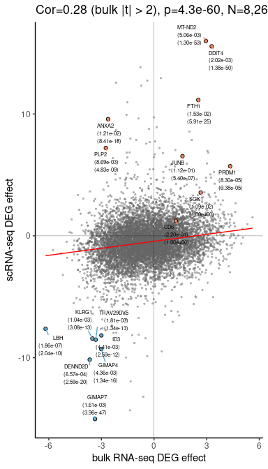

```r
.data <- fileset.list("result/step2/matrix_final")
```


```r
.features <- readLines(.data$row)
.hash <- .features[str_detect(.features, "Hash")]
.hash.hdr <- "result/step1/hash"
.hash.data <- fileset.list(.hash.hdr)
.hash.info <- read.hash(.hash.data)
```

# MS vs. HC at the major cell type level


```r
annot.dt <-
    fread("Tab/step2_celltype.txt.gz") %>%
    left_join(.hash.info) %>%
    na.omit()
```


```r
.mkdir("result/step3/deg/")
.deg.data <- fileset.list("result/step3/deg/hc_ms")

if.needed(.deg.data, {
    .deg.data <-
        rcpp_mmutil_copy_selected_columns(.data$mtx,
                                          .data$row,
                                          .data$col,
                                          unique(annot.dt$tag),
                                          "result/step3/deg/hc_ms")
})
```


```r
.file <- "result/step3/deg/hc_ms.rds"

if.needed(.file, {

    .celltype <-
        annot.dt[, .(tag, celltype)] %>%
        as.data.frame()

    .cell2indv <- annot.dt[, .(tag, subject)] %>%
        unique %>%
        as.data.frame()

    .indv2exp <- .cell2indv %>%
        select(subject) %>%
        mutate(disease = substr(`subject`, 1, 2)) %>%
        as.data.frame()

    .deg.stat <-
        make.cocoa(.deg.data, .celltype, .cell2indv, .indv2exp,
                   .rank = 15, .em.iter = 20, .em.tol = 1e-8, .take.ln = TRUE,
                   knn = 50, impute.by.knn = TRUE, num.threads = 8)

   saveRDS(.deg.stat, .file)
})

.deg.stat <- readRDS(.file)

.cts <- unique(annot.dt$celltype)
.indvs <- unique(annot.dt$subject)

.hc.ms.dt <-
    list(tot = sort.col(.deg.stat$sum, .cts, .indvs),
         cfa = sort.col(.deg.stat$resid.ln.mu, .cts, .indvs),
         cfa.sd = sort.col(.deg.stat$resid.ln.mu.sd, .cts, .indvs)) %>%
    combine.statistics()

.hc.ms.dt[, c("subject","celltype") := tstrsplit(`Var2`,split="_")]
.hc.ms.dt[, disease := substr(`subject`,1,2)]
.hc.ms.dt[, gene := `Var1`]
.hc.ms.dt[, `Var1` := NULL]
.hc.ms.dt[, `Var2` := NULL]

hc.ms.deg <- summarize.deg(.hc.ms.dt)
```

### Comparison with the bulk DEG results


```r
read.bulk <- function(.file) {
    fread(.file) %>%
        rename(hgnc_symbol = gene_name) %>%
        rename(bulk.t = t, bulk.pv = P.Value, bulk.qv = adj.P.Val) %>%
        dplyr::select(hgnc_symbol, starts_with("bulk"))
}

.file <- "data/DEG/20180513/deg.ms.hc.treg.mem.exvivo.sex_covar.ruv.txt"
bulk.mTreg.dt <- read.bulk(.file)

.file <- "data/DEG/20180513/deg.ms.hc.teff.mem.exvivo.sex_covar.ruv.txt"
bulk.mTconv.dt <- read.bulk(.file)
```

[**DOWNLOAD:** DEG MS vs HC](Tab/DEG_MS_vs_HC.txt.gz)

## 1. Memory Treg genes


```r
.sc <- hc.ms.deg[celltype == "mTreg" &
                 sign(ADD) == sign(z) &
                 sign(ADC) == sign(z),]

.sc[, c("ensembl_gene_id","hgnc_symbol") := tstrsplit(`gene`, split="_")]

.bulk <- bulk.mTreg.dt

.out <- plot.bulk.sc(.sc,
                     .bulk,
                     fdr.cutoff = .01,
                     qv.cutoff = .2,
                     n.top = 7)
```

### Correlation 0.23 with p-value = 2.21e-98

<!-- -->

[PDF](Fig/STEP3//Fig_DEG_comparison_mTreg.pdf)

## 2. Memory Tconv genes


```r
.sc <- hc.ms.deg[celltype == "mTconv" &
                 sign(ADD) == sign(z) &
                 sign(ADC) == sign(z),]

.sc[, c("ensembl_gene_id","hgnc_symbol") := tstrsplit(`gene`, split="_")]

.bulk <- bulk.mTconv.dt

.out <- plot.bulk.sc(.sc,
                     .bulk,
                     fdr.cutoff = .01,
                     qv.cutoff = .2,
                     n.top = 5)
```

### Correlation 0.26 with p-value = 7.67e-118

<!-- -->

[PDF](Fig/STEP3//Fig_DEG_comparison_mTconv.pdf)

### Found 669 unique genes strongly perturbed by MS with FWER 1%

* Up-regulated: 191

* Down-regulated:  515

* Total pairs of genes and cell types: 48,428


```r
count.deg <- function(.dt, fwer.cutoff = .01) {
    .dt[fwer < fwer.cutoff &
        sign(ADD) == sign(ADE) &
        sign(ADC) == sign(ADE),
        .(n = .N),
        by = .(celltype,
               direction = if_else(z > 0, "up", "down"))
        ] %>%
        mutate(direction = factor(direction, c("up", "down"))) %>%
        group_by(celltype) %>%
        arrange(desc(direction)) %>%
        mutate(nc = cumsum(n)) %>%
        ungroup
}
```

<!-- -->

[PDF](Fig/STEP3//Fig_DEG_count.pdf)

## 3. Show genes with FWER $< 10^{-2}$ overlapping with the bulk DEGs


```r
.bulk.genes <-
    rbind(bulk.mTreg.dt[bulk.qv < .2, .(hgnc_symbol)],
          bulk.mTconv.dt[bulk.qv < .2, .(hgnc_symbol)]) %>%
    unique() %>%
    unlist()

hc.ms.deg[, c("ensembl_gene_id", "hgnc_symbol") := tstrsplit(`gene`, split="_")]

.genes.show <-
    hc.ms.deg[fwer < 0.05 &
              hgnc_symbol %in% .bulk.genes &
              sign(ADD) == sign(ADE) &
              sign(ADC) == sign(ADE)] %>%
    select(gene) %>%
    unique %>%
    unlist %>%
    as.character
```

[CD226_CD226](Fig/STEP3//Fig_DEG_example_CD226_CD226.pdf) [CD27_CD27](Fig/STEP3//Fig_DEG_example_CD27_CD27.pdf) [CD58_CD58](Fig/STEP3//Fig_DEG_example_CD58_CD58.pdf) [ENSG00000003056_M6PR](Fig/STEP3//Fig_DEG_example_ENSG00000003056_M6PR.pdf) [ENSG00000009790_TRAF3IP3](Fig/STEP3//Fig_DEG_example_ENSG00000009790_TRAF3IP3.pdf) [ENSG00000009844_VTA1](Fig/STEP3//Fig_DEG_example_ENSG00000009844_VTA1.pdf) [ENSG00000023330_ALAS1](Fig/STEP3//Fig_DEG_example_ENSG00000023330_ALAS1.pdf) [ENSG00000034677_RNF19A](Fig/STEP3//Fig_DEG_example_ENSG00000034677_RNF19A.pdf) [ENSG00000038274_MAT2B](Fig/STEP3//Fig_DEG_example_ENSG00000038274_MAT2B.pdf) [ENSG00000040633_PHF23](Fig/STEP3//Fig_DEG_example_ENSG00000040633_PHF23.pdf) [ENSG00000043462_LCP2](Fig/STEP3//Fig_DEG_example_ENSG00000043462_LCP2.pdf) [ENSG00000051108_HERPUD1](Fig/STEP3//Fig_DEG_example_ENSG00000051108_HERPUD1.pdf) [ENSG00000057657_PRDM1](Fig/STEP3//Fig_DEG_example_ENSG00000057657_PRDM1.pdf) [ENSG00000065154_OAT](Fig/STEP3//Fig_DEG_example_ENSG00000065154_OAT.pdf) [ENSG00000065911_MTHFD2](Fig/STEP3//Fig_DEG_example_ENSG00000065911_MTHFD2.pdf) [ENSG00000069399_BCL3](Fig/STEP3//Fig_DEG_example_ENSG00000069399_BCL3.pdf) [ENSG00000070756_PABPC1](Fig/STEP3//Fig_DEG_example_ENSG00000070756_PABPC1.pdf) [ENSG00000071073_MGAT4A](Fig/STEP3//Fig_DEG_example_ENSG00000071073_MGAT4A.pdf) [ENSG00000073578_SDHA](Fig/STEP3//Fig_DEG_example_ENSG00000073578_SDHA.pdf) [ENSG00000075239_ACAT1](Fig/STEP3//Fig_DEG_example_ENSG00000075239_ACAT1.pdf) [ENSG00000075292_ZNF638](Fig/STEP3//Fig_DEG_example_ENSG00000075292_ZNF638.pdf) [ENSG00000075420_FNDC3B](Fig/STEP3//Fig_DEG_example_ENSG00000075420_FNDC3B.pdf) [ENSG00000075426_FOSL2](Fig/STEP3//Fig_DEG_example_ENSG00000075426_FOSL2.pdf) [ENSG00000077420_APBB1IP](Fig/STEP3//Fig_DEG_example_ENSG00000077420_APBB1IP.pdf) [ENSG00000079246_XRCC5](Fig/STEP3//Fig_DEG_example_ENSG00000079246_XRCC5.pdf) [ENSG00000081237_PTPRC](Fig/STEP3//Fig_DEG_example_ENSG00000081237_PTPRC.pdf) [ENSG00000087502_ERGIC2](Fig/STEP3//Fig_DEG_example_ENSG00000087502_ERGIC2.pdf) [ENSG00000088986_DYNLL1](Fig/STEP3//Fig_DEG_example_ENSG00000088986_DYNLL1.pdf) [ENSG00000089157_RPLP0](Fig/STEP3//Fig_DEG_example_ENSG00000089157_RPLP0.pdf) [ENSG00000092094_OSGEP](Fig/STEP3//Fig_DEG_example_ENSG00000092094_OSGEP.pdf) [ENSG00000092621_PHGDH](Fig/STEP3//Fig_DEG_example_ENSG00000092621_PHGDH.pdf) [ENSG00000095370_SH2D3C](Fig/STEP3//Fig_DEG_example_ENSG00000095370_SH2D3C.pdf) [ENSG00000099622_CIRBP](Fig/STEP3//Fig_DEG_example_ENSG00000099622_CIRBP.pdf) [ENSG00000099985_OSM](Fig/STEP3//Fig_DEG_example_ENSG00000099985_OSM.pdf) [ENSG00000100100_PIK3IP1](Fig/STEP3//Fig_DEG_example_ENSG00000100100_PIK3IP1.pdf) [ENSG00000100129_EIF3L](Fig/STEP3//Fig_DEG_example_ENSG00000100129_EIF3L.pdf) [ENSG00000100201_DDX17](Fig/STEP3//Fig_DEG_example_ENSG00000100201_DDX17.pdf) [ENSG00000100219_XBP1](Fig/STEP3//Fig_DEG_example_ENSG00000100219_XBP1.pdf) [ENSG00000100316_RPL3](Fig/STEP3//Fig_DEG_example_ENSG00000100316_RPL3.pdf) [ENSG00000100650_SRSF5](Fig/STEP3//Fig_DEG_example_ENSG00000100650_SRSF5.pdf) [ENSG00000101608_MYL12A](Fig/STEP3//Fig_DEG_example_ENSG00000101608_MYL12A.pdf) [ENSG00000102245_CD40LG](Fig/STEP3//Fig_DEG_example_ENSG00000102245_CD40LG.pdf) [ENSG00000102760_RGCC](Fig/STEP3//Fig_DEG_example_ENSG00000102760_RGCC.pdf) [ENSG00000104529_EEF1D](Fig/STEP3//Fig_DEG_example_ENSG00000104529_EEF1D.pdf) [ENSG00000104904_OAZ1](Fig/STEP3//Fig_DEG_example_ENSG00000104904_OAZ1.pdf) [ENSG00000106153_CHCHD2](Fig/STEP3//Fig_DEG_example_ENSG00000106153_CHCHD2.pdf) [ENSG00000106460_TMEM106B](Fig/STEP3//Fig_DEG_example_ENSG00000106460_TMEM106B.pdf) [ENSG00000106560_GIMAP2](Fig/STEP3//Fig_DEG_example_ENSG00000106560_GIMAP2.pdf) [ENSG00000107201_DDX58](Fig/STEP3//Fig_DEG_example_ENSG00000107201_DDX58.pdf) [ENSG00000108298_RPL19](Fig/STEP3//Fig_DEG_example_ENSG00000108298_RPL19.pdf) [ENSG00000108622_ICAM2](Fig/STEP3//Fig_DEG_example_ENSG00000108622_ICAM2.pdf) [ENSG00000109062_SLC9A3R1](Fig/STEP3//Fig_DEG_example_ENSG00000109062_SLC9A3R1.pdf) [ENSG00000109321_AREG](Fig/STEP3//Fig_DEG_example_ENSG00000109321_AREG.pdf) [ENSG00000109861_CTSC](Fig/STEP3//Fig_DEG_example_ENSG00000109861_CTSC.pdf) [ENSG00000109971_HSPA8](Fig/STEP3//Fig_DEG_example_ENSG00000109971_HSPA8.pdf) [ENSG00000110066_KMT5B](Fig/STEP3//Fig_DEG_example_ENSG00000110066_KMT5B.pdf) [ENSG00000110852_CLEC2B](Fig/STEP3//Fig_DEG_example_ENSG00000110852_CLEC2B.pdf) [ENSG00000111639_MRPL51](Fig/STEP3//Fig_DEG_example_ENSG00000111639_MRPL51.pdf) [ENSG00000111875_ASF1A](Fig/STEP3//Fig_DEG_example_ENSG00000111875_ASF1A.pdf) [ENSG00000112079_STK38](Fig/STEP3//Fig_DEG_example_ENSG00000112079_STK38.pdf) [ENSG00000112110_MRPL18](Fig/STEP3//Fig_DEG_example_ENSG00000112110_MRPL18.pdf) [ENSG00000113732_ATP6V0E1](Fig/STEP3//Fig_DEG_example_ENSG00000113732_ATP6V0E1.pdf) [ENSG00000114209_PDCD10](Fig/STEP3//Fig_DEG_example_ENSG00000114209_PDCD10.pdf) [ENSG00000114395_CYB561D2](Fig/STEP3//Fig_DEG_example_ENSG00000114395_CYB561D2.pdf) [ENSG00000114942_EEF1B2](Fig/STEP3//Fig_DEG_example_ENSG00000114942_EEF1B2.pdf) [ENSG00000115091_ACTR3](Fig/STEP3//Fig_DEG_example_ENSG00000115091_ACTR3.pdf) [ENSG00000115687_PASK](Fig/STEP3//Fig_DEG_example_ENSG00000115687_PASK.pdf) [ENSG00000115758_ODC1](Fig/STEP3//Fig_DEG_example_ENSG00000115758_ODC1.pdf) [ENSG00000116521_SCAMP3](Fig/STEP3//Fig_DEG_example_ENSG00000116521_SCAMP3.pdf) [ENSG00000116679_IVNS1ABP](Fig/STEP3//Fig_DEG_example_ENSG00000116679_IVNS1ABP.pdf) [ENSG00000116717_GADD45A](Fig/STEP3//Fig_DEG_example_ENSG00000116717_GADD45A.pdf) [ENSG00000117090_SLAMF1](Fig/STEP3//Fig_DEG_example_ENSG00000117090_SLAMF1.pdf) [ENSG00000117318_ID3](Fig/STEP3//Fig_DEG_example_ENSG00000117318_ID3.pdf) [ENSG00000118515_SGK1](Fig/STEP3//Fig_DEG_example_ENSG00000118515_SGK1.pdf) [ENSG00000119718_EIF2B2](Fig/STEP3//Fig_DEG_example_ENSG00000119718_EIF2B2.pdf) [ENSG00000120875_DUSP4](Fig/STEP3//Fig_DEG_example_ENSG00000120875_DUSP4.pdf) [ENSG00000120913_PDLIM2](Fig/STEP3//Fig_DEG_example_ENSG00000120913_PDLIM2.pdf) [ENSG00000120963_ZNF706](Fig/STEP3//Fig_DEG_example_ENSG00000120963_ZNF706.pdf) [ENSG00000121742_GJB6](Fig/STEP3//Fig_DEG_example_ENSG00000121742_GJB6.pdf) [ENSG00000121858_TNFSF10](Fig/STEP3//Fig_DEG_example_ENSG00000121858_TNFSF10.pdf) [ENSG00000122026_RPL21](Fig/STEP3//Fig_DEG_example_ENSG00000122026_RPL21.pdf) [ENSG00000122224_LY9](Fig/STEP3//Fig_DEG_example_ENSG00000122224_LY9.pdf) [ENSG00000122406_RPL5](Fig/STEP3//Fig_DEG_example_ENSG00000122406_RPL5.pdf) [ENSG00000122862_SRGN](Fig/STEP3//Fig_DEG_example_ENSG00000122862_SRGN.pdf) [ENSG00000123416_TUBA1B](Fig/STEP3//Fig_DEG_example_ENSG00000123416_TUBA1B.pdf) [ENSG00000124588_NQO2](Fig/STEP3//Fig_DEG_example_ENSG00000124588_NQO2.pdf) [ENSG00000125148_MT2A](Fig/STEP3//Fig_DEG_example_ENSG00000125148_MT2A.pdf) [ENSG00000125384_PTGER2](Fig/STEP3//Fig_DEG_example_ENSG00000125384_PTGER2.pdf) [ENSG00000125898_FAM110A](Fig/STEP3//Fig_DEG_example_ENSG00000125898_FAM110A.pdf) [ENSG00000126524_SBDS](Fig/STEP3//Fig_DEG_example_ENSG00000126524_SBDS.pdf) [ENSG00000129562_DAD1](Fig/STEP3//Fig_DEG_example_ENSG00000129562_DAD1.pdf) [ENSG00000130816_DNMT1](Fig/STEP3//Fig_DEG_example_ENSG00000130816_DNMT1.pdf) [ENSG00000131236_CAP1](Fig/STEP3//Fig_DEG_example_ENSG00000131236_CAP1.pdf) [ENSG00000131828_PDHA1](Fig/STEP3//Fig_DEG_example_ENSG00000131828_PDHA1.pdf) [ENSG00000132406_TMEM128](Fig/STEP3//Fig_DEG_example_ENSG00000132406_TMEM128.pdf) [ENSG00000132475_H3F3B](Fig/STEP3//Fig_DEG_example_ENSG00000132475_H3F3B.pdf) [ENSG00000132823_OSER1](Fig/STEP3//Fig_DEG_example_ENSG00000132823_OSER1.pdf) [ENSG00000132824_SERINC3](Fig/STEP3//Fig_DEG_example_ENSG00000132824_SERINC3.pdf) [ENSG00000133030_MPRIP](Fig/STEP3//Fig_DEG_example_ENSG00000133030_MPRIP.pdf) [ENSG00000133561_GIMAP6](Fig/STEP3//Fig_DEG_example_ENSG00000133561_GIMAP6.pdf) [ENSG00000133574_GIMAP4](Fig/STEP3//Fig_DEG_example_ENSG00000133574_GIMAP4.pdf) [ENSG00000133639_BTG1](Fig/STEP3//Fig_DEG_example_ENSG00000133639_BTG1.pdf) [ENSG00000133835_HSD17B4](Fig/STEP3//Fig_DEG_example_ENSG00000133835_HSD17B4.pdf) [ENSG00000135046_ANXA1](Fig/STEP3//Fig_DEG_example_ENSG00000135046_ANXA1.pdf) [ENSG00000135269_TES](Fig/STEP3//Fig_DEG_example_ENSG00000135269_TES.pdf) [ENSG00000135972_MRPS9](Fig/STEP3//Fig_DEG_example_ENSG00000135972_MRPS9.pdf) [ENSG00000136490_LIMD2](Fig/STEP3//Fig_DEG_example_ENSG00000136490_LIMD2.pdf) [ENSG00000136628_EPRS](Fig/STEP3//Fig_DEG_example_ENSG00000136628_EPRS.pdf) [ENSG00000137078_SIT1](Fig/STEP3//Fig_DEG_example_ENSG00000137078_SIT1.pdf) [ENSG00000137154_RPS6](Fig/STEP3//Fig_DEG_example_ENSG00000137154_RPS6.pdf) [ENSG00000138172_CALHM2](Fig/STEP3//Fig_DEG_example_ENSG00000138172_CALHM2.pdf) [ENSG00000138757_G3BP2](Fig/STEP3//Fig_DEG_example_ENSG00000138757_G3BP2.pdf) [ENSG00000138794_CASP6](Fig/STEP3//Fig_DEG_example_ENSG00000138794_CASP6.pdf) [ENSG00000139187_KLRG1](Fig/STEP3//Fig_DEG_example_ENSG00000139187_KLRG1.pdf) [ENSG00000139193_CD27](Fig/STEP3//Fig_DEG_example_ENSG00000139193_CD27.pdf) [ENSG00000139644_TMBIM6](Fig/STEP3//Fig_DEG_example_ENSG00000139644_TMBIM6.pdf) [ENSG00000140988_RPS2](Fig/STEP3//Fig_DEG_example_ENSG00000140988_RPS2.pdf) [ENSG00000142227_EMP3](Fig/STEP3//Fig_DEG_example_ENSG00000142227_EMP3.pdf) [ENSG00000143106_PSMA5](Fig/STEP3//Fig_DEG_example_ENSG00000143106_PSMA5.pdf) [ENSG00000143333_RGS16](Fig/STEP3//Fig_DEG_example_ENSG00000143333_RGS16.pdf) [ENSG00000143575_HAX1](Fig/STEP3//Fig_DEG_example_ENSG00000143575_HAX1.pdf) [ENSG00000143799_PARP1](Fig/STEP3//Fig_DEG_example_ENSG00000143799_PARP1.pdf) [ENSG00000144381_HSPD1](Fig/STEP3//Fig_DEG_example_ENSG00000144381_HSPD1.pdf) [ENSG00000145050_MANF](Fig/STEP3//Fig_DEG_example_ENSG00000145050_MANF.pdf) [ENSG00000145779_TNFAIP8](Fig/STEP3//Fig_DEG_example_ENSG00000145779_TNFAIP8.pdf) [ENSG00000146112_PPP1R18](Fig/STEP3//Fig_DEG_example_ENSG00000146112_PPP1R18.pdf) [ENSG00000146386_ABRACL](Fig/STEP3//Fig_DEG_example_ENSG00000146386_ABRACL.pdf) [ENSG00000147403_RPL10](Fig/STEP3//Fig_DEG_example_ENSG00000147403_RPL10.pdf) [ENSG00000147604_RPL7](Fig/STEP3//Fig_DEG_example_ENSG00000147604_RPL7.pdf) [ENSG00000148303_RPL7A](Fig/STEP3//Fig_DEG_example_ENSG00000148303_RPL7A.pdf) [ENSG00000149273_RPS3](Fig/STEP3//Fig_DEG_example_ENSG00000149273_RPS3.pdf) [ENSG00000150753_CCT5](Fig/STEP3//Fig_DEG_example_ENSG00000150753_CCT5.pdf) [ENSG00000152518_ZFP36L2](Fig/STEP3//Fig_DEG_example_ENSG00000152518_ZFP36L2.pdf) [ENSG00000154473_BUB3](Fig/STEP3//Fig_DEG_example_ENSG00000154473_BUB3.pdf) [ENSG00000155660_PDIA4](Fig/STEP3//Fig_DEG_example_ENSG00000155660_PDIA4.pdf) [ENSG00000155959_VBP1](Fig/STEP3//Fig_DEG_example_ENSG00000155959_VBP1.pdf) [ENSG00000156508_EEF1A1](Fig/STEP3//Fig_DEG_example_ENSG00000156508_EEF1A1.pdf) [ENSG00000157303_SUSD3](Fig/STEP3//Fig_DEG_example_ENSG00000157303_SUSD3.pdf) [ENSG00000157916_RER1](Fig/STEP3//Fig_DEG_example_ENSG00000157916_RER1.pdf) [ENSG00000161016_RPL8](Fig/STEP3//Fig_DEG_example_ENSG00000161016_RPL8.pdf) [ENSG00000161800_RACGAP1](Fig/STEP3//Fig_DEG_example_ENSG00000161800_RACGAP1.pdf) [ENSG00000162704_ARPC5](Fig/STEP3//Fig_DEG_example_ENSG00000162704_ARPC5.pdf) [ENSG00000162777_DENND2D](Fig/STEP3//Fig_DEG_example_ENSG00000162777_DENND2D.pdf) [ENSG00000162894_FCMR](Fig/STEP3//Fig_DEG_example_ENSG00000162894_FCMR.pdf) [ENSG00000163154_TNFAIP8L2](Fig/STEP3//Fig_DEG_example_ENSG00000163154_TNFAIP8L2.pdf) [ENSG00000163191_S100A11](Fig/STEP3//Fig_DEG_example_ENSG00000163191_S100A11.pdf) [ENSG00000163219_ARHGAP25](Fig/STEP3//Fig_DEG_example_ENSG00000163219_ARHGAP25.pdf) [ENSG00000163519_TRAT1](Fig/STEP3//Fig_DEG_example_ENSG00000163519_TRAT1.pdf) [ENSG00000163545_NUAK2](Fig/STEP3//Fig_DEG_example_ENSG00000163545_NUAK2.pdf) [ENSG00000163599_CTLA4](Fig/STEP3//Fig_DEG_example_ENSG00000163599_CTLA4.pdf) [ENSG00000163682_RPL9](Fig/STEP3//Fig_DEG_example_ENSG00000163682_RPL9.pdf) [ENSG00000164104_HMGB2](Fig/STEP3//Fig_DEG_example_ENSG00000164104_HMGB2.pdf) [ENSG00000165672_PRDX3](Fig/STEP3//Fig_DEG_example_ENSG00000165672_PRDX3.pdf) [ENSG00000165929_TC2N](Fig/STEP3//Fig_DEG_example_ENSG00000165929_TC2N.pdf) [ENSG00000167257_RNF214](Fig/STEP3//Fig_DEG_example_ENSG00000167257_RNF214.pdf) [ENSG00000167658_EEF2](Fig/STEP3//Fig_DEG_example_ENSG00000167658_EEF2.pdf) [ENSG00000167851_CD300A](Fig/STEP3//Fig_DEG_example_ENSG00000167851_CD300A.pdf) [ENSG00000167996_FTH1](Fig/STEP3//Fig_DEG_example_ENSG00000167996_FTH1.pdf) [ENSG00000168028_RPSA](Fig/STEP3//Fig_DEG_example_ENSG00000168028_RPSA.pdf) [ENSG00000168061_SAC3D1](Fig/STEP3//Fig_DEG_example_ENSG00000168061_SAC3D1.pdf) [ENSG00000168209_DDIT4](Fig/STEP3//Fig_DEG_example_ENSG00000168209_DDIT4.pdf) [ENSG00000168685_IL7R](Fig/STEP3//Fig_DEG_example_ENSG00000168685_IL7R.pdf) [ENSG00000169220_RGS14](Fig/STEP3//Fig_DEG_example_ENSG00000169220_RGS14.pdf) [ENSG00000169223_LMAN2](Fig/STEP3//Fig_DEG_example_ENSG00000169223_LMAN2.pdf) [ENSG00000169756_LIMS1](Fig/STEP3//Fig_DEG_example_ENSG00000169756_LIMS1.pdf) [ENSG00000170633_RNF34](Fig/STEP3//Fig_DEG_example_ENSG00000170633_RNF34.pdf) [ENSG00000170915_PAQR8](Fig/STEP3//Fig_DEG_example_ENSG00000170915_PAQR8.pdf) [ENSG00000171863_RPS7](Fig/STEP3//Fig_DEG_example_ENSG00000171863_RPS7.pdf) [ENSG00000172586_CHCHD1](Fig/STEP3//Fig_DEG_example_ENSG00000172586_CHCHD1.pdf) [ENSG00000172977_KAT5](Fig/STEP3//Fig_DEG_example_ENSG00000172977_KAT5.pdf) [ENSG00000173113_TRMT112](Fig/STEP3//Fig_DEG_example_ENSG00000173113_TRMT112.pdf) [ENSG00000173812_EIF1](Fig/STEP3//Fig_DEG_example_ENSG00000173812_EIF1.pdf) [ENSG00000174444_RPL4](Fig/STEP3//Fig_DEG_example_ENSG00000174444_RPL4.pdf) [ENSG00000174500_GCSAM](Fig/STEP3//Fig_DEG_example_ENSG00000174500_GCSAM.pdf) [ENSG00000174748_RPL15](Fig/STEP3//Fig_DEG_example_ENSG00000174748_RPL15.pdf) [ENSG00000175166_PSMD2](Fig/STEP3//Fig_DEG_example_ENSG00000175166_PSMD2.pdf) [ENSG00000175334_BANF1](Fig/STEP3//Fig_DEG_example_ENSG00000175334_BANF1.pdf) [ENSG00000175463_TBC1D10C](Fig/STEP3//Fig_DEG_example_ENSG00000175463_TBC1D10C.pdf) [ENSG00000177721_ANXA2R](Fig/STEP3//Fig_DEG_example_ENSG00000177721_ANXA2R.pdf) [ENSG00000177854_TMEM187](Fig/STEP3//Fig_DEG_example_ENSG00000177854_TMEM187.pdf) [ENSG00000178035_IMPDH2](Fig/STEP3//Fig_DEG_example_ENSG00000178035_IMPDH2.pdf) [ENSG00000178537_SLC25A20](Fig/STEP3//Fig_DEG_example_ENSG00000178537_SLC25A20.pdf) [ENSG00000178896_EXOSC4](Fig/STEP3//Fig_DEG_example_ENSG00000178896_EXOSC4.pdf) [ENSG00000178977_LINC00324](Fig/STEP3//Fig_DEG_example_ENSG00000178977_LINC00324.pdf) [ENSG00000179144_GIMAP7](Fig/STEP3//Fig_DEG_example_ENSG00000179144_GIMAP7.pdf) [ENSG00000179262_RAD23A](Fig/STEP3//Fig_DEG_example_ENSG00000179262_RAD23A.pdf) [ENSG00000179933_C14orf119](Fig/STEP3//Fig_DEG_example_ENSG00000179933_C14orf119.pdf) [ENSG00000179950_PUF60](Fig/STEP3//Fig_DEG_example_ENSG00000179950_PUF60.pdf) [ENSG00000181163_NPM1](Fig/STEP3//Fig_DEG_example_ENSG00000181163_NPM1.pdf) [ENSG00000181847_TIGIT](Fig/STEP3//Fig_DEG_example_ENSG00000181847_TIGIT.pdf) [ENSG00000182568_SATB1](Fig/STEP3//Fig_DEG_example_ENSG00000182568_SATB1.pdf) [ENSG00000182718_ANXA2](Fig/STEP3//Fig_DEG_example_ENSG00000182718_ANXA2.pdf) [ENSG00000182866_LCK](Fig/STEP3//Fig_DEG_example_ENSG00000182866_LCK.pdf) [ENSG00000183813_CCR4](Fig/STEP3//Fig_DEG_example_ENSG00000183813_CCR4.pdf) [ENSG00000184009_ACTG1](Fig/STEP3//Fig_DEG_example_ENSG00000184009_ACTG1.pdf) [ENSG00000184432_COPB2](Fig/STEP3//Fig_DEG_example_ENSG00000184432_COPB2.pdf) [ENSG00000184557_SOCS3](Fig/STEP3//Fig_DEG_example_ENSG00000184557_SOCS3.pdf) [ENSG00000184588_PDE4B](Fig/STEP3//Fig_DEG_example_ENSG00000184588_PDE4B.pdf) [ENSG00000184939_ZFP90](Fig/STEP3//Fig_DEG_example_ENSG00000184939_ZFP90.pdf) [ENSG00000185338_SOCS1](Fig/STEP3//Fig_DEG_example_ENSG00000185338_SOCS1.pdf) [ENSG00000187257_RSBN1L](Fig/STEP3//Fig_DEG_example_ENSG00000187257_RSBN1L.pdf) [ENSG00000187514_PTMA](Fig/STEP3//Fig_DEG_example_ENSG00000187514_PTMA.pdf) [ENSG00000188846_RPL14](Fig/STEP3//Fig_DEG_example_ENSG00000188846_RPL14.pdf) [ENSG00000189067_LITAF](Fig/STEP3//Fig_DEG_example_ENSG00000189067_LITAF.pdf) [ENSG00000196230_TUBB](Fig/STEP3//Fig_DEG_example_ENSG00000196230_TUBB.pdf) [ENSG00000196329_GIMAP5](Fig/STEP3//Fig_DEG_example_ENSG00000196329_GIMAP5.pdf) [ENSG00000196531_NACA](Fig/STEP3//Fig_DEG_example_ENSG00000196531_NACA.pdf) [ENSG00000197329_PELI1](Fig/STEP3//Fig_DEG_example_ENSG00000197329_PELI1.pdf) [ENSG00000197471_SPN](Fig/STEP3//Fig_DEG_example_ENSG00000197471_SPN.pdf) [ENSG00000197958_RPL12](Fig/STEP3//Fig_DEG_example_ENSG00000197958_RPL12.pdf) [ENSG00000198034_RPS4X](Fig/STEP3//Fig_DEG_example_ENSG00000198034_RPS4X.pdf) [ENSG00000198130_HIBCH](Fig/STEP3//Fig_DEG_example_ENSG00000198130_HIBCH.pdf) [ENSG00000198242_RPL23A](Fig/STEP3//Fig_DEG_example_ENSG00000198242_RPL23A.pdf) [ENSG00000198763_MT-ND2](Fig/STEP3//Fig_DEG_example_ENSG00000198763_MT-ND2.pdf) [ENSG00000198805_PNP](Fig/STEP3//Fig_DEG_example_ENSG00000198805_PNP.pdf) [ENSG00000198856_OSTC](Fig/STEP3//Fig_DEG_example_ENSG00000198856_OSTC.pdf) [ENSG00000198938_MT-CO3](Fig/STEP3//Fig_DEG_example_ENSG00000198938_MT-CO3.pdf) [ENSG00000204261_PSMB8-AS1](Fig/STEP3//Fig_DEG_example_ENSG00000204261_PSMB8-AS1.pdf) [ENSG00000204386_NEU1](Fig/STEP3//Fig_DEG_example_ENSG00000204386_NEU1.pdf) [ENSG00000204438_GPANK1](Fig/STEP3//Fig_DEG_example_ENSG00000204438_GPANK1.pdf) [ENSG00000204619_PPP1R11](Fig/STEP3//Fig_DEG_example_ENSG00000204619_PPP1R11.pdf) [ENSG00000204628_RACK1](Fig/STEP3//Fig_DEG_example_ENSG00000204628_RACK1.pdf) [ENSG00000205413_SAMD9](Fig/STEP3//Fig_DEG_example_ENSG00000205413_SAMD9.pdf) [ENSG00000211450_SELENOH](Fig/STEP3//Fig_DEG_example_ENSG00000211450_SELENOH.pdf) [ENSG00000211750_TRBV24-1](Fig/STEP3//Fig_DEG_example_ENSG00000211750_TRBV24-1.pdf) [ENSG00000211786_TRAV8-2](Fig/STEP3//Fig_DEG_example_ENSG00000211786_TRAV8-2.pdf) [ENSG00000211788_TRAV13-1](Fig/STEP3//Fig_DEG_example_ENSG00000211788_TRAV13-1.pdf) [ENSG00000211789_TRAV12-2](Fig/STEP3//Fig_DEG_example_ENSG00000211789_TRAV12-2.pdf) [ENSG00000211793_TRAV9-2](Fig/STEP3//Fig_DEG_example_ENSG00000211793_TRAV9-2.pdf) [ENSG00000211801_TRAV21](Fig/STEP3//Fig_DEG_example_ENSG00000211801_TRAV21.pdf) [ENSG00000211804_TRDV1](Fig/STEP3//Fig_DEG_example_ENSG00000211804_TRDV1.pdf) [ENSG00000211806_TRAV25](Fig/STEP3//Fig_DEG_example_ENSG00000211806_TRAV25.pdf) [ENSG00000211810_TRAV29DV5](Fig/STEP3//Fig_DEG_example_ENSG00000211810_TRAV29DV5.pdf) [ENSG00000213203_GIMAP1](Fig/STEP3//Fig_DEG_example_ENSG00000213203_GIMAP1.pdf) [ENSG00000213626_LBH](Fig/STEP3//Fig_DEG_example_ENSG00000213626_LBH.pdf) [ENSG00000234745_HLA-B](Fig/STEP3//Fig_DEG_example_ENSG00000234745_HLA-B.pdf) [ENSG00000235532_LINC00402](Fig/STEP3//Fig_DEG_example_ENSG00000235532_LINC00402.pdf) [ENSG00000240065_PSMB9](Fig/STEP3//Fig_DEG_example_ENSG00000240065_PSMB9.pdf) [ENSG00000241657_TRBV11-2](Fig/STEP3//Fig_DEG_example_ENSG00000241657_TRBV11-2.pdf) [ENSG00000242485_MRPL20](Fig/STEP3//Fig_DEG_example_ENSG00000242485_MRPL20.pdf) [ENSG00000243749_TMEM35B](Fig/STEP3//Fig_DEG_example_ENSG00000243749_TMEM35B.pdf) [ENSG00000243927_MRPS6](Fig/STEP3//Fig_DEG_example_ENSG00000243927_MRPS6.pdf) [ENSG00000257599_OVCH1-AS1](Fig/STEP3//Fig_DEG_example_ENSG00000257599_OVCH1-AS1.pdf) [ENSG00000277734_TRAC](Fig/STEP3//Fig_DEG_example_ENSG00000277734_TRAC.pdf) [ENSG00000278030_TRBV7-9](Fig/STEP3//Fig_DEG_example_ENSG00000278030_TRBV7-9.pdf) [TIGIT_TIGIT](Fig/STEP3//Fig_DEG_example_TIGIT_TIGIT.pdf) 

## 4. Additional genes/proteins


```r
.add <- c("CD279","PDCD1","LAG3","CD223","HAVCR2","TIM3","CD366","TOX","TOX2")

additional.genes <-
    hc.ms.deg[hgnc_symbol %in% .add, .(gene)] %>%
    unique() %>%
    unlist(use.names=F)
```

[CD279_CD279](Fig/STEP3//Fig_DEG_example_CD279_CD279.pdf) [CD366_CD366](Fig/STEP3//Fig_DEG_example_CD366_CD366.pdf) [ENSG00000089692_LAG3](Fig/STEP3//Fig_DEG_example_ENSG00000089692_LAG3.pdf) [ENSG00000124191_TOX2](Fig/STEP3//Fig_DEG_example_ENSG00000124191_TOX2.pdf) [ENSG00000135077_HAVCR2](Fig/STEP3//Fig_DEG_example_ENSG00000135077_HAVCR2.pdf) [ENSG00000188389_PDCD1](Fig/STEP3//Fig_DEG_example_ENSG00000188389_PDCD1.pdf) [ENSG00000198846_TOX](Fig/STEP3//Fig_DEG_example_ENSG00000198846_TOX.pdf) 

## 5. Appendix: PRDM1 short vs. long


```r
.total.cols <- fread(.deg.data$col, col.names = "tag", header=F)

## 1. Write down PRDM1 short and long as .mtx
.hdr <- "result/step3/deg/prdm1_hc_ms"

if.needed(fileset.list(.hdr), {

    .dt <- fread("data/PRDM1/PRDM1_SL.csv.gz")
    .dt[, tag := barcode %&% "-1" %&% "_" %&% `batch`]

    .out <- .dt[(PRDM1_short + PRDM1_long > 0) &
                `tag` %in% .total.cols$tag,
                .(tag, PRDM1_short, PRDM1_long)]

    .mat <- .out[, .(PRDM1_short, PRDM1_long)] %>%
        as.matrix() %>%
        t() %>% 
        Matrix::Matrix(sparse=TRUE)

    mmutilR::write.sparse(.mat,
                          c("PRDM1_short", "PRDM1_long"),
                          .out$tag,
                          .hdr)
})


prdm1.data <- fileset.list(.hdr)

.file <- "result/step3/deg/prdm1_hc_ms.rds"

if.needed(.file, {

    .pca <- rcpp_mmutil_svd(mtx_file = .deg.data$mtx,
                            RANK = 15,
                            TAKE_LN = T)

    .prdm1.cols <- fread(prdm1.data$col, col.names = "tag", header=F)

    V <- .pca$V[match(.prdm1.cols$tag, .total.cols$tag), , drop = F]

    .prdm1.cols[, c("barcode", "batch") := tstrsplit(`tag`, split="_")]
    .prdm1.cols[, barcode := gsub(pattern="-1", replacement = "", `barcode`)]
    .prdm1.cols[, batch := as.integer(batch)]

    .matched <- .prdm1.cols %>%
        left_join(annot.dt) %>% 
        left_join(.hash.info)

    .stat <- rcpp_mmutil_aggregate(mtx_file = prdm1.data$mtx, 
                                   row_file = prdm1.data$row,
                                   col_file = prdm1.data$col, 
                                   r_cols = .matched$tag,
                                   r_indv = .matched$subject,
                                   r_annot = .matched$celltype,
                                   r_lab_name = c("mTreg","mTconv","nTreg","nTconv"),
                                   r_trt = .matched$disease,
                                   r_V = V, knn = 50,
                                   IMPUTE_BY_KNN = T,
                                   NUM_THREADS = 16)

    saveRDS(.stat, .file)
})

.deg.stat <- readRDS(.file)

.cts <- unique(annot.dt$celltype)
.indvs <- unique(annot.dt$subject)

.hc.ms.dt <-
    list(tot = sort.col(.deg.stat$sum, .cts, .indvs),
         cfa = sort.col(.deg.stat$resid.ln.mu, .cts, .indvs),
         cfa.sd = sort.col(.deg.stat$resid.ln.mu.sd, .cts, .indvs)) %>%
    combine.statistics()

.hc.ms.dt[, c("subject","celltype") := tstrsplit(`Var2`,split="_")]
.hc.ms.dt[, disease := substr(`subject`,1,2)]
.hc.ms.dt[, gene := `Var1`]
.hc.ms.dt[, `Var1` := NULL]
.hc.ms.dt[, `Var2` := NULL]

hc.ms.deg <- summarize.deg(.hc.ms.dt)
```


<!-- -->

[PDF](Fig/STEP3//Fig_SL_DEG_PRDM1_long.pdf)


<!-- -->

[PDF](Fig/STEP3//Fig_SL_DEG_PRDM1_short.pdf)

