* Marker genes well-known for mTconv cell subtype classification


```r
.markers <-
    c("CD3", "CD3E", "CD14", "LYZ",
      "CCR4","CCR6","CXCR3","CXCR5",
      "ABCA1","GBP4","CDCA7L","ITM2C","NR1D1",
      "CTSH","GATA3","FHIT","CD40LG","C1orf162",
      "MGATA4A","GZMK","IFNGR2",
      "CD183","CD184","CD185","CD196","CD195","CD194",
      "RORC", "TBX21", "HLADR", "CD74", "TCF7", "LEF1",
      "SELL", "CCR7", "CCR8", "IKZF2", "TIGIT", "CD226",
      "BATF", "ANXA2", "BRD9", "HPGD", "LMNA", "TNFRSF4",
      "FOXP3", "FOXP1", "PDCD1", "CD279", "CTLA4", "LAG3",
      "HAVCR2", "CD366", "KLRB1", "FOSL2", "S100A4", "GMAP7",
      "JUN", "IL7R", "MYC", "IL32", "ISG20", "MALAT1",
      "GSDMD", "HDAC1", "GIMAP4", "APOBEC3G", "CD2", "CD28", "CD6",
      "CDKN2A", "CORO1A", "FAS", "FLI1", "GPR25", "MT2A", "KEAP1",
      "IL12RB", "SIRT2", "TNFRSF14", "TRAF3IP3", "IRF2", "PSPH",
      "CD278", "B2M", "RPS26", "MAP1S", "SGK1", "BACH2",
      "HLA-C", "HLA-B", "HLA-E", "HLA-DR", "HLA-DRA", "HLA-DRB1",
      "S1PR4", "KLF2", "SATB1", "TSC22D3", "IL2RA", "CD25") %>%
    unique
```

* Goal: Identify cellular states/subtypes in memory T cells


```r
.hash.hdr <- "result/step1/hash"
.hash.data <- fileset.list(.hash.hdr)
.hash.info <- read.hash(.hash.data)
```


```r
annot.dt <- fread("Tab/step2_celltype.txt.gz")
```


## 1. Memory T conventional


```r
.full.data <- fileset.list("result/step2/matrix_final")
.mkdir("result/step4/")
.data <- fileset.list("result/step4/mtconv")

if.needed(.data, {
    .tags <- unique(annot.dt[celltype == "mTconv"]$tag)
    .data <-
        rcpp_mmutil_copy_selected_columns(.full.data$mtx,
                                          .full.data$row,
                                          .full.data$col,
                                          .tags,
                                          "result/step4/mtconv")
})
```

### A. Clustering cells by batch-balancing k-nearest neighbour graph


```r
.file <- "result/step4/mtconv_bbknn.rds"

if.needed(.file, {
    .batches <- take.batch.info(.data)

    .bbknn <-
        rcpp_mmutil_bbknn_mtx(.data$mtx,
                              r_batches = .batches, # batch label
                              RANK = 30,            # PCs
                              knn = 50,             # 20 nn per batch
                              RECIPROCAL_MATCH = T, # crucial
                              EM_ITER = 20,         # EM steps
                              NUM_THREADS = 16,
                              TAKE_LN = T,
                              USE_SINGULAR_VALUES = F)

    saveRDS(.bbknn, .file)
})
.bbknn <- readRDS(.file)
```


```r
.file <- "Tab/step4_mtconv_leiden.txt.gz"
if.needed(.file, {
    .tags <- readLines(.data$col)
    .leiden <- run.leiden(.bbknn$knn.adj, .tags, res=.3, nrepeat = 100, min.size = 10)
    fwrite(.leiden, .file)
})
.leiden <- fread(.file)
```

[**DOWNLOAD:** mTconv Leiden results](Tab/step4_mtconv_leiden.txt.gz)


```r
.file <- "Tab/step4_tumap_mtconv.txt.gz"
if.needed(.file, {

    set.seed(1)
    .umap <- uwot::tumap(.bbknn$factors.adjusted,
                         learning_rate=.1,
                         n_epochs=3000,
                         n_sgd_threads=16,
                         verbose=T,
                         init="lvrandom",
                         scale=T)

    .tags <- readLines(.data$col)

    colnames(.umap) <- "UMAP" %&% 1:ncol(.umap)

    .umap.dt <-
        data.table(.umap, tag = .tags) %>%
        left_join(.leiden) %>%
        na.omit()

    fwrite(.umap.dt, .file)
})
.umap.dt <- fread(.file)
```

[**DOWNLOAD:** mTconv UMAP results](Tab/step4_tumap_mtconv.txt.gz)


```r
.file <- "Tab/step4_tsne_mtconv.txt.gz"
if.needed(.file, {
    .tsne <- Rtsne::Rtsne(.bbknn$factors.adjusted,
                          check_duplicates = FALSE,
                          verbose = T,
                          num_threads = 16)

    .tags <- readLines(.data$col)

    colnames(.tsne$Y) <- "tSNE" %&% 1:ncol(.tsne$Y)

    .tsne.dt <- data.table(.tsne$Y, tag = .tags) %>%
        left_join(.leiden) %>%
        na.omit()

    fwrite(.tsne.dt, .file)
})
```

Performing PCA
Read the 6510 x 30 data matrix successfully!
OpenMP is working. 16 threads.
Using no_dims = 2, perplexity = 30.000000, and theta = 0.500000
Computing input similarities...
Building tree...
Done in 4.08 seconds (sparsity = 0.022038)!
Learning embedding...
Iteration 50: error is 90.379258 (50 iterations in 3.87 seconds)
Iteration 100: error is 90.379257 (50 iterations in 5.15 seconds)
Iteration 150: error is 90.379256 (50 iterations in 7.23 seconds)
Iteration 200: error is 90.379259 (50 iterations in 9.36 seconds)
Iteration 250: error is 90.379255 (50 iterations in 11.45 seconds)
Iteration 300: error is 5.046698 (50 iterations in 10.58 seconds)
Iteration 350: error is 5.046698 (50 iterations in 6.48 seconds)
Iteration 400: error is 3.930356 (50 iterations in 3.71 seconds)
Iteration 450: error is 3.747422 (50 iterations in 3.19 seconds)
Iteration 500: error is 3.657500 (50 iterations in 3.22 seconds)
Iteration 550: error is 3.596099 (50 iterations in 3.24 seconds)
Iteration 600: error is 3.552737 (50 iterations in 3.27 seconds)
Iteration 650: error is 3.518280 (50 iterations in 3.28 seconds)
Iteration 700: error is 3.496113 (50 iterations in 3.29 seconds)
Iteration 750: error is 3.483103 (50 iterations in 3.34 seconds)
Iteration 800: error is 3.478440 (50 iterations in 3.32 seconds)
Iteration 850: error is 3.472622 (50 iterations in 3.34 seconds)
Iteration 900: error is 3.464702 (50 iterations in 3.39 seconds)
Iteration 950: error is 3.457242 (50 iterations in 3.39 seconds)
Iteration 1000: error is 3.450102 (50 iterations in 3.37 seconds)
Fitting performed in 97.46 seconds.

```r
.tsne.dt <- fread(.file)
```

[**DOWNLOAD:** mTconv tSNE results](Tab/step4_tsne_mtconv.txt.gz)


### B. What are the cell-cluster-specific marker genes?


```r
.mkdir("Tab/")
.file <- "Tab/step4_mtconv_gene_stat.txt.gz"
if.needed(.file, {
    x <- bbknn.x(.data, .bbknn)
    marker.stat <- take.marker.stats(x, .leiden)
    fwrite(marker.stat, .file, sep = "\t", col.names = T)
})
marker.stat <- fread(.file, sep = "\t")
```

[**DOWNLOAD:** mTconv marker gene statistics](Tab/step4_mtconv_gene_stat.txt.gz)


### C. Non-linear embedding to confirm the cell clusters of mTconv cells


```r
.cells <-
    left_join(.umap.dt, .tsne.dt) %>%
    left_join(.leiden) %>%
    left_join(.hash.info) %>%
    na.omit()

.lab <-
    .cells[,
           .(UMAP1=median(UMAP1),
             UMAP2=median(UMAP2),
             tSNE1=median(tSNE1),
             tSNE2=median(tSNE2)),
           by = .(component, membership)]

.cols <- .more.colors(nrow(.lab), nc.pal=12)

p1 <-
    .gg.plot(.cells, aes(UMAP1, UMAP2, color=as.factor(membership))) +
    ggrastr::rasterise(geom_point(stroke=0, alpha=.8, size=.7), dpi=300) +
    geom_text(aes(label=membership), data=.lab, size=4, color="black") +
    scale_color_manual(values = .cols, guide="none")

p2 <-
    .gg.plot(.cells, aes(tSNE1, tSNE2, color=as.factor(membership))) +
    ggrastr::rasterise(geom_point(stroke=0, alpha=.8, size=.7), dpi=300) +
    geom_text(aes(label=membership), data=.lab, size=4, color="black") +
    scale_color_manual(values = .cols, guide="none")

plt <- p1 | p2
print(plt)
```

<!-- -->


```r
.cols <- .more.colors(10, nc.pal=7, .palette="Set1")

p1 <-
    .gg.plot(.cells, aes(UMAP1, UMAP2, color=as.factor(subject))) +
    xlab("UMAP1") + ylab("UMAP2") +
    ggrastr::rasterise(geom_point(stroke=0, alpha=.8, size=.7), dpi=300) +
    scale_color_manual(values = .cols, guide="none")

p2 <-
    .gg.plot(.cells, aes(UMAP1, UMAP2, color=as.factor(subject))) +
    xlab("UMAP1") + ylab("UMAP2") +
    ggrastr::rasterise(geom_point(stroke=0, alpha=.8, size=.7), dpi=300) +
    scale_color_manual(values = .cols, guide="none")

plt <- p1 | p2
print(plt)
```

<!-- -->


### D. Summary heatmap

**NOTE** The colors are standardized `log1p` expression across genes and cells.


```r
x.melt <- bbknn.x.melt(.data, .bbknn, .markers)
.dt <- x.melt %>% left_join(.cells) %>% na.omit()
.sum.subj <- .dt[, .(x = median(x)), by = .(gene, subject, membership)]
.sum.subj[, x := scale(x), by = .(gene)]
```


```r
.sum <-
    .sum.subj[, .(x = median(x)), by = .(gene, membership)] %>%
    mutate(col = `gene`, row = membership, weight = x) %>%
    col.order(1:10, TRUE) %>%
    as.data.table()

plt <-
    .gg.plot(.sum, aes(row, col, fill=pmin(pmax(weight, -1.5), 1.5)))+
    geom_tile(linewidth=.1, color="black") +
    scale_fill_distiller("", palette = "RdBu", direction = -1) +
    theme(legend.key.width = unit(.2,"lines")) +
    theme(legend.key.height = unit(.5,"lines")) +
    xlab("cell clusters") + ylab("features")
print(plt)
```

<!-- -->


```r
.dt <- copy(.sum.subj) %>%
    mutate(gene = factor(`gene`, .marker.order)) %>%
    mutate(t = subject %&% "." %&% membership)

plt <-
    .gg.plot(.dt, aes(`t`, `gene`, fill=pmin(pmax(`x`, -1.5), 1.5))) +
    facet_grid(. ~ membership, space="free", scales="free")+
    geom_tile(linewidth=.1, color="black") +
    scale_fill_distiller("", palette = "RdBu", direction = -1) +
    theme(legend.key.width = unit(.2,"lines")) +
    theme(legend.key.height = unit(.5,"lines")) +
    theme(axis.ticks.x = element_blank()) +
    theme(axis.text.x = element_blank()) +
    xlab("subjects") + ylab("features")

print(plt)
```

<!-- -->


#### UMAP for each marker gene


```r
for(g in unique(x.melt$gene)) {
    .dt <- left_join(x.melt[gene == g], .cells)
    .aes <- aes(UMAP1, UMAP2, color=pmax(pmin(x, 3), -3))

    plt <-
        .gg.plot(.dt[order(`x`)], .aes) +
        xlab("UMAP1") + ylab("UMAP2") +
        ggrastr::rasterise(geom_point(stroke = 0, size=.7), dpi=300) +
        theme(legend.key.width = unit(.2,"lines")) +
        theme(legend.key.height = unit(.5,"lines")) +
        scale_color_distiller(g, palette = "RdBu", direction = -1) +
        ggtitle(g)

    print(plt)
    .file <- fig.dir %&% "/Fig_mtconv_gene_umap" %&% g %&% ".pdf"
    #.gg.save(filename = .file, plot = plt, width=3, height=2.5)
}
```

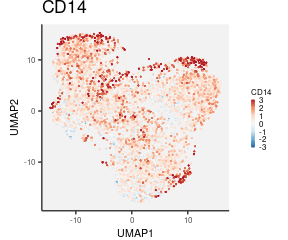<!-- -->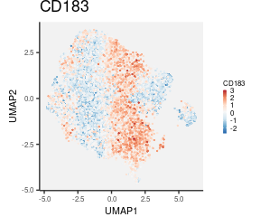<!-- -->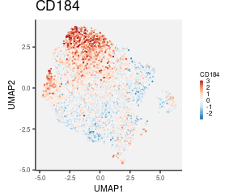<!-- -->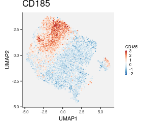<!-- --><!-- -->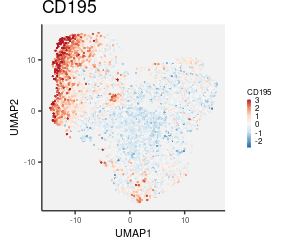<!-- -->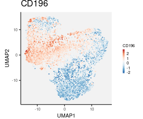<!-- -->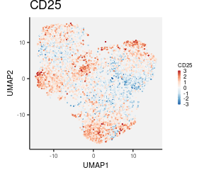<!-- -->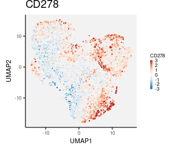<!-- -->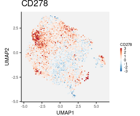<!-- -->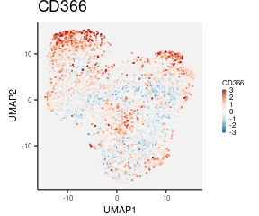<!-- -->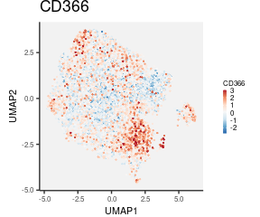<!-- --><!-- --><!-- -->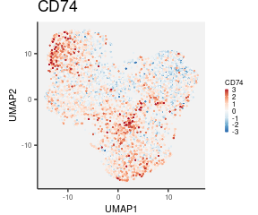<!-- -->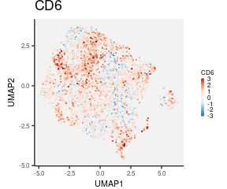<!-- -->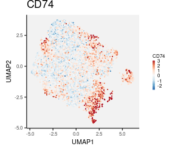<!-- -->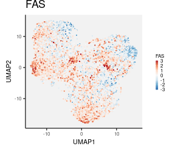<!-- -->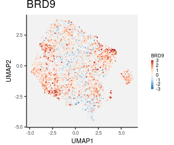<!-- -->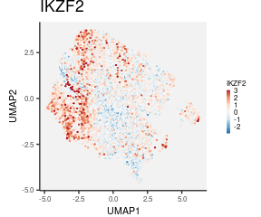<!-- -->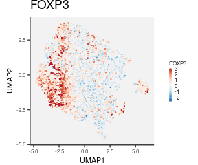<!-- -->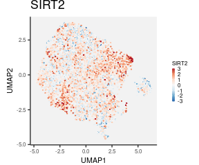<!-- -->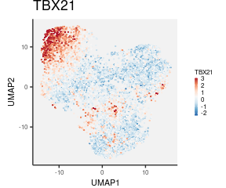<!-- -->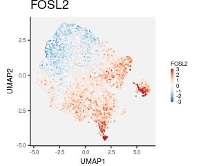<!-- -->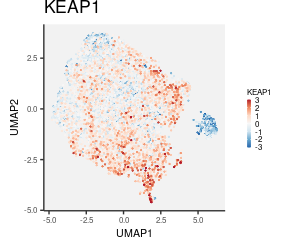<!-- -->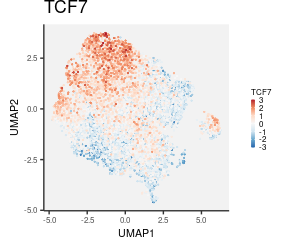<!-- -->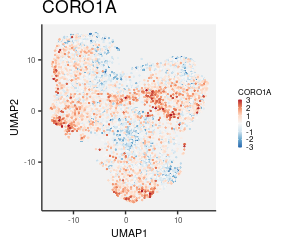<!-- -->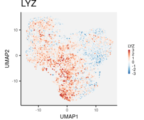<!-- -->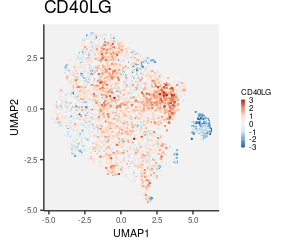<!-- -->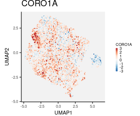<!-- -->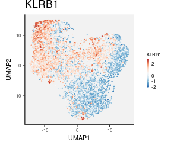<!-- -->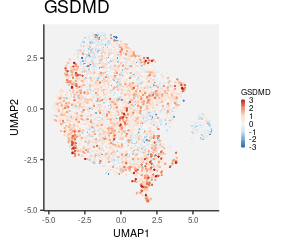<!-- -->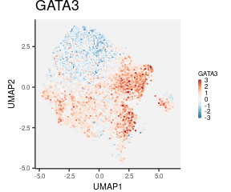<!-- -->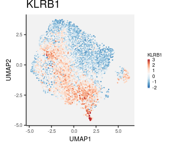<!-- -->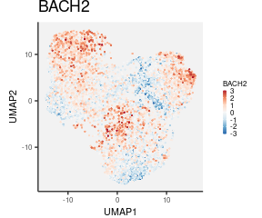<!-- -->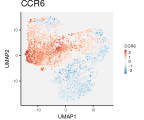<!-- -->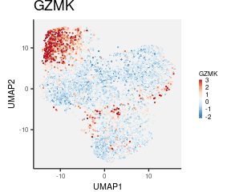<!-- -->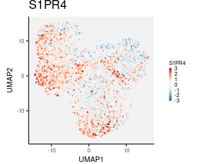<!-- --><!-- -->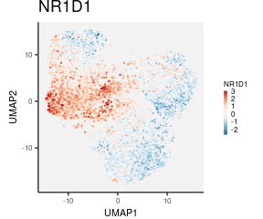<!-- -->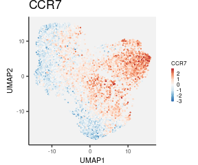<!-- -->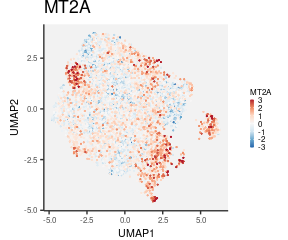<!-- -->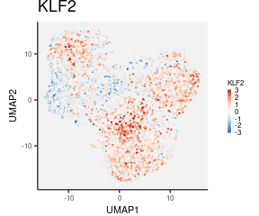<!-- -->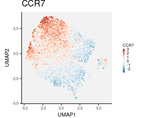<!-- -->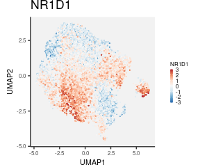<!-- -->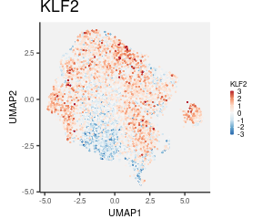<!-- -->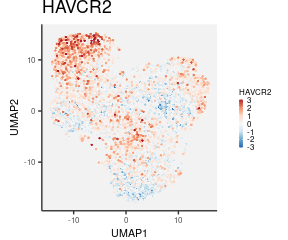<!-- --><!-- -->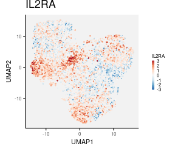<!-- --><!-- -->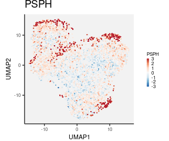<!-- -->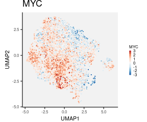<!-- -->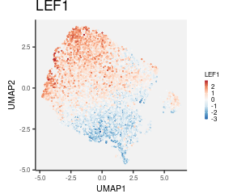<!-- -->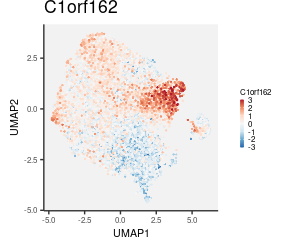<!-- -->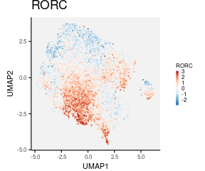<!-- -->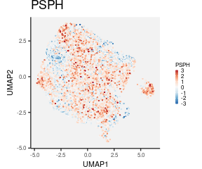<!-- --><!-- --><!-- --><!-- --><!-- --><!-- --><!-- --><!-- --><!-- --><!-- --><!-- --><!-- --><!-- --><!-- --><!-- --><!-- --><!-- --><!-- --><!-- --><!-- --><!-- --><!-- --><!-- --><!-- --><!-- --><!-- --><!-- --><!-- --><!-- --><!-- --><!-- --><!-- --><!-- --><!-- --><!-- --><!-- --><!-- --><!-- --><!-- --><!-- --><!-- --><!-- -->

#### tSNE for each marker gene


```r
for(g in unique(x.melt$gene)) {
    .dt <- left_join(x.melt[gene == g], .cells)
    .aes <- aes(tSNE1, tSNE2, color=pmax(pmin(x, 3), -3))

    plt <-
        .gg.plot(.dt[order(`x`)], .aes) +
        xlab("TSNE1") + ylab("TSNE2") +
        ggrastr::rasterise(geom_point(stroke = 0, size=.7), dpi=300) +
        theme(legend.key.width = unit(.2,"lines")) +
        theme(legend.key.height = unit(.5,"lines")) +
        scale_color_distiller(g, palette = "RdBu", direction = -1) +
        ggtitle(g)

    print(plt)
    .file <- fig.dir %&% "/Fig_mtconv_gene_tsne" %&% g %&% ".pdf"
    #.gg.save(filename = .file, plot = plt, width=3, height=2.5)
}
```

<!-- --><!-- --><!-- --><!-- --><!-- --><!-- --><!-- --><!-- --><!-- --><!-- --><!-- --><!-- --><!-- --><!-- --><!-- --><!-- --><!-- --><!-- --><!-- --><!-- --><!-- --><!-- --><!-- --><!-- --><!-- --><!-- --><!-- --><!-- --><!-- --><!-- --><!-- --><!-- --><!-- --><!-- --><!-- --><!-- --><!-- --><!-- --><!-- --><!-- --><!-- --><!-- --><!-- --><!-- --><!-- --><!-- --><!-- --><!-- --><!-- --><!-- --><!-- --><!-- --><!-- --><!-- --><!-- --><!-- --><!-- --><!-- --><!-- --><!-- --><!-- --><!-- --><!-- --><!-- --><!-- --><!-- --><!-- --><!-- --><!-- --><!-- --><!-- --><!-- --><!-- --><!-- --><!-- --><!-- --><!-- --><!-- --><!-- --><!-- --><!-- --><!-- --><!-- --><!-- --><!-- --><!-- --><!-- --><!-- --><!-- --><!-- --><!-- --><!-- --><!-- --><!-- --><!-- --><!-- --><!-- -->

### E. Basic statistics


```r
.stat <-
    .cells[,
           .(N = .N),
           by=.(batch, membership, component, disease)] %>%
    mutate(membership = as.factor(membership)) %>% 
    .sum.stat.batch()

plt <- .plt.sum.stat(.stat) + ggtitle("mTconv")
print(plt)
```

<!-- -->


```r
.stat.tot <-
    .cells[,
           .(N = .N),
           by=.(membership, disease)] %>%
    mutate(membership = as.factor(membership)) %>% 
    .sum.stat.tot() %>%
    mutate(batch = "(N=" %&% num.int(sum(.stat$N)) %&% ")")

plt <- .plt.sum.stat(.stat.tot) + ggtitle("mTconv")
print(plt)
```

<!-- -->


## 2. Memory Treg cells


```r
.full.data <- fileset.list("result/step2/matrix_final")
.mkdir("result/step4/")
.data <- fileset.list("result/step4/mtreg")

if.needed(.data, {
    .tags <- unique(annot.dt[celltype == "mTreg"]$tag)
    .data <-
        rcpp_mmutil_copy_selected_columns(.full.data$mtx,
                                          .full.data$row,
                                          .full.data$col,
                                          .tags,
                                          "result/step4/mtreg")
})
```

### A. Clustering cells by batch-balancing k-nearest neighbour graph


```r
.file <- "result/step4/mtreg_bbknn.rds"

if.needed(.file, {
    .batches <- take.batch.info(.data)

    .bbknn <-
        rcpp_mmutil_bbknn_mtx(.data$mtx,
                              r_batches = .batches, # batch label
                              RANK = 30,            # PCs
                              knn = 50,             # 20 nn per batch
                              RECIPROCAL_MATCH = T, # crucial
                              EM_ITER = 20,         # EM steps
                              NUM_THREADS = 16,
                              TAKE_LN = T,
                              USE_SINGULAR_VALUES = F)

    saveRDS(.bbknn, .file)
})
.bbknn <- readRDS(.file)
```


```r
.file <- "Tab/step4_mtreg_leiden.txt.gz"
if.needed(.file, {
    .tags <- readLines(.data$col)
    .leiden <- run.leiden(.bbknn$knn.adj, .tags, res=.3, nrepeat = 100, min.size = 10)
    fwrite(.leiden, .file)
})
.leiden <- fread(.file)
```

[**DOWNLOAD:** mTreg Leiden results](Tab/step4_mtreg_leiden.txt.gz)


```r
.file <- "Tab/step4_tumap_mtreg.txt.gz"
if.needed(.file, {

    set.seed(1)
    .umap <- uwot::tumap(.bbknn$factors.adjusted,
                         learning_rate=.1,
                         n_epochs=3000,
                         n_sgd_threads=16,
                         verbose=T,
                         init="lvrandom",
                         scale=T)

    .tags <- readLines(.data$col)

    colnames(.umap) <- "UMAP" %&% 1:ncol(.umap)

    .umap.dt <-
        data.table(.umap, tag = .tags) %>%
        left_join(.leiden) %>%
        na.omit()

    fwrite(.umap.dt, .file)
})
.umap.dt <- fread(.file)
```

[**DOWNLOAD:** mtreg UMAP results](Tab/step4_tumap_mtreg.txt.gz)


```r
.file <- "Tab/step4_tsne_mtreg.txt.gz"
if.needed(.file, {

    .tsne <- Rtsne::Rtsne(.bbknn$factors.adjusted,
                          check_duplicates = FALSE,
                          verbose = T,
                          num_threads = 16)

    .tags <- readLines(.data$col)

    colnames(.tsne$Y) <- "tSNE" %&% 1:ncol(.tsne$Y)

    .tsne.dt <- data.table(.tsne$Y, tag = .tags) %>%
        left_join(.leiden) %>%
        na.omit()

    fwrite(.tsne.dt, .file)
})
```

Performing PCA
Read the 8399 x 30 data matrix successfully!
OpenMP is working. 16 threads.
Using no_dims = 2, perplexity = 30.000000, and theta = 0.500000
Computing input similarities...
Building tree...
Done in 5.68 seconds (sparsity = 0.017168)!
Learning embedding...
Iteration 50: error is 93.451836 (50 iterations in 8.01 seconds)
Iteration 100: error is 93.298797 (50 iterations in 9.41 seconds)
Iteration 150: error is 93.297321 (50 iterations in 6.84 seconds)
Iteration 200: error is 93.297322 (50 iterations in 6.87 seconds)
Iteration 250: error is 93.297322 (50 iterations in 6.88 seconds)
Iteration 300: error is 4.342803 (50 iterations in 6.54 seconds)
Iteration 350: error is 4.025008 (50 iterations in 5.07 seconds)
Iteration 400: error is 3.872938 (50 iterations in 4.99 seconds)
Iteration 450: error is 3.781528 (50 iterations in 5.05 seconds)
Iteration 500: error is 3.717782 (50 iterations in 5.01 seconds)
Iteration 550: error is 3.670671 (50 iterations in 5.06 seconds)
Iteration 600: error is 3.633808 (50 iterations in 5.11 seconds)
Iteration 650: error is 3.604789 (50 iterations in 5.08 seconds)
Iteration 700: error is 3.582508 (50 iterations in 5.17 seconds)
Iteration 750: error is 3.564189 (50 iterations in 5.21 seconds)
Iteration 800: error is 3.548410 (50 iterations in 5.26 seconds)
Iteration 850: error is 3.535053 (50 iterations in 5.33 seconds)
Iteration 900: error is 3.523283 (50 iterations in 5.26 seconds)
Iteration 950: error is 3.513837 (50 iterations in 5.30 seconds)
Iteration 1000: error is 3.505555 (50 iterations in 5.27 seconds)
Fitting performed in 116.71 seconds.

```r
.tsne.dt <- fread(.file)
```

[**DOWNLOAD:** mtreg tSNE results](Tab/step4_tsne_mtreg.txt.gz)


### B. What are the cell-cluster-specific marker genes?


```r
.mkdir("Tab/")
.file <- "Tab/step4_mtreg_gene_stat.txt.gz"
if.needed(.file, {
    x <- bbknn.x(.data, .bbknn)
    marker.stat <- take.marker.stats(x, .leiden)
    fwrite(marker.stat, .file, sep = "\t", col.names = T)
})
marker.stat <- fread(.file, sep = "\t")
```

[**DOWNLOAD:** mTreg marker gene statistics](Tab/step4_mtreg_gene_stat.txt.gz)

### C. Non-linear embedding to confirm the cell clusters of mtreg cells


```r
.cells <-
    left_join(.umap.dt, .tsne.dt) %>%
    left_join(.leiden) %>%
    left_join(.hash.info) %>%
    na.omit()

.lab <-
    .cells[,
           .(UMAP1=median(UMAP1),
             UMAP2=median(UMAP2),
             tSNE1=median(tSNE1),
             tSNE2=median(tSNE2)),
           by = .(component, membership)]

.cols <- .more.colors(nrow(.lab), nc.pal=12)

p1 <-
    .gg.plot(.cells, aes(UMAP1, UMAP2, color=as.factor(membership))) +
    ggrastr::rasterise(geom_point(stroke=0, alpha=.8, size=.7), dpi=300) +
    geom_text(aes(label=membership), data=.lab, size=4, color="black") +
    scale_color_manual(values = .cols, guide="none")

p2 <-
    .gg.plot(.cells, aes(tSNE1, tSNE2, color=as.factor(membership))) +
    ggrastr::rasterise(geom_point(stroke=0, alpha=.8, size=.7), dpi=300) +
    geom_text(aes(label=membership), data=.lab, size=4, color="black") +
    scale_color_manual(values = .cols, guide="none")

plt <- p1 | p2
print(plt)
```

<!-- -->


```r
.cols <- .more.colors(10, nc.pal=7, .palette="Set1")

p1 <-
    .gg.plot(.cells, aes(UMAP1, UMAP2, color=as.factor(subject))) +
    xlab("UMAP1") + ylab("UMAP2") +
    ggrastr::rasterise(geom_point(stroke=0, alpha=.8, size=.7), dpi=300) +
    scale_color_manual(values = .cols, guide="none")

p2 <-
    .gg.plot(.cells, aes(UMAP1, UMAP2, color=as.factor(subject))) +
    xlab("UMAP1") + ylab("UMAP2") +
    ggrastr::rasterise(geom_point(stroke=0, alpha=.8, size=.7), dpi=300) +
    scale_color_manual(values = .cols, guide="none")

plt <- p1 | p2
print(plt)
```

<!-- -->


### D. Summary heatmap

**NOTE** The colors are standardized `log1p` expression across genes and cells.


```r
x.melt <- bbknn.x.melt(.data, .bbknn, .markers)
.dt <- x.melt %>% left_join(.cells) %>% na.omit()
.sum.subj <- .dt[, .(x = median(x)), by = .(gene, subject, membership)]
.sum.subj[, x := scale(x), by = .(gene)]
```


```r
.sum <-
    .sum.subj[, .(x = median(x)), by = .(gene, membership)] %>%
    mutate(col = `gene`, row = membership, weight = x) %>%
    col.order(1:10, TRUE) %>%
    as.data.table()

plt <-
    .gg.plot(.sum, aes(row, col, fill=pmin(pmax(weight, -1.5), 1.5)))+
    geom_tile(linewidth=.1, color="black") +
    scale_fill_distiller("", palette = "RdBu", direction = -1) +
    theme(legend.key.width = unit(.2,"lines")) +
    theme(legend.key.height = unit(.5,"lines")) +
    xlab("cell clusters") + ylab("features")
print(plt)
```

<!-- -->


```r
.dt <- copy(.sum.subj) %>%
    mutate(gene = factor(`gene`, .marker.order)) %>%
    mutate(t = subject %&% "." %&% membership)

plt <-
    .gg.plot(.dt, aes(`t`, `gene`, fill=pmin(pmax(`x`, -1.5), 1.5))) +
    facet_grid(. ~ membership, space="free", scales="free")+
    geom_tile(linewidth=.1, color="black") +
    scale_fill_distiller("", palette = "RdBu", direction = -1) +
    theme(legend.key.width = unit(.2,"lines")) +
    theme(legend.key.height = unit(.5,"lines")) +
    theme(axis.ticks.x = element_blank()) +
    theme(axis.text.x = element_blank()) +
    xlab("subjects") + ylab("features")

print(plt)
```

<!-- -->


#### UMAP for each marker gene


```r
for(g in unique(x.melt$gene)) {
    .dt <- left_join(x.melt[gene == g], .cells)
    .aes <- aes(UMAP1, UMAP2, color=pmax(pmin(x, 3), -3))

    plt <-
        .gg.plot(.dt[order(`x`)], .aes) +
        xlab("UMAP1") + ylab("UMAP2") +
        ggrastr::rasterise(geom_point(stroke = 0, size=.7), dpi=300) +
        theme(legend.key.width = unit(.2,"lines")) +
        theme(legend.key.height = unit(.5,"lines")) +
        scale_color_distiller(g, palette = "RdBu", direction = -1) +
        ggtitle(g)

    print(plt)
    .file <- fig.dir %&% "/Fig_mtreg_gene_umap" %&% g %&% ".pdf"
    #.gg.save(filename = .file, plot = plt, width=3, height=2.5)
}
```

<!-- --><!-- --><!-- --><!-- --><!-- --><!-- --><!-- --><!-- --><!-- --><!-- --><!-- --><!-- --><!-- --><!-- --><!-- --><!-- --><!-- --><!-- --><!-- --><!-- --><!-- --><!-- --><!-- --><!-- --><!-- --><!-- --><!-- --><!-- --><!-- --><!-- --><!-- --><!-- --><!-- --><!-- --><!-- --><!-- --><!-- --><!-- --><!-- --><!-- --><!-- --><!-- --><!-- --><!-- --><!-- --><!-- --><!-- --><!-- --><!-- --><!-- --><!-- --><!-- --><!-- --><!-- --><!-- --><!-- --><!-- --><!-- --><!-- --><!-- --><!-- --><!-- --><!-- --><!-- --><!-- --><!-- --><!-- --><!-- --><!-- --><!-- --><!-- --><!-- --><!-- --><!-- --><!-- --><!-- --><!-- --><!-- --><!-- --><!-- --><!-- --><!-- --><!-- --><!-- --><!-- --><!-- --><!-- --><!-- --><!-- --><!-- --><!-- --><!-- --><!-- --><!-- --><!-- --><!-- --><!-- -->

#### tSNE for each marker gene


```r
for(g in unique(x.melt$gene)) {
    .dt <- left_join(x.melt[gene == g], .cells)
    .aes <- aes(tSNE1, tSNE2, color=pmax(pmin(x, 3), -3))

    plt <-
        .gg.plot(.dt[order(`x`)], .aes) +
        xlab("TSNE1") + ylab("TSNE2") +
        ggrastr::rasterise(geom_point(stroke = 0, size=.7), dpi=300) +
        theme(legend.key.width = unit(.2,"lines")) +
        theme(legend.key.height = unit(.5,"lines")) +
        scale_color_distiller(g, palette = "RdBu", direction = -1) +
        ggtitle(g)

    print(plt)
    .file <- fig.dir %&% "/Fig_mtreg_gene_tsne" %&% g %&% ".pdf"
    #.gg.save(filename = .file, plot = plt, width=3, height=2.5)
}
```

<!-- --><!-- --><!-- --><!-- --><!-- --><!-- --><!-- --><!-- --><!-- --><!-- --><!-- --><!-- --><!-- --><!-- --><!-- --><!-- --><!-- --><!-- --><!-- --><!-- --><!-- --><!-- --><!-- --><!-- --><!-- --><!-- --><!-- --><!-- --><!-- --><!-- --><!-- --><!-- --><!-- --><!-- --><!-- --><!-- --><!-- --><!-- --><!-- --><!-- --><!-- --><!-- --><!-- --><!-- --><!-- --><!-- --><!-- --><!-- --><!-- --><!-- --><!-- --><!-- --><!-- --><!-- --><!-- --><!-- --><!-- --><!-- --><!-- --><!-- --><!-- --><!-- --><!-- --><!-- --><!-- --><!-- --><!-- --><!-- --><!-- --><!-- --><!-- --><!-- --><!-- --><!-- --><!-- --><!-- --><!-- --><!-- --><!-- --><!-- --><!-- --><!-- --><!-- --><!-- --><!-- --><!-- --><!-- --><!-- --><!-- --><!-- --><!-- --><!-- --><!-- --><!-- --><!-- --><!-- --><!-- -->

### E. Basic statistics


```r
.stat <-
    .cells[,
           .(N = .N),
           by=.(batch, membership, component, disease)] %>%
    mutate(membership = as.factor(membership)) %>% 
    .sum.stat.batch()

plt <- .plt.sum.stat(.stat) + ggtitle("mtreg")
print(plt)
```

<!-- -->


```r
.stat.tot <-
    .cells[,
           .(N = .N),
           by=.(membership, disease)] %>%
    mutate(membership = as.factor(membership)) %>% 
    .sum.stat.tot() %>%
    mutate(batch = "(N=" %&% num.int(sum(.stat$N)) %&% ")")

plt <- .plt.sum.stat(.stat.tot) + ggtitle("mtreg")
print(plt)
```

<!-- -->


