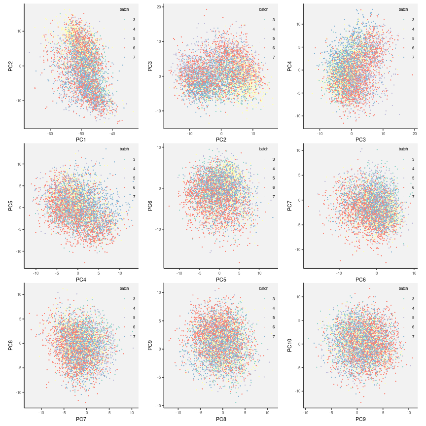
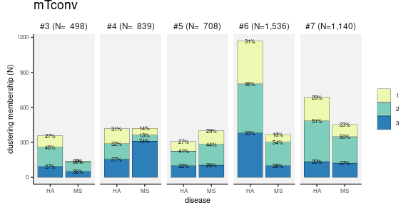
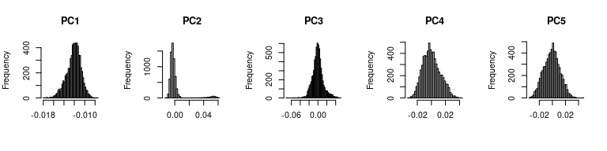
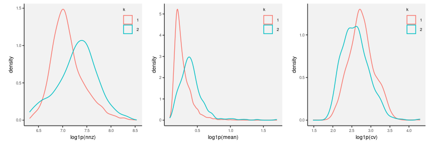
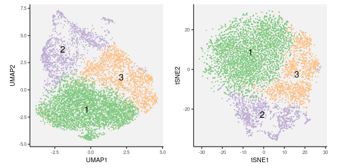

* Marker genes well-known for mTconv cell subtype classification


``` r
.markers <-
    c("CCR4","CCR6","CXCR3","CXCR5",
      "ABCA1","GBP4","CDCA7L","ITM2C","NR1D1",
      "CTSH","GATA3","FHIT","CD40LG","C1orf162",
      "MGATA4A","GZMK","IFNGR2",
      "CD183","CD185","CD196","CD194",
      "RORC", "TBX21", "HLADR", "CD74", "TCF7", "LEF1",
      "CCR7", "CCR8", "IKZF2", "TIGIT", "LAG3",
      "HAVCR2", "CD366", "KLRB1", "FOSL2", "SGK1", "BACH2",
      "HLA-C", "HLA-B", "HLA-E", "HLA-DR", "HLA-DRA", "HLA-DRB1") %>%
    unique
```


* Goal: Identify cellular states/subtypes in memory T cells


``` r
.hash.hdr <- "result/step1/hash"
.hash.data <- fileset.list(.hash.hdr)
.hash.info <- read.hash(.hash.data)
annot.dt <- fread("Tab/step2_cell_type.txt.gz") %>%
    left_join(.hash.info)
```


## 1. Memory T conventional


``` r
.full.data <- fileset.list("result/step1/final_matrix")
.mkdir("result/step4/")
.data <- fileset.list("result/step4/mtconv")

if.needed(.data, {
    .tags <- unique(annot.dt[celltype == "mTconv"]$tag)
    .data <-
        rcpp_mmutil_copy_selected_columns(.full.data$mtx,
                                          .full.data$row,
                                          .full.data$col,
                                          .tags,
                                          "result/step4/mtconv")
})
```

### Perform SVD and build batch-balancing kNN graph


``` r
.file <- "result/step4/mtconv_bbknn.rds"
if.needed(.file, {

    .batches <- take.batch.info(.data)

    .svd <- rcpp_mmutil_svd(.data$mtx, RANK=30, TAKE_LN=T, EM_ITER = 20, NUM_THREADS=16)

    .bbknn <-
        rcpp_mmutil_bbknn(r_svd_u = .svd$U,
                          r_svd_v = .svd$V,
                          r_svd_d = .svd$D,
                          r_batches = .batches, # batch label
                          knn = 50,             # 10 nn per batch
                          RECIPROCAL_MATCH = T, # crucial
                          NUM_THREADS = 16,
                          USE_SINGULAR_VALUES = T)

    saveRDS(.bbknn, .file)
})
.bbknn <- readRDS(.file)
```


``` r
VD <- .bbknn$factors.adjusted
rownames(VD) <- readLines(.data$col)
plots <- lapply(1:9, pca.plot.vd, VD=pca.df(VD))
plt <- wrap_plots(plots, ncol = 3)
print(plt)
```

<!-- -->


[PDF](Fig/STEP4//Fig_svd_batch_mtconv.pdf)

### A. Clustering cells by batch-balancing k-nearest neighbour graph


``` r
set.seed(1)
.file <- "Tab/step4_mtconv_leiden.txt.gz"
if.needed(.file, {
    .tags <- readLines(.data$col)
    .leiden <- run.leiden(.bbknn$knn.adj, .tags, res=.3, nrepeat = 1000, min.size = 100)
    fwrite(.leiden, .file)
})
.leiden <- fread(.file)
```

[**DOWNLOAD:** mTconv Leiden results](Tab/step4_mtconv_leiden.txt.gz)


``` r
.file <- "Tab/step4_tumap_mtconv.txt.gz"
if.needed(.file, {

    set.seed(1)
    .umap <- uwot::tumap(.bbknn$factors.adjusted,
                         learning_rate=1,
                         n_epochs=3000,
                         n_sgd_threads=16,
                         verbose=T,
                         init="spectral")

    .tags <- readLines(.data$col)

    colnames(.umap) <- "UMAP" %&% 1:ncol(.umap)

    .umap.dt <-
        data.table(.umap, tag = .tags) %>%
        left_join(.leiden) %>%
        na.omit()

    fwrite(.umap.dt, .file)
})
.umap.dt <- fread(.file)
```

[**DOWNLOAD:** mTconv UMAP results](Tab/step4_tumap_mtconv.txt.gz)


``` r
.file <- "Tab/step4_tsne_mtconv.txt.gz"
if.needed(.file, {

    .tsne <- Rtsne::Rtsne(.bbknn$factors.adjusted,
                          check_duplicates = FALSE,
                          verbose = T,
                          num_threads = 16,
                          perplexity = 100)

    .tags <- readLines(.data$col)

    colnames(.tsne$Y) <- "tSNE" %&% 1:ncol(.tsne$Y)

    .tsne.dt <- data.table(.tsne$Y, tag = .tags) %>%
        left_join(.leiden) %>%
        na.omit()

    fwrite(.tsne.dt, .file)
})
.tsne.dt <- fread(.file)
```

[**DOWNLOAD:** mTconv tSNE results](Tab/step4_tsne_mtconv.txt.gz)


### B. What are the cell-cluster-specific marker genes?


``` r
.mkdir("Tab/")
.file <- "Tab/step4_mtconv_gene_stat.txt.gz"
if.needed(.file, {
    x <- bbknn.x(.data, .bbknn)
    marker.stat <- take.marker.stats(x, .leiden)
    fwrite(marker.stat, .file, sep = "\t", col.names = T)
})
marker.stat <- fread(.file, sep = "\t")
```

[**DOWNLOAD:** mTconv marker gene statistics](Tab/step4_mtconv_gene_stat.txt.gz)


### C. Non-linear embedding to confirm the cell clusters of mTconv cells


``` r
.cells <-
    left_join(.umap.dt, .tsne.dt) %>%
    left_join(.hash.info) %>% 
    na.omit()

.lab <-
    .cells[,
           .(UMAP1=median(UMAP1),
             UMAP2=median(UMAP2),
             tSNE1=median(tSNE1),
             tSNE2=median(tSNE2)),
           by = .(component, membership)]

mtconv.cols <- .more.colors(nrow(.lab), nc.pal=3, .palette="YlGnBu")

p1 <-
    .gg.plot(.cells, aes(UMAP1, UMAP2, fill=as.factor(membership))) +
    ggrastr::rasterise(geom_point(stroke=.2, alpha=.8, pch=21), dpi=300) +
    geom_text(aes(label=membership), data=.lab, size=4, color="black") +
    scale_fill_manual(values = mtconv.cols, guide="none")

p2 <-
    .gg.plot(.cells, aes(tSNE1, tSNE2, fill=as.factor(membership))) +
    ggrastr::rasterise(geom_point(stroke=.2, alpha=.8, pch=21), dpi=300) +
    geom_text(aes(label=membership), data=.lab, size=4, color="black") +
    scale_fill_manual(values = mtconv.cols, guide="none")

plt <- p1 | p2
print(plt)
```

<!-- -->


[PDF](Fig/STEP4//Fig_bbknn_mtconv.pdf)

##### Confirm batch/individual-specific effects


``` r
nn <- length(unique(.cells$subject))
.cols <- .more.colors(nn, nc.pal=7, .palette="Set2")

p1 <-
    .gg.plot(.cells, aes(UMAP1, UMAP2, color=as.factor(subject))) +
    xlab("UMAP1") + ylab("UMAP2") +
    ggrastr::rasterise(geom_point(stroke=0, alpha=.8, size=.7), dpi=300) +
    scale_color_manual(values = .cols, guide="none")

p2 <-
    .gg.plot(.cells, aes(UMAP1, UMAP2, color=as.factor(subject))) +
    xlab("UMAP1") + ylab("UMAP2") +
    ggrastr::rasterise(geom_point(stroke=0, alpha=.8, size=.7), dpi=300) +
    scale_color_manual(values = .cols, guide="none")

p3 <-
    .gg.plot(.cells, aes(UMAP1, UMAP2, color=as.factor(disease))) +
    xlab("UMAP1") + ylab("UMAP2") +
    ggrastr::rasterise(geom_point(stroke=0, alpha=.8, size=.7), dpi=300) +
    scale_color_brewer("", palette = "Set1", guide="none")

p4 <-
    .gg.plot(.cells, aes(UMAP1, UMAP2, color=as.factor(disease))) +
    xlab("UMAP1") + ylab("UMAP2") +
    ggrastr::rasterise(geom_point(stroke=0, alpha=.8, size=.7), dpi=300) +
    scale_color_brewer("", palette = "Set1", guide="none")

plt <- (p1 | p2)/(p3 | p4)
print(plt)
```

<!-- -->


[PDF](Fig/STEP4//Fig_bbknn_mtconv_sub.pdf)

### D. Summary heatmap

**NOTE** The colors are standardized `log1p` expression across genes and cells.


``` r
.cells <- .leiden %>%
    left_join(.hash.info)
x.melt <- bbknn.x.melt(.data, .bbknn, .markers)
.dt <- x.melt %>% left_join(.cells) %>% na.omit()
.sum.subj <- .dt[, .(x = median(x)), by = .(gene, subject, membership)]
.sum.subj[, x := scale(x), by = .(gene)]
```


``` r
.sum <-
    .sum.subj[, .(x = median(x)), by = .(gene, membership)] %>%
    mutate(col = `gene`, row = membership, weight = x) %>%
    col.order(1:10, TRUE) %>%
    as.data.table()

plt <-
    .gg.plot(.sum, aes(row, col, fill=pmin(pmax(weight, -1.5), 1.5)))+
    geom_tile(linewidth=.1, color="black") +
    scale_fill_distiller("", palette = "RdBu", direction = -1) +
    theme(legend.key.width = unit(.2,"lines")) +
    theme(legend.key.height = unit(.5,"lines")) +
    xlab("cell clusters") + ylab("features")
print(plt)
```

<!-- -->


[PDF](Fig/STEP4//Fig_mtconv_sum_membership.pdf)


``` r
.dt <- copy(.sum.subj) %>%
    mutate(gene = factor(`gene`, .marker.order)) %>%
    mutate(t = subject %&% "." %&% membership)

plt <-
    .gg.plot(.dt, aes(`t`, `gene`, fill=pmin(pmax(`x`, -1.5), 1.5))) +
    facet_grid(. ~ membership, space="free", scales="free")+
    geom_tile(linewidth=.1, color="black") +
    scale_fill_distiller("", palette = "RdBu", direction = -1) +
    theme(legend.key.width = unit(.2,"lines")) +
    theme(legend.key.height = unit(.5,"lines")) +
    theme(axis.ticks.x = element_blank()) +
    theme(axis.text.x = element_blank()) +
    xlab("subjects") + ylab("features")

print(plt)
```

<!-- -->


[PDF](Fig/STEP4//Fig_mtconv_sum_subj_member.pdf)

### E. Basic statistics


``` r
.stat <-
    .cells[,
           .(N = .N),
           by=.(batch, membership, component, disease)] %>%
    mutate(membership = as.factor(membership)) %>% 
    .sum.stat.batch()

plt <- .plt.sum.stat(.stat, .cols=mtconv.cols, show.prop = T) + ggtitle("mTconv")
print(plt)
```

<!-- -->


[PDF](Fig/STEP4//Fig_count_mtconv_prop.pdf)


``` r
plt <- .plt.sum.stat(.stat, .cols=mtconv.cols, show.prop = F) + ggtitle("mTconv")
print(plt)
```

<!-- -->


[PDF](Fig/STEP4//Fig_count_mtconv_tot.pdf)


``` r
.stat.tot <-
    .cells[,
           .(N = .N),
           by=.(membership, disease)] %>%
    mutate(membership = as.factor(membership)) %>% 
    .sum.stat.tot() %>%
    mutate(batch = "(N=" %&% num.int(sum(.stat$N)) %&% ")")

plt <- .plt.sum.stat(.stat.tot, .cols=mtconv.cols, show.prop = T) + ggtitle("mTconv")
print(plt)
```

<!-- -->


[PDF](Fig/STEP4//Fig_count_merged_mtconv_prop.pdf)


``` r
plt <- .plt.sum.stat(.stat.tot, .cols=mtconv.cols, show.prop = F) + ggtitle("mTconv")
print(plt)
```

<!-- -->


[PDF](Fig/STEP4//Fig_count_merged_mtconv_tot.pdf)

## 2. Memory Treg cells


``` r
.full.data <- fileset.list("result/step1/final_matrix")
.mkdir("result/step4/")
.data <- fileset.list("result/step4/mtreg")

if.needed(.data, {
    .tags <- unique(annot.dt[celltype == "mTreg"]$tag)
    .data <-
        rcpp_mmutil_copy_selected_columns(.full.data$mtx,
                                          .full.data$row,
                                          .full.data$col,
                                          .tags,
                                          "result/step4/mtreg")
})
```


### Perform outlier Q/C to detect and remove batch-specific cells


``` r
.file <- "result/step4/mtreg_svd.rds"

if.needed(.file, {
    .svd <- rcpp_mmutil_svd(.data$mtx, RANK=30, TAKE_LN=T, NUM_THREADS = 16, EM_ITER = 20)
    saveRDS(.svd, .file)
})
.svd <- readRDS(.file)
```

#### Can we identify troublesome batch-specific principal components?

##### Show PCs to reveal potential biases


``` r
V <- sweep(.svd$V, 2, .svd$D, `*`)
rownames(V) <- readLines(.data$col)
plots <- lapply(1:9, pca.plot.vd, VD=pca.df(V))
plt <- wrap_plots(plots, ncol = 3)
print(plt)
```

<!-- -->

* We found strong bimodal distributions for the PC #2


``` r
par(mfrow=c(1,5))
for(k in 1:5){
    hist(.svd$V[,k], 50, main = "PC" %&% k, xlab="")
}
```

<!-- -->

##### Identify outlier cells in gene expression data


``` r
set.seed(1)
.kmeans <- kmeans(.svd$V[, 1:5], 2, nstart = 100)
k.select <- which.max(table(.kmeans$cluster))
.qc.cells <- readLines(.data$col)[.kmeans$cluster == k.select]
```


``` r
V <- .svd$V; rownames(V) <- readLines(.data$col)
.vd <- pca.df(V)
.vd[, batch := as.factor(.kmeans$cluster)]

plots <- lapply(1:9, pca.plot.vd, VD = .vd)
plt <- wrap_plots(plots, ncol = 3)
print(plt)
```

<!-- -->


``` r
plt <- diagnostic.density.kmeans(.data, .kmeans)
print(plt)
```

<!-- -->


``` r
.file <- "result/step4/qc_mtreg_svd.rds"

if.needed(.file, {
    mtreg.svd <- rcpp_mmutil_svd(.mtreg.qc.data$mtx, RANK=30, TAKE_LN=T,
                                NUM_THREADS = 16, EM_ITER = 20)
    saveRDS(mtreg.svd, .file)
})
mtreg.svd <- readRDS(.file)

V <- mtreg.svd$V; rownames(V) <- readLines(.mtreg.qc.data$col)
plots <- lapply(1:9, pca.plot.vd, VD = pca.df(V))
plt <- wrap_plots(plots, ncol = 3)
print(plt)
```

<!-- -->


[PDF](Fig/STEP4//Fig_svd_batch_mtreg.pdf)


``` r
.data <- .mtreg.qc.data
```

### Perform SVD and build batch-balancing kNN graph


``` r
.file <- "result/step4/mtreg_bbknn.rds"

if.needed(.file, {

    .batches <- take.batch.info(.data)
    .svd <- mtreg.svd

    .bbknn <-
        rcpp_mmutil_bbknn(r_svd_u = .svd$U,
                          r_svd_v = .svd$V,
                          r_svd_d = .svd$D,
                          r_batches = .batches, # batch label
                          knn = 50,             # 10 nn per batch
                          RECIPROCAL_MATCH = T, # crucial
                          NUM_THREADS = 16,
                          USE_SINGULAR_VALUES = T)

    saveRDS(.bbknn, .file)
})
.bbknn <- readRDS(.file)
```

### A. Clustering cells by batch-balancing k-nearest neighbour graph


``` r
.file <- "Tab/step4_mtreg_leiden.txt.gz"
if.needed(.file, {
    .tags <- readLines(.data$col)
    .leiden <- run.leiden(.bbknn$knn.adj, .tags, res=.3, nrepeat = 1000, min.size = 100)
    fwrite(.leiden, .file)
})
.leiden <- fread(.file)
```

[**DOWNLOAD:** mtreg Leiden results](Tab/step4_mtreg_leiden.txt.gz)


``` r
.file <- "Tab/step4_tumap_mtreg.txt.gz"
if.needed(.file, {

    set.seed(1)
    .umap <- uwot::tumap(.bbknn$factors.adjusted,
                         learning_rate=1,
                         n_epochs=3000,
                         n_sgd_threads=16,
                         verbose=T,
                         init="lvrandom")

    .tags <- readLines(.data$col)

    colnames(.umap) <- "UMAP" %&% 1:ncol(.umap)

    .umap.dt <-
        data.table(.umap, tag = .tags) %>%
        left_join(.leiden) %>%
        na.omit()

    fwrite(.umap.dt, .file)
})
.umap.dt <- fread(.file)
```

[**DOWNLOAD:** mtreg UMAP results](Tab/step4_tumap_mtreg.txt.gz)


``` r
.file <- "Tab/step4_tsne_mtreg.txt.gz"
if.needed(.file, {

    .tsne <- Rtsne::Rtsne(.bbknn$factors.adjusted,
                          check_duplicates = FALSE,
                          verbose = T,
                          num_threads = 16)

    .tags <- readLines(.data$col)

    colnames(.tsne$Y) <- "tSNE" %&% 1:ncol(.tsne$Y)

    .tsne.dt <- data.table(.tsne$Y, tag = .tags) %>%
        left_join(.leiden) %>%
        na.omit()

    fwrite(.tsne.dt, .file)
})
.tsne.dt <- fread(.file)
```

[**DOWNLOAD:** mtreg tSNE results](Tab/step4_tsne_mtreg.txt.gz)


### B. What are the cell-cluster-specific marker genes?


``` r
.mkdir("Tab/")
.file <- "Tab/step4_mtreg_gene_stat.txt.gz"
if.needed(.file, {
    x <- bbknn.x(.data, .bbknn)
    marker.stat <- take.marker.stats(x, .leiden)
    fwrite(marker.stat, .file, sep = "\t", col.names = T)
})
marker.stat <- fread(.file, sep = "\t")
```

[**DOWNLOAD:** mTreg marker gene statistics](Tab/step4_mtreg_gene_stat.txt.gz)

### C. Non-linear embedding to confirm the cell clusters of mtreg cells


``` r
.cells <-
    left_join(.umap.dt, .tsne.dt) %>%
    left_join(.leiden) %>%
    left_join(.hash.info) %>%
    na.omit()

.lab <-
    .cells[,
           .(UMAP1=median(UMAP1),
             UMAP2=median(UMAP2),
             tSNE1=median(tSNE1),
             tSNE2=median(tSNE2)),
           by = .(component, membership)]

K <- nrow(.lab)
mtreg.cols <- .more.colors(K, nc.pal=min(K, 5), .palette="Accent")

p1 <-
    .gg.plot(.cells, aes(UMAP1, UMAP2, color=as.factor(membership))) +
    ggrastr::rasterise(geom_point(stroke=0, alpha=.8, size=.7), dpi=300) +
    geom_text(aes(label=membership), data=.lab, size=4, color="black") +
    scale_color_manual(values = mtreg.cols, guide="none")

p2 <-
    .gg.plot(.cells, aes(tSNE1, tSNE2, color=as.factor(membership))) +
    ggrastr::rasterise(geom_point(stroke=0, alpha=.8, size=.7), dpi=300) +
    geom_text(aes(label=membership), data=.lab, size=4, color="black") +
    scale_color_manual(values = mtreg.cols, guide="none")

plt <- p1 | p2
print(plt)
```

<!-- -->


[PDF](Fig/STEP4//Fig_bbknn_mtreg.pdf)

##### Confirm batch/individual-specific effects


``` r
nn <- length(unique(.cells$subject))
.cols <- .more.colors(nn, nc.pal=5, .palette="Set1")

p1 <-
    .gg.plot(.cells, aes(UMAP1, UMAP2, color=as.factor(subject))) +
    xlab("UMAP1") + ylab("UMAP2") +
    ggrastr::rasterise(geom_point(stroke=0, alpha=.8, size=.7), dpi=300) +
    scale_color_manual(values = .cols, guide="none")

p2 <-
    .gg.plot(.cells, aes(UMAP1, UMAP2, color=as.factor(subject))) +
    xlab("UMAP1") + ylab("UMAP2") +
    ggrastr::rasterise(geom_point(stroke=0, alpha=.8, size=.7), dpi=300) +
    scale_color_manual(values = .cols, guide="none")

p3 <-
    .gg.plot(.cells, aes(UMAP1, UMAP2, color=as.factor(disease))) +
    xlab("UMAP1") + ylab("UMAP2") +
    ggrastr::rasterise(geom_point(stroke=0, alpha=.8, size=.7), dpi=300) +
    scale_color_brewer("", palette = "Set1", guide="none")

p4 <-
    .gg.plot(.cells, aes(UMAP1, UMAP2, color=as.factor(disease))) +
    xlab("UMAP1") + ylab("UMAP2") +
    ggrastr::rasterise(geom_point(stroke=0, alpha=.8, size=.7), dpi=300) +
    scale_color_brewer("", palette = "Set1", guide="none")

plt <- (p1 | p2)/(p3 | p4)
print(plt)
```

<!-- -->


[PDF](Fig/STEP4//Fig_bbknn_mtreg_sub.pdf)

### D. Summary heatmap

**NOTE** The colors are standardized `log1p` expression across genes and cells.


``` r
.cells <- .leiden %>% left_join(.hash.info)
x.melt <- bbknn.x.melt(.data, .bbknn, .markers)
.dt <- x.melt %>% left_join(.cells) %>% na.omit()
.sum.subj <- .dt[, .(x = median(x)), by = .(gene, subject, membership)]
.sum.subj[, x := scale(x), by = .(gene)]
```


``` r
.sum <-
    .sum.subj[, .(x = median(x)), by = .(gene, membership)] %>%
    mutate(col = `gene`, row = membership, weight = x) %>%
    col.order(1:15, TRUE) %>%
    as.data.table()

plt <-
    .gg.plot(.sum, aes(row, col, fill=pmin(pmax(weight, -1.5), 1.5)))+
    geom_tile(linewidth=.1, color="black") +
    scale_fill_distiller("", palette = "RdBu", direction = -1) +
    theme(legend.key.width = unit(.2,"lines")) +
    theme(legend.key.height = unit(.5,"lines")) +
    xlab("cell clusters") + ylab("features")
print(plt)
```

<!-- -->


[PDF](Fig/STEP4//Fig_mtreg_sum_membership.pdf)


``` r
.dt <- copy(.sum.subj) %>%
    mutate(gene = factor(`gene`, .marker.order)) %>%
    mutate(t = subject %&% "." %&% membership)

plt <-
    .gg.plot(.dt, aes(`t`, `gene`, fill=pmin(pmax(`x`, -1.5), 1.5))) +
    facet_grid(. ~ membership, space="free", scales="free")+
    geom_tile(linewidth=.1, color="black") +
    scale_fill_distiller("", palette = "RdBu", direction = -1) +
    theme(legend.key.width = unit(.2,"lines")) +
    theme(legend.key.height = unit(.5,"lines")) +
    theme(axis.ticks.x = element_blank()) +
    theme(axis.text.x = element_blank()) +
    xlab("subjects") + ylab("features")

print(plt)
```

<!-- -->


[PDF](Fig/STEP4//Fig_mtreg_sum_subj_member.pdf)


### E. Basic statistics


``` r
.stat <-
    .cells[,
           .(N = .N),
           by=.(batch, membership, component, disease)] %>%
    mutate(membership = as.factor(membership)) %>% 
    .sum.stat.batch()

plt <- .plt.sum.stat(.stat, .cols=mtreg.cols, show.prop = T) + ggtitle("mtreg")
print(plt)
```

<!-- -->


[PDF](Fig/STEP4//Fig_count_mtreg_prop.pdf)


``` r
plt <- .plt.sum.stat(.stat, .cols=mtreg.cols, show.prop = F) + ggtitle("mtreg")
print(plt)
```

<!-- -->


[PDF](Fig/STEP4//Fig_count_mtreg_tot.pdf)


``` r
.stat.tot <-
    .cells[,
           .(N = .N),
           by=.(membership, disease)] %>%
    mutate(membership = as.factor(membership)) %>% 
    .sum.stat.tot() %>%
    mutate(batch = "(N=" %&% num.int(sum(.stat$N)) %&% ")")

plt <- .plt.sum.stat(.stat.tot, .cols=mtreg.cols, show.prop = T) + ggtitle("mtreg")
print(plt)
```

<!-- -->


[PDF](Fig/STEP4//Fig_count_merged_mtreg_prop.pdf)


``` r
plt <- .plt.sum.stat(.stat.tot, .cols=mtreg.cols, show.prop = F) + ggtitle("mtreg")
print(plt)
```

<!-- -->


[PDF](Fig/STEP4//Fig_count_merged_mtreg_tot.pdf)
