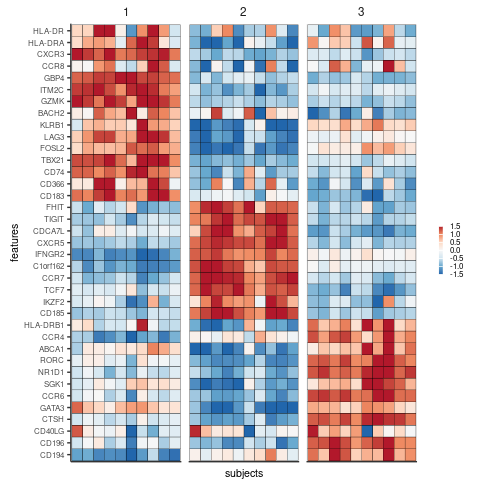
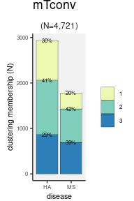
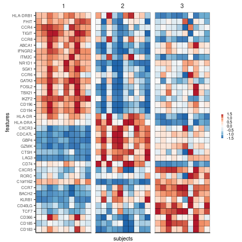
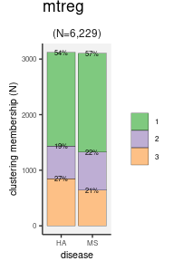

```r
parse.tag <- function(x) {
    x[, c("barcode", "batch") := tstrsplit(tag, split="[_]")];
    x[, barcode := gsub(`barcode`, pattern="-[0-9]$", replacement="")];
    x[, batch := as.integer(`batch`)]
    x;
}
parse.gene <- function(x){
    x[, c("ensembl_gene_id","hgnc_symbol") := tstrsplit(`gene`,split="_")]
    x[, i := 1:.N]
    return(x)
}

bbknn.x <- function(.data, .bbknn, .bbknn.umap, .subset = NULL) {
    .cols <-
        fread(.data$col, header=F, col.names = "tag") %>%
        parse.tag() %>%
        mutate(j = 1:n()) %>%
        left_join(.bbknn.umap) %>%
        na.omit() %>%
        as.data.table()

    .rows <-
        fread(.data$row, col.names="gene", header=F) %>%
        parse.gene()

    if(!is.null(.subset)){
        .rows <- .rows %>%
            filter(hgnc_symbol %in% .subset |
                   ensembl_gene_id %in% .subset)
    }

    vv <- .bbknn$factors.adjusted[.cols$j, , drop = F]
    X <- sweep(.bbknn$U, 2, .bbknn$D, `*`) %*% t(vv)

    ## double scale
    X <- apply(X, 2, scale)
    X.t <- apply(t(X), 2, scale)
    X <- t(X.t)

    ret <- X[.rows$i, , drop = F]
    rownames(ret) <- .rows$hgnc_symbol
    colnames(ret) <- .cols$tag
    return(ret)
}

bbknn.x.melt <- function(.data, .bbknn, .bbknn.umap, .subset = NULL) {

    X <- bbknn.x(.data, .bbknn, .bbknn.umap, .subset)
    ret <- reshape2::melt(X) %>% as.data.table()
    ret[, tag := Var2]
    ret[, gene := Var1]
    ret[, Var1 := NULL]
    ret[, Var2 := NULL]
    ret[, x := value]
    ret[, value := NULL]
    return(ret)
}

take.marker.stats <- function(x, dict){

    require(matrixTests)

    ret <- data.table()
    for(k in unique(dict$membership)){
        tag.k <- .bbknn.umap[membership == k]$tag
        x.k <- x[, colnames(x) %in% tag.k, drop = F]
        y.k <- x[, !(colnames(x) %in% tag.k), drop = F]
        ## wilcox within vs. outside
        wilcox.k <- row_wilcoxon_twosample(x.k, y.k)
        ## t-test
        ttest.k <- row_t_welch(x.k, y.k)
        ret.k <- data.table(
            gene = rownames(x),
            membership = k,
            wilcox.p = wilcox.k$pvalue,
            ttest.t = ttest.k$statistic,
            mean = ttest.k$mean.x,
            mean.outside = ttest.k$mean.y,
            sd = sqrt(ttest.k$var.x),
            sd.outside = sqrt(ttest.k$var.y),
            ttest.p = ttest.k$pvalue)
        ret <- rbind(ret, ret.k)
    }
    return(ret)
}
```

# Results

* Marker genes well-known for mTconv cell subtype classification


```r
.markers <-
    c("CCR4","CCR6","CXCR3","CXCR5",
      "ABCA1","GBP4","CDCA7L","ITM2C","NR1D1",
      "CTSH","GATA3","FHIT","CD40LG","C1orf162",
      "MGATA4A","GZMK","IFNGR2",
      "CD183","CD184","CD185","CD196","CD195","CD194",
      "RORC", "TBX21", "HLADR", "CD74", "TCF7", "LEF1",
      "SELL", "CCR7", "CCR8", "IKZF2", "TIGIT", "CD226",
      "BATF", "ANXA2", "BRD9", "HPGD", "LMNA", "TNFRSF4",
      "FOXP3", "FOXP1", "PDCD1", "CD279", "CTLA4", "LAG3",
      "HAVCR2", "CD366", "KLRB1", "FOSL2", "S100A4", "GMAP7",
      "JUN", "IL7R", "MYC", "IL32", "ISG20", "MALAT1",
      "GSDMD", "HDAC1", "GIMAP4", "APOBEC3G", "CD2", "CD28", "CD6",
      "CDKN2A", "CORO1A", "FAS", "FLI1", "GPR25", "MT2A", "KEAP1",
      "IL12RB", "SIRT2", "TNFRSF14", "TRAF3IP3", "IRF2", "PSPH",
      "CD278", "B2M", "RPS26", "MAP1S",
      "HLA-C", "HLA-B", "HLA-E", "HLA-DR", "HLA-DRA", "HLA-DRB1",
      "S1PR4", "KLF2", "SATB1", "TSC22D3", "IL2RA", "CD25") %>%
    unique
```

* Goal: Identify cellular states/subtypes in memory T cells


```r
.sample.info <-
    readxl::read_xlsx("data/Hashing list MS Treg project.xlsx", 1) %>%
    mutate(disease=substr(`subject`,1,2)) %>%
    mutate(hash = gsub(pattern="#", replacement="", `hash`)) %>%
    mutate(hash = as.integer(hash)) %>%
    as.data.table()
```


```r
annot.dt <- fread("Tab/step2_celltype.txt.gz")
```

## 1. Memory T conventional


```r
.full.data <- fileset.list("result/step1/matrix_final")
.mkdir("result/step4/")
.data <- fileset.list("result/step4/mtconv")

if.needed(.data, {
    .tags <- unique(annot.dt[celltype == "mTconv"]$tag)
    .data <-
        rcpp_mmutil_copy_selected_columns(.full.data$mtx,
                                          .full.data$row,
                                          .full.data$col,
                                          .tags,
                                          "result/step4/mtconv")
})
```

### Clustering cells by batch-balancing k-nearest neighbour graph


```r
.file <- "result/step4/mtconv_bbknn.rds"
if.needed(.file, {

    .batches <-
        fread(.data$col, col.names="tag", header=F) %>%
        parse.tag() %>% 
        left_join(.hash.info)

    bb <- .batches %>%
        mutate(b = batch %&% "_" %&% disease) %>%
        select(b) %>%
        unlist()

    .bbknn <- rcpp_mmutil_bbknn_svd(.data$mtx, bb,
                                    knn = 30, RANK = 50,
                                    EM_ITER = 20,
                                    TAKE_LN = TRUE,
                                    NUM_THREADS = 16)
    saveRDS(.bbknn, .file)
})
.bbknn <- readRDS(.file)
```


```r
.file <- "result/step4/mtconv_bbknn_leiden.txt.gz"
if.needed(.file, {
    .cells <- readLines(.data$col)
    .bbknn.umap <- run.bbknn.umap(.bbknn$knn,
                                  .cells,
                                  symmetrize=T,
                                  min_dist=0.01,
                                  spread=5,
                                  res=.5)
    fwrite(.bbknn.umap, .file)
})

.bbknn.umap <- fread(.file)
.bbknn.umap[, membership := as.factor(membership)]
```


[**DOWNLOAD:** mTconv clustering results](Tab/step4_mtconv_cluster.txt.gz)

### What are the cell-cluster-specific marker genes?


```r
.mkdir("Tab/")
.file <- "Tab/step4_mtconv_gene_stat.txt.gz"
if.needed(.file, {
    x <- bbknn.x(.data, .bbknn, .bbknn.umap)
    marker.stat <- take.marker.stats(x, .bbknn.umap)
    fwrite(marker.stat, .file, sep = "\t", col.names = T)
})
marker.stat <- fread(.file, sep = "\t")
```

[**DOWNLOAD:** mTconv marker gene statistics](Tab/step4_mtconv_gene_stat.txt.gz)

### Non-linear embedding to confirm the cell clusters of mTconv cells


```r
.lab <-
    .cells[,
           .(umap1=median(umap1), umap2=median(umap2)),
           by = .(membership)]
.cols <- .more.colors(nrow(.lab), nc.pal=12)
plt <-
    .gg.plot(.bbknn.umap, aes(umap1, umap2, color=membership)) +
    xlab("UMAP1") + ylab("UMAP2") +
    ggrastr::rasterise(geom_point(stroke=0, alpha=.8, size=.7), dpi=300) +
    geom_text(aes(label=membership), data=.lab, size=4, color="black") +
    scale_color_manual(values = .cols, guide="none")

print(plt)
```

<!-- -->

```r
.file <- fig.dir %&% "/Fig_bbknn_mtconv.pdf"
.gg.save(filename = .file, plot = plt, width=3, height=3)
```


[PDF](Fig/STEP4//Fig_bbknn_mtconv.pdf)


```r
.cols <- .more.colors(10, nc.pal=7, .palette="Set1")
plt <-
    .gg.plot(.cells, aes(umap1, umap2, color=as.factor(subject))) +
    xlab("UMAP1") + ylab("UMAP2") +
    ggrastr::rasterise(geom_point(stroke=0, alpha=.8, size=.7), dpi=300) +
    scale_color_manual(values = .cols, guide="none")

print(plt)
```

<!-- -->

```r
.file <- fig.dir %&% "/Fig_bbknn_mtconv_sub.pdf"
.gg.save(filename = .file, plot = plt, width=3, height=3)
```


[PDF](Fig/STEP4//Fig_bbknn_mtconv_sub.pdf)


```r
x.melt <- bbknn.x.melt(.data, .bbknn, .bbknn.umap, .markers)
```

#### Summary heatmap


```r
.dt <- x.melt %>% left_join(.cells)
.sum.subj <- .dt[, .(x = median(x)), by = .(gene, subject, membership)]
.sum.subj[, x := scale(x), by = .(gene)]
```


```r
.sum <-
    .sum.subj[, .(x = median(x)), by = .(gene, membership)] %>%
    mutate(col = `gene`, row = membership, weight = x) %>%
    col.order(1:10, TRUE) %>%
    as.data.table()

plt <-
    .gg.plot(.sum, aes(row, col, fill=pmin(pmax(weight, -1.5), 1.5)))+
    geom_tile(linewidth=.1, color="black") +
    scale_fill_distiller("", palette = "RdBu", direction = -1) +
    theme(legend.key.width = unit(.2,"lines")) +
    theme(legend.key.height = unit(.5,"lines")) +
    xlab("cell clusters") + ylab("features")
print(plt)
```

<!-- -->


```r
.marker.order <- sort(unique(.sum$col))
```


```r
.dt <- copy(.sum.subj) %>%
    mutate(gene = factor(`gene`, .marker.order)) %>%
    mutate(t = subject %&% "." %&% membership)

plt <-
    .gg.plot(.dt, aes(`t`, `gene`, fill=pmin(pmax(`x`, -1.5), 1.5))) +
    facet_grid(. ~ membership, space="free", scales="free")+
    geom_tile(linewidth=.1, color="black") +
    scale_fill_distiller("", palette = "RdBu", direction = -1) +
    theme(legend.key.width = unit(.2,"lines")) +
    theme(legend.key.height = unit(.5,"lines")) +
    theme(axis.ticks.x = element_blank()) +
    theme(axis.text.x = element_blank()) +
    xlab("subjects") + ylab("features")

print(plt)
```

<!-- -->


**NOTE** The colors are standardized `log1p` expression across genes and cells.


```r
for(g in unique(x.melt$gene)) {
    .dt <- left_join(x.melt[gene == g], .cells)
    .aes <- aes(umap1, umap2, color=pmax(pmin(x, 3), -3))

    plt <-
        .gg.plot(.dt[order(`x`)], .aes) +
        xlab("UMAP1") + ylab("UMAP2") +
        ggrastr::rasterise(geom_point(stroke = 0, size=.7), dpi=300) +
        theme(legend.key.width = unit(.2,"lines")) +
        theme(legend.key.height = unit(.5,"lines")) +
        scale_color_distiller(g, palette = "RdBu", direction = -1) +
        ggtitle(g)

    print(plt)
    .file <- fig.dir %&% "/Fig_mtconv_gene_umap" %&% g %&% ".pdf"
    ## .gg.save(filename = .file, plot = plt, width=3, height=2.5)
}
```

<!-- --><!-- --><!-- --><!-- --><!-- --><!-- --><!-- --><!-- --><!-- --><!-- --><!-- --><!-- --><!-- --><!-- --><!-- --><!-- --><!-- --><!-- --><!-- --><!-- --><!-- --><!-- --><!-- --><!-- --><!-- --><!-- --><!-- --><!-- --><!-- --><!-- --><!-- --><!-- --><!-- --><!-- --><!-- --><!-- --><!-- --><!-- --><!-- --><!-- --><!-- --><!-- --><!-- --><!-- --><!-- --><!-- --><!-- --><!-- --><!-- --><!-- --><!-- --><!-- --><!-- --><!-- --><!-- --><!-- --><!-- --><!-- --><!-- --><!-- --><!-- --><!-- --><!-- --><!-- --><!-- --><!-- --><!-- --><!-- --><!-- --><!-- --><!-- --><!-- --><!-- --><!-- --><!-- --><!-- --><!-- --><!-- --><!-- --><!-- --><!-- --><!-- --><!-- --><!-- --><!-- --><!-- --><!-- --><!-- --><!-- --><!-- --><!-- -->

### Basic statistics


```r
.stat <-
    .cells[,
           .(N = .N),
           by=.(batch, membership, disease)] %>%
    .sum.stat.batch()

plt <- .plt.sum.stat(.stat) + ggtitle("mTconv")
print(plt)
```

<!-- -->


[PDF](Fig/STEP4//Fig_count_mtconv_tot.pdf)


```r
.stat.tot <-
    .cells[,
           .(N = .N),
           by=.(membership, disease)] %>%
    .sum.stat.tot %>%
    mutate(batch = "(N=" %&% num.int(sum(.stat$N)) %&% ")")

plt <- .plt.sum.stat(.stat.tot) + ggtitle("mTconv")
print(plt)
```

<!-- -->


[PDF](Fig/STEP4//Fig_count_merged_mtconv_tot.pdf)


## 2. Memory Treg cells


```r
.full.data <- fileset.list("result/step1/matrix_final")
.mkdir("result/step4/")
.data <- fileset.list("result/step4/mtreg")

if.needed(.data, {
    .tags <- unique(annot.dt[celltype == "mTreg"]$tag)
    .data <-
        rcpp_mmutil_copy_selected_columns(.full.data$mtx,
                                          .full.data$row,
                                          .full.data$col,
                                          .tags,
                                          "result/step4/mtreg")
})
```

### Clustering cells by batch-balancing k-nearest neighbour graph


```r
.file <- "result/step4/mtreg_bbknn.rds"
if.needed(.file, {

    .batches <-
        fread(.data$col, col.names="tag", header=F) %>%
        parse.tag() %>% 
        left_join(.hash.info)

    bb <- .batches %>%
        mutate(b = batch %&% "_" %&% disease) %>%
        select(b) %>%
        unlist()

    .bbknn <- rcpp_mmutil_bbknn_svd(.data$mtx, bb,
                                    knn = 30, RANK = 50,
                                    EM_ITER = 20,
                                    TAKE_LN = TRUE,
                                    NUM_THREADS = 16)
    saveRDS(.bbknn, .file)
})
.bbknn <- readRDS(.file)
```


```r
.file <- "result/step4/mtreg_bbknn_leiden.txt.gz"
.cells <- readLines(.data$col)

if.needed(.file, {
    .bbknn.umap <- run.bbknn.umap(.bbknn$knn,
                                  .cells,
                                  symmetrize=T,
                                  min_dist=0.01,
                                  spread=5,
                                  res=.5)
    fwrite(.bbknn.umap, .file)
})

.bbknn.umap <- fread(.file)
.bbknn.umap[, membership := as.factor(membership)]
```


[**DOWNLOAD:** mTreg clustering results](Tab/step4_mtreg_cluster.txt.gz)

### What are the cell-cluster-specific marker genes?


```r
.mkdir("Tab/")
.file <- "Tab/step4_mtreg_gene_stat.txt.gz"
if.needed(.file, {
    x <- bbknn.x(.data, .bbknn, .bbknn.umap)
    marker.stat <- take.marker.stats(x, .bbknn.umap)
    fwrite(marker.stat, .file, sep = "\t", col.names = T)
})
marker.stat <- fread(.file, sep = "\t")
```

[**DOWNLOAD:** mTreg marker gene statistics](Tab/step4_mtreg_gene_stat.txt.gz)

### Non-linear embedding to confirm the cell clusters of mTreg cells


```r
.lab <-
    .cells[,
           .(umap1=median(umap1), umap2=median(umap2)),
           by = .(membership)]
.cols <- .more.colors(nrow(.lab), nc.pal=12)
plt <-
    .gg.plot(.bbknn.umap, aes(umap1, umap2, color=membership)) +
    xlab("UMAP1") + ylab("UMAP2") +
    ggrastr::rasterise(geom_point(stroke=0, alpha=.8, size=.7), dpi=300) +
    geom_text(aes(label=membership), data=.lab, size=4, color="black") +
    scale_color_manual(values = .cols, guide="none")

print(plt)
```

<!-- -->

```r
.file <- fig.dir %&% "/Fig_bbknn_mtreg.pdf"
.gg.save(filename = .file, plot = plt, width=3, height=3)
```


[PDF](Fig/STEP4//Fig_bbknn_mtreg.pdf)

#### Subject-level variation is not the major source of this clustering pattern.


```r
.cols <- .more.colors(10, nc.pal=7, .palette="Set1")
plt <-
    .gg.plot(.cells, aes(umap1, umap2, color=as.factor(subject))) +
    xlab("UMAP1") + ylab("UMAP2") +
    ggrastr::rasterise(geom_point(stroke=0, alpha=.8, size=.7), dpi=300) +
    scale_color_manual(values = .cols, guide="none")
print(plt)
```

<!-- -->

```r
.file <- fig.dir %&% "/Fig_bbknn_mtreg_sub.pdf"
.gg.save(filename = .file, plot = plt, width=3, height=3)
```


[PDF](Fig/STEP4//Fig_bbknn_mtreg_sub.pdf)

#### Confirm cell type identity based on known marker genes?


```r
x.melt <- bbknn.x.melt(.data, .bbknn, .bbknn.umap, .markers)
```


```r
.dt <- x.melt %>% left_join(.cells)
.sum.subj <- .dt[, .(x = median(x)), by = .(gene, subject, membership)]
.sum.subj[, x := scale(x), by = .(gene)]
```

#### Summary heatmap


```r
.sum <-
    .sum.subj[, .(x = median(x)), by = .(gene, membership)] %>%
    mutate(col = `gene`, row = membership, weight = x) %>%
    col.order(1:10, TRUE) %>%
    as.data.table()

plt <-
    .gg.plot(.sum, aes(row, col, fill=pmin(pmax(weight, -1.5), 1.5)))+
    geom_tile(linewidth=.1, color="black") +
    scale_fill_distiller("", palette = "RdBu", direction = -1) +
    theme(legend.key.width = unit(.2,"lines")) +
    theme(legend.key.height = unit(.5,"lines")) +
    xlab("cell clusters") + ylab("features")

print(plt)
```

<!-- -->

```r
.file <- fig.dir %&% "/Fig_mtreg_sum_membership.pdf"
.gg.save(filename = .file, plot = plt, width=2, height=6)
```


[PDF](Fig/STEP4//Fig_mtreg_sum_membership.pdf)


```r
.marker.order <- sort(unique(.sum$col))
```


```r
.dt <- copy(.sum.subj) %>%
    mutate(gene = factor(`gene`, .marker.order)) %>%
    mutate(t = subject %&% "." %&% membership)

plt <-
    .gg.plot(.dt, aes(`t`, `gene`, fill=pmin(pmax(`x`, -1.5), 1.5))) +
    facet_grid(. ~ membership, space="free", scales="free")+
    geom_tile(linewidth=.1, color="black") +
    scale_fill_distiller("", palette = "RdBu", direction = -1) +
    theme(legend.key.width = unit(.2,"lines")) +
    theme(legend.key.height = unit(.5,"lines")) +
    theme(axis.ticks.x = element_blank()) +
    theme(axis.text.x = element_blank()) +
    xlab("subjects") + ylab("features")

print(plt)
```

<!-- -->

```r
.file <- fig.dir %&% "/Fig_mtreg_sum_subj_memberhip.pdf"
.gg.save(filename = .file, plot = plt, width=6, height=6)
```


[PDF](Fig/STEP4//Fig_mtreg_sum_subj_memberhip.pdf)

**NOTE** The colors are standardized `log1p` expression across genes and cells.


```r
for(g in unique(x.melt$gene)) {
    .dt <- left_join(x.melt[gene == g], .cells)
    .aes <- aes(umap1, umap2, color=pmax(pmin(x, 3), -3))

    plt <-
        .gg.plot(.dt[order(`x`)], .aes) +
        xlab("UMAP1") + ylab("UMAP2") +
        ggrastr::rasterise(geom_point(stroke = 0, size=.7), dpi=300) +
        theme(legend.key.width = unit(.2,"lines")) +
        theme(legend.key.height = unit(.5,"lines")) +
        scale_color_distiller(g, palette = "RdBu", direction = -1) +
        ggtitle(g)

    print(plt)
    .file <- fig.dir %&% "/Fig_mtreg_gene_umap_" %&% g %&% ".pdf"
    ## .gg.save(filename = .file, plot = plt, width=3, height=2.5)
}
```

<!-- --><!-- --><!-- --><!-- --><!-- --><!-- --><!-- --><!-- --><!-- --><!-- --><!-- --><!-- --><!-- --><!-- --><!-- --><!-- --><!-- --><!-- --><!-- --><!-- --><!-- --><!-- --><!-- --><!-- --><!-- --><!-- --><!-- --><!-- --><!-- --><!-- --><!-- --><!-- --><!-- --><!-- --><!-- --><!-- --><!-- --><!-- --><!-- --><!-- --><!-- --><!-- --><!-- --><!-- --><!-- --><!-- --><!-- --><!-- --><!-- --><!-- --><!-- --><!-- --><!-- --><!-- --><!-- --><!-- --><!-- --><!-- --><!-- --><!-- --><!-- --><!-- --><!-- --><!-- --><!-- --><!-- --><!-- --><!-- --><!-- --><!-- --><!-- --><!-- --><!-- --><!-- --><!-- --><!-- --><!-- --><!-- --><!-- --><!-- --><!-- --><!-- --><!-- --><!-- --><!-- --><!-- --><!-- --><!-- --><!-- --><!-- --><!-- -->


```r
.stat <-
    .cells[,
           .(N = .N),
           by=.(batch, membership, disease)] %>%
    .sum.stat.batch()

plt <- .plt.sum.stat(.stat) + ggtitle("mTreg")
print(plt)
```

<!-- -->


[PDF](Fig/STEP4//Fig_count_mtreg_tot.pdf)


```r
.stat.tot <-
    .cells[,
           .(N = .N),
           by=.(membership, disease)] %>%
    .sum.stat.tot %>%
    mutate(batch = "(N=" %&% num.int(sum(.stat$N)) %&% ")")

plt <- .plt.sum.stat(.stat.tot) + ggtitle("mTreg")
print(plt)
```

<!-- -->


[PDF](Fig/STEP4//Fig_count_merged_mtreg_tot.pdf)


### Can we find new marker genes/proteins for mTreg clusters?


```r
## Actually, p-values are meaningless because we did clustering based
## on expression and testing the significance of clustering results.
.stat <- 
    marker.stat[p.adjust(wilcox.p) < .01 &
                p.adjust(ttest.p) < .01 &
                ttest.t > 0]

.top.markers <- 
    .stat[order(`ttest.t`, `sd`, decreasing = T),
          head(.SD, 10),
          by = .(membership)]

top.stat <- .stat[gene %in% .top.markers$gene]
```

### PRDM1 vs. SGK1 (also standardized across cells)

<!-- --><!-- -->

### What about the PRDM1 long and short isoforms?

<!-- -->


