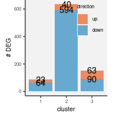
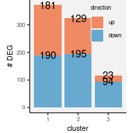

```r
sort.col <- function(.mat, .cts, .indvs){

    .fun <- function(ct) paste0(.indvs, "_", ct)

    .samples <-
        lapply(.cts, .fun) %>%
        do.call(what=c) %>%
        sort()

    .idx <- match(.samples, colnames(.mat))
    .idx <- .idx[!is.na(.idx)]
    .mat[, .idx, drop = FALSE]
}

combine.statistics <- function(.result){

    ret <- lapply(names(.result), function(v) {
        .mat <- .result[[v]]
        if(!is.matrix(.mat)) return(NULL)
        as.data.table(reshape2::melt(.mat, value.name = v))
    })

    out <- ret[[1]]
    for(j in 2:length(ret)){
        if(is.null(out)) {
            out <- ret[[j]]
        } else if(!is.null(ret[[j]])) {
            out <- merge(out, ret[[j]])
        }
    }
    return(out)
}

summarize.deg <- function(.dt, tot.cutoff = 3, disease.name = "MS", control.name = "HA") {

    ## adjust potential bias
    .dt[`tot` >= tot.cutoff, b := mean(cfa), by = .(gene, membership)]
    .dt[, cfa := cfa - b]

    ## .sd <- .dt[`tot` >= tot.cutoff,
    ##            .(min.sd = sd(cfa) / sqrt(.N)),
    ##            by = .(gene, membership)]
    ## left_join(.sd) %>%

    .dt <- .dt %>%
        filter(`tot` >= tot.cutoff) %>%
        mutate(w = 1/cfa.sd^2) %>%
        as.data.table

    ## average disease effect on the disease subjects
    ADD.dt <-
        .dt[disease == disease.name & `tot` >= tot.cutoff,
               .(ADD = sum(cfa * w) / sum(w),
                 ADD.se = sqrt(1/sum(w))),
               by = .(gene, membership)]

    ## average disease effect on the control subjects
    ADC.dt <-
        .dt[disease == control.name & `tot` >= tot.cutoff,
               .(ADC = -sum(cfa * w)/ sum(w),
                 ADC.se = sqrt(1/sum(w))),
               by = .(gene, membership)]

    ## average disease effect
    ADE.dt <-
        .dt[`tot` >= tot.cutoff] %>%
        mutate(cfa.s = if_else(disease == disease.name, 1, -1) * cfa) %>%
        mutate(tot.s = if_else(disease == disease.name, 1, -1) * tot) %>%
        as.data.table %>%
        (function(xx) {
            xx[,
               .(ADE = sum(cfa.s * w) / sum(w),
                 ADE.se = sqrt(1/sum(w)),
                 tot = sum(tot)),
               by = .(gene, membership)
               ]
        }) %>%
        mutate(z = ADE/ADE.se) %>%
        mutate(pv = 2 * pnorm(abs(z), lower.tail=FALSE)) %>%
        mutate(fwer = p.adjust(pv, "holm")) %>%
        mutate(fdr = p.adjust(pv, "fdr")) %>%
        as.data.table

    left_join(ADE.dt, ADD.dt) %>% left_join(ADC.dt) %>% as.data.table
}
```


```r
.hash.hdr <- "result/step1/hash"
.hash.data <- fileset.list(.hash.hdr)
.hash.mtx <- read.dense(.hash.data$mtx)
.hash.argmax <- apply(.hash.mtx, 2, which.max)

.hash.cells <- .hash.data$col %>%
    fread(header=F, col.names="cell") %>%
    (function(x) {
        x[,c("barcode","batch"):=tstrsplit(`cell`,split="_")];
        x[, barcode := gsub(`barcode`, pattern="-[0-9]$", replacement="")];
        x[, hash := .hash.argmax]
        x[, batch := as.integer(`batch`)]
        return(x);
    })

.sample.info <-
    readxl::read_xlsx("data/Hashing list MS Treg project.xlsx", 1) %>%
    rename(Sample = `Cell type`) %>%
    mutate(hash = gsub("#","",`hash`)) %>%
    mutate(hash = as.integer(`hash`)) %>%
    mutate(disease = substr(`subject`, 1, 2))

.hash.info <-
    left_join(.hash.cells, .sample.info)
```


# 1. mTconv subtype DEG analysis


```r
annot.dt <-
    fread("Tab/step4_mtconv_cluster.txt.gz") %>%
    left_join(.hash.info) %>%
    na.omit()
```


```r
.data <- fileset.list("result/step1/matrix_final")
.mkdir("result/step5/deg/")
.deg.data <- fileset.list("result/step5/deg/mtconv_hc_ms")

if.needed(.deg.data, {
    .deg.data <-
        rcpp_mmutil_copy_selected_columns(.data$mtx,
                                          .data$row,
                                          .data$col,
                                          unique(annot.dt$tag),
                                          "result/step5/deg/mtconv_hc_ms")
})

.file <- "result/step5/deg/mtconv_hc_ms.rds"

if.needed(.file, {

    .membership <-
        annot.dt[, .(tag, membership)] %>%
        as.data.frame()

    .cell2indv <- annot.dt[, .(tag, subject)] %>%
        unique %>%
        as.data.frame()

    .indv2exp <- .cell2indv %>%
        select(subject) %>%
        mutate(disease = substr(`subject`, 1, 2)) %>%
        as.data.frame()

    .deg.stat <-
        make.cocoa(.deg.data, .membership, .cell2indv, .indv2exp,
                   .rank = 15, .em.iter = 20, .em.tol = 1e-8, .take.ln = TRUE,
                   knn = 50, impute.by.knn = TRUE, num.threads = 8)

   saveRDS(.deg.stat, .file)
})

.deg.stat <- readRDS(.file)

.mems <- unique(annot.dt$membership)
.indvs <- unique(annot.dt$subject)

.hc.ms.dt <-
    list(tot = sort.col(.deg.stat$sum, .mems, .indvs),
         cfa = sort.col(.deg.stat$resid.ln.mu, .mems, .indvs),
         cfa.sd = sort.col(.deg.stat$resid.ln.mu.sd, .mems, .indvs)) %>%
    combine.statistics()

.hc.ms.dt[, c("subject","membership") := tstrsplit(`Var2`,split="_")]
.hc.ms.dt[, disease := substr(`subject`,1,2)]
.hc.ms.dt[, gene := `Var1`]
.hc.ms.dt[, `Var1` := NULL]
.hc.ms.dt[, `Var2` := NULL]

hc.ms.deg <- summarize.deg(.hc.ms.dt)
hc.ms.deg[, c("ensembl_gene_id", "hgnc_symbol") := tstrsplit(`gene`, split="_")]
```

[**DOWNLOAD:** mTconv DEG MS vs HC](Tab/DEG_mtconv_MS_vs_HC.txt.gz)

### Found 198 unique genes strongly perturbed by MS with FWER 5%

* Up-regulated: 100

* Down-regulated:  109

* Total pairs of genes and clusters: 45,668


```r
count.deg <- function(.dt, fwer.cutoff = .05) {
    .dt[fwer < fwer.cutoff &
        sign(ADD) == sign(ADE) &
        sign(ADC) == sign(ADE),
        .(n = .N),
        by = .(membership,
               direction = if_else(z > 0, "up", "down"))
        ] %>%
        mutate(direction = factor(direction, c("up", "down"))) %>%
        group_by(membership) %>%
        arrange(desc(direction)) %>%
        mutate(nc = cumsum(n)) %>%
        ungroup
}
```

<!-- -->

[PDF](Fig/STEP5//Fig_mTconv_DEG_count.pdf)

#### Examples


```r
show.each.gene <- function(g, .data, .stat, .cutoff = 0) {

    .dt.g <- na.omit(.data[gene == g]) %>% filter(tot > .cutoff)
    .stat.dt <- na.omit(.stat[gene == g]) %>% rename(total = tot)

    .dir <- .stat.dt[which.max(abs(.stat.dt$ADE)), .(ADE)] %>%
        unlist

    if(.dir > 0) {

        .dt <- .dt.g %>%
            left_join(.stat.dt, by = c("membership", "gene")) %>%
            group_by(disease, membership) %>%
            arrange(cfa) %>%
            mutate(j = 1:n()) %>%
            ungroup() %>%
            mutate(x = disease %&% "_" %&% j)

    } else {

        .dt <- .dt.g %>%
            left_join(.stat.dt, by = c("membership", "gene")) %>%
            group_by(disease, membership) %>%
            arrange(desc(cfa)) %>%
            mutate(j = 1:n()) %>%
            ungroup() %>%
            mutate(x = disease %&% "_" %&% j)

    }

    .dt <- .dt %>%
        mutate(.pv = if_else(is.na(pv), "1", num.sci(pv))) %>%
        mutate(.facet = membership %&% "\n(" %&% .pv %&% ")") %>%
        mutate(ADD.z = ADD/ADD.se, ADC.z = ADC/ADC.se) %>%
        as.data.table

    .stat.dt <- .dt[, .(membership,
                        ADE, ADE.se,
                        ADD, ADD.se,
                        ADC, ADC.se,
                        pv, .facet)] %>%
        unique

    .aes <- aes(x = x,
                y = cfa,
                ymin = cfa - 2 * cfa.sd,
                ymax = cfa + 2 * cfa.sd,
                fill = disease)

    .scale.y <- scale_y_continuous(labels = function(x) num.round(exp(x)))

    p1 <-
        .gg.plot(.dt, .aes) +
        theme(legend.position = "top") +
        facet_wrap(~.facet, nrow = 1, scales="free") +
        .scale.y +
        theme(axis.ticks.x = element_blank()) +
        theme(axis.text.x = element_blank()) +
        theme(axis.title.x = element_blank()) +
        geom_hline(yintercept = 0, linewidth = 1, colour = "gray") +
        geom_hline(data = .stat.dt, aes(yintercept = ADE), linewidth = 1, colour = "#F8766D") +
        geom_linerange(linewidth = .2) +
        geom_point(aes(size = tot), pch = 21, stroke = .2) +
        scale_size_continuous("total(k)", range=c(0.1, 2.5), labels = function(x) num.int(x/1e3)) +
        scale_fill_manual(values = c("gray90","#F8766D")) +
        xlab("") + ylab("fold change") + ggtitle(g)

    .temp.1 <- .stat.dt %>%
        dplyr::select(membership, pv, ADE, ADD, ADC) %>%
        mutate(ADC = - ADC) %>%                  # flip the effect
        melt(id.vars=c("membership", "pv"), value.name = "mu")

    .temp.2 <- .stat.dt %>%
        dplyr::select(membership, ADE.se, ADD.se, ADC.se) %>%
        melt(id.vars="membership", value.name = "se") %>%
        mutate(variable = str_remove(variable, ".se"))

    .temp <- left_join(.temp.1, .temp.2, by = c("membership", "variable"))

    .aes <- aes(x = variable,
                y = mu,
                ymin = mu - 3 * se,
                ymax = mu + 3 * se)

    p2 <-
        .gg.plot(.temp, .aes) +
        theme(axis.text.x = element_text(angle=90, hjust = 1, vjust= .5)) +
        facet_wrap(~membership, nrow = 1, scales="free") +
        .scale.y + ylab("fold change") + xlab("") +
        geom_hline(yintercept = 0, lty = 2, linewidth = .5, colour = "black") +
        geom_linerange(linewidth = .2) +
        geom_point(aes(fill = variable, stroke = .2, size = -log10(pv)), pch = 21) +
        scale_fill_brewer(palette = "Greens", guide="none") +
        scale_size_continuous("p-value", range=c(.5, 2.5), breaks=seq(0, 10, 2), labels = function(x) 10^(-x))

    plt <- (p1 / p2) + patchwork::plot_layout(heights = c(4,2))
    return(plt)
}
```


```r
read.bulk <- function(.file) {
    fread(.file) %>%
        rename(hgnc_symbol = gene_name) %>%
        rename(bulk.t = t, bulk.pv = P.Value, bulk.qv = adj.P.Val) %>%
        dplyr::select(hgnc_symbol, starts_with("bulk"))
}

.file <- "data/DEG/20180513/deg.ms.hc.treg.mem.exvivo.sex_covar.ruv.txt"
bulk.mTreg.dt <- read.bulk(.file)

.file <- "data/DEG/20180513/deg.ms.hc.teff.mem.exvivo.sex_covar.ruv.txt"
bulk.mTconv.dt <- read.bulk(.file)
```


```r
.bulk.genes <-
    bulk.mTconv.dt[bulk.qv < .2, .(hgnc_symbol)] %>% 
    unique() %>%
    unlist()

hc.ms.deg[, c("ensembl_gene_id", "hgnc_symbol") := tstrsplit(`gene`, split="_")]

.genes.show <-
    hc.ms.deg[fwer < 0.05 &
              hgnc_symbol %in% .bulk.genes &
              sign(ADD) == sign(ADE) &
              sign(ADC) == sign(ADE)] %>%
    select(gene) %>%
    unique %>%
    unlist %>%
    as.character
```

[CD226_CD226](Fig/STEP5//Fig_mTconv_DEG_example_CD226_CD226.pdf) [CD27_CD27](Fig/STEP5//Fig_mTconv_DEG_example_CD27_CD27.pdf) [ENSG00000009790_TRAF3IP3](Fig/STEP5//Fig_mTconv_DEG_example_ENSG00000009790_TRAF3IP3.pdf) [ENSG00000029639_TFB1M](Fig/STEP5//Fig_mTconv_DEG_example_ENSG00000029639_TFB1M.pdf) [ENSG00000034677_RNF19A](Fig/STEP5//Fig_mTconv_DEG_example_ENSG00000034677_RNF19A.pdf) [ENSG00000100100_PIK3IP1](Fig/STEP5//Fig_mTconv_DEG_example_ENSG00000100100_PIK3IP1.pdf) [ENSG00000108298_RPL19](Fig/STEP5//Fig_mTconv_DEG_example_ENSG00000108298_RPL19.pdf) [ENSG00000109321_AREG](Fig/STEP5//Fig_mTconv_DEG_example_ENSG00000109321_AREG.pdf) [ENSG00000114942_EEF1B2](Fig/STEP5//Fig_mTconv_DEG_example_ENSG00000114942_EEF1B2.pdf) [ENSG00000116157_GPX7](Fig/STEP5//Fig_mTconv_DEG_example_ENSG00000116157_GPX7.pdf) [ENSG00000117318_ID3](Fig/STEP5//Fig_mTconv_DEG_example_ENSG00000117318_ID3.pdf) [ENSG00000122026_RPL21](Fig/STEP5//Fig_mTconv_DEG_example_ENSG00000122026_RPL21.pdf) [ENSG00000132475_H3F3B](Fig/STEP5//Fig_mTconv_DEG_example_ENSG00000132475_H3F3B.pdf) [ENSG00000133574_GIMAP4](Fig/STEP5//Fig_mTconv_DEG_example_ENSG00000133574_GIMAP4.pdf) [ENSG00000133872_SARAF](Fig/STEP5//Fig_mTconv_DEG_example_ENSG00000133872_SARAF.pdf) [ENSG00000135046_ANXA1](Fig/STEP5//Fig_mTconv_DEG_example_ENSG00000135046_ANXA1.pdf) [ENSG00000136490_LIMD2](Fig/STEP5//Fig_mTconv_DEG_example_ENSG00000136490_LIMD2.pdf) [ENSG00000140988_RPS2](Fig/STEP5//Fig_mTconv_DEG_example_ENSG00000140988_RPS2.pdf) [ENSG00000149273_RPS3](Fig/STEP5//Fig_mTconv_DEG_example_ENSG00000149273_RPS3.pdf) [ENSG00000152518_ZFP36L2](Fig/STEP5//Fig_mTconv_DEG_example_ENSG00000152518_ZFP36L2.pdf) [ENSG00000156508_EEF1A1](Fig/STEP5//Fig_mTconv_DEG_example_ENSG00000156508_EEF1A1.pdf) [ENSG00000161016_RPL8](Fig/STEP5//Fig_mTconv_DEG_example_ENSG00000161016_RPL8.pdf) [ENSG00000162777_DENND2D](Fig/STEP5//Fig_mTconv_DEG_example_ENSG00000162777_DENND2D.pdf) [ENSG00000163191_S100A11](Fig/STEP5//Fig_mTconv_DEG_example_ENSG00000163191_S100A11.pdf) [ENSG00000163519_TRAT1](Fig/STEP5//Fig_mTconv_DEG_example_ENSG00000163519_TRAT1.pdf) [ENSG00000164483_SAMD3](Fig/STEP5//Fig_mTconv_DEG_example_ENSG00000164483_SAMD3.pdf) [ENSG00000167996_FTH1](Fig/STEP5//Fig_mTconv_DEG_example_ENSG00000167996_FTH1.pdf) [ENSG00000168209_DDIT4](Fig/STEP5//Fig_mTconv_DEG_example_ENSG00000168209_DDIT4.pdf) [ENSG00000173812_EIF1](Fig/STEP5//Fig_mTconv_DEG_example_ENSG00000173812_EIF1.pdf) [ENSG00000179144_GIMAP7](Fig/STEP5//Fig_mTconv_DEG_example_ENSG00000179144_GIMAP7.pdf) [ENSG00000197958_RPL12](Fig/STEP5//Fig_mTconv_DEG_example_ENSG00000197958_RPL12.pdf) [ENSG00000198763_MT-ND2](Fig/STEP5//Fig_mTconv_DEG_example_ENSG00000198763_MT-ND2.pdf) [ENSG00000198938_MT-CO3](Fig/STEP5//Fig_mTconv_DEG_example_ENSG00000198938_MT-CO3.pdf) [ENSG00000211750_TRBV24-1](Fig/STEP5//Fig_mTconv_DEG_example_ENSG00000211750_TRBV24-1.pdf) [ENSG00000211786_TRAV8-2](Fig/STEP5//Fig_mTconv_DEG_example_ENSG00000211786_TRAV8-2.pdf) [ENSG00000211787_TRAV8-3](Fig/STEP5//Fig_mTconv_DEG_example_ENSG00000211787_TRAV8-3.pdf) [ENSG00000211797_TRAV17](Fig/STEP5//Fig_mTconv_DEG_example_ENSG00000211797_TRAV17.pdf) [ENSG00000211801_TRAV21](Fig/STEP5//Fig_mTconv_DEG_example_ENSG00000211801_TRAV21.pdf) [ENSG00000211810_TRAV29DV5](Fig/STEP5//Fig_mTconv_DEG_example_ENSG00000211810_TRAV29DV5.pdf) [ENSG00000241657_TRBV11-2](Fig/STEP5//Fig_mTconv_DEG_example_ENSG00000241657_TRBV11-2.pdf) [ENSG00000274752_TRBV12-3](Fig/STEP5//Fig_mTconv_DEG_example_ENSG00000274752_TRBV12-3.pdf) [ENSG00000278030_TRBV7-9](Fig/STEP5//Fig_mTconv_DEG_example_ENSG00000278030_TRBV7-9.pdf) [TIGIT_TIGIT](Fig/STEP5//Fig_mTconv_DEG_example_TIGIT_TIGIT.pdf) 

# 2. mTreg subtype DEG analysis


```r
annot.dt <-
    fread("Tab/step4_mtreg_cluster.txt.gz") %>%
    left_join(.hash.info) %>%
    na.omit()
```


```r
.data <- fileset.list("result/step1/matrix_final")
.mkdir("result/step5/deg/")
.deg.data <- fileset.list("result/step5/deg/mtreg_hc_ms")

if.needed(.deg.data, {
    .deg.data <-
        rcpp_mmutil_copy_selected_columns(.data$mtx,
                                          .data$row,
                                          .data$col,
                                          unique(annot.dt$tag),
                                          "result/step5/deg/mtreg_hc_ms")
})

.file <- "result/step5/deg/mtreg_hc_ms.rds"

if.needed(.file, {

    .membership <-
        annot.dt[, .(tag, membership)] %>%
        as.data.frame()

    .cell2indv <- annot.dt[, .(tag, subject)] %>%
        unique %>%
        as.data.frame()

    .indv2exp <- .cell2indv %>%
        select(subject) %>%
        mutate(disease = substr(`subject`, 1, 2)) %>%
        as.data.frame()

    .deg.stat <-
        make.cocoa(.deg.data, .membership, .cell2indv, .indv2exp,
                   .rank = 15, .em.iter = 20, .em.tol = 1e-8, .take.ln = TRUE,
                   knn = 50, impute.by.knn = TRUE, num.threads = 8)

   saveRDS(.deg.stat, .file)
})

.deg.stat <- readRDS(.file)

.mems <- unique(annot.dt$membership)
.indvs <- unique(annot.dt$subject)

.hc.ms.dt <-
    list(tot = sort.col(.deg.stat$sum, .mems, .indvs),
         cfa = sort.col(.deg.stat$resid.ln.mu, .mems, .indvs),
         cfa.sd = sort.col(.deg.stat$resid.ln.mu.sd, .mems, .indvs)) %>%
    combine.statistics()

.hc.ms.dt[, c("subject","membership") := tstrsplit(`Var2`,split="_")]
.hc.ms.dt[, disease := substr(`subject`,1,2)]
.hc.ms.dt[, gene := `Var1`]
.hc.ms.dt[, `Var1` := NULL]
.hc.ms.dt[, `Var2` := NULL]

hc.ms.deg <- summarize.deg(.hc.ms.dt)
hc.ms.deg[, c("ensembl_gene_id", "hgnc_symbol") := tstrsplit(`gene`, split="_")]
```

[**DOWNLOAD:** mtreg DEG MS vs HC](Tab/DEG_mtreg_MS_vs_HC.txt.gz)

### Found 657 unique genes strongly perturbed by MS with FWER 5%

* Up-regulated: 507

* Down-regulated:  285

* Total pairs of genes and clusters: 68,676

<!-- -->

[PDF](Fig/STEP5//Fig_mtreg_DEG_count.pdf)


```r
.bulk.genes <-
    bulk.mTreg.dt[bulk.qv < .2, .(hgnc_symbol)] %>% 
    unique() %>%
    unlist()

hc.ms.deg[, c("ensembl_gene_id", "hgnc_symbol") := tstrsplit(`gene`, split="_")]

.genes.show <-
    hc.ms.deg[fwer < 0.05 &
              hgnc_symbol %in% .bulk.genes &
              sign(ADD) == sign(ADE) &
              sign(ADC) == sign(ADE)] %>%
    select(gene) %>%
    unique %>%
    unlist %>%
    as.character
```

[ENSG00000030582_GRN](Fig/STEP5//Fig_mTreg_DEG_example_ENSG00000030582_GRN.pdf) [ENSG00000051108_HERPUD1](Fig/STEP5//Fig_mTreg_DEG_example_ENSG00000051108_HERPUD1.pdf) [ENSG00000057657_PRDM1](Fig/STEP5//Fig_mTreg_DEG_example_ENSG00000057657_PRDM1.pdf) [ENSG00000071073_MGAT4A](Fig/STEP5//Fig_mTreg_DEG_example_ENSG00000071073_MGAT4A.pdf) [ENSG00000092621_PHGDH](Fig/STEP5//Fig_mTreg_DEG_example_ENSG00000092621_PHGDH.pdf) [ENSG00000104660_LEPROTL1](Fig/STEP5//Fig_mTreg_DEG_example_ENSG00000104660_LEPROTL1.pdf) [ENSG00000108622_ICAM2](Fig/STEP5//Fig_mTreg_DEG_example_ENSG00000108622_ICAM2.pdf) [ENSG00000109971_HSPA8](Fig/STEP5//Fig_mTreg_DEG_example_ENSG00000109971_HSPA8.pdf) [ENSG00000110852_CLEC2B](Fig/STEP5//Fig_mTreg_DEG_example_ENSG00000110852_CLEC2B.pdf) [ENSG00000117318_ID3](Fig/STEP5//Fig_mTreg_DEG_example_ENSG00000117318_ID3.pdf) [ENSG00000135486_HNRNPA1](Fig/STEP5//Fig_mTreg_DEG_example_ENSG00000135486_HNRNPA1.pdf) [ENSG00000142227_EMP3](Fig/STEP5//Fig_mTreg_DEG_example_ENSG00000142227_EMP3.pdf) [ENSG00000163599_CTLA4](Fig/STEP5//Fig_mTreg_DEG_example_ENSG00000163599_CTLA4.pdf) [ENSG00000169100_SLC25A6](Fig/STEP5//Fig_mTreg_DEG_example_ENSG00000169100_SLC25A6.pdf) [ENSG00000169756_LIMS1](Fig/STEP5//Fig_mTreg_DEG_example_ENSG00000169756_LIMS1.pdf) [ENSG00000182117_NOP10](Fig/STEP5//Fig_mTreg_DEG_example_ENSG00000182117_NOP10.pdf) [ENSG00000187257_RSBN1L](Fig/STEP5//Fig_mTreg_DEG_example_ENSG00000187257_RSBN1L.pdf) [ENSG00000203780_FANK1](Fig/STEP5//Fig_mTreg_DEG_example_ENSG00000203780_FANK1.pdf) [ENSG00000211778_TRAV4](Fig/STEP5//Fig_mTreg_DEG_example_ENSG00000211778_TRAV4.pdf) [ENSG00000211815_TRAV36DV7](Fig/STEP5//Fig_mTreg_DEG_example_ENSG00000211815_TRAV36DV7.pdf) [ENSG00000234745_HLA-B](Fig/STEP5//Fig_mTreg_DEG_example_ENSG00000234745_HLA-B.pdf) [ENSG00000257599_OVCH1-AS1](Fig/STEP5//Fig_mTreg_DEG_example_ENSG00000257599_OVCH1-AS1.pdf) 
