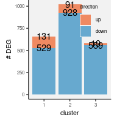

```r
.hash.hdr <- "result/step1/hash"
.hash.data <- fileset.list(.hash.hdr)
.hash.info <- read.hash(.hash.data)
```


# 1. mTconv subtype DEG analysis


```r
annot.dt <-
    fread("Tab/step4_mtconv_leiden.txt.gz") %>%
    left_join(.hash.info) %>%
    na.omit()
```


```r
.data <- fileset.list("result/step1/final_matrix")
.mkdir("result/step5/deg/")
.deg.data <- fileset.list("result/step5/deg/mtconv_hc_ms")

if.needed(.deg.data, {
    .deg.data <-
        rcpp_mmutil_copy_selected_columns(.data$mtx,
                                          .data$row,
                                          .data$col,
                                          unique(annot.dt$tag),
                                          "result/step5/deg/mtconv_hc_ms")
})

.file <- "result/step5/deg/mtconv_hc_ms.rds"

if.needed(.file, {

    .membership <-
        annot.dt[, .(tag, membership)] %>%
        as.data.frame()

    .cell2indv <- annot.dt[, .(tag, subject)] %>%
        unique %>%
        as.data.frame()

    .indv2exp <- .cell2indv %>%
        select(subject) %>%
        mutate(disease = substr(`subject`, 1, 2)) %>%
        as.data.frame()

    .deg.stat <-
        make.cocoa(.deg.data, .membership, .cell2indv, .indv2exp,
                   knn = 50, .rank = 50, .take.ln = TRUE,
                   impute.by.knn = TRUE, num.threads = 16)

   saveRDS(.deg.stat, .file)
})
.deg.stat <- readRDS(.file)

.cts <- unique(annot.dt$membership)
.indvs <- unique(annot.dt$subject)

.hc.ms.dt <-
    list(tot = sort.col(.deg.stat$sum, .cts, .indvs),
         cfa = sort.col(.deg.stat$resid.ln.mu, .cts, .indvs),
         cfa.sd = sort.col(.deg.stat$resid.ln.mu.sd, .cts, .indvs)) %>%
    combine.statistics() %>%
    na.omit() %>%
    as.data.table() %>% 
    (function(x) {
        x[, c("sample", "membership") := tstrsplit(as.character(Var2), split="_")];
        x[, disease := substr(`sample`, 1, 2)];
        x[, gene := as.character(Var1)];
        x
    }) %>% 
    dplyr::select(-Var1, -Var2) %>% 
    as.data.table()

hc.ms.deg <-
    summarize.deg(.hc.ms.dt, tot.cutoff = 10) %>%
    parse.gene()
```

[**DOWNLOAD:** mTconv DEG MS vs HC](Tab/DEG_mtconv_MS_vs_HC.txt.gz)

### Found 136 unique genes strongly perturbed by MS with FDR 5%

* Up-regulated: 88

* Down-regulated:  52

* Total pairs of genes and clusters: 35,651


```r
count.deg <- function(.dt, fdr.cutoff = .05) {
    .dt[fdr < fdr.cutoff &
        sign(ADD) == sign(ADE) &
        sign(ADC) == sign(ADE),
        .(n = .N),
        by = .(membership,
               direction = if_else(z > 0, "up", "down"))
        ] %>%
        mutate(direction = factor(direction, c("up", "down"))) %>%
        group_by(membership) %>%
        arrange(desc(direction)) %>%
        mutate(nc = cumsum(n)) %>%
        ungroup
}
```

<!-- -->

[PDF](Fig/STEP5//Fig_mTconv_DEG_count.pdf)

#### Examples


```r
read.bulk <- function(.file) {
    fread(.file) %>%
        rename(hgnc_symbol = gene_name) %>%
        rename(bulk.t = t, bulk.pv = P.Value, bulk.qv = adj.P.Val) %>%
        dplyr::select(hgnc_symbol, starts_with("bulk"))
}

.file <- "data/DEG/20180513/deg.ms.hc.treg.mem.exvivo.sex_covar.ruv.txt"
bulk.mTreg.dt <- read.bulk(.file)

.file <- "data/DEG/20180513/deg.ms.hc.teff.mem.exvivo.sex_covar.ruv.txt"
bulk.mTconv.dt <- read.bulk(.file)
```


```r
.bulk.genes <-
    bulk.mTconv.dt[bulk.qv < .2, .(hgnc_symbol)] %>% 
    unique() %>%
    unlist()

hc.ms.deg[, c("ensembl_gene_id", "hgnc_symbol") := tstrsplit(`gene`, split="_")]

.genes.show <-
    hc.ms.deg[fdr < 0.05 &
              hgnc_symbol %in% .bulk.genes &
              sign(ADD) == sign(ADE) &
              sign(ADC) == sign(ADE)] %>%
    select(gene) %>%
    unique %>%
    unlist %>%
    as.character
```


<table class=" lightable-paper lightable-striped" style="font-family: Helvetica; width: auto !important; margin-left: auto; margin-right: auto;">
 <thead>
  <tr>
   <th style="text-align:left;"> membership </th>
   <th style="text-align:left;"> hgnc_symbol </th>
   <th style="text-align:left;"> z </th>
   <th style="text-align:left;"> pv </th>
   <th style="text-align:left;"> fdr </th>
   <th style="text-align:left;"> .link </th>
  </tr>
 </thead>
<tbody>
  <tr>
   <td style="text-align:left;font-weight: bold;vertical-align: top !important;" rowspan="10"> 1 </td>
   <td style="text-align:left;"> OSM </td>
   <td style="text-align:left;"> 4.41 </td>
   <td style="text-align:left;"> 1.05e-05 </td>
   <td style="text-align:left;"> 2.34e-03 </td>
   <td style="text-align:left;"> [PDF](Fig/STEP5//example/Fig_mTconv_DEG_example_ENSG00000099985_OSM.pdf) </td>
  </tr>
  <tr>
   
   <td style="text-align:left;"> DDIT4 </td>
   <td style="text-align:left;"> 4.83 </td>
   <td style="text-align:left;"> 1.39e-06 </td>
   <td style="text-align:left;"> 3.57e-04 </td>
   <td style="text-align:left;"> [PDF](Fig/STEP5//example/Fig_mTconv_DEG_example_ENSG00000168209_DDIT4.pdf) </td>
  </tr>
  <tr>
   
   <td style="text-align:left;"> CD27 </td>
   <td style="text-align:left;"> -5.17 </td>
   <td style="text-align:left;"> 2.30e-07 </td>
   <td style="text-align:left;"> 6.52e-05 </td>
   <td style="text-align:left;"> [PDF](Fig/STEP5//example/Fig_mTconv_DEG_example_CD27_CD27.pdf) </td>
  </tr>
  <tr>
   
   <td style="text-align:left;"> TRAV23DV6 </td>
   <td style="text-align:left;"> -4.69 </td>
   <td style="text-align:left;"> 2.73e-06 </td>
   <td style="text-align:left;"> 6.66e-04 </td>
   <td style="text-align:left;"> [PDF](Fig/STEP5//example/Fig_mTconv_DEG_example_ENSG00000211803_TRAV23DV6.pdf) </td>
  </tr>
  <tr>
   
   <td style="text-align:left;"> GIMAP6 </td>
   <td style="text-align:left;"> -3.62 </td>
   <td style="text-align:left;"> 2.99e-04 </td>
   <td style="text-align:left;"> 4.52e-02 </td>
   <td style="text-align:left;"> [PDF](Fig/STEP5//example/Fig_mTconv_DEG_example_ENSG00000133561_GIMAP6.pdf) </td>
  </tr>
  <tr>
   
   <td style="text-align:left;"> PASK </td>
   <td style="text-align:left;"> 4.14 </td>
   <td style="text-align:left;"> 3.44e-05 </td>
   <td style="text-align:left;"> 6.78e-03 </td>
   <td style="text-align:left;"> [PDF](Fig/STEP5//example/Fig_mTconv_DEG_example_ENSG00000115687_PASK.pdf) </td>
  </tr>
  <tr>
   
   <td style="text-align:left;"> TRBV7-9 </td>
   <td style="text-align:left;"> -4.13 </td>
   <td style="text-align:left;"> 3.58e-05 </td>
   <td style="text-align:left;"> 7.02e-03 </td>
   <td style="text-align:left;"> [PDF](Fig/STEP5//example/Fig_mTconv_DEG_example_ENSG00000278030_TRBV7-9.pdf) </td>
  </tr>
  <tr>
   
   <td style="text-align:left;"> KLRG1 </td>
   <td style="text-align:left;"> -4.55 </td>
   <td style="text-align:left;"> 5.39e-06 </td>
   <td style="text-align:left;"> 1.28e-03 </td>
   <td style="text-align:left;"> [PDF](Fig/STEP5//example/Fig_mTconv_DEG_example_ENSG00000139187_KLRG1.pdf) </td>
  </tr>
  <tr>
   
   <td style="text-align:left;"> FTH1 </td>
   <td style="text-align:left;"> 9.1 </td>
   <td style="text-align:left;"> 8.91e-20 </td>
   <td style="text-align:left;"> 5.78e-17 </td>
   <td style="text-align:left;"> [PDF](Fig/STEP5//example/Fig_mTconv_DEG_example_ENSG00000167996_FTH1.pdf) </td>
  </tr>
  <tr>
   
   <td style="text-align:left;"> CD226 </td>
   <td style="text-align:left;"> 27.81 </td>
   <td style="text-align:left;"> 3.69e-170 </td>
   <td style="text-align:left;"> 1.32e-166 </td>
   <td style="text-align:left;"> [PDF](Fig/STEP5//example/Fig_mTconv_DEG_example_CD226_CD226.pdf) </td>
  </tr>
  <tr>
   <td style="text-align:left;font-weight: bold;vertical-align: top !important;" rowspan="20"> 2 </td>
   <td style="text-align:left;"> ACTG1 </td>
   <td style="text-align:left;"> 3.87 </td>
   <td style="text-align:left;"> 1.08e-04 </td>
   <td style="text-align:left;"> 1.95e-02 </td>
   <td style="text-align:left;"> [PDF](Fig/STEP5//example/Fig_mTconv_DEG_example_ENSG00000184009_ACTG1.pdf) </td>
  </tr>
  <tr>
   
   <td style="text-align:left;"> PRDM1 </td>
   <td style="text-align:left;"> 3.76 </td>
   <td style="text-align:left;"> 1.67e-04 </td>
   <td style="text-align:left;"> 2.80e-02 </td>
   <td style="text-align:left;"> [PDF](Fig/STEP5//example/Fig_mTconv_DEG_example_ENSG00000057657_PRDM1.pdf) </td>
  </tr>
  <tr>
   
   <td style="text-align:left;"> DENND2D </td>
   <td style="text-align:left;"> -3.76 </td>
   <td style="text-align:left;"> 1.70e-04 </td>
   <td style="text-align:left;"> 2.84e-02 </td>
   <td style="text-align:left;"> [PDF](Fig/STEP5//example/Fig_mTconv_DEG_example_ENSG00000162777_DENND2D.pdf) </td>
  </tr>
  <tr>
   
   <td style="text-align:left;"> PTPN2 </td>
   <td style="text-align:left;"> 3.76 </td>
   <td style="text-align:left;"> 1.71e-04 </td>
   <td style="text-align:left;"> 2.84e-02 </td>
   <td style="text-align:left;"> [PDF](Fig/STEP5//example/Fig_mTconv_DEG_example_ENSG00000175354_PTPN2.pdf) </td>
  </tr>
  <tr>
   
   <td style="text-align:left;"> ARPC5 </td>
   <td style="text-align:left;"> -3.75 </td>
   <td style="text-align:left;"> 1.77e-04 </td>
   <td style="text-align:left;"> 2.89e-02 </td>
   <td style="text-align:left;"> [PDF](Fig/STEP5//example/Fig_mTconv_DEG_example_ENSG00000162704_ARPC5.pdf) </td>
  </tr>
  <tr>
   
   <td style="text-align:left;"> TRAV29DV5 </td>
   <td style="text-align:left;"> -5.63 </td>
   <td style="text-align:left;"> 1.79e-08 </td>
   <td style="text-align:left;"> 5.65e-06 </td>
   <td style="text-align:left;"> [PDF](Fig/STEP5//example/Fig_mTconv_DEG_example_ENSG00000211810_TRAV29DV5.pdf) </td>
  </tr>
  <tr>
   
   <td style="text-align:left;"> DDIT4 </td>
   <td style="text-align:left;"> 6 </td>
   <td style="text-align:left;"> 1.98e-09 </td>
   <td style="text-align:left;"> 7.13e-07 </td>
   <td style="text-align:left;"> [PDF](Fig/STEP5//example/Fig_mTconv_DEG_example_ENSG00000168209_DDIT4.pdf) </td>
  </tr>
  <tr>
   
   <td style="text-align:left;"> TRAV13-1 </td>
   <td style="text-align:left;"> -3.72 </td>
   <td style="text-align:left;"> 2.01e-04 </td>
   <td style="text-align:left;"> 3.20e-02 </td>
   <td style="text-align:left;"> [PDF](Fig/STEP5//example/Fig_mTconv_DEG_example_ENSG00000211788_TRAV13-1.pdf) </td>
  </tr>
  <tr>
   
   <td style="text-align:left;"> ANXA2 </td>
   <td style="text-align:left;"> 4.23 </td>
   <td style="text-align:left;"> 2.38e-05 </td>
   <td style="text-align:left;"> 4.93e-03 </td>
   <td style="text-align:left;"> [PDF](Fig/STEP5//example/Fig_mTconv_DEG_example_ENSG00000182718_ANXA2.pdf) </td>
  </tr>
  <tr>
   
   <td style="text-align:left;"> PLP2 </td>
   <td style="text-align:left;"> 4.69 </td>
   <td style="text-align:left;"> 2.71e-06 </td>
   <td style="text-align:left;"> 6.65e-04 </td>
   <td style="text-align:left;"> [PDF](Fig/STEP5//example/Fig_mTconv_DEG_example_ENSG00000102007_PLP2.pdf) </td>
  </tr>
  <tr>
   
   <td style="text-align:left;"> FTH1 </td>
   <td style="text-align:left;"> 7.89 </td>
   <td style="text-align:left;"> 2.92e-15 </td>
   <td style="text-align:left;"> 1.60e-12 </td>
   <td style="text-align:left;"> [PDF](Fig/STEP5//example/Fig_mTconv_DEG_example_ENSG00000167996_FTH1.pdf) </td>
  </tr>
  <tr>
   
   <td style="text-align:left;"> TRBV11-2 </td>
   <td style="text-align:left;"> -4.18 </td>
   <td style="text-align:left;"> 2.98e-05 </td>
   <td style="text-align:left;"> 6.10e-03 </td>
   <td style="text-align:left;"> [PDF](Fig/STEP5//example/Fig_mTconv_DEG_example_ENSG00000241657_TRBV11-2.pdf) </td>
  </tr>
  <tr>
   
   <td style="text-align:left;"> OSM </td>
   <td style="text-align:left;"> 4.67 </td>
   <td style="text-align:left;"> 3.07e-06 </td>
   <td style="text-align:left;"> 7.44e-04 </td>
   <td style="text-align:left;"> [PDF](Fig/STEP5//example/Fig_mTconv_DEG_example_ENSG00000099985_OSM.pdf) </td>
  </tr>
  <tr>
   
   <td style="text-align:left;"> SOCS1 </td>
   <td style="text-align:left;"> 4.15 </td>
   <td style="text-align:left;"> 3.29e-05 </td>
   <td style="text-align:left;"> 6.58e-03 </td>
   <td style="text-align:left;"> [PDF](Fig/STEP5//example/Fig_mTconv_DEG_example_ENSG00000185338_SOCS1.pdf) </td>
  </tr>
  <tr>
   
   <td style="text-align:left;"> CD226 </td>
   <td style="text-align:left;"> 17.58 </td>
   <td style="text-align:left;"> 3.60e-69 </td>
   <td style="text-align:left;"> 6.11e-66 </td>
   <td style="text-align:left;"> [PDF](Fig/STEP5//example/Fig_mTconv_DEG_example_CD226_CD226.pdf) </td>
  </tr>
  <tr>
   
   <td style="text-align:left;"> TRAV21 </td>
   <td style="text-align:left;"> -6.59 </td>
   <td style="text-align:left;"> 4.51e-11 </td>
   <td style="text-align:left;"> 1.89e-08 </td>
   <td style="text-align:left;"> [PDF](Fig/STEP5//example/Fig_mTconv_DEG_example_ENSG00000211801_TRAV21.pdf) </td>
  </tr>
  <tr>
   
   <td style="text-align:left;"> CLIC1 </td>
   <td style="text-align:left;"> 4.07 </td>
   <td style="text-align:left;"> 4.78e-05 </td>
   <td style="text-align:left;"> 9.07e-03 </td>
   <td style="text-align:left;"> [PDF](Fig/STEP5//example/Fig_mTconv_DEG_example_ENSG00000213719_CLIC1.pdf) </td>
  </tr>
  <tr>
   
   <td style="text-align:left;"> TRAV9-2 </td>
   <td style="text-align:left;"> 4.54 </td>
   <td style="text-align:left;"> 5.64e-06 </td>
   <td style="text-align:left;"> 1.33e-03 </td>
   <td style="text-align:left;"> [PDF](Fig/STEP5//example/Fig_mTconv_DEG_example_ENSG00000211793_TRAV9-2.pdf) </td>
  </tr>
  <tr>
   
   <td style="text-align:left;"> TRBV24-1 </td>
   <td style="text-align:left;"> 5.79 </td>
   <td style="text-align:left;"> 7.14e-09 </td>
   <td style="text-align:left;"> 2.40e-06 </td>
   <td style="text-align:left;"> [PDF](Fig/STEP5//example/Fig_mTconv_DEG_example_ENSG00000211750_TRBV24-1.pdf) </td>
  </tr>
  <tr>
   
   <td style="text-align:left;"> CD27 </td>
   <td style="text-align:left;"> -7.13 </td>
   <td style="text-align:left;"> 9.85e-13 </td>
   <td style="text-align:left;"> 4.75e-10 </td>
   <td style="text-align:left;"> [PDF](Fig/STEP5//example/Fig_mTconv_DEG_example_CD27_CD27.pdf) </td>
  </tr>
  <tr>
   <td style="text-align:left;font-weight: bold;vertical-align: top !important;" rowspan="5"> 3 </td>
   <td style="text-align:left;"> CITED2 </td>
   <td style="text-align:left;"> 4.39 </td>
   <td style="text-align:left;"> 1.14e-05 </td>
   <td style="text-align:left;"> 2.50e-03 </td>
   <td style="text-align:left;"> [PDF](Fig/STEP5//example/Fig_mTconv_DEG_example_ENSG00000164442_CITED2.pdf) </td>
  </tr>
  <tr>
   
   <td style="text-align:left;"> CD226 </td>
   <td style="text-align:left;"> 11.08 </td>
   <td style="text-align:left;"> 1.60e-28 </td>
   <td style="text-align:left;"> 1.36e-25 </td>
   <td style="text-align:left;"> [PDF](Fig/STEP5//example/Fig_mTconv_DEG_example_CD226_CD226.pdf) </td>
  </tr>
  <tr>
   
   <td style="text-align:left;"> ANXA1 </td>
   <td style="text-align:left;"> -4.78 </td>
   <td style="text-align:left;"> 1.79e-06 </td>
   <td style="text-align:left;"> 4.47e-04 </td>
   <td style="text-align:left;"> [PDF](Fig/STEP5//example/Fig_mTconv_DEG_example_ENSG00000135046_ANXA1.pdf) </td>
  </tr>
  <tr>
   
   <td style="text-align:left;"> TRAV8-4 </td>
   <td style="text-align:left;"> 3.64 </td>
   <td style="text-align:left;"> 2.74e-04 </td>
   <td style="text-align:left;"> 4.19e-02 </td>
   <td style="text-align:left;"> [PDF](Fig/STEP5//example/Fig_mTconv_DEG_example_ENSG00000211790_TRAV8-4.pdf) </td>
  </tr>
  <tr>
   
   <td style="text-align:left;"> ARPC5 </td>
   <td style="text-align:left;"> -3.95 </td>
   <td style="text-align:left;"> 7.82e-05 </td>
   <td style="text-align:left;"> 1.44e-02 </td>
   <td style="text-align:left;"> [PDF](Fig/STEP5//example/Fig_mTconv_DEG_example_ENSG00000162704_ARPC5.pdf) </td>
  </tr>
  <tr>
   <td style="text-align:left;font-weight: bold;vertical-align: top !important;" rowspan="12"> 5 </td>
   <td style="text-align:left;"> TRBV7-9 </td>
   <td style="text-align:left;"> -4.4 </td>
   <td style="text-align:left;"> 1.06e-05 </td>
   <td style="text-align:left;"> 2.36e-03 </td>
   <td style="text-align:left;"> [PDF](Fig/STEP5//example/Fig_mTconv_DEG_example_ENSG00000278030_TRBV7-9.pdf) </td>
  </tr>
  <tr>
   
   <td style="text-align:left;"> MRPS6 </td>
   <td style="text-align:left;"> -3.87 </td>
   <td style="text-align:left;"> 1.07e-04 </td>
   <td style="text-align:left;"> 1.95e-02 </td>
   <td style="text-align:left;"> [PDF](Fig/STEP5//example/Fig_mTconv_DEG_example_ENSG00000243927_MRPS6.pdf) </td>
  </tr>
  <tr>
   
   <td style="text-align:left;"> FTH1 </td>
   <td style="text-align:left;"> 5.66 </td>
   <td style="text-align:left;"> 1.52e-08 </td>
   <td style="text-align:left;"> 4.84e-06 </td>
   <td style="text-align:left;"> [PDF](Fig/STEP5//example/Fig_mTconv_DEG_example_ENSG00000167996_FTH1.pdf) </td>
  </tr>
  <tr>
   
   <td style="text-align:left;"> ICAM2 </td>
   <td style="text-align:left;"> -3.74 </td>
   <td style="text-align:left;"> 1.85e-04 </td>
   <td style="text-align:left;"> 2.98e-02 </td>
   <td style="text-align:left;"> [PDF](Fig/STEP5//example/Fig_mTconv_DEG_example_ENSG00000108622_ICAM2.pdf) </td>
  </tr>
  <tr>
   
   <td style="text-align:left;"> TIGIT </td>
   <td style="text-align:left;"> 5.16 </td>
   <td style="text-align:left;"> 2.46e-07 </td>
   <td style="text-align:left;"> 6.89e-05 </td>
   <td style="text-align:left;"> [PDF](Fig/STEP5//example/Fig_mTconv_DEG_example_TIGIT_TIGIT.pdf) </td>
  </tr>
  <tr>
   
   <td style="text-align:left;"> ANXA1 </td>
   <td style="text-align:left;"> -4.2 </td>
   <td style="text-align:left;"> 2.62e-05 </td>
   <td style="text-align:left;"> 5.40e-03 </td>
   <td style="text-align:left;"> [PDF](Fig/STEP5//example/Fig_mTconv_DEG_example_ENSG00000135046_ANXA1.pdf) </td>
  </tr>
  <tr>
   
   <td style="text-align:left;"> TRBV24-1 </td>
   <td style="text-align:left;"> 6.98 </td>
   <td style="text-align:left;"> 2.90e-12 </td>
   <td style="text-align:left;"> 1.34e-09 </td>
   <td style="text-align:left;"> [PDF](Fig/STEP5//example/Fig_mTconv_DEG_example_ENSG00000211750_TRBV24-1.pdf) </td>
  </tr>
  <tr>
   
   <td style="text-align:left;"> CD226 </td>
   <td style="text-align:left;"> 20.92 </td>
   <td style="text-align:left;"> 3.62e-97 </td>
   <td style="text-align:left;"> 7.59e-94 </td>
   <td style="text-align:left;"> [PDF](Fig/STEP5//example/Fig_mTconv_DEG_example_CD226_CD226.pdf) </td>
  </tr>
  <tr>
   
   <td style="text-align:left;"> TRAV13-1 </td>
   <td style="text-align:left;"> -4.62 </td>
   <td style="text-align:left;"> 3.77e-06 </td>
   <td style="text-align:left;"> 9.07e-04 </td>
   <td style="text-align:left;"> [PDF](Fig/STEP5//example/Fig_mTconv_DEG_example_ENSG00000211788_TRAV13-1.pdf) </td>
  </tr>
  <tr>
   
   <td style="text-align:left;"> DDIT4 </td>
   <td style="text-align:left;"> 6.56 </td>
   <td style="text-align:left;"> 5.54e-11 </td>
   <td style="text-align:left;"> 2.30e-08 </td>
   <td style="text-align:left;"> [PDF](Fig/STEP5//example/Fig_mTconv_DEG_example_ENSG00000168209_DDIT4.pdf) </td>
  </tr>
  <tr>
   
   <td style="text-align:left;"> DENND2D </td>
   <td style="text-align:left;"> -3.91 </td>
   <td style="text-align:left;"> 9.27e-05 </td>
   <td style="text-align:left;"> 1.69e-02 </td>
   <td style="text-align:left;"> [PDF](Fig/STEP5//example/Fig_mTconv_DEG_example_ENSG00000162777_DENND2D.pdf) </td>
  </tr>
  <tr>
   
   <td style="text-align:left;"> CD27 </td>
   <td style="text-align:left;"> -23.86 </td>
   <td style="text-align:left;"> 7.57e-126 </td>
   <td style="text-align:left;"> 2.25e-122 </td>
   <td style="text-align:left;"> [PDF](Fig/STEP5//example/Fig_mTconv_DEG_example_CD27_CD27.pdf) </td>
  </tr>
  <tr>
   <td style="text-align:left;font-weight: bold;vertical-align: top !important;" rowspan="4"> 7 </td>
   <td style="text-align:left;"> ACTG1 </td>
   <td style="text-align:left;"> 5.16 </td>
   <td style="text-align:left;"> 2.50e-07 </td>
   <td style="text-align:left;"> 6.91e-05 </td>
   <td style="text-align:left;"> [PDF](Fig/STEP5//example/Fig_mTconv_DEG_example_ENSG00000184009_ACTG1.pdf) </td>
  </tr>
  <tr>
   
   <td style="text-align:left;"> TIGIT </td>
   <td style="text-align:left;"> -4.1 </td>
   <td style="text-align:left;"> 4.21e-05 </td>
   <td style="text-align:left;"> 8.06e-03 </td>
   <td style="text-align:left;"> [PDF](Fig/STEP5//example/Fig_mTconv_DEG_example_TIGIT_TIGIT.pdf) </td>
  </tr>
  <tr>
   
   <td style="text-align:left;"> CD226 </td>
   <td style="text-align:left;"> 8.64 </td>
   <td style="text-align:left;"> 5.51e-18 </td>
   <td style="text-align:left;"> 3.12e-15 </td>
   <td style="text-align:left;"> [PDF](Fig/STEP5//example/Fig_mTconv_DEG_example_CD226_CD226.pdf) </td>
  </tr>
  <tr>
   
   <td style="text-align:left;"> FTH1 </td>
   <td style="text-align:left;"> 5 </td>
   <td style="text-align:left;"> 5.67e-07 </td>
   <td style="text-align:left;"> 1.50e-04 </td>
   <td style="text-align:left;"> [PDF](Fig/STEP5//example/Fig_mTconv_DEG_example_ENSG00000167996_FTH1.pdf) </td>
  </tr>
</tbody>
</table>


# 2. mTreg subtype DEG analysis


```r
annot.dt <-
    fread("Tab/step4_mtreg_leiden.txt.gz") %>%
    left_join(.hash.info) %>%
    na.omit()
```


```r
.data <- fileset.list("result/step1/final_matrix")
.mkdir("result/step5/deg/")
.deg.data <- fileset.list("result/step5/deg/mtreg_hc_ms")
.mkdir(dirname(.deg.data$mtx))
if.needed(.deg.data, {
    .deg.data <-
        rcpp_mmutil_copy_selected_columns(.data$mtx,
                                          .data$row,
                                          .data$col,
                                          unique(annot.dt$tag),
                                          "result/step5/deg/mtreg_hc_ms")
})

.file <- "result/step5/deg/mtreg_hc_ms.rds"

if.needed(.file, {

    .membership <-
        annot.dt[, .(tag, membership)] %>%
        as.data.frame()

    .cell2indv <- annot.dt[, .(tag, subject)] %>%
        unique %>%
        as.data.frame()

    .indv2exp <- .cell2indv %>%
        select(subject) %>%
        mutate(disease = substr(`subject`, 1, 2)) %>%
        as.data.frame()

    .deg.stat <-
        make.cocoa(.deg.data, .membership, .cell2indv, .indv2exp,
                   knn = 50, .rank = 50, .take.ln = TRUE,
                   impute.by.knn = TRUE, num.threads = 16)

   saveRDS(.deg.stat, .file)
})
.deg.stat <- readRDS(.file)

.cts <- unique(annot.dt$membership)
.indvs <- unique(annot.dt$subject)

.hc.ms.dt <-
    list(tot = sort.col(.deg.stat$sum, .cts, .indvs),
         cfa = sort.col(.deg.stat$resid.ln.mu, .cts, .indvs),
         cfa.sd = sort.col(.deg.stat$resid.ln.mu.sd, .cts, .indvs)) %>%
    combine.statistics() %>%
    na.omit() %>%
    as.data.table() %>% 
    (function(x) {
        x[, c("sample", "membership") := tstrsplit(as.character(Var2), split="_")];
        x[, disease := substr(`sample`, 1, 2)];
        x[, gene := as.character(Var1)];
        x
    }) %>% 
    dplyr::select(-Var1, -Var2) %>% 
    as.data.table()

hc.ms.deg <-
    summarize.deg(.hc.ms.dt, tot.cutoff = 10) %>%
    parse.gene()
```

[**DOWNLOAD:** mtreg DEG MS vs HC](Tab/DEG_mtreg_MS_vs_HC.txt.gz)

### Found 329 unique genes strongly perturbed by MS with FDR 5%

* Up-regulated: 182

* Down-regulated:  177

* Total pairs of genes and clusters: 45,128

<!-- -->

[PDF](Fig/STEP5//Fig_mtreg_DEG_count.pdf)


```r
.bulk.genes <-
    bulk.mTreg.dt[bulk.qv < .2, .(hgnc_symbol)] %>% 
    unique() %>%
    unlist()

hc.ms.deg[, c("ensembl_gene_id", "hgnc_symbol") := tstrsplit(`gene`, split="_")]

.genes.show <-
    hc.ms.deg[fdr < 0.05 &
              hgnc_symbol %in% .bulk.genes &
              sign(ADD) == sign(ADE) &
              sign(ADC) == sign(ADE)] %>%
    select(gene) %>%
    unique %>%
    unlist %>%
    as.character
```


<table class=" lightable-paper lightable-striped" style="font-family: Helvetica; width: auto !important; margin-left: auto; margin-right: auto;">
 <thead>
  <tr>
   <th style="text-align:left;"> membership </th>
   <th style="text-align:left;"> hgnc_symbol </th>
   <th style="text-align:left;"> z </th>
   <th style="text-align:left;"> pv </th>
   <th style="text-align:left;"> fdr </th>
   <th style="text-align:left;"> .link </th>
  </tr>
 </thead>
<tbody>
  <tr>
   <td style="text-align:left;font-weight: bold;vertical-align: top !important;" rowspan="3"> 1 </td>
   <td style="text-align:left;"> ICAM2 </td>
   <td style="text-align:left;"> -3.64 </td>
   <td style="text-align:left;"> 2.73e-04 </td>
   <td style="text-align:left;"> 2.58e-02 </td>
   <td style="text-align:left;"> [PDF](Fig/STEP5//example/Fig_mTreg_DEG_example_ENSG00000108622_ICAM2.pdf) </td>
  </tr>
  <tr>
   
   <td style="text-align:left;"> HERPUD1 </td>
   <td style="text-align:left;"> 3.51 </td>
   <td style="text-align:left;"> 4.47e-04 </td>
   <td style="text-align:left;"> 3.80e-02 </td>
   <td style="text-align:left;"> [PDF](Fig/STEP5//example/Fig_mTreg_DEG_example_ENSG00000051108_HERPUD1.pdf) </td>
  </tr>
  <tr>
   
   <td style="text-align:left;"> CTLA4 </td>
   <td style="text-align:left;"> 7.15 </td>
   <td style="text-align:left;"> 8.80e-13 </td>
   <td style="text-align:left;"> 3.89e-10 </td>
   <td style="text-align:left;"> [PDF](Fig/STEP5//example/Fig_mTreg_DEG_example_ENSG00000163599_CTLA4.pdf) </td>
  </tr>
  <tr>
   <td style="text-align:left;font-weight: bold;vertical-align: top !important;" rowspan="2"> 3 </td>
   <td style="text-align:left;"> HERPUD1 </td>
   <td style="text-align:left;"> 5.29 </td>
   <td style="text-align:left;"> 1.25e-07 </td>
   <td style="text-align:left;"> 3.05e-05 </td>
   <td style="text-align:left;"> [PDF](Fig/STEP5//example/Fig_mTreg_DEG_example_ENSG00000051108_HERPUD1.pdf) </td>
  </tr>
  <tr>
   
   <td style="text-align:left;"> CTLA4 </td>
   <td style="text-align:left;"> 4.19 </td>
   <td style="text-align:left;"> 2.83e-05 </td>
   <td style="text-align:left;"> 3.91e-03 </td>
   <td style="text-align:left;"> [PDF](Fig/STEP5//example/Fig_mTreg_DEG_example_ENSG00000163599_CTLA4.pdf) </td>
  </tr>
  <tr>
   <td style="text-align:left;font-weight: bold;vertical-align: top !important;" rowspan="4"> 5 </td>
   <td style="text-align:left;"> MGAT4A </td>
   <td style="text-align:left;"> 4.34 </td>
   <td style="text-align:left;"> 1.41e-05 </td>
   <td style="text-align:left;"> 2.14e-03 </td>
   <td style="text-align:left;"> [PDF](Fig/STEP5//example/Fig_mTreg_DEG_example_ENSG00000071073_MGAT4A.pdf) </td>
  </tr>
  <tr>
   
   <td style="text-align:left;"> HERPUD1 </td>
   <td style="text-align:left;"> 6.03 </td>
   <td style="text-align:left;"> 1.62e-09 </td>
   <td style="text-align:left;"> 5.17e-07 </td>
   <td style="text-align:left;"> [PDF](Fig/STEP5//example/Fig_mTreg_DEG_example_ENSG00000051108_HERPUD1.pdf) </td>
  </tr>
  <tr>
   
   <td style="text-align:left;"> ICAM2 </td>
   <td style="text-align:left;"> -4.98 </td>
   <td style="text-align:left;"> 6.20e-07 </td>
   <td style="text-align:left;"> 1.26e-04 </td>
   <td style="text-align:left;"> [PDF](Fig/STEP5//example/Fig_mTreg_DEG_example_ENSG00000108622_ICAM2.pdf) </td>
  </tr>
  <tr>
   
   <td style="text-align:left;"> PRDM1 </td>
   <td style="text-align:left;"> 3.99 </td>
   <td style="text-align:left;"> 6.68e-05 </td>
   <td style="text-align:left;"> 8.14e-03 </td>
   <td style="text-align:left;"> [PDF](Fig/STEP5//example/Fig_mTreg_DEG_example_ENSG00000057657_PRDM1.pdf) </td>
  </tr>
  <tr>
   <td style="text-align:left;font-weight: bold;vertical-align: top !important;" rowspan="3"> 6 </td>
   <td style="text-align:left;"> TRAV4 </td>
   <td style="text-align:left;"> 8.22 </td>
   <td style="text-align:left;"> 2.07e-16 </td>
   <td style="text-align:left;"> 1.14e-13 </td>
   <td style="text-align:left;"> [PDF](Fig/STEP5//example/Fig_mTreg_DEG_example_ENSG00000211778_TRAV4.pdf) </td>
  </tr>
  <tr>
   
   <td style="text-align:left;"> ICAM2 </td>
   <td style="text-align:left;"> -4.25 </td>
   <td style="text-align:left;"> 2.18e-05 </td>
   <td style="text-align:left;"> 3.08e-03 </td>
   <td style="text-align:left;"> [PDF](Fig/STEP5//example/Fig_mTreg_DEG_example_ENSG00000108622_ICAM2.pdf) </td>
  </tr>
  <tr>
   
   <td style="text-align:left;"> CTLA4 </td>
   <td style="text-align:left;"> 3.62 </td>
   <td style="text-align:left;"> 2.96e-04 </td>
   <td style="text-align:left;"> 2.74e-02 </td>
   <td style="text-align:left;"> [PDF](Fig/STEP5//example/Fig_mTreg_DEG_example_ENSG00000163599_CTLA4.pdf) </td>
  </tr>
  <tr>
   <td style="text-align:left;font-weight: bold;vertical-align: top !important;" rowspan="2"> 7 </td>
   <td style="text-align:left;"> LIMS1 </td>
   <td style="text-align:left;"> -4.31 </td>
   <td style="text-align:left;"> 1.62e-05 </td>
   <td style="text-align:left;"> 2.41e-03 </td>
   <td style="text-align:left;"> [PDF](Fig/STEP5//example/Fig_mTreg_DEG_example_ENSG00000169756_LIMS1.pdf) </td>
  </tr>
  <tr>
   
   <td style="text-align:left;"> MRPL20 </td>
   <td style="text-align:left;"> -3.99 </td>
   <td style="text-align:left;"> 6.51e-05 </td>
   <td style="text-align:left;"> 7.96e-03 </td>
   <td style="text-align:left;"> [PDF](Fig/STEP5//example/Fig_mTreg_DEG_example_ENSG00000242485_MRPL20.pdf) </td>
  </tr>
</tbody>
</table>
